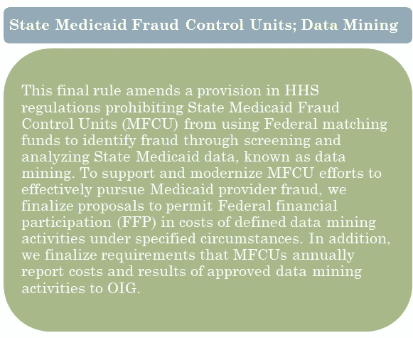

# 政府如何使用数据科学

> 原文：<https://towardsdatascience.com/how-the-government-uses-data-science-b7dfa4a22677?source=collection_archive---------22----------------------->

## 我们能知道政府是如何使用我们的数据的吗？

Photo by [Seth Doyle](https://unsplash.com/@sethdoylee?utm_source=medium&utm_medium=referral) on [Unsplash](https://unsplash.com?utm_source=medium&utm_medium=referral)

## 概述和背景

除非你在法律或政府部门工作，否则你可能不会意识到，美国政府做出的大多数关于公民的决定都是相当受控和透明的。这是因为一些不同的法律，但特别是一个要求政府告诉每个人他们要做什么，他们要如何做，为什么他们要这样做，如果他们不遵循自己的指导方针，你可以如何起诉他们。

哦，政府也会提前告诉你这些，并征求你的意见，这是法律要求他们考虑(并做出回应)的。这都是因为《行政程序法》(APA)。

《行政程序法》于 1946 年通过，是对新政下政府扩张的直接回应。在此期间，罗斯福总统扩大了联邦政府的规模和范围，创建了全新的机构来管理新的社会项目。一些人担心这会造成政府的中央执行部门过于强大——担心这会导致过多的中央计划或独裁。

这就是导致《行政程序法》立法产生的原因。根据《行政程序法》,联邦机构必须在《联邦公报》上公布提议的法规和规章以征求公众的意见，这些法规和规章详细说明了他们将要做什么以及如何去做。例如，如果国税局要审计税收，他们必须公布一项拟议的规则，规定他们如何确定要审计的纳税申报单，他们的审计师在进行审计时必须遵循的步骤，以及他们将如何确定审计的结果。

这些规则公开征求公众意见，机构必须对收到的每条意见作出回应，然后才能最终确定提议的规则。他们不必总是根据评论修改规则，但如果他们不这样做，他们必须在回应每个评论时解释原因。这实际上是一个很好的例子，说明了公民如何与政府互动并影响政府的结果。

更好的是，自 1994 年以来，联邦公报上发布的每一份文件都被数字化了，可以通过 REST API 获得。

由于我做了大量关于政府使用数据科学的研究，我想利用这一点来了解政府如何以需要制定规则的方式使用数据科学。

使用 python 和 Requests 包，我创建了一个联邦注册文档数据集，其中包含以下术语之一:**人工智能、大数据、商业智能、数据分析、数据挖掘、数据科学和机器学习**。

对于包含一个或多个上述搜索词的文档，我创建了一个具有特定文档字段和元数据的数据框，我的一些主要列是:

*   文件识别号
*   文档标题
*   机构名称
*   出版日期
*   文档类型(即通知、规则)和子类型
*   主题标签
*   摘要

## 描述统计学

该数据集有 638 个独特的联邦注册文档，包含一个或多个我的数据科学搜索术语。这些文件由 48 个不同的联邦机构发布，时间跨度从 1994 年 2 月到 2019 年 11 月(我在 11 月下旬提取了数据)。在同一时期，《联邦公报》上发表了 819，160 份文件。因此，我的第一个结论是，根据联邦登记册显示，联邦政府对数据科学的使用非常少，只有 0.00078%！

Count of Fed. Reg. Document Containing Search Terms

正如你在下面看到的，大部分的搜索词是最近才出现的，而其他的则被代理商使用了很长时间。例如，直到 2012 年，大数据在政府中似乎还不存在。

Documents containing search terms based on publication dates.

看看哪些联邦机构最常使用数据科学，肯定有一些并不令人惊讶。例如，国家科学基金会定期举行会议，并为人工智能和人工智能的研究提供资助。此外，美国宇航局似乎是合理的，因为他们使用 ML 的天文学以及应用技术。有趣的是，与其他文件相比，HHS 文件的数量更多。

如果我们把文件数量作为机关文件总量的一个比例，我们可以看到 HHS 还出版了更多的联邦公报文件。有趣的是，现在消费者金融保护局(作为多德-弗兰克法案的一部分，为应对 2007 年金融危机而创建)似乎更多地使用了数据科学。

## HHS 的更多细节

尽管如此，我还是想更深入地了解 HHS，因为他们有 200 多个引用数据科学术语的文档，以了解他们正在制定哪些应用程序。

我想做的事情之一是了解 HHS 用这些术语发布了什么样的文档，所以使用 NLTK 和 WordCloud 包，我为文档标题和摘要创建了 word cloud。

HSS Document Abstract Word Cloud

HHS Document Title Word Cloud

最突出的是——特别是在文件的标题中——诸如“非公开”、“会议”和“通知”等术语占了优势。根据上下文，这些可能有几种不同的含义。例如，他们可能会通知公众公众意见征询期即将结束，或者他们可能会发布闭门会议(不对公众开放的会议)的通知和会议笔记。不幸的是，仅仅从云这个词来区分有点困难。

为了在不阅读每份文件(每份文件可能有数百页)的情况下得到确切的信息，我根据摘要中的搜索词过滤了文件标题。这里的理论是，该机构在其简短的摘要中捕获最相关的信息，因此摘要中出现的数据科学术语可能表明该文档主要关注该领域。

我很快意识到，HHS 在利用《联邦公报》宣布会议、培训网络研讨会、拨款和奖励提案讨论以及奖项和竞赛获奖者方面做得非常好。如果您了解数据科学在医疗领域的用途，这并不奇怪，其中许多都与数据科学搜索词直接相关。

我在我的 HHS 数据集中发现的数据科学的唯一应用是通过分析州医疗补助数据，使用数据挖掘来打击医疗补助中的欺诈行为。

Title and Abstract of HHS Applied Use Document

## 局限性、结论和后续步骤

我的研究有些受限，因为我无法从每个文档中提取全文。这是基于文件大小的问题，以及联邦注册 API 只允许你拉 URL 到唯一的文档或 PDF 链接，而不是文本。如果将来我有更多的时间，我会致力于解决这个问题，并重新审视我的分析。

虽然我对在联邦公报中很少使用应用数据科学技术并不感到惊讶，但我从这项研究中得到了一些重要的收获:

首先,《行政程序法》和《联邦公报》是公众了解政府在日常应用中使用数据科学的有用途径。此外，这允许公众就人工智能和人工智能的使用与直接影响美国公民的角色进行互动并向联邦政府提供反馈。

第二，在联邦公报上几乎没有应用 ML 和 AI 的证据。对此有两种可能的解释。首先是联邦政府不太使用 ML 或 AI。另一种选择是，它们的使用方式不需要在《联邦公报》上发表。

《行政程序法》只要求公布某些东西，供公众检查和评论。事实上，大多数军事和外交政策行动都免于公开评论，而被归类为“来源和方法”风险的其他领域允许机构排除有关他们如何完成某些任务的基本细节。例如，如果国税局想要查看社交媒体信息以进行审计，他们可能会掩盖许多细节，假装如果他们透露了来源和方法，就会妨碍他们的工作。

《行政程序法》的这些局限性早已为人所知。事实上，美国律师协会已经公布了对《行政程序法》的修改建议，以使联邦行为更加透明，并促使《行政程序法》更加符合国会的意图。

我认为，这还应包括对政府使用人工智能和人工智能的更好理解和问责。[有趣的是](https://media.defense.gov/2019/Feb/12/2002088963/-1/-1/1/SUMMARY-OF-DOD-AI-STRATEGY.PDF)，我们知道在联邦政府中人工智能和人工智能的使用越来越多，但这些实例在联邦登记册中明显缺失——这意味着如果没有另一种机制，公众对我们的政府将如何使用我们的数据几乎没有发言权。

正如我们在世界其他地方看到的那样，美国将不得不尽快解决这个问题，希望在我们遇到太多负面影响政府使用这些技术以更高效力和效率实施公共项目的能力的事件之前。