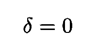
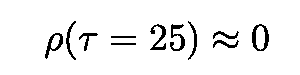
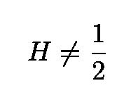
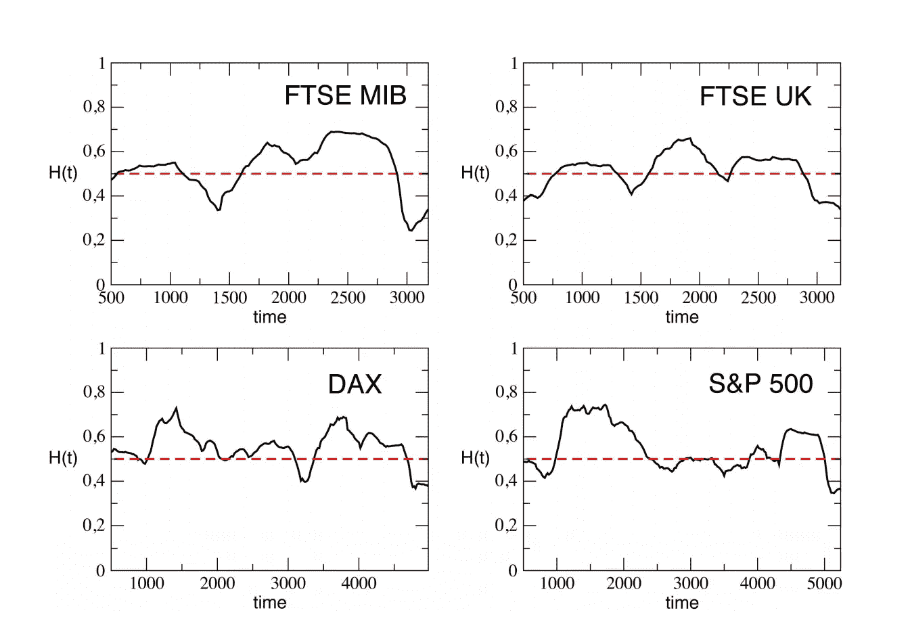

# 分形数学如何帮助预测股票市场的变化

> 原文：<https://towardsdatascience.com/how-the-mathematics-of-fractals-can-help-predict-stock-markets-shifts-19fee5dd6574?source=collection_archive---------1----------------------->

## 使用分形识别市场异常


Image by [Arek Socha](https://pixabay.com/fr/users/qimono-1962238/?utm_source=link-attribution&utm_medium=referral&utm_campaign=image&utm_content=2500328) from [Pixabay](https://pixabay.com/fr/?utm_source=link-attribution&utm_medium=referral&utm_campaign=image&utm_content=2500328).

在金融市场，投资者最常用的两种交易策略是[动量](https://www.investopedia.com/terms/m/momentum_investing.asp)和[均值回复](https://www.investopedia.com/terms/m/meanreversion.asp)策略。如果一只股票表现出动量(或趋势行为，如下图所示)，如果它的价格在前期已经上涨(下跌)，那么它在本期的价格更有可能上涨(下跌)。


Section of the time series of the S&P 500 Index or [SPY](https://www.nasdaq.com/symbol/spy). This is an example of trending behavior.

当一只股票在时间 *t* 的收益在某种程度上依赖于前一时间 *t* - *1、*的收益时，这些收益被称为自相关。在动量机制中，回报是正相关的。

相比之下，均值回归股票的价格围绕其历史均值随机波动，并显示出向历史均值回归的趋势。当存在均值回归时，如果价格在本期增加(减少)，则在下一期减少(增加)的可能性更大。


Section of the time series of log returns of the [Apple](https://finance.yahoo.com/quote/AAPL?p=AAPL) stock (adjusted closing price). This is an example of mean-reverting behavior.

请注意，由于这两种状态发生在不同的时间范围内(趋势行为通常发生在更大的时间范围内)，它们可以，而且经常共存。

在这两种机制中，当前价格包含了关于未来价格的有用信息。事实上，交易策略**只能在资产价格趋向或均值回复**的情况下产生利润 **，否则，价格将遵循所谓的[随机游走](https://en.wikipedia.org/wiki/Random_walk)(见下面的动画)。**


Example of random walk in 2D ([source](http://upload.wikimedia.org/wikipedia/commons/c/cb/Random_walk_25000.svg)).

# 均值回复时间序列

股票价格[很少表现出](https://www.amazon.com/Algorithmic-Trading-Winning-Strategies-Rationale/dp/1118460146)均值回复行为。在绝大多数情况下，它们遵循随机游走(然而，它们对应的回报是均值回复的，在零附近随机波动)。然而，均值回复价格序列可以通过组合不同的股票来合成，以建立一个[协整的](https://en.wikipedia.org/wiki/Cointegration)投资组合(更多细节见[该参考文献](https://www.oreilly.com/library/view/quantitative-trading/9780470284889/ch07.html))，该投资组合显示了[平稳性](https://en.wikipedia.org/wiki/Stationary_process)的属性(下文对此有更多介绍)。虽然可以使用各种众所周知的[标准统计测试](https://en.m.wikipedia.org/wiki/Augmented_Dickey–Fuller_test)来识别平稳性，但在本文中，我将重点关注一种基于所谓的[赫斯特指数](https://en.wikipedia.org/wiki/Hurst_exponent)的强大分析类型，该指数与价格时间序列的[分形指数](https://en.wikipedia.org/wiki/Fractal_dimension)相关。赫斯特指数提供了一种方法来衡量金融时间序列偏离随机游走的程度。这是一个非常简单的工具，可以帮助投资者决定采用哪种策略。

## 平稳性

在本文中，出于实用目的，我将非正式地互换使用均值回复和平稳这两个术语。现在，假设给定股票的价格，我用 *S* ( *t* )来表示，表现出均值回复行为。这种行为可以更正式地描述为下面的[随机微分方程](https://en.wikipedia.org/wiki/Stochastic_differential_equation) (SDE)


[SDE](https://en.wikipedia.org/wiki/Stochastic_differential_equation) describing a [mean-reverting process](https://en.wikipedia.org/wiki/Ornstein%E2%80%93Uhlenbeck_process).

这里，符号


分别是时间 *t* 的股价，时间 *t* 的一个[维纳过程](https://en.wikipedia.org/wiki/Wiener_process)(或布朗运动)，均值回复率 *θ* ，过程的均衡或均值 *μ* 及其波动率 *σ* 。根据这个 SDE，在 *t+1* 时的价格变化与在 *t* 时的价格与均值之间的差异成正比。正如我们所看到的，如果价格小于(大于)平均值，价格变化更可能是正的(负的)。这个 SDE 的一个众所周知的特例是所谓的[奥恩斯坦-乌伦贝克过程](https://en.wikipedia.org/wiki/Ornstein%E2%80%93Uhlenbeck_process)。


The Ornstein-Uhlenbeck process was named after the Dutch physicist [Leonard Ornstein](https://en.wikipedia.org/wiki/Leonard_Ornstein) and the Dutch-American physicist [George Eugene Uhlenbeck](https://history.aip.org/phn/11610022.html).

两个最著名的(非)平稳性测试是[迪基-富勒测试](https://en.wikipedia.org/wiki/Dickey%E2%80%93Fuller_test) (DF)和[扩展迪基-富勒测试](https://en.wikipedia.org/wiki/Augmented_Dickey%E2%80%93Fuller_test) (ADF)。

## 迪基-富勒试验和扩展的迪基-富勒试验:鸟瞰

ADF 测试是 DF 测试的扩展，所以让我们先了解后者。可以举例如下。考虑由下式给出的简单模型:


其中 *S* ( *t* )为随时间变化的股票价格， *ρ* 为系数，最后一项为误差项。这里的[零假设](https://en.wikipedia.org/wiki/Null_hypothesis)就是 *ρ=* 1。由于在零假设下 *S* ( *t* )和 *S* ( *t-* 1)都是非平稳的，因此[中心极限定理](https://en.wikipedia.org/wiki/Central_limit_theorem)被违反，人们不得不求助于以下技巧。


The [Dickey-Fuller test](https://en.wikipedia.org/wiki/Dickey%E2%80%93Fuller_test) is named for the statisticians [Wayne Fuller](https://en.wikipedia.org/wiki/Wayne_Arthur_Fuller) and [David Dickey](https://en.wikipedia.org/wiki/David_Dickey). The ADF is an extension of this test for more complex time series models.

定义第一差值和参数 *δ* 如下


回归模型可以方便地改写为:


Dickey-Fuller 随后测试假设(技术上来说是[零假设](https://en.wikipedia.org/wiki/Null_hypothesis))



其中 *δ* 的分布是由[韦恩富勒](https://en.wikipedia.org/wiki/Wayne_Arthur_Fuller)和[大卫迪基](https://en.wikipedia.org/wiki/David_Dickey)制成的表。

DF 测试背后的逻辑可以启发性地理解如下。如果 *S* ( *t* )是[稳定的](https://en.wikipedia.org/wiki/Stationary_process)，它倾向于返回到某个恒定的平均值(或者可能是决定性演变的[趋势](https://en.wikipedia.org/wiki/Dickey%E2%80%93Fuller_test))，这意味着较大的值可能跟随较小的值，反之亦然。这使得序列的当前值成为下一个值的强预测值，我们将得到 *δ* < 0。如果 *S* ( *t* )是非平稳的未来变化不依赖于当前值(例如，如果过程是一个[随机行走](https://en.wikipedia.org/wiki/Random_walk)，当前值不影响下一个)。

[ADF](https://en.wikipedia.org/wiki/Augmented_Dickey%E2%80%93Fuller_test) 测试遵循类似的程序，但它适用于更复杂、更完整的模型，由下式给出:


这里， *α* 是实常数， *β* 是时间趋势的系数(漂移项)，而 *δ* s 是差值的系数


其中 *p* 是过程的滞后阶数，最后一项是误差。这里的测试统计数据是


其中分母是回归拟合的标准误差。Dickey 和 Fuller 也把这个检验统计量的分布制成了表格。与 DF 测试的情况一样，我们期望*γ*0。关于如何进行测试的细节可以在任何[时间序列书](https://www.amazon.com/Analysis-Financial-Time-Ruey-Tsay/dp/0470414359)中找到。

## Python 代码

下面的 Python 片段展示了 ADF 测试在苹果股票价格中的应用。虽然股票价格很少均值回复，股票日志回报通常是。下面的`Python`代码获取对数差异，绘制结果并应用 ADF 测试。

剧情如下:


Log returns for Apple stocks.

ADF 测试的输出是:

```
Augmented Dickey-Fuller test statistic: -28.653611206757994
p-value: 0.0
Critical Values:
	1%: -3.4379766581448803
	5%: -2.8649066016199836
	10%: -2.5685626352082207
```

一般来说，我们更有可能拒绝零假设，根据零假设，序列是非平稳的(它有一个[单位根](https://en.wikipedia.org/wiki/Unit_root))，ADF 检验统计量“越负”。上述测试证实了对数收益序列确实是平稳的假设。结果显示-28.65 附近的统计值在 1%时小于-3.438，这是我们可以拒绝零假设的显著性水平(详见此[链接](https://machinelearningmastery.com/time-series-data-stationary-python/))。

# 赫斯特指数

有另一种方法来研究过程中均值回归或趋势行为的存在。正如稍后将详细解释的，这可以通过分析系列的[扩散](https://en.wikipedia.org/wiki/Diffusion)速度并将其与[随机行走](https://en.wikipedia.org/wiki/Random_walk#Anomalous_diffusion)的扩散速率进行比较来完成。这个过程将把我们引向赫斯特指数的概念，正如我们将看到的，它与分形指数密切相关。

虽然赫斯特指数的应用可以在数学的多个领域中找到，但我们在这里只关注其中的两个，即分形和长记忆过程。

## 分形

一个分形可以被[定义为](https://www.google.com/search?q=fractals&oq=fractals&aqs=chrome..69i57j69i61l2j0j35i39j0.2642j0j7&sourceid=chrome&ie=UTF-8)如下:

> 一种曲线或几何图形，其每一部分都具有与整体相同的统计特征。分形在模拟结构(如侵蚀的海岸线或雪花)时很有用，在这种结构中，相似的图案在逐渐变小的尺度上重复出现，在描述部分随机或混乱的现象时也很有用，如晶体生长、流体湍流和星系形成

分形的一个例子是下图所示的 [Sierpinski 三角形](https://en.wikipedia.org/wiki/Sierpi%C5%84ski_triangle)。


测量表面粗糙度的“分形维数”与 *H、*有如下简单关系


我们看到，大的赫斯特指数与小的分形维数相关，即与更平滑的曲线或表面相关。下面是一个例子。从这篇文章的[中可以清楚地看到，随着 *H* 的增加，曲线确实变得更加平滑。](https://link.springer.com/chapter/10.1007%2F978-1-4612-3784-6_2)


Processes with varying Hurst exponents H. As H increases, the curve gets smoother and the fractal dimension decreases ([source](https://link.springer.com/chapter/10.1007%2F978-1-4612-3784-6_2)).

分形有一个属性叫做[自相似性](https://en.wikipedia.org/wiki/Self-similarity)。在工程和应用数学的几个分支中出现的一种类型的自相似性被称为[统计自相似性](https://science.sciencemag.org/content/156/3775/636)。在显示这种自相似性的数据集中，任何子部分在统计上都与整个数据集相似。统计自相似性最著名的例子可能是在海岸线上发现的。


This is an example of the so-called [coastline paradox](https://en.wikipedia.org/wiki/Coastline_paradox). According to it, if one measures coastlines using different units one obtains different results ([source](https://en.wikipedia.org/wiki/Coastline_paradox)).

1967 年，[分形几何领域的创始人之一伯努瓦·曼德尔布罗](https://en.m.wikipedia.org/wiki/Benoit_Mandelbrot)在[科学杂志](https://science.sciencemag.org/)上发表了一篇[开创性论文](https://science.sciencemag.org/content/156/3775/636)题为《英国的海岸有多长？统计自相似性和分数维”，其中他讨论了分形的性质，如自相似性和分数维。

## 长程相关性

当过程具有长程相关性时，会出现一种重要的偏离随机游动的情况。这些过程显示了高度的持续性:过去的事件与未来的事件有着重要的关联，即使它们相距很远。由 [Granger、Joyeux 和 Hosking](https://books.google.com.br/books?id=w8HPcMJsk-cC&pg=PA121&lpg=PA121&dq=Granger,+Joyeux,+and+Hosking&source=bl&ots=nRsiyBj7Nv&sig=ACfU3U1x3n11cVBT8JGHIS5zeGWJXie92g&hl=en&sa=X&ved=2ahUKEwjwqK2s2u7iAhW4ILkGHQdoABEQ6AEwAXoECAkQAQ#v=onepage&q=Granger%2C%20Joyeux%2C%20and%20Hosking&f=false) 构思的一个例子由下面的*分数差分时间序列给出:*


其中 *L* 是通常的[滞后算子](https://en.wikipedia.org/wiki/Lag_operator)，指数 *d* 是非整数， *ϵ* 是误差项。使用简单的[二项式展开](https://en.wikipedia.org/wiki/Binomial_theorem)，该方程可以用[伽马函数](https://en.wikipedia.org/wiki/Gamma_function)来表示


比较简单的 [AR(1)](https://en.wikipedia.org/wiki/Autoregressive_model) 过程的自相关函数，我们发现后者的自相关函数比前者的自相关函数具有更慢的衰减速率。例如，对于滞后 *τ* ~25，



而分数差分过程的自相关函数的相应值是~-0.17。

## 赫斯特指数的起源

尽管关于赫斯特指数估计方法的最新进展来自于分形和混沌理论的数学，但令人奇怪的是，赫斯特指数首次用于[水文学](https://en.wikipedia.org/wiki/Hydrology)领域，该领域[主要关注](https://www.google.com/search?q=Dictionary#dobs=hydrology)水的分布、质量及其相对于土地的运动。此外，最近对金融时间序列长期相关性的测试是基于一种叫做重新标度范围的统计(见下文)，最初是由英国水文学家[哈罗德·赫斯特](https://en.wikipedia.org/wiki/Harold_Edwin_Hurst)开发的。赫斯特原始论文的首页如下图。


The original paper by [Harold Hurst](https://en.wikipedia.org/wiki/Harold_Edwin_Hurst) ([source](https://www.tandfonline.com/doi/pdf/10.1080/02626665609493644)).

# 赫斯特指数与反常扩散

了解价格序列本质的一个方法是分析它的扩散速度。扩散是一个广泛使用的概念，它描述了某个对象(可能是一个想法、一项资产的价格、一种疾病等)从一个比其他大多数地方更集中的地方向外扩散。


The plot shows how the [mean squared displacement](https://en.wikipedia.org/wiki/Mean_squared_displacement]) varies with the elapsed time τ for three types of diffusion ([source](https://en.wikipedia.org/wiki/Anomalous_diffusion)).

可以通过研究[方差](https://www.investopedia.com/terms/v/variance.asp)如何依赖于后续测量之间的差异来测量扩散:


在这个表达式中， *τ* 是两次测量之间的时间间隔， *x* 是价格 *S* ( *t* )的一般函数。该函数通常被选择为对数价格:


众所周知，股票价格回报的方差很大程度上取决于人们选择衡量它的频率。以 1 分钟为间隔的高频测量与日常测量有很大不同。

如果股票价格遵循几何随机漫步(或等价的几何布朗运动或 GBM ),这并不总是如此(特别是对于每日回报),方差将随着滞后 *τ* 线性变化


回报将是正态分布的。然而，当存在与纯随机游走的小偏差时，正如经常发生的那样，给定滞后 *τ* 的方差不再与 *τ* 成比例，而是获得一个[异常指数](https://en.wikipedia.org/wiki/Anomalous_diffusion)


The anomalous exponent is proportional to the Hurst exponent ([source](https://en.wikipedia.org/wiki/Anomalous_diffusion)).

参数 *H* 就是所谓的[赫斯特指数](https://en.wikipedia.org/wiki/Hurst_exponent)。均值回归和趋势股票都有以下特征



满足这个等式的日收益率不具有正态分布。相反，分布在平均值附近有较宽的尾部和较窄较高的峰值。

赫斯特指数可用于区分三种可能的市场机制:

*   如果*H*0.5，则时间序列是均值回复或平稳的。与几何布朗运动相关的正态扩散相比，对数价格波动性以较慢的速率增加。在这种情况下，系列显示所谓的*反持久性*(相邻点的高值和低值之间的长期切换)
*   如果 *H* > 0.5，序列显示趋势行为，其特征是存在*持续*行为(长期正自相关，即高值可能跟随高值)
*   *H* = 0.5 的情况对应于几何布朗运动

因此，赫斯特指数衡量时间序列的持续性水平，并可用于识别市场状态:如果在某个时间尺度上，赫斯特指数发生变化，这可能表明从均值回归到动量机制的转变，反之亦然。


Relations between market regimes and the Hurst exponent.

> 因此，赫斯特指数衡量时间序列的持续性水平，并可用于识别市场状态。

每种情况的示例绘制如下:


在下一张图中，我们看到赫斯特指数如何随时间变化，表明政权的变化。



Hurst exponent varying in time for four different financial time series ([source](https://arxiv.org/pdf/1303.4351.pdf)).

## 自相关

股票价格 *S* ( *t* )的自相关函数定义如下:


衰减非常慢的自相关过程称为长记忆过程。这样的过程对过去的事件有一些记忆(过去的事件对未来的事件有衰减的影响)。长记忆过程的特点是自相关函数 *ρ* ( *τ* )呈幂律衰减


*α* 与赫斯特指数的关系为


注意，随着 *H* 接近 1，衰减变得越来越慢，因为指数 *α* 接近零，这表示“持续行为”。经常发生的是，起初看起来随机的过程，实际上是长记忆过程，具有在开放区间内的赫斯特指数


那些过程通常被称为[分数布朗运动](https://en.wikipedia.org/wiki/Fractional_Brownian_motion) (fBm)或[黑噪声](https://books.google.com.br/books?id=_bkoySKyc_cC&pg=PA183&lpg=PA183&dq=fBm+%22black+noise%22&source=bl&ots=sOymnxU0GN&sig=ACfU3U2OmL0QXl027PvJbi3Ab8NNq9Dvag&hl=en&sa=X&ved=2ahUKEwjDtuG936TiAhVsLLkGHSpPBvkQ6AEwCXoECAYQAQ#v=onepage&q=fBm%20%22black%20noise%22&f=false)，是[布朗运动](https://en.wikipedia.org/wiki/Brownian_motion)的推广。

## 使用方差估计赫斯特指数的重要问题

为了获得对 *τ* 的方差依赖性，我们必须对许多滞后重复相同的计算，并提取结果的对数图的斜率。正如我们现在将看到的， *H* 的值很大程度上取决于我们对滞后的选择。这一部分是基于这篇博文中的分析。

让我们考虑标准普尔 500 指数 [SPY](https://www.nasdaq.com/symbol/spy) 并估计不同滞后的赫斯特指数。我们首先运行以下代码，其滞后范围为 2 到 20:

我们获得了 *H* 的以下值:

```
hurst =  0.43733191005891303
```

如前所述， *H* 的这个值表示均值回复机制，尽管相当温和。滞后 300–400 的相同代码给出:

```
hurst =  0.6107941846903405
```

这个值表示趋势状态的存在。因此，我们看到滞后的选择强烈地影响赫斯特指数的值。这意味着这个时间序列既不是纯粹的均值回复也不是趋势，而是改变行为或**改变制度**，这取决于人们是在短期内还是在长期内衡量它。此外，正如这里的[所指出的](https://robotwealth.com/demystifying-the-hurst-exponent-part-2/)，由于这些结论对于肉眼来说远非显而易见，我们得出结论，基于赫斯特指数的分析可以给出重要的见解。

# 长程相关性和重标范围

1971 年 [Mandelbrot](https://en.wikipedia.org/wiki/Benoit_Mandelbrot) 注意到[股票收益长期异常行为的存在。](https://www.jstor.org/stable/1937966?seq=1#page_scan_tab_contents)


Benoit Mandelbrot one of the fathers of the field of [fractal geometry](https://en.wikipedia.org/wiki/Fractal_geometry) ([source](https://history.aip.org/phn/11606005.html)).

为了测试这种长期相关性，Mandelbrot [使用了](https://www.jstor.org/stable/1937966?seq=1#page_scan_tab_contents)上面简要提到的重新标度范围或 R/S 测试统计。R/S 统计量[是](https://press.princeton.edu/titles/5904.html)一个序列相对于其均值的偏差的部分和的范围，由标准差重新调整(更多细节见本书)。Mandelbrot 和其他人表明，与其他方法(如自相关分析、方差比和频谱分解)相比，使用 R/S 统计会产生更好的结果，尽管它也有缺点，如对短程相关性的敏感性(有关更多详细信息，请参见[本文](http://www.jonathankinlay.com/Articles/Long%20Memory%20and%20Regime%20Shifts%20in%20Asset%20Volatility.pdf)和[这篇出色的博客文章](https://robotwealth.com/exploring-mean-reversion-and-cointegration-with-zorro-and-r-part-1/))。

R/S 统计可以如下获得。例如，考虑以下长度为 *n* 的股票收益时间序列


第一个 *k* 偏离平均值的部分和由下式给出:


R/S 统计与这些和的最大值和最小值之间的差成比例，其中 *k* ∈ [ *1* ， *n* :


分母 *σ* ( *n* )就是[最大似然标准差估计量](https://statistics.laerd.com/statistical-guides/measures-of-spread-standard-deviation.php)。重新标度的范围和观察值的数量 *n* 具有以下关系


其中 *H* 是赫斯特指数。Mandelbrot 和 Wallis 首先使用这种标度行为来发现长程相关性的存在。由于重新标度的范围和观察次数之间的关系是多项式的，因此可以用简单的双对数图计算出 *H* 的值，因为


在下图中，赫斯特指数估计在 0.53 左右，这大致相当于随机游走。代码使用了`hurst`库(Github repo 的链接是[这里是](https://github.com/Mottl/hurst))。


Estimation of the Hurst exponent gives H~0.5183\. The code uses the Github repo found [here](https://github.com/Mottl/hurst).

还有其他方法来获得赫斯特。你可以查看这篇文章了解更多细节。

# 结论和展望

我们看到，使用赫斯特指数的概念可以得出关于市场机制的非常有用的见解。有了这些信息，人们就可以决定均值回归和动量策略中哪一个更适合采用。

简而言之，赫斯特指数的值表明时间序列是否对过去的事件有记忆。赫斯特值不总是等于 1/2 的事实表明，市场完全不可预测的有效市场假说经常被违反。原则上，正确识别这些异常对于建立有效的交易策略非常有用。

感谢您的阅读，再见！一如既往，我们随时欢迎建设性的批评和反馈！

我的 [Github](https://github.com/marcotav) 和个人网站 [www.marcotavora.me](https://marcotavora.me/) 有(希望)一些关于数据科学和量化金融的其他有趣的东西。