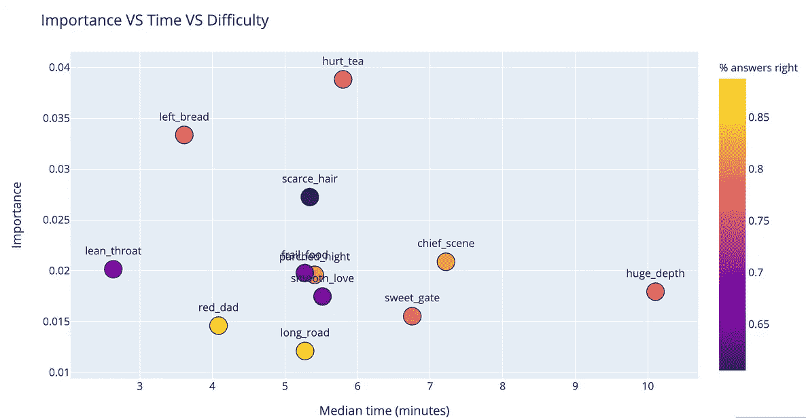
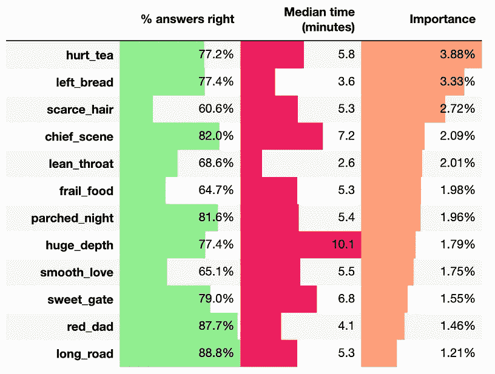
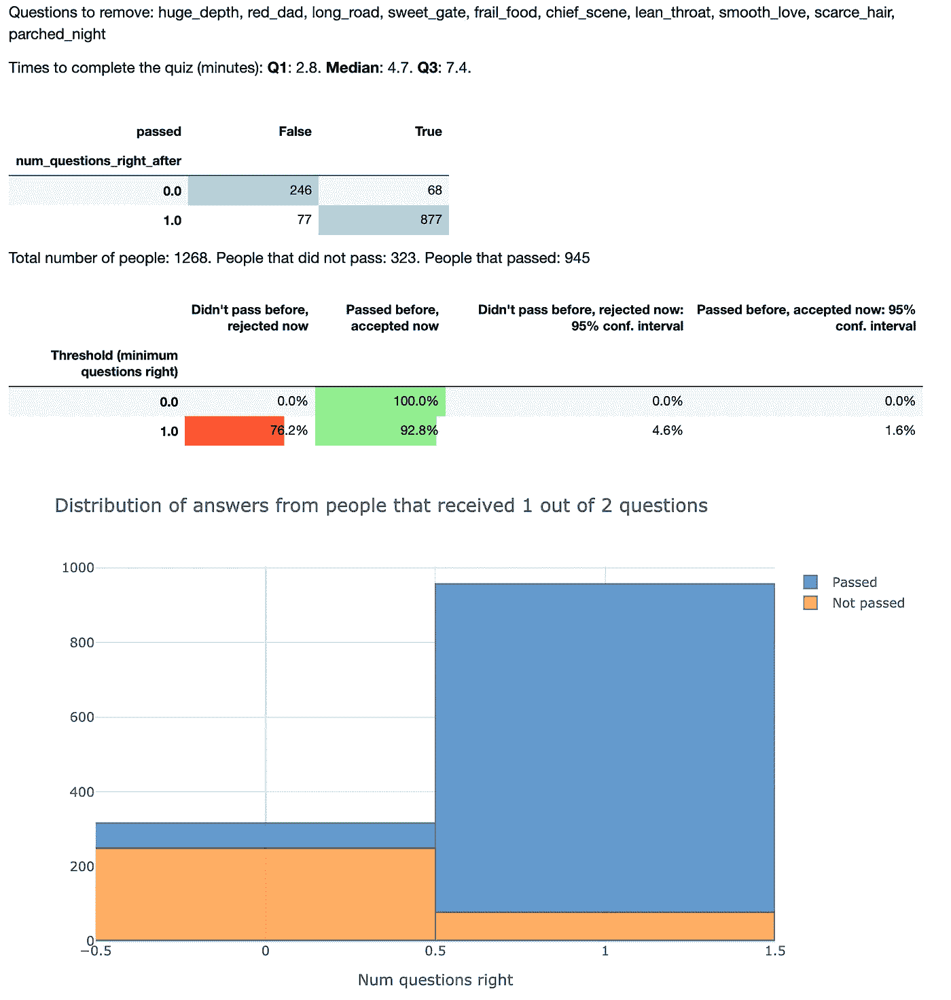
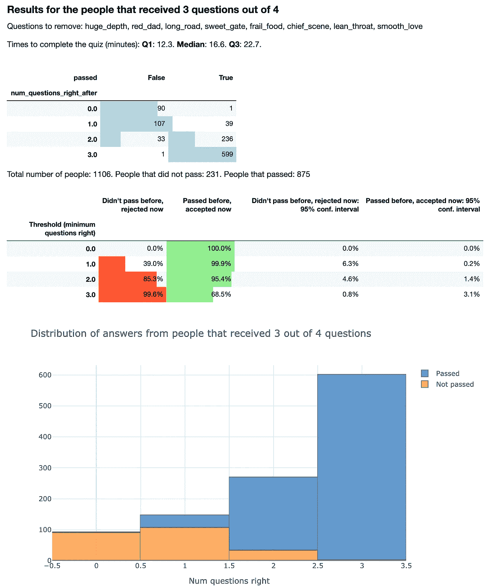

# 美国训练营如何将他们的测验缩短到 5 分钟左右

> 原文：<https://towardsdatascience.com/how-this-coding-bootcamp-could-reduce-their-quiz-to-5-mins-e265f7837fb8?source=collection_archive---------23----------------------->

## 减少他们问的问题数量可能会让更多的人申请和注册，这将增加公司的收入

Photo by [NESA by Makers](https://unsplash.com/@nesabymakers?utm_source=medium&utm_medium=referral) on [Unsplash](https://unsplash.com?utm_source=medium&utm_medium=referral)

最近，我为丹佛的美国训练营做了一个项目，在过去的 5 年里，这个项目一直在教人们如何编码。作为录取过程的一部分，考生要从 12 个问题中选择 8 个来测试他们的逻辑思维。学校想知道是否以及如何使用一些数据科学分析，及时减少这种测验。

现在，它需要大约 1 个小时来完成，并且大约 50%的报名者从未开始测验。理想情况下，学校可以少问一些问题，同时保留那些能提供候选人是否优秀的信息的问题。潜在的可能性是，更短的测验可以让更多的人参加考试，如果他们通过了，最终加入学校，这也将使公司的收入增加。

More revenue always sounds good

# 看着这些数据

他们有大约 2700 名学生的数据。对于每一个人，他们都知道他们得到的问题以及他们得到的问题是对还是错，对于其中的大约 700 人，他们知道他们完成每一个问题所花的时间。

65%的人答对了 6 个或更多的问题。这可能意味着可以问的问题会更少，以前通过的人现在也会通过。稍后我们会知道这是不是真的。

要通过测验，你必须答对 6 道或 6 道以上的问题，答对 5 道的人需要接受额外的逻辑思维面试。这也是为什么有的人答对了 5 题，还是没通过。

# 关注谁？

根据数据的不同，学校可能做出的决定会有所不同。本质上，我们可以关注两类人群:

*   未完成就离开的人
*   从来没有机会参加测验的人

看起来大多数人回答了他们收到的所有 8 个问题，很少有人在开始测验时中途离开。

此外，回答几个问题的人是正确答案比例最低的人，所以他们很可能不会通过考试。

因此，试图让这些人完成没有意义，目标应该是关注另一组人，那些永远不会开始的人。我们会尽量缩短测验，如果太长是人们没有开始的原因，那么在缩短后，更多的人会开始。

Right now, candidates take between 25 minutes and 1h30 to complete the quiz.

# 缩短测验时间

为了决定去掉哪些问题，我们需要为每个问题获取一些度量。比如…

## 时间

Note: these names are not the original ones

有些问题比其他问题花的时间要长，比如深度大，10 分钟！。我们可能会想去掉那个

## 困难

大多数人都在问长路或红爸爸这样的问题。这可能意味着这些是最简单的问题，并没有给我们多少信息来知道一个学生是否会通过考试。

## 每个问题的重要性

这是我们对每个问题的 3 个衡量标准中最好的一个。它将告诉我们的是，每个问题在多大程度上预测了候选人是否会通过测试。

实际的技术术语是[排列重要性](https://explained.ai/rf-importance/index.html)。我在一个 [fast.ai](https://www.fast.ai/) 课程中第一次了解到它，现在是使用它的好时机。基本上，它的工作原理是:

*   我们首先训练一个 ML 模型来预测结果。我们的结果是一个学生通过与否。这个模型会有一定的准确性。大约是 96%
*   然后我们取出*列，一个接一个，用训练好的模型预测同样的结果。剔除一个列后，模型的精度下降得越多，该列就越重要。

*(*)实际上我们并没有把列拿出来，我们只是一次一列地洗牌。移动一个列与取出它有相似的效果，但是好处是我们不需要重新训练模型。在简单的模型中，如我使用的随机森林，这没有太大的影响，但如果一个模型需要很长时间来训练，这种方法我们只需要训练它一次，而不是 N 次。*

I added two random columns to have a baseline for importance.

正如我们之前所猜测的，红爸爸和长路确实是最不重要的。此外，要回答的最长的问题，巨大的深度，被证明是不那么重要的，所以把它拿出来不会像我们把茶或面包拿出来一样。

## 概括

现在，我们可以可视化所有问题的指标

The first plot is also [👀interactive 🎭](https://plot.ly/~xoelop/234.embed)

# 提出问题

这是这个项目的最后一部分🎉我拿出了 1，2，3…多达 11 个问题。我总是从巨大的深度开始，因为它是最长的，然后从最不重要的问题开始到最重要的问题。这为以下问题提供了答案……

*   可以带走多少个问题
*   如果问题少一些，测验要花多长时间
*   候选人应该通过多少道题，这样通过的人数最多，没有通过的人数最多，现在也不会通过

这是我发现的一些情况。

## 他们只能问一个问题，测验只需要 5 分钟

如果我们从问题库中删除 10 个最不重要的问题，并且只问了 2 个最重要的问题中的 1 个，则结果如下:

尽管如此，92%以前通过的人如果现在就通过，76%以前没有通过的人现在不会通过。

## 另一个好的折中办法是:只问 3 个问题，去掉 8 个

在这种情况下，我们看到 3 个问题中有 2 个答对需要最佳阈值。这只会给我们带来大约 15%的假阳性(应该被录取但不应该被录取的人)和大约 5%的假阴性(不应该被录取但应该被录取的人)。在这种情况下，测验大约需要 17 分钟。

我不想把这篇文章写得太长，但是还有很多可能性。如果你很好奇，想要检查它们(并看到一些不工作的东西)，你可以查看完整的报告[这里](https://xoelop.github.io/bootcamp-questions/)。

您还可以看到，计算出的重要性似乎是有效的，因为当我们删除较少的问题，例如，我们问 6 个中的 3 个而不是 4 个中的 3 个时，一个人应该正确通过多少个问题的阈值变得不太清楚。

# 结论

我们发现了哪些是最重要的问题，哪些没有告诉我们太多。我们还发现，测验可以更短，问重要的问题，我们仍然有足够的信息来判断一个学生是否优秀。

现在，应该做出什么决定呢？只问一个问题？问 8 个中的 5 个？

这更多地取决于业务的成本，并且更多地是利益相关者现在必须做出的决定，考虑到他们所拥有的数据。

如果采访更多的人很便宜，我的建议是少问一些问题，不要要求答对很多问题。这样，所有以前通过的学生现在都通过了，但是会有更多的学生不应该通过，在下一阶段必须进行面试才能找到答案。

理想情况下，能够宣布“现在考试只需要 5/10/15 分钟”会让更多的人参加考试，甚至可能提高门槛，这样面试团队的工作量不会增加，但会有更多的人成为学生。

这种情况是否会发生已经超出了本文的范围，需要通过实验来检验。希望如此，我可以在这上面加几行。

# 还有一件事！

我正在积极寻找合同工作来解决像这样有趣的数据问题。

因此，如果您的企业有具体的问题，并且希望以一种更加数据驱动的方式来解决它，我很乐意与您聊天，看看我能如何帮助您。

[让我们](https://www.linkedin.com/in/xoel-lopez-barata/) [谈谈吧！](https://twitter.com/xoelipedes)