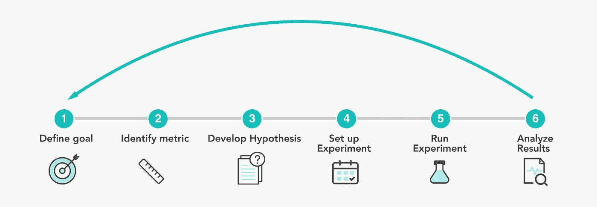
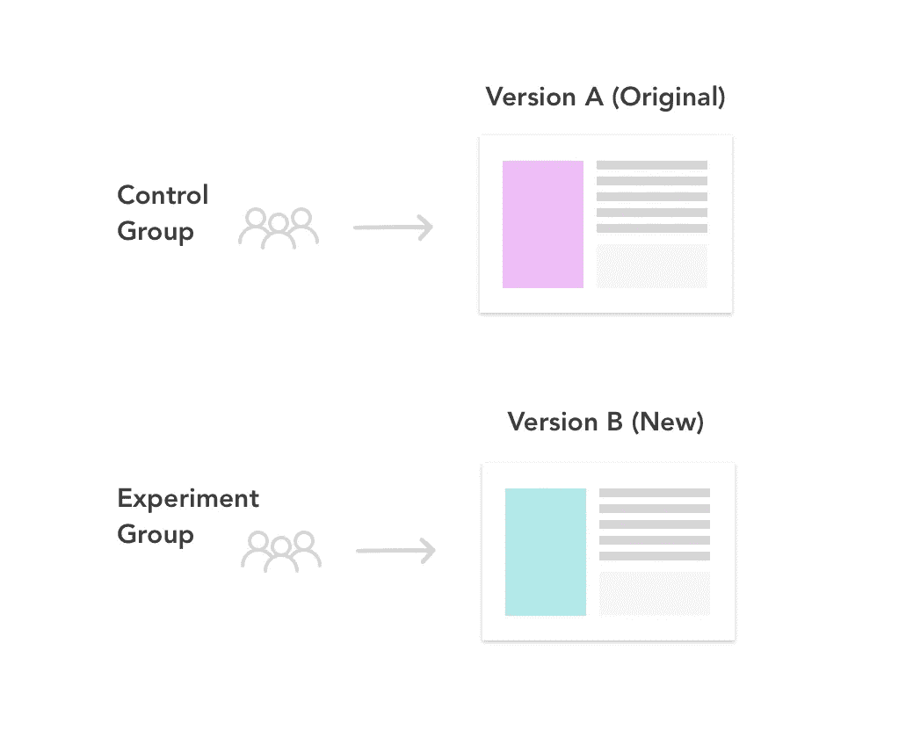
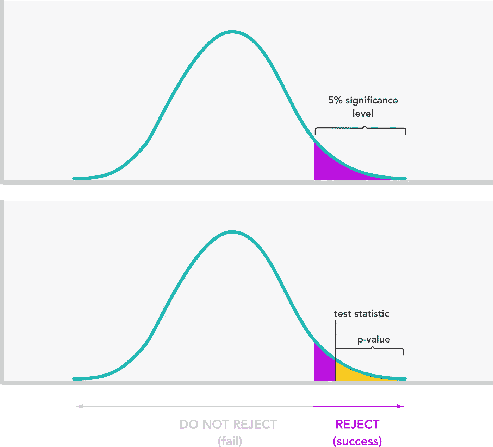
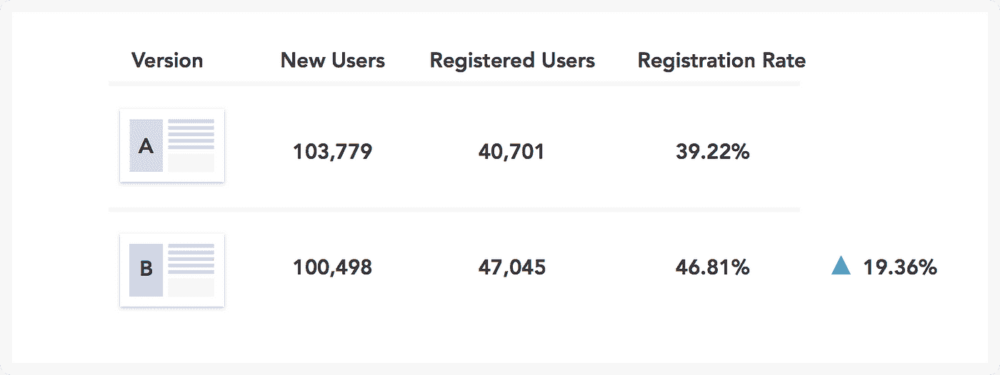
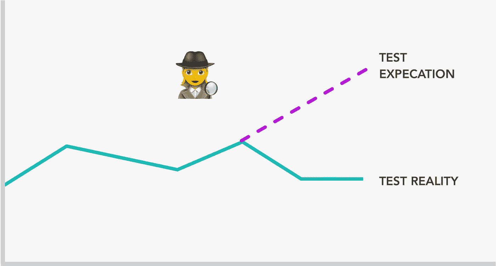

# 如何不花一毛钱考 A/B

> 原文：<https://towardsdatascience.com/how-to-a-b-test-without-spending-a-dime-60c4112f8f4e?source=collection_archive---------9----------------------->

## **无需购买测试平台即可获得具有统计意义的结果**

A/B 测试是产品开发过程中不可或缺的一部分，从成长型营销人员到设计师都在使用。然而，并不是每个人都有合适的 A/B 测试平台。也许你买不起每年高达 100，000 美元的系统，或者你是一个纯粹主义者，喜欢自己提取和处理硬数字。无论如何，本指南将揭开这个过程的神秘面纱，并一步一步地指导你如何获得显著的效果。

# 什么是 A/B 测试？🤷‍

A/B 测试或统计假设测试基本上是一种比较两个版本的东西以找出哪个更好的实验。有趣的事实:早在 20 世纪初，吉尼斯的统计学家威廉·戈塞特就使用 A/B 测试来测试哪种类型的大麦在啤酒生产中产量最高。

A/B testing for better beer! That’s science I can get behind. Photo by [Wil Stewart](https://unsplash.com/@wilstewart3?utm_source=medium&utm_medium=referral) on [Unsplash](https://unsplash.com?utm_source=medium&utm_medium=referral)

# 它对我有什么帮助？

A/B 测试是任何人都可以根据自己的目标使用的工具。

*   **产品经理**可以测试定价模式的变化，以提高收入或优化漏斗的一部分(如注册和入职)，从而提高转化率。
*   **营销人员**可以测试图像、CTA 或营销活动或广告中的几乎任何元素，以提高打开率和点击率。
*   **产品设计师**可以测试设计决策(例如，结帐按钮应该是红色还是蓝色)，或者在 100%推出之前使用结果来确定新功能的可用性。

所以你想知道，没有一个合适的测试平台，我如何以正确的方式完成它？首先，在你进行 A/B 测试之前，问自己这些问题。

## 可行性——我能做到吗？

*   你有足够的用户和数据来玩吗？太小的样本量要么需要你运行测试很长时间，要么给你无关紧要的结果。
*   A/B 测试也需要设计、设置和运行，所以问问你自己，你有时间和资源吗(例如，开发人员来实施)？有关这方面的更多信息，请参见步骤 4。
*   您有收集数据并将其传输到正确的查询或分析平台的系统吗？

> 你有提取、清理和分析数据的技能吗？

*   假设您没有专用的测试工具，您将需要使用查询语言(例如 SQL)提取原始数据，以可读格式(例如 Excel)处理和显示数据

## 合适性——我应该这么做吗？

这是检验假设或回答问题的最好(最便宜、最快)的方法吗？例如，如果你想知道为什么人们不填写表格，也许在半天的练习中做一些可用性测试比 3 周的 A/B 测试更好。当铲子起作用时，不要使用推土机。

# 6 个简单步骤的 A/B 测试

下面是你下次考虑进行测试时需要经历的 6 个步骤。该示例包括在 B2C 启动时 A/B 测试注册网页。数字是编出来的。

# 1.定义一个目标🎯

理解你公司更大的商业目标，并确保你的 A/B 测试与这些目标一致。

> ***举例:*** *你是 X 公司的产品经理，这家公司处于初创阶段。高管团队已经制定了一个全公司的目标来促进用户增长。具体来说，该公司正在寻求增加日活跃用户数(DAUs)，即过去 30 天内该网站每天注册用户的平均数量。您认为可以通过提高保留率(再次使用产品的用户百分比)或增加新用户注册来实现这一目标。*
> 
> *在调查过程中，您从漏斗分析中注意到，60%的用户在完成注册之前就退出了。所以你认为有一个很好的机会来提高注册页面的注册率。反过来，这应该有助于增加 DAU。*

# 2.确定一个指标📏

接下来，您需要确定一个度量标准来衡量新版本是否比原始版本更成功。这通常是某种转化率，但也可能是中间步骤，如点击率。

> ***例如:*** *在这种情况下，您选择注册率作为您的指标，定义为注册的新用户数除以网站的新访客总数。*

# 3.发展一种假设🤔

接下来，您将需要开发一个假设来解释正在改变的内容(即，您想要测试的内容)、结果和基本原理。

> ***例如:*** *假设当前注册页面有一个图像和一个注册模态。您可以在这里测试一些东西(例如，表单字段、副本、位置、文本大小)，但英雄图像是视觉上最突出的，因此您想知道不同的图像是否会导致更好的注册率。*
> 
> 一般的假设是“如果注册页面的英雄形象被改变，那么更多的首次用户会注册这个产品，因为这个形象更好地传达了产品的价值。”

在正式的假设测试中，您需要定义两个假设，这将帮助您确定您在版本 A(原始版本)和版本 B(您想要测试的新版本)之间看到的结果是自然变化的结果还是您更改的结果。

*   **零假设**假设 A 和 B 的结果没有不同，观察到的差异是随机的。我们希望拒绝这一点。
*   **备选假设**是假设 B 不同于 A，你想通过拒绝 null 来推断 true。

决定它是单尾测试还是双尾测试。单尾检验允许您检测一个方向的变化，而双尾检验允许您检测两个方向的变化(正负)。因此，单尾测试将帮助您确定 B 是否优于 A，而双尾测试更适合测试两个完整的新设计(当不存在默认值时)，并将告诉您 B 的表现是优于还是劣于 A。

If only 1-tailed tests were this cute. Photo by [Jason Leung](https://unsplash.com/@ninjason?utm_source=medium&utm_medium=referral) on [Unsplash](https://unsplash.com?utm_source=medium&utm_medium=referral)

> ***举例:*** *我们的无效和替代假设将:*
> 
> ***零假设:*** *新注册页面(B)注册率≤原注册页面(A 版)注册率*
> 
> ***替代假设:*** *新注册页面(B)的注册率是>比原注册页面(A)的注册率*
> 
> 我们将使用一个 ***单尾测试*** *，因为我们更感兴趣的是发现 B 的进步，而不是知道 B 何时表现更差。*

# 4.设置实验👩‍🔬

为了使测试有效，我们需要

*   **创建新版本(B)** 以反映您想要测试的变更。

***保护:*** *你也可以在* [*多元测试(MVT)*](https://www.optimizely.com/optimization-glossary/multivariate-test-vs-ab-test/) *中一次测试多个变量，但这只包括分割测试*

*   **定义对照组和实验组。**你想测试哪些用户？所有平台的所有用户？仅美国现有的网络用户？根据用户类型、平台、地理位置等来定义你的测试人群。然后，确定控制组(接受 A 的组)和实验组(接受 B 的组)的比例。这通常是对半分。
*   **确保随机化**哪些用户获得 A 和 b。这意味着每个用户获得 A 或 b 的机会均等。
*   **定义显著性水平(** α) **。**这是你接受假阳性的风险水平(当真时拒绝零假设)，通常设置为α = 0.05 或 5%。这意味着有 5%的时间你会发现 A 和 B 之间的差异，这实际上是由于自然变化。显著性水平越低，检测到随机性差异的风险就越低。
*   **定义最小样本量**。计算器存在于[这里](https://www.optimizely.com/sample-size-calculator/)和[这里](https://www.abtasty.com/sample-size-calculator/)并将计算每个版本所需的样本量。由于不同的参数和假设，你会得到稍微不同的数字。

> 拥有足够大的样本量对于确保您的结果具有统计学意义非常重要。

*   **定义时间线。**取每个版本所需的总样本量，除以你的日流量，这将给出你运行测试的天数。一般来说，一个好的经验法则是大约 1 到 2 周，但也可能更多或更少，这取决于许多因素，包括流量大小或商业周期。

> ***举例:***
> 
> ***创建版本 B*** *我们将用不同的英雄形象设计现有的注册页面。*
> 
> ***定义对照组和实验组。*** *由于我们对在网络平台上注册的新用户感兴趣，我们将根据用户类型和平台进行细分。只有访问浏览器注册页面的新用户才会接触到这个实验。我们还确保随机抽样，这意味着每个用户将有平等的机会获得 A 或 B，并被随机分配。*
> 
> ***控制组*** *— 50%使用网络浏览器点击注册页面的首次用户将看到原始版本 a。*
> 
> ***实验组****——50%使用网络浏览器点击注册页面的首次用户将看到新版本 b。*
> 
> ***定义显著性水平。*** *我们将采用最佳实践，即显著性水平α = 0.05 或 5%。*
> 
> ***定义时间线。*** *比方说，我们的注册网页平均每天有 10，000 的首次用户流量。我们计算出每个变异的最小样本量约为 100，000。这意味着每天只有 5000 名用户会收到每个变体。所以我们需要运行这个实验 100，000/5，000 = 20 天。*

# 5.运行实验💃

*   **传达**实验的预期开始和结束日期，为您的团队或其他利益相关者设定期望。
*   **执行质量控制—** 这一点经常被忽视，但却非常重要。

> 无论你处于什么样的角色，学会如何自我问答。

1.  与工程师确认实验设置了正确的参数。
2.  如果您有一个测试查询来检查数据，请在临时环境上进行测试查询。或者，你也可以在实验开始的第一天检查数据。
3.  数据清理应包括检查:
    (1)完整性—空值、空白和丢失的数据可能是无害的，或者是错误实现的标志。
    (2)准确性—确保正确的用户操作触发正确的事件，所有预期的字段和字段值都进入。
4.  当它预期上线时，检查它是否真的上线了。
5.  👀最后，不要偷看结果！过早查看结果可能会使统计显著性无效。为什么？在这里阅读。👀

Waiting for test results is like watching water boil. Photo by [John-Mark Smith](https://unsplash.com/@mrrrk_smith?utm_source=medium&utm_medium=referral) on [Unsplash](https://unsplash.com?utm_source=medium&utm_medium=referral)

# 6.最终分析结果！有趣的部分🤓

*   **收集和分析数据** 您需要提取数据，并计算您之前为版本 A、B 和差异定义的成功指标。如果总体上没有差异，您可能还希望根据平台、来源类型、地理位置等进行细分(如果适用)。您可能会发现版本 B 在某些部分表现得更好或更差。
*   **检查统计显著性** 这种方法背后的统计理论在这里[有更好的解释](http://blog.analytics-toolkit.com/2017/statistical-significance-ab-testing-complete-guide/)但是基本思想是弄清楚 A 和 B 之间的结果差异是由于你改变了什么还是由于随机性/自然方差。这是通过将测试统计(和结果 p 值)与您的显著性水平进行比较来确定的。

***Protip:*** 你也可以从置信水平的角度考虑统计显著性，简单来说就是 1-α。最佳实践通常是将置信度设置为 1-.05 = .95 或 95%。这意味着如果你重复测试 100 次，你会得到其中 95 次的结果。显著性水平和置信度水平均可用于确定统计显著性，但本例使用显著性水平。

## 确定重要性的基本步骤是:

1.  **计算检验统计量。**检验统计值是我们用来比较 A 和 b 的结果的值。它说明了我们在结果之间看到的差异有多大，以及我们的数据中有多少可变性。根据你对实际人口的了解，通常会使用 ***Z*** 统计量或 ***t*** 统计量作为检验统计量。在此[阅读更多关于何时使用的信息](https://stats.stackexchange.com/questions/178854/a-b-tests-z-test-vs-t-test-vs-chi-square-vs-fisher-exact-test)，尽管实际上，如果样本量很大，两者之间几乎没有区别。
2.  **使用检验统计量计算 p 值。**p 值是 A 和 B 版本之间的结果差异纯粹是由于偶然因素造成的概率。因此，像 1%这样非常低的 p 值意味着 A 和 B 的差异极不可能是偶然造成的。这是从测试统计中计算出来的。你可能还记得在你的大学统计课上从表格中查找 p 值，但幸运的是今天有在线计算器可以帮你做到这一点。
3.  **将 p 值与显著性水平进行比较。**

*   若 p 值< significance level, we can reject the null hypothesis and have evidence for the alternative.
*   If p-value ≥ significance level, we cannot reject the null hypothesis.

One-tailed hypothesis test showing when the p-value is less than the significance level.

> ***举例:***
> 
> ***收集&分析数据*** *因为我们希望能够比较 A 和 B 的注册率，所以我们希望收集关于 ftu 数量以及在 20 天内成功注册的 ftu 数量的数据。*

请参见下面的示例数据。

[https://gist . github . com/lisamxu/db 6041895 a0b 96481 F4 F5 b 107 B1 c 2101](https://gist.github.com/lisamxu/db6041895a0b96481f4f5b107b1c2101)

Table comparing registration rate of new users that received Version A vs B.

> *太好了！看起来 B 比 a 表现得更好。但是在我们自我表扬之前，我们需要检查其重要性。*
> 
> ***检查统计显著性*** *我们将使用 t 统计量，因为我们不知道人口统计量。如果您对总体和总体统计(例如，平均值和方差)一无所知，您最好使用 t 统计。如果你知道，你可以使用 Z 统计量。*
> 
> ***1。计算 t-statistic*** *我用了一个在线计算器* [*这里的*](https://www.mathportal.org/calculators/statistics-calculator/t-test-calculator.php) *也显示了公式和原始计算。*
> 
> *t 统计量= 2.3665*
> 
> **②*。计算 p 值*** *您可以使用一个 p 值* [*计算器*](https://www.socscistatistics.com/pvalues/Default.aspx) *或*[*Excel*](https://researchbasics.education.uconn.edu/excel-formula-for-t-test/)*t-test 公式来返回 p 值。记住，这是一个显著性水平为 0.05 的单尾双样本测试。*
> 
> *P 值= .0115*
> 
> ***3。将 p 值与显著性水平进行比较。***
> 
> *P 值为. 0115 < .05*
> 
> *结果是显著的！*
> 
> *这告诉我们只有大约 1.15%的可能性，登记率的不同结果是偶然的结果。因此，我们可以推断，另一种选择(即 B 确实比 A 有更高的注册率)是正确的。*

## **得出**结论

所以你已经看了结果并检查了重要性。A/B 测试可以下列方式结束:

> 对于大多数测试来说，新版本的表现与原始版本相同或更差。

1.  **控制一个胜败没有区别。**除了会导致无效测试(即结果不准确或不重要的测试)的原因，新版本的较差性能可能是因为:

*   价值主张的信息传递/品牌推广不佳
*   没有吸引力的价值主张
*   用户体验差

在这种情况下，您可以挖掘数据或进行用户研究，以了解为什么新版本没有像预期的那样表现更好。这反过来将有助于你的下一次测试。

**2。变体 B 赢了。A/B 测试支持您的假设，即版本 B 的性能优于版本 A。太好了！分享结果后，可以 100%铺开实验。之后关注成功和背线指标是有好处的。**

在我们的例子中，我们的结论是版本 B 确实比版本 A 有更高的注册率，所以我们将向所有用户推送 live。然后，我们将在未来几周内监测登记率和 DAU 增长情况。

# **包装好一切**

不管你的测试是否成功，把每一次实验都当作一次学习的机会。用你所学到的知识来帮助发展你的下一个假设。例如，您可以基于之前的测试，或者关注另一个要优化的领域。您可以测试和实现的可能性是无限的。

# 快乐实验！👩‍🔬

***感谢阅读！想要连接吗？伸出*** [@lisamxu](https://twitter.com/lisamxu) ***。欢迎反馈和评论！特别感谢*** [***托马斯·马蒂诺***](https://medium.com/@thomasmartino)*[***乔安·郭***](https://www.linkedin.com/in/joann-kuo/)*[***亚当·加德拉***](https://www.linkedin.com/in/adamgadra/)*[***莎拉***](https://www.linkedin.com/in/sarahmbierman/)***

# **资源**

*   **A/B 测试模板[此处](https://abtestguide.com/calc/) (Z 统计)和[此处](http://gchang.people.ysu.edu/EXCELE/Form_TwoSample.xls)(T-测试)**
*   **样本大小计算器[在这里](https://www.optimizely.com/sample-size-calculator/)和[在这里](https://www.abtasty.com/sample-size-calculator/)**
*   **t 和 Z 统计[计算器](https://www.mathportal.org/calculators/statistics-calculator/t-test-calculator.php)**
*   **p 值[计算器](https://www.socscistatistics.com/pvalues/Default.aspx)和 [Excel](https://researchbasics.education.uconn.edu/excel-formula-for-t-test/)**