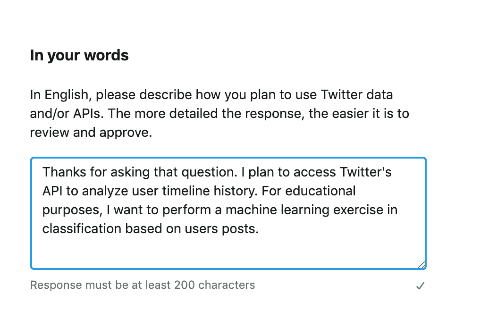
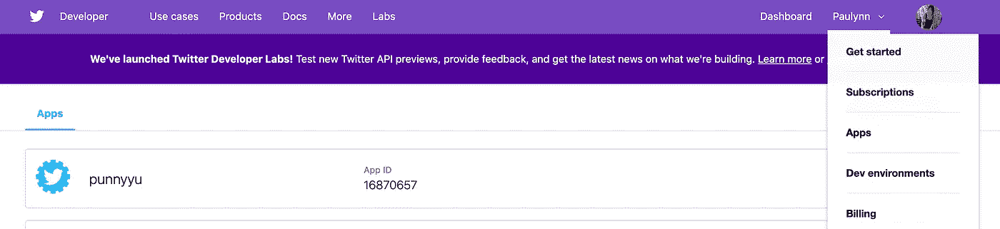
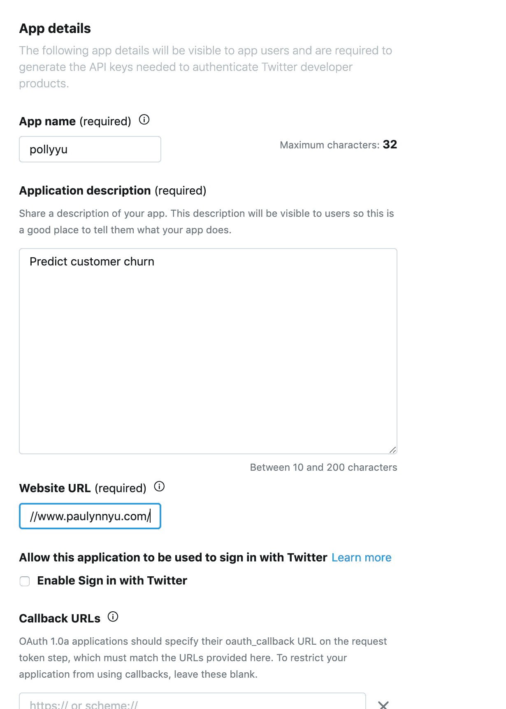
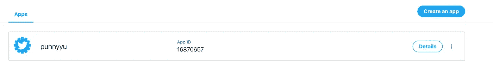
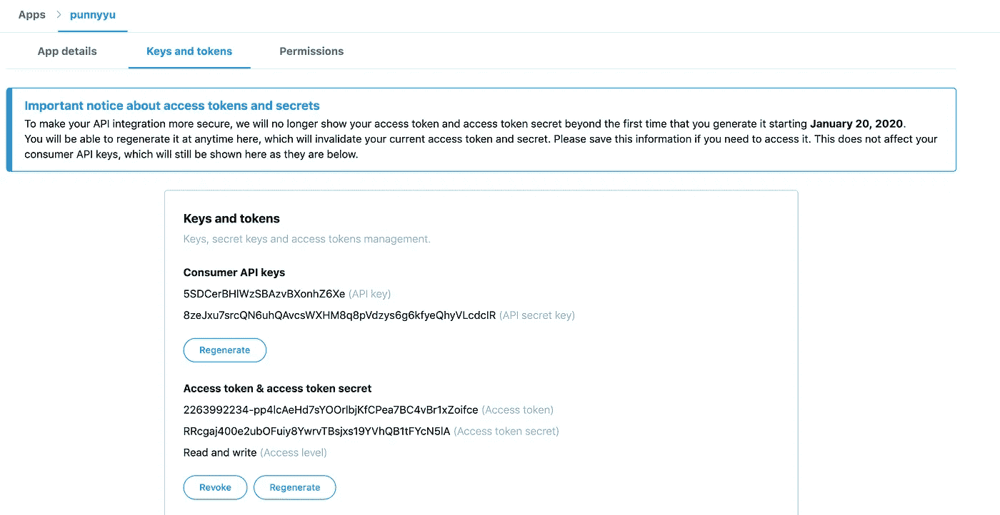
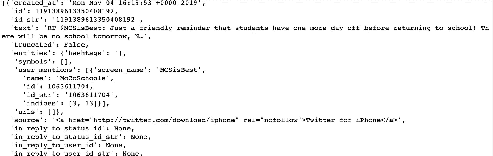
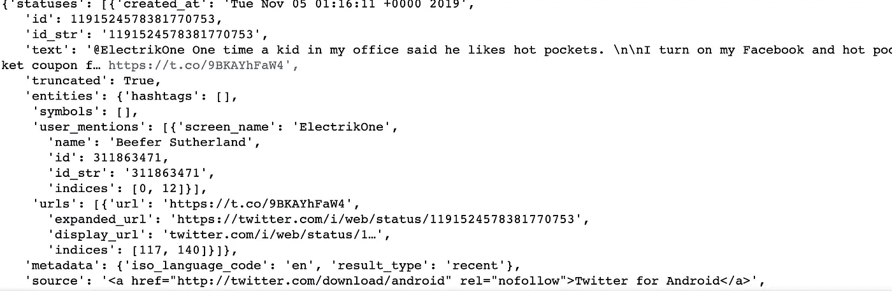

# 如何使用 Tweepy 访问 Twitter 的 API

> 原文：<https://towardsdatascience.com/how-to-access-twitters-api-using-tweepy-5a13a206683b?source=collection_archive---------2----------------------->

## 使用易于使用的 Python 库获得大型 Twitter 数据集的分步指南(包含代码和技巧)


Photo by [Kon Karampelas](https://unsplash.com/@konkarampelas?utm_source=medium&utm_medium=referral) on [Unsplash](https://unsplash.com?utm_source=medium&utm_medium=referral)

Tweet 数据集对于有抱负的(和实践中的)数据科学家来说是一个非常理想的分析和执行模型的语料库。推文本质上是简短的，包含不同的相关主题，这使得它成为一个优秀的情感分析数据集。这也是一个分析用户参与度的很好的数据集，因为推特时间戳是可用的。

虽然有许多现有的 Twitter 数据集，但它们会为你预先定义。我相信首先要定义你感兴趣的问题，然后找出获取数据的方法。这就是访问 Twitter API 的好处——你可以获得只有 API 才能提供的类型、容量和“新颖性”。


如果有任何证据的话，我能够获得 7 万个用户账户和他们的 1000 万个帖子，这几乎需要一整天的时间。这比用自制的酸面团来醒发你的面包面团要稍微长一点，但是真的不会太长。我更强烈地推荐它，而不是试图从零开始做面包(至少一次),相信我，这说明了很多。

# 什么是 Tweepy？


Straight from the Tweepy website: [https://www.tweepy.org/](https://www.tweepy.org/)

Twitter API 公开了数十个 HTTP 端点，可用于检索、创建和删除推文、转发和类似内容。它提供了对丰富的实时 tweet 数据的直接访问，但需要处理大量底层细节(并且调试起来很不有趣)。

Tweepy 是一个开源包，它允许你绕过许多低级的细节。 [Twitter 的开发者网站](https://developer.twitter.com/en/docs/basics/getting-started)有很棒的文档，我推荐你去浏览一下，获取示例回复，看看你能访问的数据类型。 [Tweepy 的文档](http://docs.tweepy.org/en/v3.5.0/getting_started.html)将进一步为 Tweepy 模块提供代码片段和一些基本文档。

# 获取 Twitter API 认证

Twitter API 使用 OAuth，这是一个开放的授权协议来认证请求。您需要创建和配置您的身份验证凭证来访问 Twitter API。正如我所承诺的，这是一个循序渐进的指南，所以跟着做吧！

**第 0 步:**开一个推特账号。如果你已经有一个 Twitter 账户，跳过这一步

**第一步:**申请开发者账号

去他们的开发者网站，进入[申请访问](https://developer.twitter.com/en/apply-for-access.html)，选择“申请开发者账户”。系统会提示您登录您的 Twitter 帐户。

然后，您将被导航到如下页面:


选择您的选择路径，在下一页填写详细信息，并填写一些个人信息。当你打算使用时，有几个字段有最小字符限制(一次他们有一个最小值😏).



这是我填的。诚实，但是不要太担心细节，尤其不要担心简洁。以我的经验来看，他们的审批是即时的。

还会有进一步的简单问题和步骤(耐心点！).一旦你完成了这些步骤并接受开发者协议，你现在就有了一个开发者帐户！

**第二步:创建一个应用程序**

您可能需要等待开发人员帐户获得批准，但一旦获得批准，您就可以开始创建自己的应用程序了。

转到您的个人资料选项卡并选择应用程序。创建一个应用程序并填写详细信息。那应该再花一分钟。



Fill in details in the app section.

创建应用程序后，进入下一步。

**第三步:获取您的认证信息**

转到您的应用程序页面，在那里您将看到您创建的应用程序。点击详细信息。



一旦你在那里，点击钥匙和令牌获得相关的钥匙。您可能需要生成您的访问令牌和访问令牌密码。

您还可以重新生成密钥，以防您需要写一篇循序渐进的博客文章并共享您的旧密钥(我就是这样做的)。



一旦你做到了这一点，就进入下一步吧！

# 验证凭据

用您自己的凭据替换下面代码中的 CONSUMER_KEY、CONSUMER_SECRET、ACCESS_TOKEN、ACCESS_TOKEN_SECRET。

运行下面的代码来验证您的身份验证。希望有用！

```
import tweepy

# Authenticate to Twitter
auth = tweepy.OAuthHandler("CONSUMER_KEY", "CONSUMER_SECRET")
auth.set_access_token("ACCESS_TOKEN","ACCESS_TOKEN_SECRET")api = tweepy.API(auth)# test authentication
try:
    api.verify_credentials()
    print("Authentication OK")
except:
    print("Error during authentication")
```

# 强调几种方法

Tweepy 有一个方法列表，可以很容易地帮助你访问 Twitter 的端点。用户时间表、推文、搜索、趋势、用户等等都有一个方法。请务必阅读[文档](https://tweepy.readthedocs.io/en/latest/api.html)以获得完整列表，但是让我来谈谈我使用的这两种方法。

[**follower_ids**](https://developer.twitter.com/en/docs/accounts-and-users/follow-search-get-users/api-reference/get-followers-ids)

此方法允许您获取特定用户的最近关注(使用 screen_name 作为参数)。结果以 5，000 个用户 id 为一组，您可以使用光标浏览“页面”。

```
api.followers_ids(screen_name=screen_name)
```

出于我的目的，我将此作为一种策略来获取一个 id 列表，作为一个参数提供给 user_timeline 方法

[**用户 _ 时间线**](https://developer.twitter.com/en/docs/tweets/timelines/api-reference/get-statuses-user_timeline)

在任何一个 24 小时内，这种方法的总速率限制为 100，000 次呼叫。这将转化为 100，000 个用户及其时间轴帖子(最多 200 个最新帖子)。

```
timeline = api.user_timeline(user_id=user_id, count=200)
```

下面是它将返回的 JSON 的一个片段。请仔细查看对您的目的有用的属性。



对我来说，我收集的属性是 *['created_at '，' text '，' source '，' in_reply_to_screen_name '，' retweet_count '，
'favorited '，' retweet '，' is_quote_status '，' retweeted _ status '，' hashtags '，' symbols '，' user_mentions']*

[**搜索**](https://tweepy.readthedocs.io/en/latest/api.html#API.search)

我没有使用这种方法，但我相信这对于大多数寻找 Twitter 数据的人来说是有用的，可以获得关于特定主题的对话。该方法为所有公共 tweet 返回与指定查询匹配的相关 tweet 集合。

下面的例子返回了最近 5 条关于热门人物斯诺登的推文。

```
api.search(q="hot pockets snowden", lang="en", rpp=5)
```

您需要解析的结果是:



# 一些我需要的代码

这个函数将帮助你获得给定 Twitter 用户名的关注者 id 列表。每个页面有 5000 个 id，所以如果特定用户有超过 5000 个追随者，光标只是帮助你“翻转”页面。我的计划是为每个 id 调用用户时间表。

```
# define screen_name
def get_ids(screen_name):
    '''
    :argument: screen_name of user
    :returns: a list_id of the given user's followers
    '''
    # get first list
    first_list = api.followers_ids(screen_name=screen_name)
    id_list = first_list['ids']
    cursor = first_list['next_cursor'] while cursor != 0 :
        user_ids = api.followers_ids(screen_name=screen_name,  cursor=cursor)
        id_list.extend(user_ids[0]['ids'])
        cursor = user_ids[0]['next_cursor'] return id_list
```

下面的函数有点难。但是高层次上，它根据我指定的属性获取 tweets。我必须执行一些简单的操作(替换函数)来帮助 API 调用的下一行(\n)格式化。这完全是我的操作，因为我的 final 是一个 csv 文件，我将它移动到 postgresql 数据库中。

如果您是在 MongoDB 中捕获的，这可能是不需要的。

```
def get_tweets(user_id, timeline) :
    '''
    :param user_id: the list_id as recognized by twitter
    :param timeline: the dictionary that is pulled from user_timeline twitter API
    :return: all the posts in dictionary format of a specified list_id
    '''
    # attribute lists
    post_attrs = ['created_at', 'text', 'source', 'in_reply_to_screen_name', 'retweet_count', 'favorite_count',
                  'favorited', 'retweeted', 'is_quote_status', 'retweeted_status']
    entities_attrs = ['hashtags', 'symbols', 'user_mentions'] # creating empty dictionary, and specifying user id
    post_dict = defaultdict(list) for tweets in timeline :
       post_dict['user_id'] = user_id
           for post in list(post_attrs) :
              if post == 'text' :
                try :
                    t = tweets[post]
                    t = t.replace('\n','')
                    t = t.replace('\r','')
                    post_dict[post].append(t)
                except :
                    post_dict[post].append(np.nan)
            else :
                try :
                    t = tweets[post]
                    post_dict[post].append(t)
                except :
                    post_dict[post].append(np.nan) # looping through other post attributes
        for entity in entities_attrs :
            try :
                attr_name = 'len_' + entity
                post_dict[entity].append(tweets['entities'][entity])
                post_dict[attr_name].append(len(tweets['entities'][entity]))
            except :
                post_dict[entity].append(np.nan)
    return post_dict
```

# 其他提示

```
auth = tweepy.OAuthHandler("CONSUMER_KEY", "CONSUMER_SECRET")
auth.set_access_token("ACCESS_TOKEN","ACCESS_TOKEN_SECRET")api = tweepy.API(auth, wait_on_rate_limit=True, wait_on_rate_limit_notify=True, parser=tweepy.parsers.JSONParser())
```

1.  在您的 API 方法中，一定要指定 wait_on_rate_limit 和 wait_on_rate_limit_notify，一旦您达到速率限制，它们就会等待并打印出一条消息。
2.  我发现从 AWS 服务器(或任何云服务器)调用 API 比使用我的本地机器更快。这可能纯粹是我自己在查询 API 时观察打印的用户 id 填充速度的启发。你可以两者都试试，尤其是如果速度对你很重要的话。
3.  这可能是我能给你的最大的提示，并且在我自己的数据收集中改变了游戏规则。尽管 Twitter 声明每 15 分钟的请求限制为 900 个，但是如果你在一批中连续请求，它们会变得非常慢(每 7 秒 1 个呼叫对每秒 1 个呼叫)。通过一次将我的批分成 5000 条(而不是我第一次迭代中的 20000 条)，我能够更快地获得用户的历史推文。这意味着每次运行 5000 个用户的用户 ID 迭代，然后休息一下，进行另一个 API auth 调用，并调用另外 5000 个用户。请随意测试更小的批次。

目前就这些——如果有任何问题，请告诉我。快乐求活新鲜数据！