# 如何以最大的 ROI 和速度采用智能自动化？

> 原文：<https://towardsdatascience.com/how-to-achieve-adoption-of-intelligent-automation-with-maximum-roi-and-speed-faf1fe18e1b7?source=collection_archive---------16----------------------->

Source: [https://www.burwood.com/blog-archive/automation-vs-orchestration-whats-the-difference](https://www.burwood.com/blog-archive/automation-vs-orchestration-whats-the-difference)

自动化将使银行业的 20 万工人失业。在未来的十年里，理论上讲，全球近一半的带薪工作可能会面临自动化带来的风险，因为这些工作使用的是已经掌握的技术[。](https://www.mckinsey.com/featured-insights/future-of-work/jobs-lost-jobs-gained-what-the-future-of-work-will-mean-for-jobs-skills-and-wages)在未来的 12 年里，三分之一的美国工人面临着因新技术而失去工作的风险，政治家们已经在谈论[全民基本收入](https://www.citylab.com/equity/2019/10/stockton-universal-basic-income-pilot-economic-empowerment/599152/) (UBI)来补偿失去的工作，并保证人们有基本的生活工资来帮助他们应对。

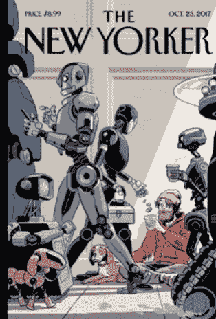

Source: The New Yorker

这些都是可怕的预测，但让我们打破所有这些喧嚣，看看如何通过采用变革性智能自动化(IA)功能来推动变革的最佳实践。在过去几年中，作为 ia 之旅的第一步，通过机器人流程自动化(RPA)技术采用重复流程自动化的企业数量呈指数级增长。许多公司通常从 RPA 技术开始，这是一个关键的促成因素，为了确保最大的潜在价值，需要考虑一些关键因素。事实上，选择技术堆栈相对容易，因为已经有相当多的研究对不同的供应商进行了排名和分类。一旦你清楚了所有的十个成功因素，做决定就会变得容易。

**机器人流程自动化软件魔力象限**

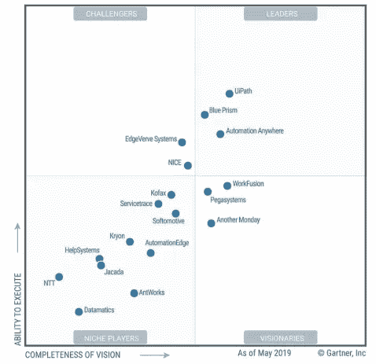

Source: [Gartner (May 2019)](https://www.uipath.com/company/rpa-analyst-reports/gartner-magic-quadrant-robotic-process-automation)

我建议在你做出选择的时候，正面抓住这十个机会。

**1。加倍关注您的公司战略和级联自动化业务案例**

你应该总是从“问题”和商业机会开始。第一步是加倍你的公司战略。与您的高级利益相关者和公司领导层/首席执行官交谈，以了解迫切的需求是增加收入、提高利润、消除欺诈/合规问题还是其他。在内部员工、外部客户/消费者或供应商之间，对他们希望更好地服务的角色加倍下注。

一旦您对战略和目标有了更清晰的认识，请双击基于上述内容的自动化业务案例。你应该进一步明确你的重点是前台还是后台。选择合适的领域投资运营、供应链、财务、人力资源等。也许您的独特案例跨越了需要将多个组织整合在一起的接缝。这应该会让你对你需要与你的关键利益相关者保持一致的“奖励的大小”有一个概念。关注早期采用者团队和领导者。将数字传播者和意见领袖视为影响者和赞助者。作为一个意想不到的好处，所有这些开始的努力也会帮助你战胜文化阻力。

**2。根据您的环境做出正确的选择—同类最佳与最佳套件**

自动化领域也存在传统的 IT 投资困境。第一，选择没有对错；最合适的选择取决于您的业务案例和现有的公司架构。

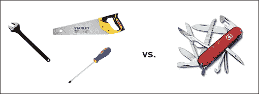

best-of-breed vs. best-of-suite

如果你有强烈的特殊需求和潜在的更高的股东回报，那么就大胆地采用**的最佳战略**。这将使您能够选择最适合您的精品需求的解决方案，即 RPA、OCR、ML、BPM。它将加快您的上市创新。尽管如此，在大多数情况下，由于集成、可支持性、故障点的数量以及多种技术堆栈所有权，您的(IT 系统)总拥有成本会增加。此外，不要低估管理各种软件供应商/集成商的必要性。

另一种选择是针对特定需求提供足够好的功能，并选择一个您可以信赖的一体化解决方案 **E2E 最佳套件解决方案**。这种方法可以降低总体拥有成本，减少供应商/集成商的数量，并避免一个瓶颈。内包开发运维工作将变得更加容易，并且通常可以更快地将部署推向市场。主要的缺点是缺乏灵活性、有限的垂直功能，并且在用户体验或功能方面更难赢得最终用户的赞赏。您也可能被一个供应商所束缚，并且随着需求的发展进行定制可能是一个挑战。这里的另一个“注意”是，几乎每个大型 BPM、ERP 或云供应商都已经进入了利润丰厚的自动化领域。此外，要注意所有可用的自动化功能的成熟度。

**采用现成的产品，而不是为自动化定制构建**

虽然您可以采用和集成企业自动化软件包，但总有一种选择是**构建**一个定制的自动化解决方案。FAANG 有能力建造它，但问题是，你能吗？

Source: ITSolutions — [Link](https://www.itsolutions-inc.com/news-and-training/article/build-vs-buy/)

因为信息架构是一个快速变化的行业，我的建议是，当定制对你的公司来说是一个真正的竞争优势时，就定制。一旦明确了这一竞争点，您就可以寻求资源来投资于您的数据科学家、架构师和软件工程师，以将 Python/Java/C++语言与 Knime/SAS/PowerBI/Cloud ML 解决方案结合使用，并开发满足您特定业务需求的定制 ML 算法。

**3。决定内包和/或外包实施工作**

您需要快速地为实现和集成工作做出另一个战略选择。在理想的情况下，你可以**内包**所有的开发和运营/支持工作。不利的一面可能是更慢的启动和更高的启动成本，而从长远来看，你将享受更快、更便宜、更敏捷的交付。当你尽可能内包时，也更容易建立公民开发者，从而使自动化民主化并建立草根数字文化。

另一方面，**外包**会让你更快启动，降低你的初始资金需求。您还将从一开始就拥有更清晰的代码/标准，并在您将工作内包时赢得时间。

我的建议是在短期内外包和学习，但同时，开始投资于内包工作，并为未来的自动化机会播种第一代高级公民开发人员。

**4。关键时刻—投资开发运维及持续支持的治理**

是的，他们会告诉你，你的机器人将全天候工作，没有任何假期或病假，而且他们从不放弃。但是他们没有告诉你的是，他们也经常停止工作。请记住，您将面临遗留集成、信息安全需求、云迁移、不计其数的版本、技术异常，所有这些很快就会变成一场完美风暴。这些很快就会成为日常的头痛问题，因为你会用机器人取代你的关键流程，所有以前有经验的人可能都已经离开了。因此，总体治理框架是维持价值的关键，包括充分的控制、法规遵从性、用户访问管理、信息安全和 99%以上的关键流程优质服务。

> 每个公司都需要一个“机器人运营中心(ROC)”

智能自动化提供商通常是行业中的新手，经常推出新版本和升级。这意味着支持人员可能不完全符合行业标准，而且与 ERP/CRM 相比，DevOps 产品可能相对不成熟。这给支持质量和确保快速扩展带来了挑战。您可以通过业务和 IT 之间的积极协作以及嵌入内部 DevOps 模型来解决其中一些问题，该模型由混合 DevOps 结构中的合作伙伴进行补充。

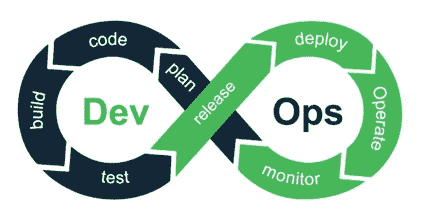

Source: [Link](https://medium.com/@neonrocket/devops-is-a-culture-not-a-role-be1bed149b0)

一个新兴的未来工作示例是维持您的机器学习模型，目前还没有全面或负担得起的企业支持模型。公司需要找到方法来确保 ML 模型的持续性能，即使它们已经被移交给支持部门(即重新培训、重新标记、转移学习、性能监控等)。).

**平台与业务流程支持** —虽然以上几点解决了平台需求，但我们也应该承认业务流程支持带来了类似的挑战。自动化/ML 模型解决了从非常简单到非常复杂的过程集(数百个机器人，需要集成多个平台)。特别是在后一种情况下，目标是最高的业务价值，支持流程本身就变成了业务知识、人员配备的连续性和技术专长的问题。创建这种支持结构需要时间来培训、提升以及维护，以确保适当的质量。早点开始！

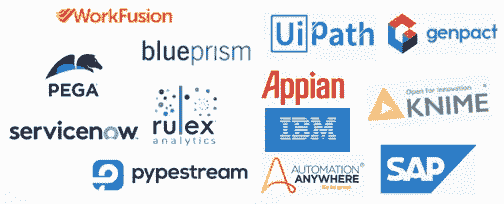

A subset of the leading vendors. IA is fast becoming a crowded space…

**5。从最小可行的产品开始，采用敏捷**

你需要在自动化项目中使用敏捷/Scrum 或者一个变体；否则，我保证你的程序会失败！

根据敏捷原则，您不必从一开始就自动化整个过程。选择一些 lighthouse 案例，启动概念证明，意思是，以更高的频率自动化快乐路径和流程的各个部分。不要自动化每一个异常，除非你能确认它满足一个适当的频率阈值，在这个阈值下，自动化的好处可以显著地补偿开发成本。关注**最小可行产品，以** **快乐路径**开始。选择和调整第一组流程对于整个企业 IA 项目的成功至关重要。

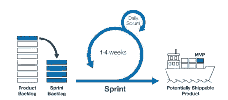

Agile project management life cycle

敏捷也为开发带来了挑战，因为变更请求和设计澄清的数量远远超出了最初的蓝图阶段。在这种情况下，有一个强有力的产品经理和 scrum 大师可以让事情继续发展。

Start with the happy path

另一个关键的实现挑战是满足内部客户的需求，尤其是当自动化面对用户时(人在回路中、编排等)。).许多业务需求(功能或 UX 相关的)是特定于某个业务模型的。在维护产品完整性、可伸缩性和可支持性的同时，用技术能力确保客户响应的灵活性和敏捷性仍然是自动化项目管理和实现中的“高”技能之一。

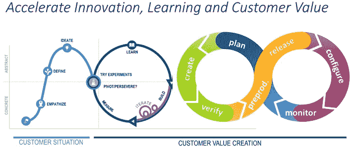

Source: [Gartner](https://blogs.gartner.com/christopher-little/2019/03/01/devops-mar-2019/) (Christopher Little)

**6。每个机器人的投资回报率是多少？**

认真对待这一点，以优化投资，同时避免分析瘫痪的情况。一条经验法则是，自动化带来的节约应该等于或高于您的一次性成本。否则，您不应该继续。换句话说:你的付出比例应该是一年或更少。如果特定的自动化成本为 50，000 美元，那么您应该期望至少 5000 万美元或更多的持续收益。这是你的最低门槛。通常，较简单的 RPA 自动化的开发成本为 5 美元——10K，运行成本为类似的美元，而较复杂的自动化的开发或运行成本可能高达 4 万至 5 万美元(不包括 ML 型号)。

不要只考虑自动化消除了什么(减少您已经做的事情)，还要考虑您可以用自动化做什么(承担更多的额外容量)。您可以减少罚款、提高客户服务/满意度、避免缺货或消除洗钱和欺诈！

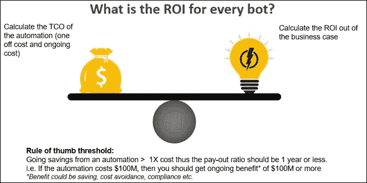

Image source: [https://www.slideteam.net/](https://www.slideteam.net/)

7 .**。不要错失良机，首先重新设计遗留流程！**

> *比尔·盖茨优雅地说道*“在商业中使用的任何技术的第一条规则是，自动化应用于高效的运营将会放大效率。第二，自动化应用于低效率的操作会放大低效率。”

关于 RPA 的一个很大的误解是，它被视为消除任何流程中低效率的灵丹妙药。

在实施 RPA(或更高级的 IA)的同时重新设计您的遗留流程会增加整个计划的时间和成本。尽管如此，投资回报可能会成倍增加。因此，我的建议是首先关注过程标准化和优化，而不是交付它的工具。首先，我们务实地标准化，然后我们改进，然后我们自动化。

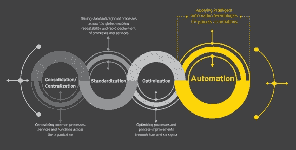

Source: Intelligent Automation — Reshaping the future of work with robots, EY ([PDF](https://webforms.ey.com/Publication/vwLUAssets/ey-intelligent-automation/$FILE/ey-intelligent-automation.pdf))

> **例外是任何成功的信息架构项目面临的逆风**

如果您自动化整个遗留的“蜘蛛网”，这将需要很长时间，并且维护或支持起来很有挑战性。在大多数企业中，通常下至第 3 级，设计和文档编制是显而易见的，但通常较少应用于较低级别的流程设计和执行(4–5–6)。在第 6 层(击键或任务层)，由于好的或坏的原因，流程通常不协调，并且在业务单元之间有差异。例如，每个国家可能有不同的法规、贸易条款或客户/消费者要求，因此有必要进行变更或例外。我们总是会有例外或客户驱动的变化，找到定制与标准化之间的最佳平衡点是一门艺术；因此，你需要专家。

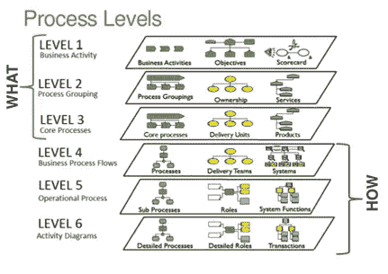

Source: Slideshare — [link](https://www.slideshare.net/tonaval/business-process-management-session-2)

这是一个绝佳的机会，既可以转变组织结构，又可以优化与自动化项目并行的现有流程，从而最大化股东回报。

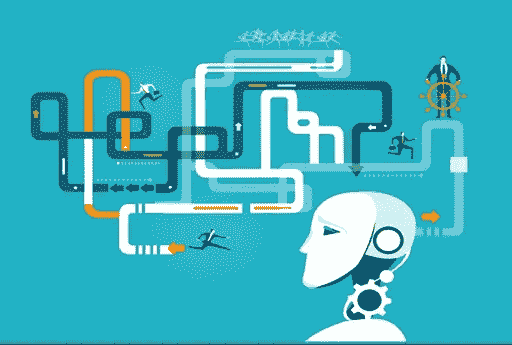

Source: CiGen RPA — [Link](https://medium.com/@cigen_rpa/8-ways-in-which-robotic-process-automation-rpa-will-change-it-operations-d2acda97767f)

你需要多技能的专家

在自动化之前重新设计流程的最佳实践是组建一个拥有流程理解和 IA 技术专业知识的多技能专家团队。公司可以考虑招聘有经验的流程顾问、6-sigma/精益/约束理论/设计思维专家来加速转型。与 IA 项目并行运行流程重新设计(相对于线性瀑布方法)至关重要，因为公司可能会错过自动化的机会。

最具破坏性的方法是遵循零基础的流程清理方法，即从头开始设计最佳流程，而不是对现有流程进行增量更改。同时，现有组织也应该重新调整技能和目标，以适应新的目标流程。

**8。一枚硬币的两面:智能自动化与工作流程/工作编排**

历史上，公司总是被组织成筒仓。当他们开始部署 IT 时，他们实施的系统本身是孤立的:人力资源管理、税务和会计管理、采购管理、物流管理等。随着公司变得越来越不依赖于功能，未来的工作将需要跨孤岛简化这些业务流程。这里要注意的是，在尝试数字化转变您的业务时，不要将 RPA 作为权宜之计。日常运营自动化跨越了各个孤岛。

虽然智能自动化和业务流程管理(BPM)各有不同，但它们也是相辅相成的，可以帮助您实施公司范围的无缝数字化转型。从概念上讲，自动化似乎已经在消除手工和重复性工作。然而，不同之处在于过程。简单的 RPA 机器人自动执行单独的任务；他们缺乏将这些任务联系起来以简化工作流程的能力。这就是工作流程和工作编排自动化的起点。好消息是 BPM 和自动化正在快速融合，并且可以集成以利用它们的优势。

RPA 和 BPM 一起部署时，可以帮助您构建一个强大的平台，支持整个组织的数字化转型。他们有着相似的提高效率和生产率的目标。因此，它们不是相互竞争的方法，可以和谐地一起工作。

BPM 简化了组织的后端工作，以支持更好的员工体验，这反过来使这些员工能够支持更智能、更灵敏的客户交互。当您需要自动化那些不会频繁变化并且不需要大量集成的流程时，您应该选择基本自动化。BPM 应该用于主要由人工执行或需要第三方集成的流程。

智能 BPM (iBPM)工作流可以触发智能 RPA 机器人，反之亦然。RPA 可用作中间件，从核心系统或外部网站收集数据。

**用例:**新客户入职银行

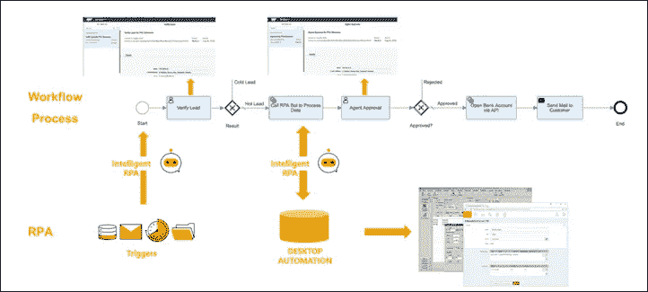

Source: SAP — Sebastian Schroetel and Christopher Aron at digitalistmag — [Link](https://www.digitalistmag.com/cio-knowledge/2019/09/26/business-process-management-robotic-process-automation-two-sides-of-same-automation-coin-06200717)

你应该仔细分析并决定如何利用有限的公司资源。这个决定取决于要构建的自动化项目的目标。

**使能技术**

幸运的是，可行的技术是存在的。[业务流程管理(BPM)](https://en.m.wikipedia.org/wiki/Business_process_management) 和流程再造在 90 年代已经很流行了。现在，现代智能业务流程管理套件(iBPMS)供应商提供了一套集成的技术来协调人、机器和事物。一个现代的 iBPMS 平台允许“公民开发者”在业务流程的改进和转换上进行合作。因此，现在是利用 iBPM 和 IA 平台的力量推动数字化转型的最佳时机。

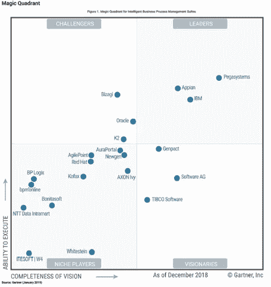

Source: [2019 Gartner Magic Quadrant for Intelligent Business Process Management Suites](https://www.pega.com/gartner-ibpms-2019)

**9。让 IT 和人力资源职能成为核心智能自动化团队和旅程不可或缺的一部分**

信息架构的商业价值和股东回报必须与 IT 和人力资源团队密切合作共同创造。如果由于缺乏技术资源、云基础设施、与遗留系统的集成、符合信息安全标准以及持续的 IT 支持要求而导致公司 IT 职能部门没有密切参与，IA 项目可能注定会失败。由于 IA 项目需要短时间的冲刺和频繁的自动化发布，it 需要与 IT 部门同步工作。

Source: camp-essen — [Link](https://camp-essen.de/web-4-0-next-level-shit/)

由于每个 IA 项目都会自然地在系统中产生不确定性和紧张感，人力资源协作是持续沟通和密切管理员工关系的关键。人力资源支持对于明确目标至关重要，它还可以帮助技能再培训计划，吸引合适的人才，并重新调整一些遗留角色的用途。

**10。收益递减陷阱——如何跨越鸿沟？**

自动化可以在短期内带来巨大的价值，但如果您不发展您的 IA 能力，机会将会受到限制。大多数公司首先采用机器人流程自动化(RPA ),通过不需要人工交互的软件程序来自动化基于规则和确定性的流程。然而，这些公司在 1-2 年内很快就会遭遇商业价值回报递减，最终将需要采用更先进的技术，如机器学习(OCR、NLP 聊天机器人、分类/翻译机器人、预测/说明性警报等。)，以及动态工作流程。

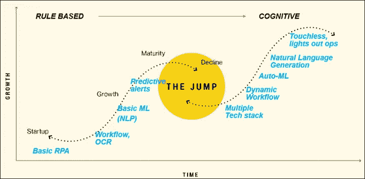

Image template: PeopleDesign

这是一个快速变化的空间，创新的步伐非常有活力。保持内部和外部联系，跨越每个鸿沟。

**接下来，S 曲线/空白区域**

制定机会总体规划，为您的组织选择合适的解决方案供应商；一家希望在您未来 3-5 年感兴趣的领域进行战略性投资的供应商。时间过得很快。当解决方案的功能不再符合客户需求时，改变方向可能为时已晚，且代价高昂。

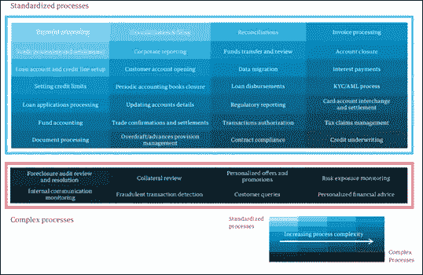

Source: [Genpact](https://www.genpact.com/downloadable-content/insight/the-evolution-from-robotic-process-automation-to-intelligent-automation.pdf) — Automation in banking and financial services processes

**共同投资**

共同投资是一个所有自动化公司为了在商业领域获得优势而竞争的领域。选择正确的业务战略和联合投资机会可以显著降低未来自动化的成本，甚至更好的是，释放巨大的未来价值。

**遗言**

还有其他重要的考虑事项我没有在这里介绍，比如建立自动化卓越中心(CoE)，机器人的信息安全最佳实践，或者选择正确的供应商。IA 是一个多年的旅程，也是一个陡峭的学习曲线。不要害怕在实验中犯错误，大胆前进。祝你好运！

Good luck!

**信用/来源:**

[https://www.uipath.com/blog/rpa-re-engineer-first-really?hs_amp=true](https://www.uipath.com/blog/rpa-re-engineer-first-really?hs_amp=true)

[https://www . digitalistmag . com/CIO-knowledge/2019/09/26/business-process-management-robotic-process-automation-two-sides-of-same-automation-coin-06200717](https://www.digitalistmag.com/cio-knowledge/2019/09/26/business-process-management-robotic-process-automation-two-sides-of-same-automation-coin-06200717)

[https://HBR . org/2018/06/before-automating-your-company-processes-find-ways-improve-them](https://hbr.org/2018/06/before-automating-your-companys-processes-find-ways-to-improve-them)

[https://technology advice . com/blog/information-technology/workflow-vs-BPM-vs-RPA/](https://technologyadvice.com/blog/information-technology/workflow-vs-bpm-vs-rpa/)

[https://kissflow.com/bpm/rpa-vs-bpm-whats-the-difference/](https://kissflow.com/bpm/rpa-vs-bpm-whats-the-difference/)

[https://dzone.com/articles/rpa-vs-bpm](https://dzone.com/articles/rpa-vs-bpm)