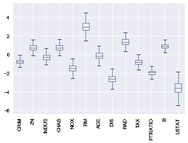

# 如何为任何模型添加置信区间

> 原文：<https://towardsdatascience.com/how-to-add-confidence-intervals-to-any-model-7bbb9f80fd9c?source=collection_archive---------16----------------------->

## 不到 10 行代码


Photo by [Toa Heftiba](https://unsplash.com/@heftiba?utm_source=medium&utm_medium=referral) on [Unsplash](https://unsplash.com?utm_source=medium&utm_medium=referral)

“我能相信你的模型吗？”

这是你展示最新作品时，你的经理问的第一件事。你怎么回答？你指的是均方差吗？R 系数？一些例子结果怎么样？这些都很棒，但是我想在你的工具箱中添加另一项技术— **置信区间**。

# 信任

归根结底，任何数据科学家最重要的工作之一就是帮助人们信任一种他们很可能并不完全理解的算法。

帮助建立这种信任的一种方法是给模型的预测增加置信区间。我们将为本文定义置信区间，作为量化估计的不确定性的一种方式。这对于分类问题来说更容易。大多数算法提供概率估计，可以作为置信度得分。例如，90%的概率是一只猫应该比 50%的概率更有信心。

然而，对于回归问题，事情往往变得更加棘手。大多数算法没有提供置信度或概率分数的自然方法。这个问题有很多解决方案，我最喜欢的一个是贝叶斯模型，但是**我想讨论最简单和最容易的方法来实现任何机器学习模型。**

# **自举重采样**

首先，我们需要定义一个引导示例。幸运的是，这很简单——这是我们数据集的一个样本，*替换了*，其中样本大小与数据集大小相同。这意味着平均 bootstrap 样本包含 63.2%的原始观察值，并省略 36.8%。遗漏的 36.8%的数据是从样本中包含的 63.2%的数据中复制的。你可以在这里阅读更多关于这些数字是如何计算的[。](https://blogs.sas.com/content/iml/2017/06/28/average-bootstrap-sample-omits-data.html)

这很有用，因为这是一个非常简单的方法，通过它，您现在可以模拟不同的底层数据集，而不会实际更改数据。

下面是如何创建数据集的 1，000 个引导样本(假设 X 值在 scaled_df 中，标签在 target 中)

一旦你有了 1，000 个数据样本，你现在可以训练你的模型 1，000 次，并获得不同的结果。关键在于，当输入数据的微小变化仅导致输出的微小变化时，结果会更加稳健。让我们看看我们的培训(在本例中使用一个简单的 SGD 回归器)

在这个例子中，我关心的结果是我的模型系数。您可以在我的训练循环中看到，我将它们附加到一个列表中，这样我就可以分析系数的分布，如下所示:



我们拥有的是我在 x 轴上的所有特征以及这些特征的系数分布(来自 1000 个模型)。当试图理解这些系数值的可信度时，这非常有帮助。

例如，有几个变量，如年龄，跨度为 0。这不好，因为你不仅对点估计不自信，而且对方向(正或负)也不自信。其他变量，如 PTRATIO，具有较小的方差，并且完全位于正或负的一侧。这些变量给了我们更多的信心。

您还可以定义概率范围。如果我们仔细观察 LSTAT，我们会看到以下内容:

```
mean       -3.599465
std         0.687444
min        -5.825069
25%        -4.058086
50%        -3.592409
75%        -3.120958
max        -1.575822
```

100%的时间系数值落在-1.57 和-5.82 之间，内部四分位数范围位于-3.12 和-4.05 之间。

# 充满信心地前进

希望这是一个有用的例子，说明如何在任何模型中增加和测量你的信心。虽然简单，但我们已经证明了 bootstrap 重采样非常有启发性，有助于建立对模型的信任。这并不是提供置信区间的唯一方法，我鼓励你把它作为在你的模型中建立置信区间的起点。

[免费获得掌握数据科学的 11 种极其有用的资源](https://datascienceleadership.substack.com/)