# 如何向 Azure 数据湖添加元数据

> 原文：<https://towardsdatascience.com/how-to-add-metadata-to-your-azure-data-lake-f8ec2022f50?source=collection_archive---------3----------------------->

# 1.介绍

许多公司考虑建立一个企业数据湖。这个想法是将数据存储在一个集中的存储库中。这样，团队就更容易用数据创造商业价值。为了防止数据湖变成充斥着不可信数据的数据沼泽，元数据是关键。在这种情况下，可以区分以下类型的元数据:

*   业务元数据:数据所有者、数据源、隐私级别
*   技术元数据:模式名、表名、字段名/类型
*   操作元数据:时间戳、数据大小、沿袭

在本博客的剩余部分，将讨论如何建立 Azure 数据湖以及如何添加元数据。关于如何在你的 Azure 数据湖中保护数据编排的更多细节，请看我的后续博客[这里](/how-to-secure-your-azure-data-factory-pipeline-e2450502cd43)。关于如何使用快照和增量备份来防止数据湖中数据丢失的解决方案，请看这个[博客](/how-to-create-snapshots-and-backups-of-your-azure-storage-e72bef58e0aa)。

# 2.带有元数据的 Azure 数据湖体系结构

在这个[项目](https://github.com/rebremer/adfv2_cdm_metadata)的架构中，结合了流行的 Azure 服务的功能来创建数据湖，其中数据/元数据从 SQLDB 复制到 Azure 数据湖存储。项目的设置可以在下面找到。


2\. Azure Data Lake architecture with metadata

Azure 服务及其在本项目中的使用描述如下:

*   **元数据存储**用于存储业务元数据。在这个项目中，使用了一个 blob 存储帐户，其中数据所有者、数据的隐私级别存储在一个 json 文件中。
*   **SQLDB** 用作包含将要复制的表数据的源系统。它还包含将用于描述数据的技术元数据。
*   **Azure 数据工厂** **v2** (ADFv2)被用作将数据从源复制到目的地的编排器。它还收集业务元数据和技术元数据，并生成操作元数据。
*   **Azure Function Python** 被 Azure Data Factory 用来创建符合[公共数据模型](https://github.com/Microsoft/CDM) (CDM)格式的单个元数据文件。在这里，它使用业务/技术/运营元数据作为输入，并使用 CDM 的 [jsonschema](https://github.com/microsoft/CDM/blob/master/samples/cdm-folders/schema/modeljsonschema.json) 创建 model.json。
*   Azure Data Lake Store gen 2(ADLS gen 2)用于存储来自 10 个 SQLDB 表的数据。创建一个文件系统，每个表都是文件系统中的一个根文件夹。除了数据本身，元数据还使用由 Azure 函数 Python 创建的 CDM 格式的 model.json 进行存储。

在接下来的三章中，实现了这个架构。在第 3 章中，部署了创建数据湖的先决条件。然后在第 4 章，部署并运行一个管道。最后，在第五章得出结论。关于如何保护 ADFv2 管道的更多细节，请参见我的另一篇[博客。](/how-to-secure-your-azure-data-factory-pipeline-e2450502cd43)

# 3.创建 Azure 数据湖的先决条件

在这一章中，实现了一个带有元数据的 Azure 数据湖。执行以下步骤:

*   3a。创建 SQLDB
*   3b。使用元数据创建存储帐户
*   3c。创建 ADLS 第二代帐户
*   3d。在 python 中创建 Azure 函数
*   3e。创建 Azure 数据工厂实例
*   3f。使用受管身份向 ADLS 第二代授予访问权限

## 3a。创建 SQLDB

按照[快速入门](https://docs.microsoft.com/en-us/azure/sql-database/sql-database-single-database-get-started?tabs=azure-portal)中的步骤如何创建 is SQLDB 数据库。在这种情况下，请确保您选择了基本数据库，如下所示。

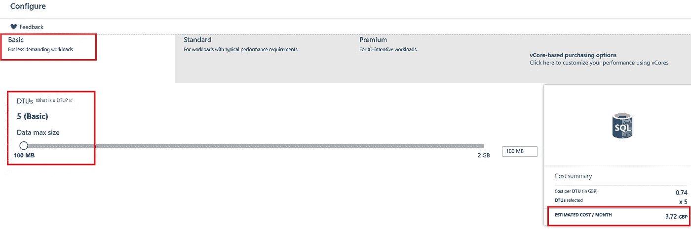

3a1\. Basic SQLDB to save costs

此外，请确保安装 AdventureWorksLT 示例数据库，另请参见下文。

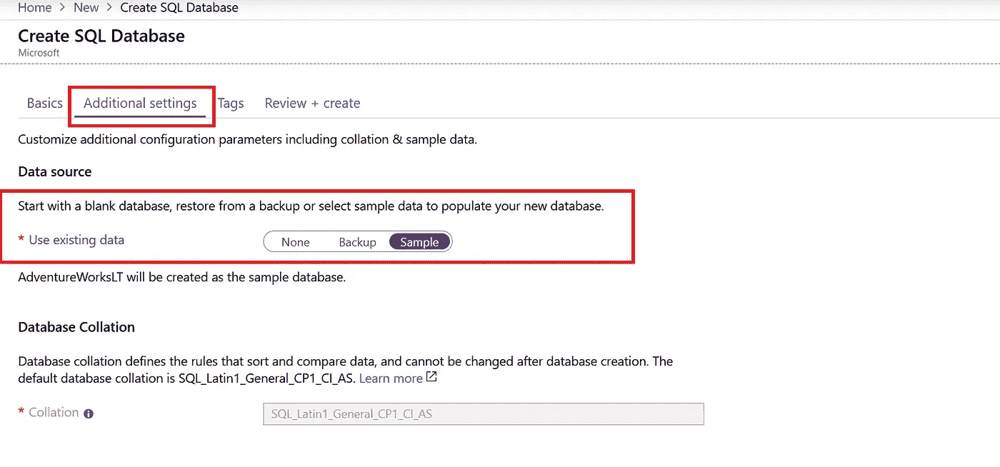

3a2\. Add AdventureWorksLT as sample database

## 3b。使用业务元数据创建存储帐户

在此步骤中，将创建一个常规存储帐户。遵循本[快速入门](https://docs.microsoft.com/en-us/azure/storage/common/storage-quickstart-create-account?tabs=azure-portal)中的步骤。确保存储帐户存储在安装了 SQLDB 的同一资源组中。此外，在存储帐户中创建一个容器，并将该容器命名为 **processmetadata** 。然后使用以下链接下载包含数据所有者、数据隐私级别的以下业务元数据文件:

```
[https://raw.githubusercontent.com/rebremer/adfv2_cdm_metadata/master/procesdataexample/MetadataProcess.json](https://raw.githubusercontent.com/rebremer/adfv2_cdm_metadata/master/procesdataexample/MetadataProcess.json)
```

将 MetadataProcess.json 上传到您的存储容器，另请参见下文。

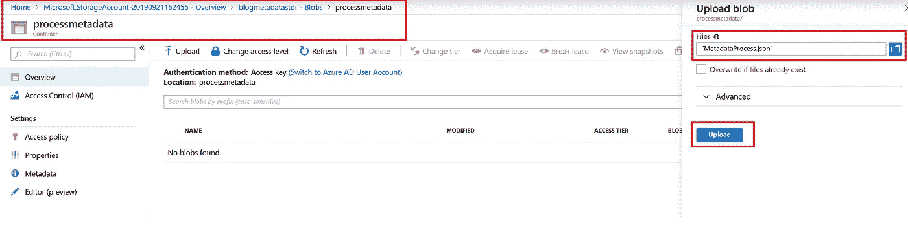

3b1\. Storage account with container and MetadataProcess.json uploaded

## 3c。创建 ADLS 第二代帐户

在此步骤中，将创建一个 ADLS 第二代存储帐户。遵循本[快速入门](https://docs.microsoft.com/en-us/azure/storage/blobs/data-lake-storage-quickstart-create-account#create-a-general-purpose-v2-storage-account)中的步骤。确保“分层命名空间”为“是”，这将创建一个分层文件系统(HFS ),其中可以创建文件夹(而不是基于对象的文件系统，其中所有信息都存储在对象本身中)。另见下文。

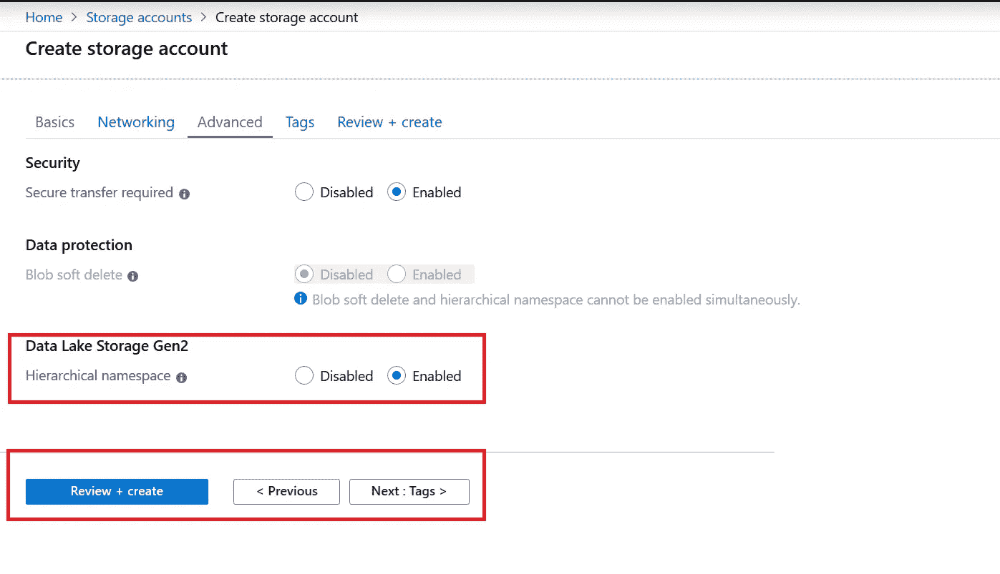

3c1\. ADLS gen2 with hierachical namespace enabled

随后，在 ADLS gen 2 中创建一个文件系统，如下所示。

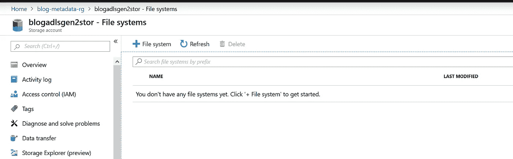

3c2\. Create File System in ADLS gen2

确保文件系统被命名为 **sqldbdata** 。

## 3d。在 python 中创建 Azure 函数

在这一步中，用 Python 创建了一个 Azure 函数。按照这个用 Azure Python 创建函数的[快速入门](https://docs.microsoft.com/en-us/azure/azure-functions/functions-reference-python)中的步骤操作。使用 HTTP 触发器发布初始 Azure 函数 Python 后，更新 __init__。py 和 requirement.txt，并将 cdmschema.py 添加到项目中 __init__.py 的旁边。

```
[https://raw.githubusercontent.com/rebremer/adfv2_cdm_metadata/master/modeljson/modeljsonwrite/__init__.py](https://raw.githubusercontent.com/rebremer/adfv2_cdm_metadata/master/modeljson/modeljsonwrite/__init__.py)[https://raw.githubusercontent.com/rebremer/adfv2_cdm_metadata/master/modeljson/modeljsonwrite/cdmschema.py](https://raw.githubusercontent.com/rebremer/adfv2_cdm_metadata/master/modeljson/modeljsonwrite/cdmschema.py)[https://raw.githubusercontent.com/rebremer/adfv2_cdm_metadata/master/modeljson/requirements.txt](https://raw.githubusercontent.com/rebremer/adfv2_cdm_metadata/master/modeljson/modeljsonwrite/requirements.txt)
```

__init__。py 接收元数据输入作为参数，创建符合 CDM jsonschema 的 model.json 对象，然后将 json 对象返回给 ADFv2。然后，ADFv2 会将数据写入 ADLS gen2 文件系统。Requirement.txt 包含 Python 中 Azure 函数运行所需的 Pypi 库。随后，使用以下命令发布代码。

```
func azure functionapp publish <APP_NAME> --build remote
```

当你的 Azure 函数成功部署后，你可以看到函数中的代码，见下文。

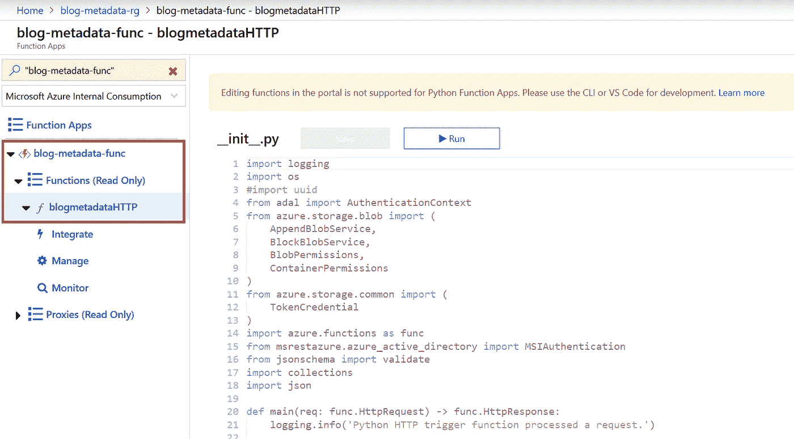

3d1\. Python code in Azure Function

**3e。创建一个 Azure 数据工厂实例**

在这一步中，用 Python 创建了一个 Azure 函数。遵循这个创建 Azure 数据工厂的[快速入门](https://docs.microsoft.com/en-us/azure/data-factory/quickstart-create-data-factory-portal#create-a-data-factory)中的步骤。创建数据工厂后，找到您的 ADFv2 资源并单击 author & monitor。然后选择建立一个代码库，导入下面的 GitHub 库 **rebremer** 和 project**ADF v2 _ CDM _ metadata**，见下图。

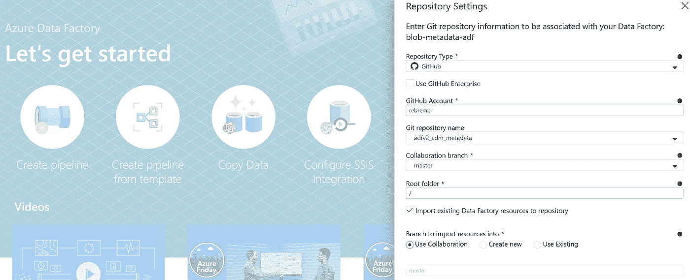

3e1\. Setup code repository in ADFv2

## 3f。使用受管身份向 ADLS 第二代授予访问权限

在所讨论的体系结构中，ADFv2 用于将数据从 SQLDB 复制到 ADLS gen2。此外，使用 Azure Python 函数从 blob 存储中读取业务元数据，并将其写入 ADLS gen 2。为此，需要授予对 ADLS gen2、blob 存储和 SQLDB 的访问权限。在本[教程](https://docs.microsoft.com/bs-latn-ba/azure/storage/common/storage-auth-aad-rbac-portal#assign-rbac-roles-using-the-azure-portal)中，解释了如何将 RBAC 规则分配给存储。按如下方式分配以下 RBAC 规则:

*   授予您的 ADFv2 实例“存储 Blob 数据贡献者”角色，使其成为具有业务元数据的存储帐户(在 3b 中创建)
*   向您的 ADLS gen 帐户(在 3c 中创建)授予您的 ADFv2 实例“存储 Blob 数据贡献者”角色

可以在访问控制选项卡中验证是否成功添加了 RBAC，请参见下面的 ADFv2 实例(3c)和 Azure 函数(3d)。

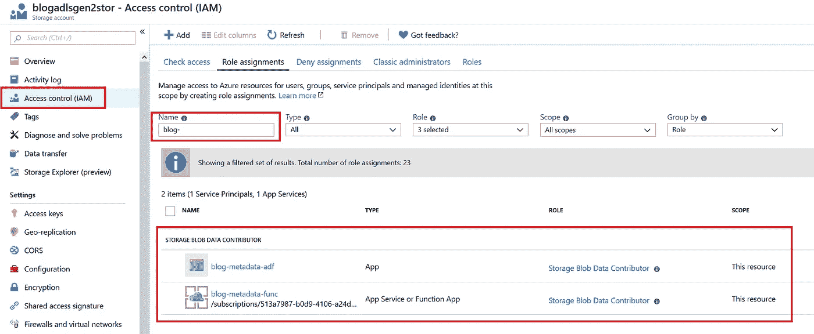

3f1\. ADFv2 and Azure function as “Storage Blob Data Contributer” on ADLS gen2

为简单起见，在以下两个步骤中不使用托管身份:

*   ADFv2 使用 SQL 认证对 SQLDB 进行认证，但是，这也可以通过 MI 完成，请参考此[链接](https://docs.microsoft.com/en-us/azure/data-factory/connector-azure-sql-database#managed-identity)。
*   ADFv2 使用密钥向 Azure 函数进行身份验证。请参考本[教程](https://github.com/rebremer/managed_identity_authentication)如何管理身份也可以用于此目的

所有先决条件现在都已部署。在下一章中，管道是在 ADFv2 中安润构建的。

# 4.在 ADFv2 中构建并运行管道

在本章中，实现了 ADFv2 中的构建和运行管道。执行以下步骤:

*   4a。设置参数和链接的服务
*   4b。在 Azure 函数中配置应用洞察
*   4c。运行管道

## 4a。设置参数和链接的服务

第一步，需要为您的存储帐户和 SQLDB 定制管道。确保 ADFv2 在数据工厂模式下运行，并使用您的参数填写管道的参数，如下所示


4a1\. Data Factory mode ans set parameters

随后，在链接的服务中引用您自己的日志记录、ADLS gen 2、SQLDB 和 Azure 函数的存储帐户。请参阅下面需要更改的链接服务:

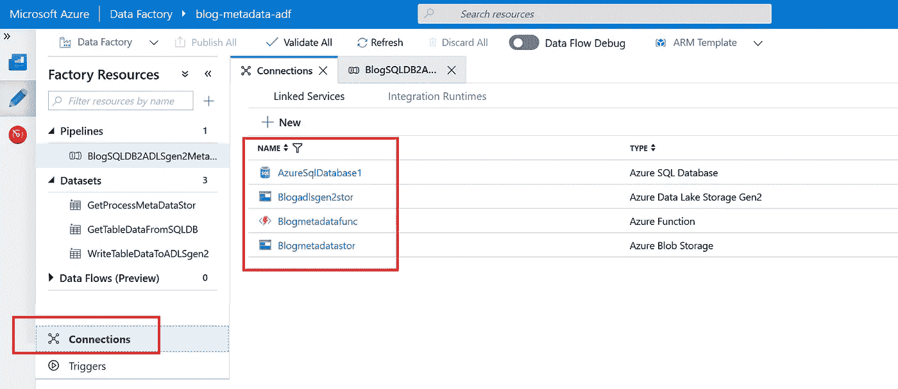

4a2\. Linked Services that needs to be customized

## 4b。在 Azure 函数中配置应用洞察

第一次运行管道时，管道可能不会正确运行。在 ADFv2 中可以看到错误消息，但是，ADFv2 也引用了一个外部 Azure 函数。要查看 Azure 函数的日志记录，需要启用应用洞察。转到“监控”选项卡，按照向导设置应用洞察，见下文

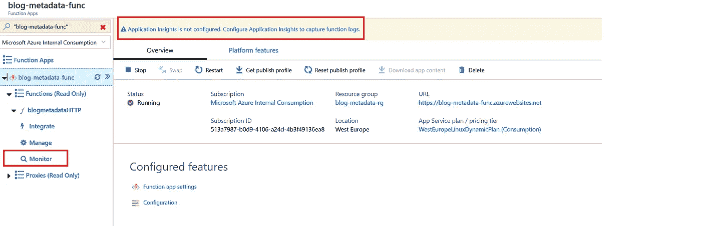

4b1\. Setup Applications Insights in Azure Function

当 Azure 函数运行时，所有 logging.info 和引发的异常都会被记录，参见下面的示例。


4b2\. Example of logging in Azure Function using Applications Insight

## 4c。在 ADFv2 中运行管道

最后一步，管道可以在 ADFv2 中运行。转到您的管道并单击 debug。当一切顺利时，所有的绿色检查将出现在输出中，如下所示。

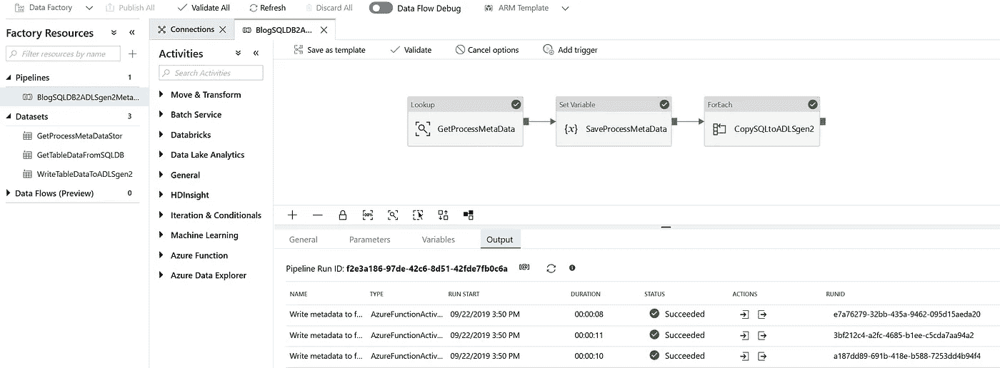

4c1\. Successful run of pipeline

转到您的 ADLS gen 存储帐户，验证数据和元数据是否已复制。有关表 dboversio，请参见下面的示例

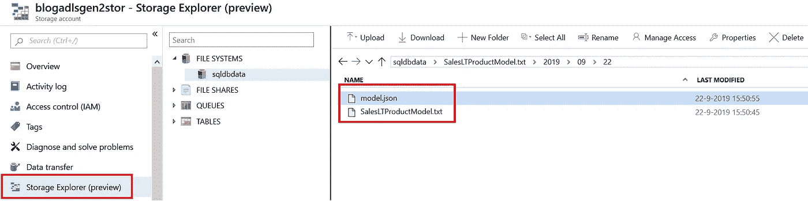

4c2\. Data and metadata of table in ADLS gen2 file system

当您打开 model.json 时，可以使用 CDM 格式找到元数据，请参见下面的代码片段。

```
{
  "name": "BlogMetaData",
  "description": "Example model.json using CDM json schema",
  "version": "1.0",
  "annotation": {
    "retentionPeriod": 62,
    "sourceSystem": "bremerov",
    "IngestionDate": "2019-09-09 16:56:00Z",
    "privacyLevel": "10"
  },
  "entities": [
    {
      "$type": "LocalEntity",
      "name": "SalesLTProductModel",
      "description": "", 
      "attributes": [
        {
          "name": "ProductModelID",
          "dataType": "int64"
        },
...
```

# 5.结论

许多公司考虑建立一个企业数据湖。为了防止数据湖变成数据沼泽，元数据是关键。在这种情况下，可以区分以下类型的元数据:

*   业务元数据:数据所有者、数据源、隐私级别
*   技术元数据:模式名、表名、字段、字段类型
*   操作元数据:摄取开始/结束的时间戳

在这篇博客中，我们讨论了如何使用下面的架构向数据湖添加元数据。


5\. Azure Data Lake architecture with metadata