# 如何使用 Python 分析笔记本电脑上的 100 GB 数据

> 原文：<https://towardsdatascience.com/how-to-analyse-100s-of-gbs-of-data-on-your-laptop-with-python-f83363dda94?source=collection_archive---------1----------------------->


Image Credit: Flickr User Kenny Louie

## [理解大数据](https://towardsdatascience.com/tagged/making-sense-of-big-data)

许多组织正试图收集和利用尽可能多的数据，以改善他们如何经营业务、增加收入或如何影响他们周围的世界。因此，数据科学家面对 50GB 甚至 500GB 大小的数据集变得越来越常见。

现在，这种数据集使用起来有点…不舒服。它们足够小，可以放入日常笔记本电脑的硬盘，但又太大，无法放入 RAM。因此，它们已经很难打开和检查，更不用说探索或分析了。

处理此类数据集时，通常采用 3 种策略。第一个是对数据进行子采样。这里的缺点是显而易见的:一个人可能会因为没有看到相关的部分而错过关键的洞察力，或者更糟糕的是，因为没有看到全部而误解了它所讲述的故事和数据。下一个策略是使用分布式计算。虽然在某些情况下这是一种有效的方法，但是它会带来管理和维护集群的巨大开销。想象一下，必须为一个刚好超出 RAM 范围的数据集设置一个集群，比如 30–50gb 的范围。对我来说这似乎是一种过度杀戮。或者，您可以租用一个强大的云实例，它具有处理相关数据所需的内存。例如，AWS 提供了 1tb 内存的实例。在这种情况下，您仍然需要管理云数据桶，在每次实例启动时等待数据从桶传输到实例，处理将数据放在云上带来的合规性问题，以及处理在远程机器上工作带来的所有不便。更不用说成本，虽然开始很低，但随着时间的推移，成本会越来越高。

在本文中，我将向您展示一种新的方法:一种更快、更安全、总体上更方便的方法，使用几乎任意大小的数据进行数据科学研究，只要它能够适合您的笔记本电脑、台式机或服务器的硬盘驱动器。

# Vaex

[](https://github.com/vaexio/vaex)

[Vaex](https://github.com/vaexio/vaex) 是一个开源的 DataFrame 库，它可以对硬盘大小的表格数据集进行可视化、探索、分析甚至机器学习。为此，Vaex 采用了内存映射、高效核外算法和惰性评估等概念。所有这些都包含在一个熟悉的[熊猫式的](https://github.com/pandas-dev/pandas) API 中，所以任何人都可以马上开始使用。

# 十亿次出租车乘坐分析

为了说明这个概念，让我们对一个数据集做一个简单的探索性数据分析，这个数据集太大了，以至于不能放入典型笔记本电脑的 RAM 中。在本文中，我们将使用纽约市(NYC)的出租车数据集，其中包含标志性的黄色出租车在 2009 年至 2015 年间进行的超过*10 亿次*出租车旅行的信息。这些数据可以从这个[网站](https://www1.nyc.gov/site/tlc/about/tlc-trip-record-data.page)下载，并且是 CSV 格式的。完整的分析可以在[本 Jupyter 笔记本](https://nbviewer.jupyter.org/github/vaexio/vaex-examples/blob/master/medium-nyc-taxi-data-eda/vaex-taxi-article.ipynb) *中单独查看。*

# 清扫街道

第一步是将数据转换成内存可映射文件格式，如 [Apache Arrow](https://arrow.apache.org/) 、 [Apache Parquet](https://parquet.apache.org/) 或 [HDF5](https://en.wikipedia.org/wiki/Hierarchical_Data_Format#HDF5) 。如何将 CSV 数据转换为 HDF5 的示例可参见[这里的](https://nbviewer.jupyter.org/github/vaexio/vaex-examples/blob/master/medium-airline-data-eda/airline-original-data-conversion.ipynb)。一旦数据是内存可映射格式，用 Vaex 打开它是即时的(0.052 秒！)，尽管它在磁盘上的大小超过 100GB:

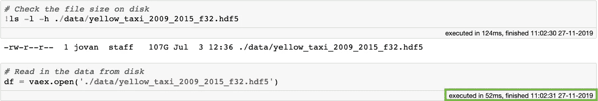

Opening memory mapped files with [Vaex](https://github.com/vaexio/vaex) is instant (0.052 seconds!), even if they are over 100GB large.

为什么这么快？当你用 Vaex 打开一个内存映射文件时，实际上没有数据读取。Vaex 只读取文件元数据，如数据在磁盘上的位置、数据结构(行数、列数、列名和类型)、文件描述等。那么，如果我们想要检查数据或与数据进行交互，该怎么办呢？打开一个数据集会产生一个标准的数据框，检查它的速度很快，而且很简单:

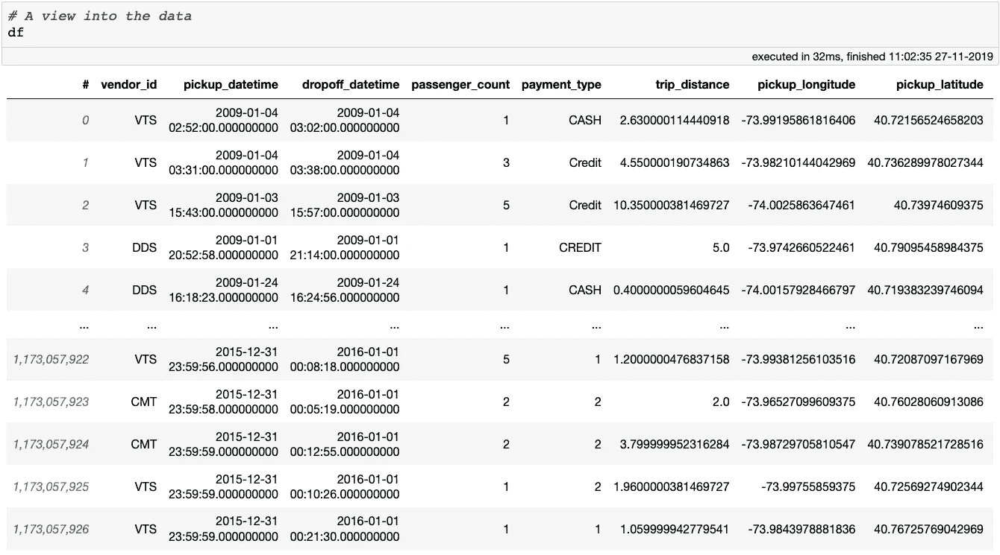

A preview of the New York City Yellow Taxi data

请再次注意，单元执行时间非常短。这是因为显示 Vaex 数据帧或列只需要从磁盘读取前 5 行和后 5 行。这让我们想到了另一个要点:Vaex 只会在必要时检查整个数据集，并且会尽量少地检查数据。

无论如何，让我们从清除这个数据集的极端异常值或错误的数据输入开始。一个好的开始方式是使用`describe`方法获得数据的高层次概述，该方法显示每列的样本数、缺失值数和数据类型。如果列的数据类型是数字，还会显示平均值、标准偏差以及最小值和最大值。所有这些统计数据都是通过对数据的一次遍历计算出来的。

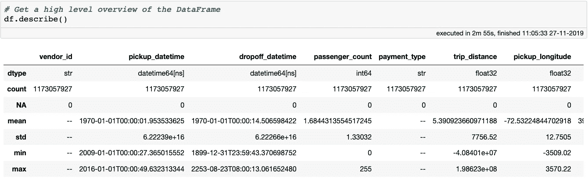

Getting a high level overview of a DataFrame with the `describe` method. Note that the DataFrame contains 18 column, but only the first 7 are visible on this screenshot.

`describe`方法很好地说明了 Vaex 的能力和效率:所有这些统计数据都是在我的 MacBook Pro (15 英寸，2018，2.6GHz 英特尔酷睿 i7，32GB 内存)上在不到 3 分钟的时间内计算出来的。其他库或方法需要分布式计算或超过 100GB 的云实例来执行相同的计算。使用 Vaex，您需要的只是数据，而您的笔记本电脑只有几 GB 的内存。

查看`describe`的输出，很容易注意到数据包含一些严重的异常值。首先，让我们从检查提货地点开始。移除异常值的最简单方法是简单地绘制上下车地点，并直观地定义我们要重点分析的纽约市区域。由于我们正在处理如此大的数据集，直方图是最有效的可视化方式。用 Vaex 创建和显示直方图和热图是如此之快，这样的图可以是交互式的！

```
df.plot_widget(df.pickup_longitude, 
               df.pickup_latitude, 
               shape=512, 
               limits='minmax',
               f='log1p', 
               colormap='plasma')
```

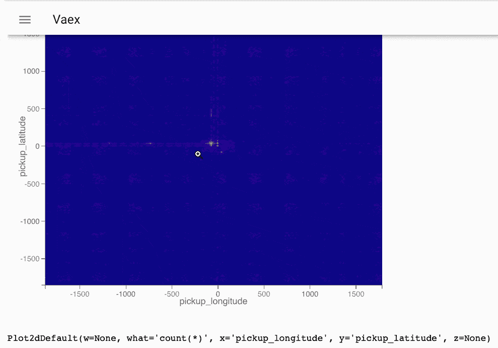

一旦我们交互式地决定了我们想要关注纽约的哪个区域，我们就可以简单地创建一个过滤数据框架:

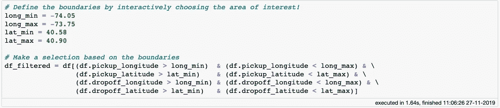

上面的代码块很酷的一点是它只需要很少的内存就可以执行！过滤 Vaex 数据帧时，不会复制数据。相反，只创建对原始对象的引用，并对其应用二进制掩码。该掩码选择显示哪些行并用于将来的计算。这为我们节省了 100GB 的 RAM，这是复制数据时所需要的，正如当今许多标准数据科学工具所做的那样。

现在，让我们检查一下`passenger_count`列。单次出租车行程记录的最大乘客人数是 255 人，这似乎有点极端。我们来统计一下每名乘客的出行次数。用`value_counts`方法很容易做到这一点:

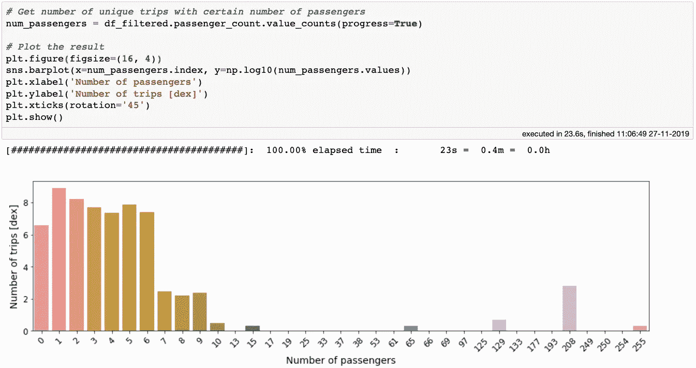

The `value_counts` method applied on 1 billion rows takes only ~20 seconds!

从上图中我们可以看到，超过 6 名乘客的行程可能是罕见的异常值，或者只是错误的数据输入。还有大量 0 旅客的车次。因为此时我们不了解这些是否是合法的旅行，所以让我们也将它们过滤掉。

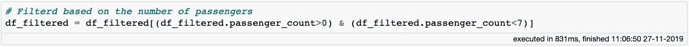

让我们用行程距离做一个类似的练习。由于这是一个连续变量，我们可以绘制出行距离的分布。望最低(负！)和最大值(比火星还远！)距离，我们来画一个直方图，有一个比较感性的范围。

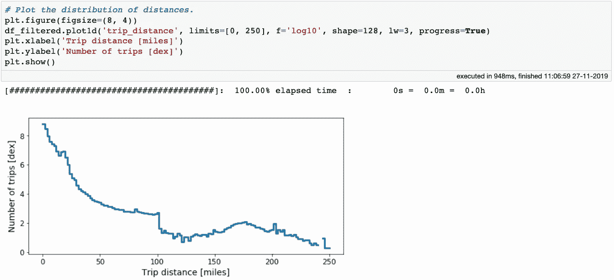

A histogram of the trip distances for the NYC taxi dataset.

从上图中我们可以看出，旅行次数随着距离的增加而减少。在大约 100 英里的距离，分布有一个大的下降。现在，我们将以此为分界点，根据行程距离消除极端异常值:

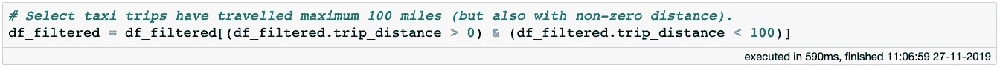

行程距离列中极端异常值的存在是调查出租车行程持续时间和平均速度的动机。这些特征在数据集中不容易获得，但是计算起来很简单:


上面的代码块不需要任何内存，也不需要任何时间来执行！这是因为代码会导致创建*虚拟列。*这些列只存放数学表达式，仅在需要时才进行计算。否则，虚拟列的行为就像任何其他常规列一样。注意，对于同样的操作，其他标准库需要几十 GB 的 RAM。

好的，让我们画出旅行持续时间的分布图:

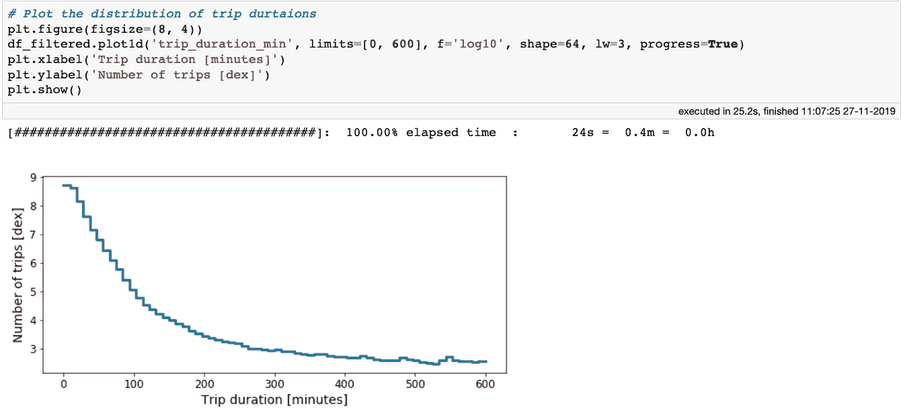

Histogram of durations of over 1 billion taxi trips in NYC.

从上面的图中我们看到，95%的出租车行程不到 30 分钟就能到达目的地，尽管有些行程可能需要 4-5 个小时。你能想象在纽约被困在出租车里 3 个多小时吗？无论如何，让我们思想开放，考虑所有持续时间不超过 3 小时的旅行:


现在让我们调查出租车的平均速度，同时为数据限制选择一个合理的范围:


The distribution of average taxi speed.

基于分布变平的位置，我们可以推断出合理的平均滑行速度在每小时 1 到 60 英里的范围内，因此我们可以更新我们的过滤数据帧:

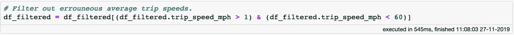

让我们把焦点转移到出租车旅行的费用上。从`describe`方法的输出中，我们可以看到在 *fare_amount、total_amount、*和 *tip_amount* 列中有一些疯狂的离群值。首先，这些列中的任何值都不应该是负数。另一方面，数字表明一些幸运的司机仅仅乘坐一次出租车就几乎成为百万富翁。让我们看看这些量的分布，但在一个相对合理的范围内:

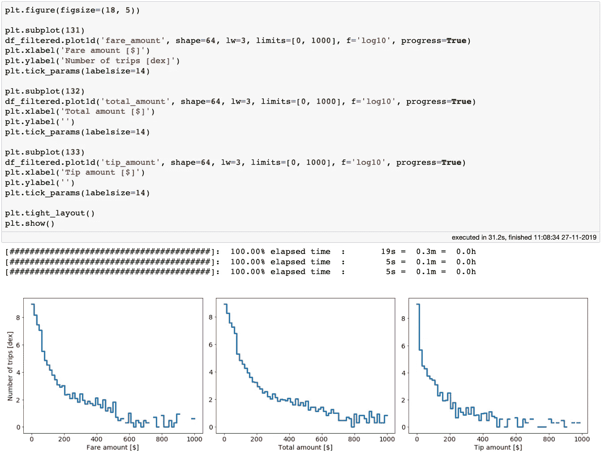

The distributions of the fare, total and tip amounts for over 1 billion taxi trips in NYC. The creation of these plots took only 31 seconds on a laptop!

我们看到上述三种分布都有相当长的尾部。尾部的一些值可能是合法的，而其他值可能是错误的数据输入。无论如何，现在让我们保守一点，只考虑 *fare_amount、*total _ amount、 *tip_amount* 少于 200 美元的乘车。我们还要求 *fare_amount，total_amount* 值大于$0。

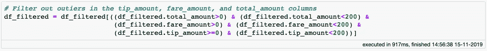

最后，在对数据进行所有初始清理之后，让我们看看还有多少次出租车出行需要我们进行分析:

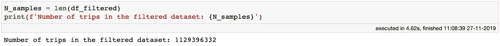

我们剩下超过 11 亿次旅行！这些数据足以让我们对出租车行业有一些有价值的了解。

# 坐到司机座位上

假设我们是一名未来的出租车司机，或者出租车公司的经理，并且有兴趣使用这个数据集来学习如何最大化我们的利润，最小化我们的成本，或者仅仅是改善我们的工作生活。

让我们首先找出搭载乘客的地点，平均来说，这些地点会带来最好的收益。天真的是，我们可以绘制一个热图，显示按平均票价金额进行颜色编码的上车地点，并查看热点地区。然而，出租车司机自己也有成本。例如，他们必须支付燃料费。因此，带乘客去很远的地方可能会导致更高的票价，但这也意味着更大的燃料消耗和时间损失。此外，从那个遥远的地方找到乘客去市中心的某个地方可能不是那么容易的，因此没有乘客的情况下开车回来可能是昂贵的。解释这一点的一种方法是通过费用金额和行程距离之间的比率的平均值对热图进行颜色编码。让我们考虑这两种方法:

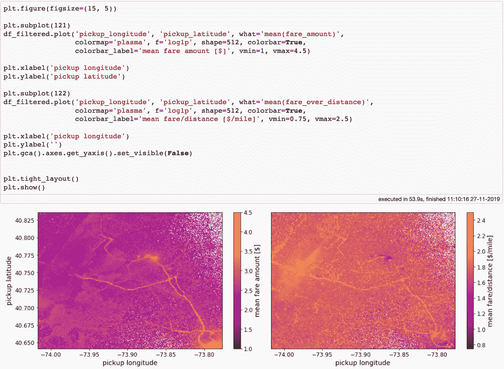

Heatmaps of NYC colour-coded by: average fare amount (left), and average ratio of fare amount over trip distance.

在天真的情况下，当我们只关心获得所提供服务的最高票价时，搭载乘客的最佳区域是纽约机场，以及沿主要道路，如范威克高速公路和长岛高速公路。当我们考虑到旅行的距离，我们得到一个稍微不同的画面。Van Wyck 高速公路和长岛高速公路以及机场仍然是搭载乘客的好地方，但是它们在地图上已经不那么突出了。然而，一些新的亮点出现在哈得逊河的西侧，看起来非常有利可图。

当出租车司机可能是一份相当灵活的工作。为了更好地利用这种灵活性，除了应该潜伏在哪里之外，知道什么时候开车最有利可图也是有用的。为了回答这个问题，让我们制作一个图表，显示每天和一天中的每个小时的平均费用与行程距离的比率:


The mean ratio of fare over trip distance per day of week and hour of day.

上面的数字是有道理的:最好的收入发生在一周工作日的高峰时间，尤其是中午前后。作为出租车司机，我们收入的一小部分给了出租车公司，所以我们可能会对哪一天、什么时间顾客给的小费最多感兴趣。让我们绘制一个类似的图，这次显示的是平均小费百分比:

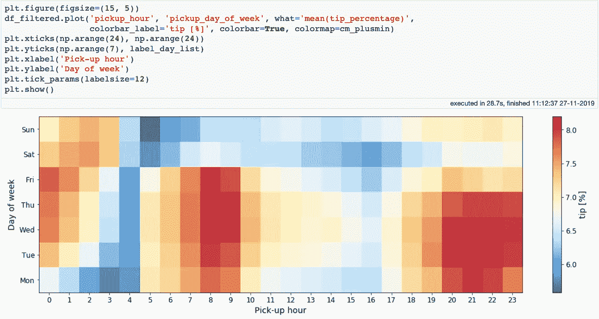

The mean tip percentage per day of week and hour of day.

上面的情节很有意思。它告诉我们，乘客在早上 7-10 点之间给出租车司机的小费最多，在一周的前几天晚上也是如此。如果你在凌晨 3 点或 4 点接乘客，不要指望得到大笔小费。结合上两个图的观点，一个好的工作时间是早上 8-10 点:一个人将会得到每英里不错的票价和不错的小费。

# 加速你的引擎！

在本文的前面部分，我们简要关注了 *trip_distance* 列，在清除异常值的同时，我们保留了所有低于 100 英里的行程。这仍然是一个相当大的临界值，特别是考虑到黄色出租车公司主要在曼哈顿运营。 *trip_distance* 列描述了出租车在上车地点和下车地点之间行驶的距离。然而，人们通常可以在两个确切的上下车地点之间选择不同距离的不同路线，例如为了避免交通堵塞或道路施工。因此，作为 *trip_distance* 列的对应项，让我们计算一个接送位置之间的最短可能距离，我们称之为 *arc_distance:*

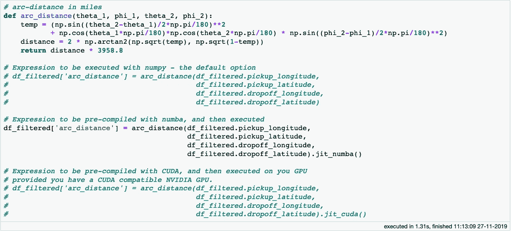

For complicated expressions written in numpy, vaex can use just-in-time compilation with the help of Numba, Pythran or even CUDA (if you have a NVIDIA GPU) to greatly speed up your computations.

用于计算 *arc_distance* 的公式非常复杂，它包含了大量的三角学和算术，并且计算量很大，尤其是当我们处理大型数据集时。如果表达式或函数仅使用 Numpy 包中的 Python 操作和方法编写，Vaex 将使用您机器的所有内核并行计算它。除此之外，Vaex 还支持通过 [Numba](http://numba.pydata.org/) (使用 LLVM)或[py tran](https://pythran.readthedocs.io/en/latest/)(通过 C++加速)进行实时编译，从而提供更好的性能。如果你碰巧有 NVIDIA 显卡，你可以通过`jit_cuda`方法使用 [CUDA](https://developer.nvidia.com/cuda-zone) 来获得更快的性能。

无论如何，让我们画出*行程距离*和*弧距离:*的分布

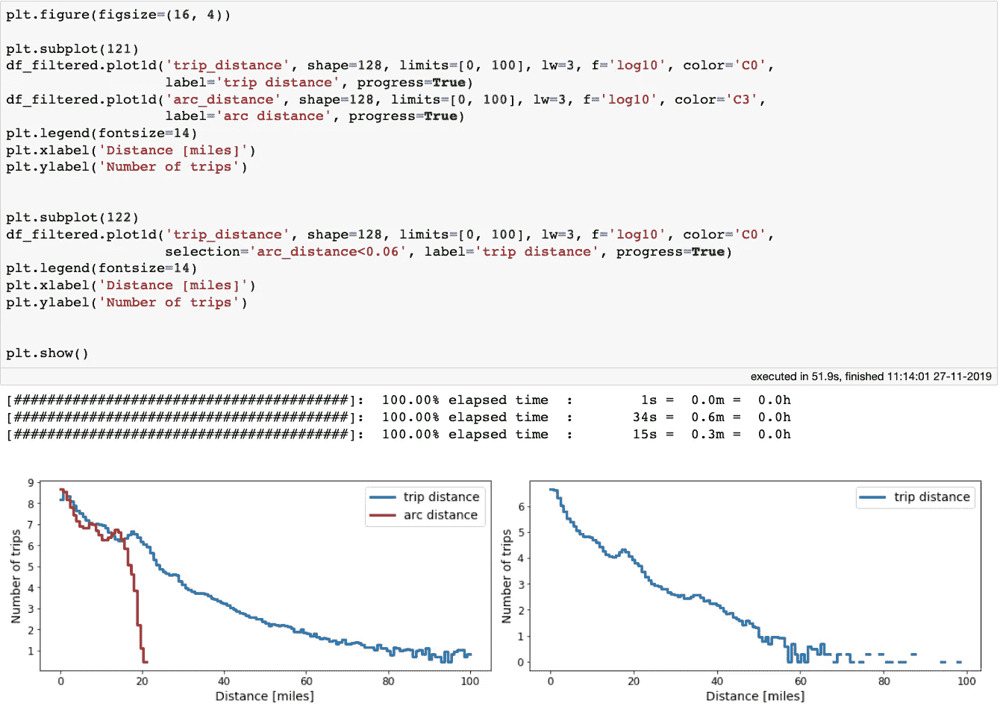

Left: comparison between *trip_distance and arc_distance. Right: the distribution of trip_distance for arc_distance<100 meters.*

有趣的是，*弧距*从未超过 21 英里，但出租车实际行驶的距离可能是它的 5 倍。事实上，上百万次出租车旅行的下车地点都在上车地点 100 米(0.06 英里)以内！

# 多年来的黄色出租车

我们今天使用的数据集跨越了 7 年。有趣的是，我们可以看到一些兴趣是如何随着时间的推移而演变的。借助 Vaex，我们可以执行快速的核外分组和聚合操作。让我们来看看票价和旅行距离在这 7 年中是如何演变的:

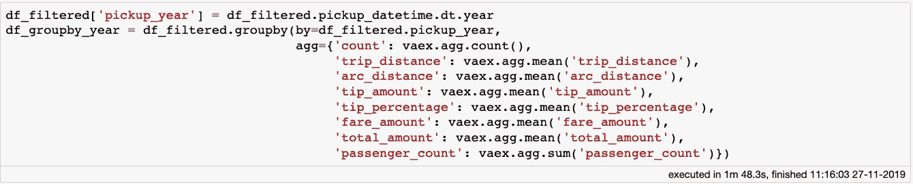

A group-by operation with 8 aggregations for a Vaex DataFrame with over 1 billion samples takes less than 2 minutes on laptop with a quad-core processor.

在上面的单元块中，我们执行了一个 group-by 操作，然后是 8 个聚合，其中 2 个聚合在虚拟列上。上面的单元块在我的笔记本电脑上运行了不到 2 分钟。考虑到我们使用的数据包含超过 10 亿个样本，这是相当令人印象深刻的。不管怎样，让我们看看结果。以下是多年来出租车费用的变化情况:

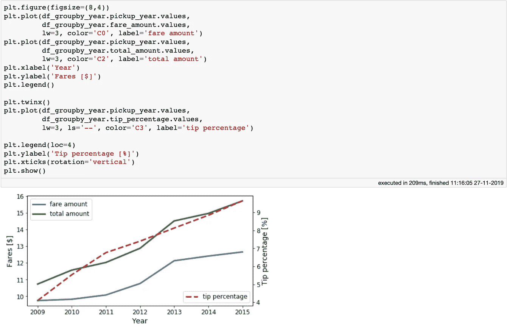

The average fare and total amounts, as well as the tip percentage paid by the passengers per year.

我们看到出租车费和小费随着时间的推移而增加。现在让我们看看出租车行驶的平均*行程距离*和*弧距*与年份的关系:

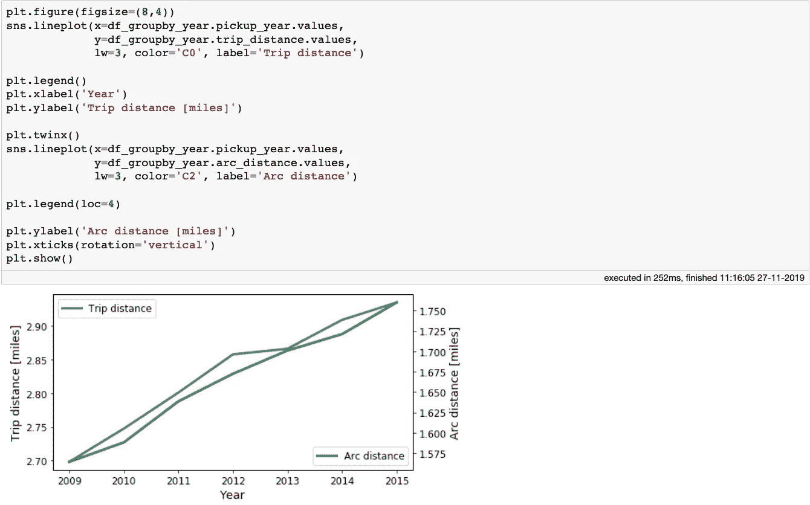

The mean trip and arc distances the taxis travelled per year.

上图显示，*行程距离*和*弧线距离*都有小幅增加，这意味着，平均而言，人们倾向于每年旅行更远一点。

# 给我看看钱

在我们的旅行结束之前，让我们再停一站，调查一下乘客是如何支付乘车费用的。数据集包含 *payment_type* 列，所以让我们看看它包含的值:

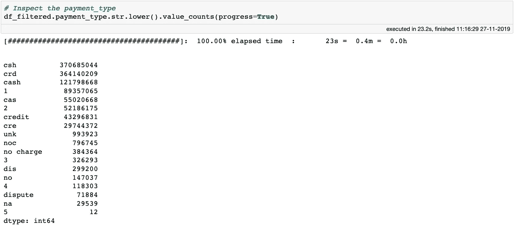

从[数据集文档中，](https://www1.nyc.gov/assets/tlc/downloads/pdf/data_dictionary_trip_records_yellow.pdf)我们可以看到该列只有 6 个有效条目:

*   1 =信用卡支付
*   2 =现金支付
*   3 =不收费
*   4 =争议
*   5 =未知
*   6 =无效行程

因此，我们可以简单地将 *payment_type* 列中的条目映射到整数:

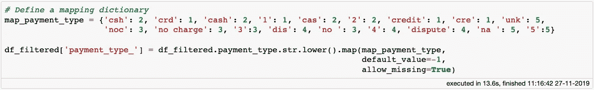

现在，我们可以根据每年的数据分组，看看纽约人在出租车支付方面的习惯是如何变化的:

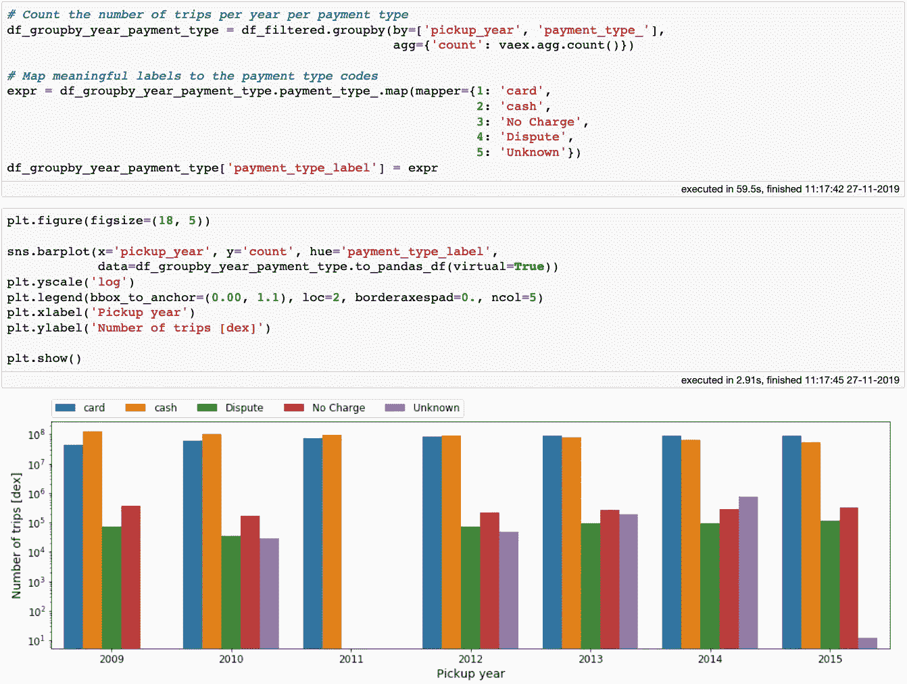

Payment method per year

我们看到，随着时间的推移，信用卡支付慢慢变得比现金支付更加频繁。我们真正生活在一个数字时代！注意，在上面的代码块中，一旦我们聚合了数据，小的 Vaex 数据帧可以很容易地转换成 Pandas 数据帧，我们可以方便地将其传递给 [Seaborn](http://seaborn.pydata.org/) 。我不想在这里重新发明轮子。

最后，让我们通过绘制现金与卡支付次数之间的比率来看看支付方式是取决于一天中的时间还是一周中的某一天。为此，我们将首先创建一个过滤器，仅选择由现金或卡支付的乘车费用。下一步是我最喜欢的 Vaex 特性之一:带有选择的聚合。其他库要求对每种支付方式的单独过滤的数据帧进行聚合，然后合并成一种支付方式。另一方面，使用 Vaex，我们可以通过在聚合函数中提供选择来一步完成。这非常方便，只需要一次数据传递，从而为我们提供了更好的性能。之后，我们可以用标准方式绘制结果数据帧:

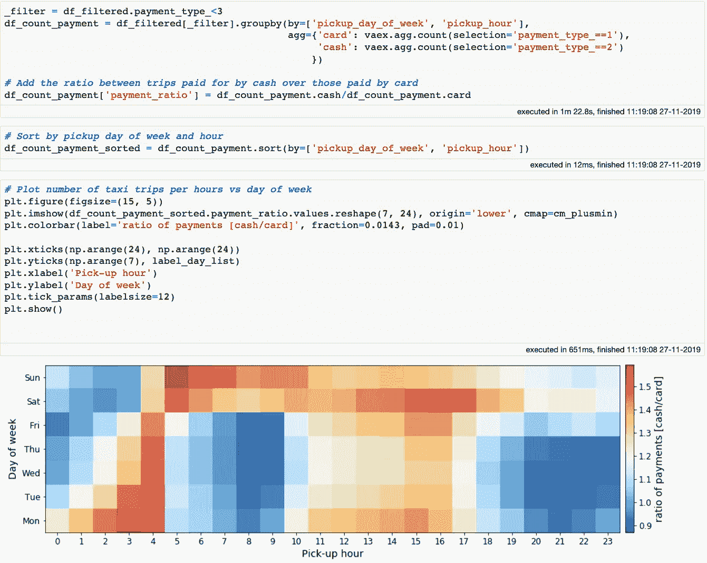

The fraction of cash to card payments for a given time and day of week.

看上面的图，我们可以注意到一个类似的模式，显示了小费百分比作为一周中的某一天和一天中的某个时间的函数。从这两个图中，数据表明刷卡的乘客比现金支付的乘客倾向于给更多的小费。为了查明这是否确实是真的，我想邀请你去尝试并弄清楚它，因为现在你已经有了知识、工具和数据！你也可以看看这个 Jupyter 笔记本来获得一些额外的提示。

# 我们到达了你的目的地

我希望这篇文章是对 [Vaex](https://github.com/vaexio/vaex) 的一个有用的介绍，并且它将帮助您减轻您可能面临的一些“令人不舒服的数据”问题，至少在表格数据集方面。如果您有兴趣探索本文中使用的数据集，可以直接从 S3 使用 Vaex。参见[完整版 Jupyter 笔记本](https://nbviewer.jupyter.org/github/vaexio/vaex-examples/blob/master/medium-nyc-taxi-data-eda/vaex-taxi-article.ipynb)了解如何做到这一点。

有了 Vaex，人们可以在几秒钟内，在自己舒适的笔记本电脑上浏览 10 亿多行数据，计算各种统计数据、汇总数据，并生成信息丰富的图表。它是[免费和开源的](https://github.com/vaexio/vaex)，我希望你能尝试一下！

数据科学快乐！

本文中介绍的探索性数据分析基于由 [Maarten Breddels](https://medium.com/u/b8a6decc0862?source=post_page-----f83363dda94--------------------------------) 创建的早期 Vaex 演示。

请查看下面我们来自 PyData London 2019 的现场演示: