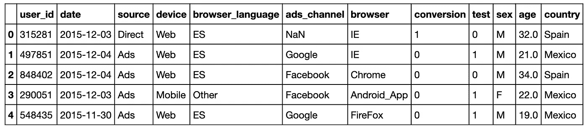
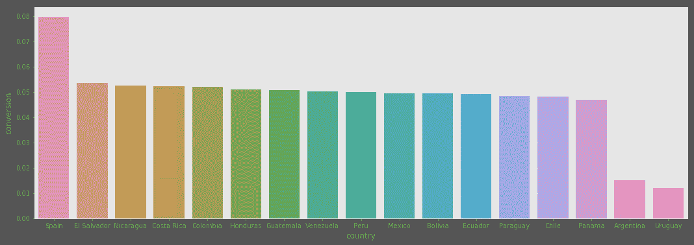
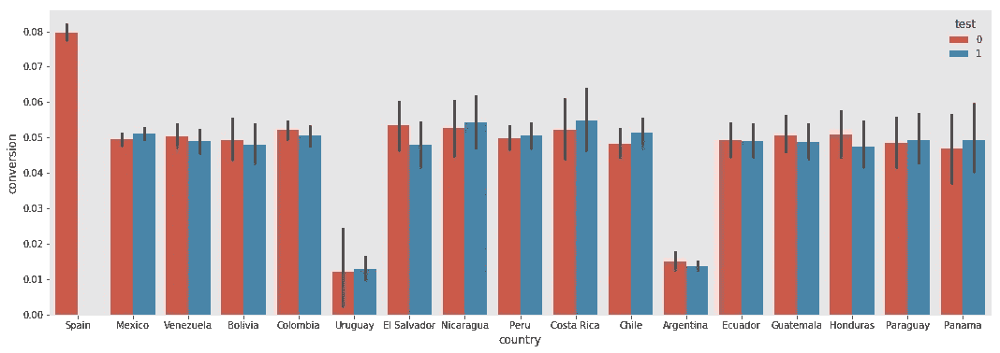
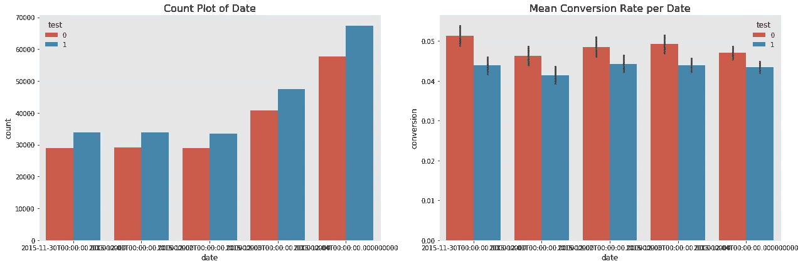
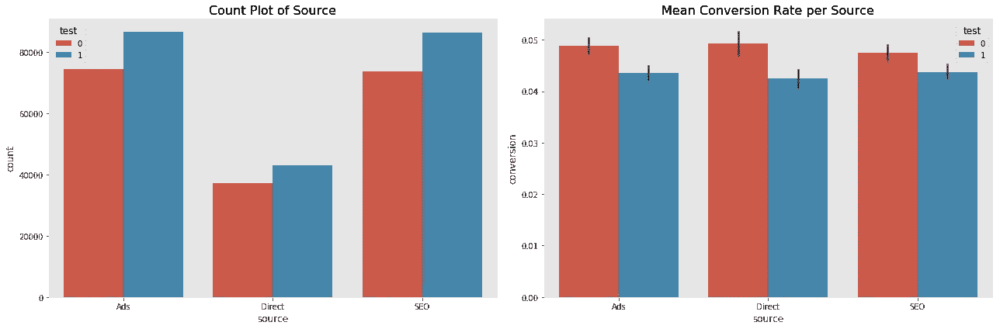
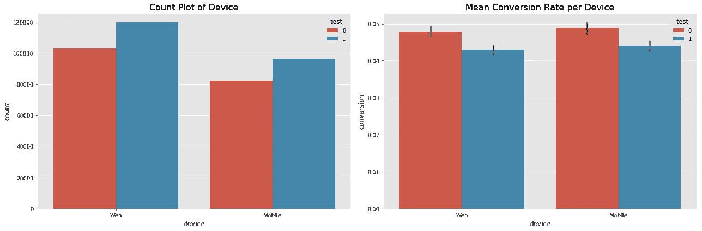
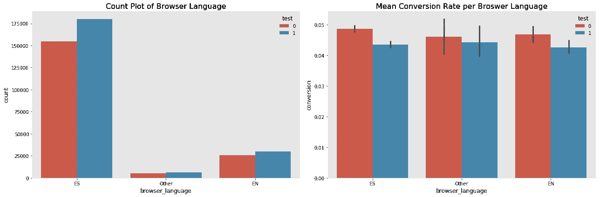
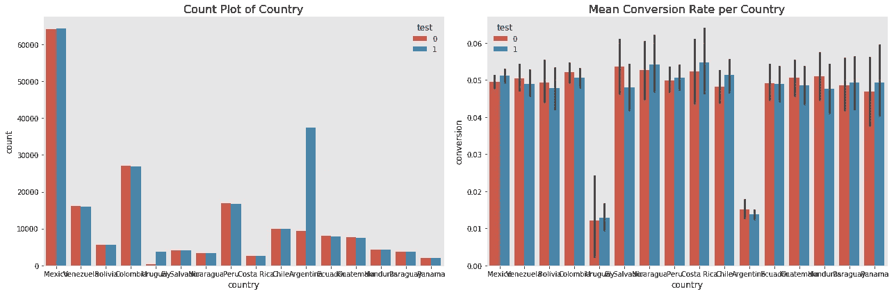
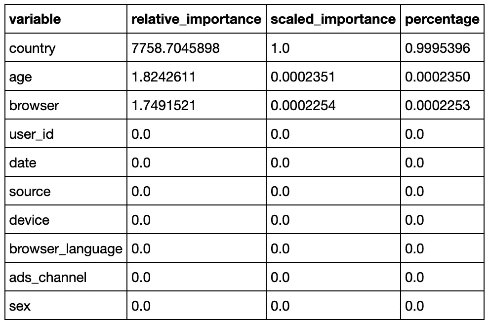
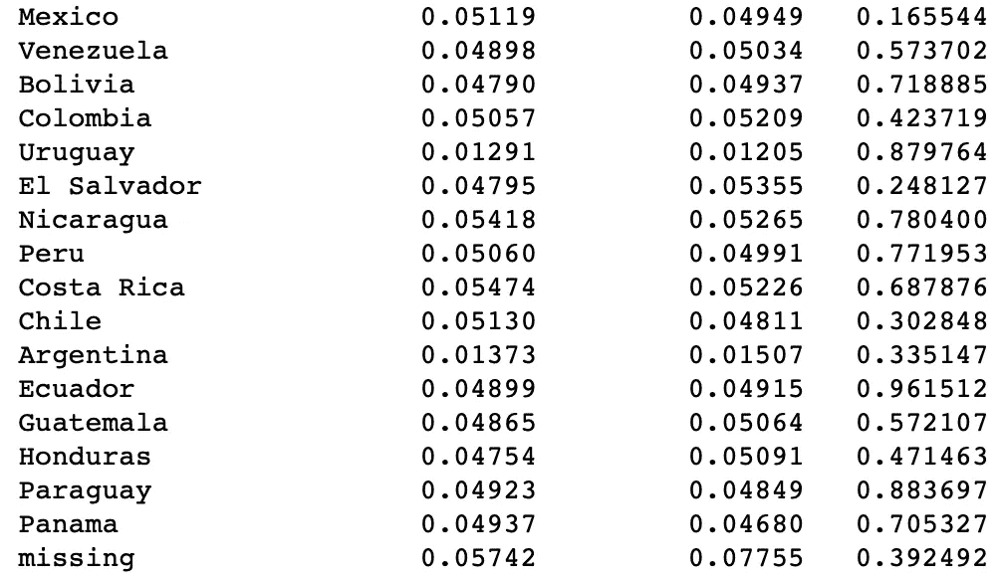

# 如何用 python 分析 A/B 测试结果？

> 原文：<https://towardsdatascience.com/how-to-analyze-a-b-testing-result-with-python-600eea37530d?source=collection_archive---------17----------------------->

*这是书中的一个数据挑战案例:* [*《数据科学带回家的挑战集锦》。*](https://datamasked.com/) *数据集可以在上面的网站购买，本文只讲解决方案和 python 技巧。所有代码都在我的* [*Github 上。*](https://github.com/vertigo-yl/DS-take-home-Challenge/blob/master/02.AB_Testing.ipynb)


# 1.实验概述

XYZ 公司是一个全球性的电子商务网站，提供网站的本地化版本。XYZ 的一位数据科学家注意到，西班牙用户的转化率比任何其他西班牙语国家都高。

他们认为一个原因可能是翻译。所有说西班牙语的国家都有一个西班牙人写的网站的相同翻译。他们同意尝试一个测试，每个国家都有一个由本地人写的翻译。

然而，在他们进行测试后，他们真的很惊讶，因为测试是阴性的。也就是说，似乎非本地化翻译做得更好！

**试验性变更:非本地化到本地化翻译**

# 2.数据分析

看看这个数据框。

我们有 12 列，分别是“用户标识”、“日期”、“来源”、“设备”、“浏览器语言”、“广告频道”、“浏览器”、“转换”、“测试”、“性别”、“年龄”、“国家”。

所有来自西班牙的数据都在对照组。



data overview

## 1)确认测试实际上是阴性的。

首先，我们需要证明，在对照组中，西班牙在变革前的表现优于其他国家。

```
groupby_country = data[data['test'] == 0][['conversion', 'country']].groupby('country').mean()
groupby_country = groupby_country.reset_index()
groupby_country = groupby_country.sort_values('conversion', ascending = **False** )

*# Visualization*
fig, ax = plt.subplots(figsize=(18, 6))
sns.barplot(x='country', y='conversion', data=groupby_country, ax=ax)
plt.show()
```



然后，我们需要确认非本地化翻译表现更好的实验结果，或者可以说，在除西班牙以外的国家，控制组比测试组做得更好

```
*# Visualization* fig, ax = plt.subplots(figsize=(18, 6))
sns.barplot(x=’country’, y=’conversion’, hue=’test’, data=data, ax=ax)
plt.show()
```



并用统计学方法来证明。

```
*# A/B test*
test_data = data[data['country'] != 'Spain']
test_val = test_data[test_data['test'] == 1]['conversion'].values
cont_val = test_data[test_data['test'] == 0]['conversion'].values*# Welch Two Sample t-test*
print(ttest_ind(test_val, cont_val, equal_var=**False**))
```

ttest _ indResult(statistic =-7.3939374121344，pvalue=1.42829947540 e-13)

绝对正确。

然而，我们可以看到，测试组的平均转化率为 0.0434，对照组为 0.0483，下降 10%，如果这是真的，那将是惊人的。所以我们需要深入研究。

## 2)解释为什么会发生这种情况。本地化的翻译真的很差吗？

很可能，由于某种原因，一些用户更有可能进入测试或控制阶段，这部分用户的转化率明显高于/低于测试或控制阶段，这影响了整体结果。

只看西班牙以外国家的数据:(*Github 上更多图表)*

*   日期



*   sourse



*   设备



*   语言



*   国家



我们可以看到，除了国家，所有测试组在其他细分领域的表现都比较差。所以仔细看看这个国家。

在理想的情况下，每个部分的测试和控制人员的分布应该是相同的。因此，我们可以使用**决策树**来测试随机化是否有效，其中变量是用户维度，结果变量是用户是在测试中还是在控制中。

```
**import** **h2o**
**from** **h2o.frame** **import** H2OFrame
**from** **h2o.estimators** **import** H2OGradientBoostingEstimatorh2o.init()
h2o.remove_all()

h2o_df = H2OFrame(data)
h2o_df['test'] = h2o_df['test'].asfactor()
h2o_df['ads_channel'] = h2o_df['ads_channel'].asfactor()
h2o_df.summary()feature = ['user_id', 'date', 'source', 'device', 'browser_language',
       'ads_channel', 'browser', 'sex', 'age',
       'country']
target = 'test'*# Build random forest model*
model = H2OGradientBoostingEstimator(ntrees = 2, max_depth = 2)
model.train(x=feature, y=target, training_frame=h2o_df)print(model)
```



```
data.groupby(['country','test']).size()=====================================country      test
Argentina    0        9356
             1       37377
Bolivia      0        5550
             1        5574
Chile        0        9853
             1        9884
Colombia     0       27088
             1       26972
Costa Rica   0        2660
             1        2649
Ecuador      0        8036
             1        7859
El Salvador  0        4108
             1        4067
Guatemala    0        7622
             1        7503
Honduras     0        4361
             1        4207
Mexico       0       64209
             1       64275
Nicaragua    0        3419
             1        3304
Panama       0        1966
             1        1985
Paraguay     0        3650
             1        3697
Peru         0       16869
             1       16797
Uruguay      0         415
             1        3719
Venezuela    0       16149
             1       15905
missing      0         245
             1         209
dtype: int64
```

阿根廷和乌拉圭加起来有 80%的测试和 20%的控制！随机化在这两个国家并不成功。

让我们在控制国家之后检查测试结果。

```
countries = [name **for** name **in** data['country'].unique() **if** name **is** **not** np.nan]

**for** country **in** countries:
    test_val = data[(data['country'] == country) & (data['test'] == 1)]['conversion'].values
    cont_val = data[(data['country'] == country) & (data['test'] == 0)]['conversion'].values

    test_mean = test_val.mean()
    cont_mean = cont_val.mean()
    p_val = ttest_ind(test_val, cont_val, equal_var=**False**).pvalue

    print('**{0:15s}** **{1:15.5f}** **{2:15.5f}** **{3:10f}**'.format(country, test_mean, cont_mean, p_val))
```



在我们对国家进行控制后，检验显然显得不显著。考虑到目标是提高转化率，这并不是一个很大的成功，但至少我们知道本地化的翻译没有让事情变得更糟！