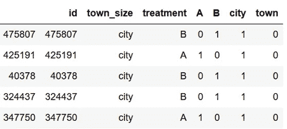
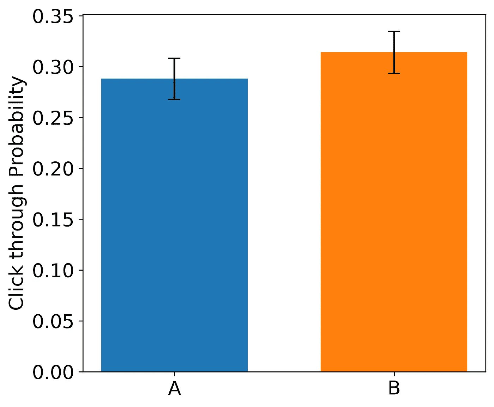
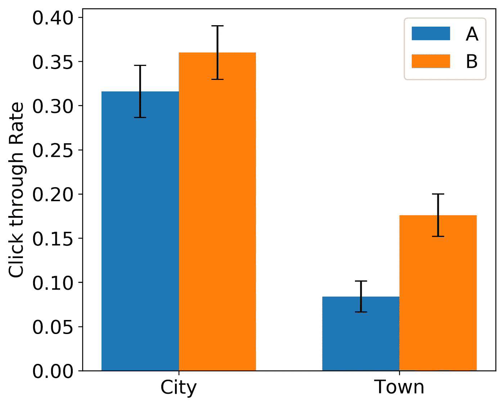

# 如何分析分层随机抽样数据

> 原文：<https://towardsdatascience.com/how-to-analyze-stratified-random-sampled-data-e3933199ae74?source=collection_archive---------19----------------------->

## 使用实验设计来增加你的分析能力


Rock stratification is a topic for a different day. Credit: [https://en.wikipedia.org/wiki/Stratigraphy](https://en.wikipedia.org/wiki/Stratigraphy)

当构建一个实验时，要问的最重要的问题之一是:我应该如何从我的总体中取样？很明显，你想进行某种随机抽样程序，但是如何进行随机抽样会对你的分析产生很大的影响。虽然有许多关于如何进行[分层随机抽样](https://en.wikipedia.org/wiki/Stratified_sampling)的有用指南，但我注意到，关于如何正确分析分层抽样数据的指南很少。在这篇文章中，我将讨论如何进行分层抽样，以及如何使用一些模拟数据作为例子来分析结果数据。

# **设计实验**

首先，我想简要回顾一下分层抽样以及它的重要性。假设我是 X 公司的数据科学家。X 公司拥有来自美国各地的大约 500，000 名用户。我们的大多数用户生活在城市，但也有很大一部分生活在小城镇。我有兴趣做一个实验，看看改变我们的应用程序的用户界面会如何改变从应用程序到二级网站的点击率。一个非常简单的 A/B 测试。假设我有相关的权限和足够匿名的数据，我应该如何选择这个实验的用户？

我有两个选择:1)我可以从用户群中随机抽样，或者 2)我可以对我的用户中的两个子群(城市和城镇)进行分层抽样。如果我想使用分层抽样，我会从每个亚组中随机抽取样本，并把其中的一半分配给 A 组或 B 组。

但是我为什么要这么做呢？在这种情况下，如果我认为亚组之间存在真正的差异，我会分层。例如，也许“我的城市”子组的基线点击率高于“城镇”子组。另一种可能性是，治疗 B 的*效应*可能会因城市和城镇而异。也许城市里的人和城镇里的人有不同的审美观，而且*真的*喜欢 B 处理，导致 B 处理对点击率有更强的影响。在这种情况下，我不会讨论这种可能性，但在其他情况下，这可能很重要。

在这篇文章中，我将模拟一个用户群，并用一个假设的反应进行一个实验。首先使用完全随机抽样(又名简单随机抽样)，然后使用分层随机抽样。然后，我将检查我对实验的推断在两种取样方式之间是如何变化的。这两个亚组的基线点击率有很大不同，但每组的治疗效果是相同的。

# **构造数据**

我将使用 pandas、numpy、scipy 和 statsmodels 进行分析。你可以用 sklearn 代替 statsmodels 来做这些，但是我更喜欢 statsmodels 的统计输出。

我需要做的第一件事是建立一个用户群。

首先，为了可再现性，我为 numpy 设置了一个随机种子，用于它的随机选择算法。人口数据帧中的每一行代表一个唯一的用户。我的用户群有 50 万人，来自城市的人比来自城镇的人丰富 15 倍。在模拟数据集中，城市和城镇的人口比例并不完全是 15:1，因为我使用的是随机过程:

```
city       468520
town        31480
```

由于来自 R 背景，我还在这个数据帧中包含了一个 id 列。Pandas 通常用它的索引功能来解决这个问题，但是当我从一个群体中取样时，我喜欢有一个不变的 id 号。

# **随机抽样实验**

对于这个实验，我感兴趣的是在实现一个改变后，用户点击应用的概率是否会增加。例如，为了增加流量，X 公司可能想改变一个指向合作伙伴网站的按钮。

在第一种情况下，我将从整体人口中随机抽样，不考虑城镇和城市之间的差异。

在上面的代码中，我设置了每次治疗 500 个用户的样本量(总共 1000 个用户)。然后，我从所有用户中抽取 1000 个样本，并基于这些样本创建一个新的数据框架。理想情况下，您应该使用功效分析来决定样本大小。但是我会在文章的最后回到这个话题。

下一步是分配治疗方案。为了让事情变得简单，我创建了一个函数，它可以对完全随机抽样和分层随机抽样都这样做。

在这个过程的最后，我们得到了一个类似这样的数据帧:



我已经为分配的治疗添加了一列，也为每个虚拟变量添加了一列。虚拟变量列将使合成响应变量更容易。

每个城市类别中有多少被分配到每个治疗？


我们马上就能看到一些担忧。相对于城市类别，城镇类别的样本非常少(正如我们根据它们在人口中的丰富程度所预期的)。更重要的是，处理 B 中的城镇个体几乎是处理 a 中的两倍。如果城镇个体与城市个体非常不同，这可能是一个真正的问题。(提示:这里会是个问题。)

# **随机抽样分析**

为了计算预期的信号，我需要指定基线点击率以及界面变化产生的提升。对于这个例子，我假设城市用户的基线点进概率为 0.3，而城镇用户的基线点进概率为 0.1。然后，我假设 B 组中的用户的点击概率会增加 0.05 个百分点。它有点大，但是在这个玩具例子中很有用。

为了创建响应数据，我根据我在上一段中列出的概率，从每个组的二项分布中取样。

要分解上面代码块中发生的事情，从 np.random.binomial()函数开始。我从二项分布中抽样 500 次，每次只有一次试验，其中成功的概率是我刚才列出的概率中的任何一个(0.3，0.1，或者其他两个加上额外的 0.05)。这就是虚拟变量派上用场的地方。请记住，只有当用户来自某个城市时，city 列才为 1，其他地方都为 0，对于 A、B 和 town 列也是如此。这意味着我们可以将四个二项式响应变量中的每一个乘以它们各自的虚拟变量，然后将所有 4 列相加，得到一个响应变量列。这个过程类似于一般线性回归模型用来分析分类数据的过程。

从这里我们可以很容易地进行 t 检验，看看我们的治疗是否有效果。

```
responseA = completerandom_df['response'][completerandom_df['A']==1]
responseB = completerandom_df['response'][completerandom_df['B']==1]stats.ttest_ind(responseA, responseB)
```

运行这段代码得到的 t 统计值为-0.90，p 值为 0.37。不太好。如果我们把数据绘制成图表，我们就能了解正在发生的事情。



# **分层抽样实验&分析**

现在，我们不进行简单的随机抽样，而是使用分层随机抽样，看看分析结果如何变化。

那么我们如何进行分层随机抽样呢？结果这和最初的完全随机抽样非常相似。

步骤如下:

1.  定义要从中取样的子群体
2.  从每个亚群中进行完全随机抽样

我做这个实验的方法是创建 k 个指数列表，每个指数代表一个我想要取样的亚群。然后，我将它们连接成一个长列表，并使用新的索引列表从原始群体中提取数据。我喜欢这样做，这样我可以跟踪数据帧是如何构建的，但是可能有更有效的解决方案。

现在，我用和上面一样的方法计算响应变量，然后运行

t 检验的代码保持不变:

```
responseA = stratified_df['response'][stratified_df['A']==1]
responseB = stratified_df['response'][stratified_df['B']==1]stats.ttest_ind(responseA, responseB)
```

这里的输出是 t 值 2.55 和 p 值 0.011。比原来的完全随机抽样制度好得多。

我可以再次对这些数据进行 t 检验，就像我上面做的那样。然而，现在我已经确保从两个亚群中取样，我可以使用 ANOVA 来解释一些差异并增强信号。

但是，当我们使用子群体的额外信息并对数据进行双向方差分析时，会发生什么呢？

```
model = ols('response ~ treatment + cities', data = stratified_df).fit()
aov_table = anova_lm(model, typ=1)
print(aov_table) df   sum_sq  mean_sq      F     PR(>F)
treatment    1    1.16      1.16   6.89     0.0090
town_size    1   10.82     10.82  64.47   2.75e-15
Residual   997  167.27      0.17    NaN        NaN
```

双向方差分析是估计每个变量(治疗和反应)对反应总误差的贡献。您可以在表的第二列的 sum_sq 项中看到这个输出。基于此，看起来城市变量比治疗变量多贡献了大约 9.4 倍的方差，这基于我如何构建响应变量是有意义的。此外，在这种情况下，我没有获得比传统 t 检验低得多的治疗效果 p 值。那主要是因为两个城市治疗的效果是一样的。当亚组之间的治疗效果相同时，双向方差分析是否优于简单的 t 检验取决于采样数据的确切分布。

如果我们看看这个图，我们就能明白为什么方差分析表现得如此之好。



因为我们使用分层随机抽样增加了我们的分析能力，我们的初始样本量计算在分层随机抽样和完全随机抽样程序之间是不同的。我不会在这里深入探讨这个问题，但从本质上讲，当我们从完全随机抽样转向分层随机抽样时，我们对每个总体方差的估计会发生变化。

# **结论**

这篇文章主要有两点。首先，考虑进行分层随机抽样时，信号可能是非常不同的亚群。第二，当你使用分层随机抽样进行实验时，使用一种可以考虑分类变量的分析方法。

总的来说，分层随机抽样增加了你的分析能力。在最初的完全随机抽样实验中，A/B 测试的信号被未解释的城镇亚人群引入的额外变异所稀释。一旦我考虑了这个亚群，那么 A/B 测试的信号就变得清晰了。

我希望这有助于你的分层随机抽样需求！我已经将我进行分析的 Jupyter 笔记本和一个类似的 R 脚本添加到我的 GitHub [库](https://github.com/j-sadowski/FromRtoPython)中。以下是进一步阅读 ANOVAs 和分层随机抽样的一些链接:

*   网上有许多文章介绍了不同类型的采样方法。看[这里](https://medium.com/analytics-vidhya/sampling-methods-6c6e21773a1c)，这里[这里](/sampling-techniques-a4e34111d808)，或者[这里](https://www.statisticshowto.datasciencecentral.com/probability-and-statistics/sampling-in-statistics/)。
*   宾夕法尼亚州立大学的这门课程深入研究了分层随机抽样的统计学。
*   如何在 [R](http://myweb.facstaff.wwu.edu/~minerb2/biometrics/anova.html) 和 [Python](https://www.marsja.se/four-ways-to-conduct-one-way-anovas-using-python/) 中对虹膜数据集进行方差分析的示例。
*   如何使用传统的[方法](https://www.evanmiller.org/ab-testing/sample-size.html)和[模拟数据](http://meeting.spsp.org/2016/sites/default/files/Lane%2C%20Hennes%2C%20West%20SPSP%20Power%20Workshop%202016.pdf)进行功率分析。