# 如何使用 Python 分析调查数据

> 原文：<https://towardsdatascience.com/how-to-analyze-survey-data-with-python-84eff9cc9568?source=collection_archive---------7----------------------->

## 如何使用 Python 读取 SPSS/SAV 数据，使用权重并执行典型的 SPSS 命令作为频率和交叉表

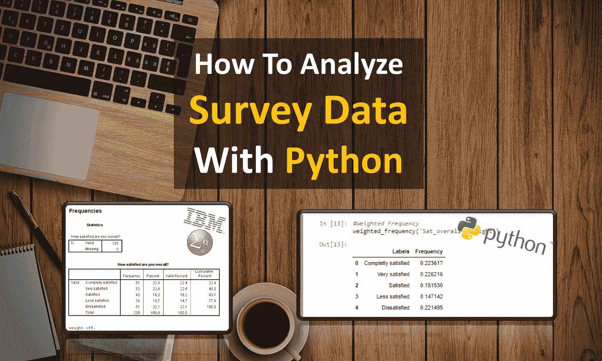

如果你从事市场调研，你可能还需要处理调查数据。通常这些都是 SAV 或 SPSS 文件。SPSS 对于调查数据的统计分析非常有用，因为变量、变量标签、值和值标签都集成在一个数据集中。使用 SPSS，分类变量易于分析:

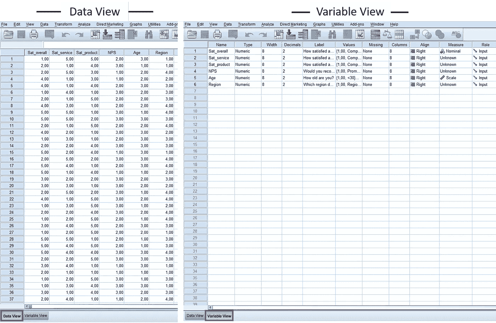

*不幸的是，SPSS 在处理较大的数据集时速度较慢，自动化的宏系统不够直观，与 Python 相比提供的选项很少。因此，我将向您展示如何使用 Python 分析调查数据。*

## 设置

首先，我们安装`pyreadstat`模块，它允许我们将 SPSS 文件作为数据帧`pip install pyreadstat`导入。如果您想手动安装它，您可以从这里下载软件包:

[](https://pypi.org/project/pyreadstat/) [## pyreadstat

### 将 SAS、SPSS 和 Stata 文件读写到 pandas 数据帧中。

pypi.org](https://pypi.org/project/pyreadstat/) 

## 读取数据

现在，我们将模块导入 Jupyter 笔记本并加载数据集:

```
import numpy as np
import pandas as pd
import pyreadstatdf, meta = pyreadstat.read_sav('...path\\Surveydata.sav')
df.head(5)
```

让我们看一下数据框:

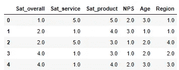

Our DataFrame

我们不能从中读出太多，因为我们不知道变量和数字信息意味着什么。元容器包括所有其他数据，如标签和值标签。用`meta.column_labels`我们可以打印变量标签:

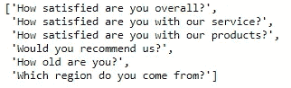

对于列`Sat_overall`,匹配的标签是“您的总体满意度如何？”。通过几个变量，你可以很容易地从列表中分配它。如果我们有数百个变量，整个事情会很混乱。因此，我们首先创建一个字典，以便在必要时可以有选择地显示某一列的正确标签。

```
meta_dict = dict(zip(meta.column_names, meta.column_labels))
```

有了`meta_dict['Sat_overall']`，我们现在得到了匹配的标签。

## 未加权数据

在调查中，我们通常对选择特定答案类别的受访者的百分比感兴趣:

```
df['Age'].value_counts(normalize=True).sort_index()
```

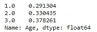

从输出中，我们只能看到 29%的人投票支持类别 1，33%的人支持类别 2，几乎 38%的人支持类别 3。然而，在字典`meta.value_labels`中，我们有所有的值标签:

```
df['Age'].map(meta.variable_value_labels['Age']).value_counts(normalize=True)
```

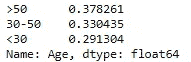

这样看起来更好！38%的受访者超过 50 岁，33%在 30 至 50 岁之间，其余的在 30 岁以下。我个人更喜欢按照价值标签的顺序排序。目前，这些值只是按比例大小排序:

```
df['Age'].map(meta.variable_value_labels['Age']).value_counts(normalize=True).loc[meta.variable_value_labels['Age'].values()]
```

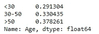

完美！这就是我们所需要的，结果与 SPSS“频率”的输出非常匹配。通常，调查数据是根据社会人口特征进行评估的。例如，满意度如何因年龄组而异？为此，我们可以简单地使用交叉表函数:

```
pd.crosstab(df['Sat_overall'], df['Age'], dropna=True, normalize='columns')
```

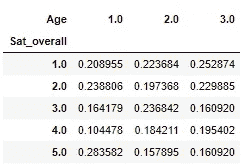

同样，我们不能对输出做太多，所以让我们首先映射值标签:

```
pd.crosstab(df['Sat_overall'].\
        map(meta.variable_value_labels['Sat_overall']), \
        df['Age'].map(meta.variable_value_labels['Age']), \
        dropna=True, normalize='columns'). \
        loc[meta.variable_value_labels['Sat_overall'].values()]. \
        loc[:,meta.variable_value_labels['Age'].values()]*100
```

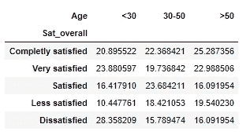

现在，我们能够解释输出。对于 50 岁以上的人，有最完全满意的顾客。相比之下，30 岁以下的顾客最不满意。使用`.loc`功能，我们可以再次在此指定顺序。

## 加权数据

在调查中，事后通常会发现社会人口特征的分布与客户群的分布并不一致。一开始我们看到三个组几乎是平均分布的。然而，我们知道 50%的顾客年龄在 30 岁以下，25%在 30 到 50 岁之间，其余的在 50 岁以上。因此，我们对数据进行加权以反映这种分布:

```
weight = np.NaN
df.loc[(df['Age'] == 1), 'weight'] = 0.5/(67/230)
df.loc[(df['Age'] == 2), 'weight'] = 0.25/(76/230)
df.loc[(df['Age'] == 3), 'weight'] = 0.25/(87/230)
```

但是我们现在如何在计算中考虑这个重量呢？对于频率分布，我们编写一个小的辅助函数:

```
def weighted_frequency(x,y):
    a = pd.Series(df[[x,y]].groupby(x).sum()[y])/df[y].sum()
    b = a.index.map(meta.variable_value_labels[x])
    c = a.values
    df_temp = pd.DataFrame({'Labels': b, 'Frequency': c})
    return df_temp
```

因此，我们得到一个数据帧，其中包含相应的标签(按照从小到大的数字顺序)和相应的百分比频率:

```
weighted_frequency('Age','weight')
```

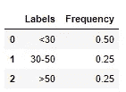

加权分布现在符合我们的客户结构。让我们再来看看满意度分布:

```
weighted_frequency('Sat_overall','weight')
```

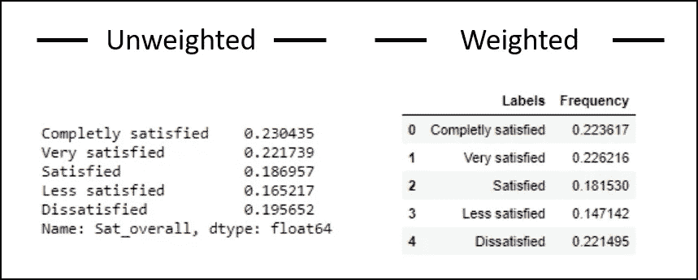

例如，我们看到在加权分布中，更多的客户不满意。如果我们没有加权，我们会低估我们客户群中的奇怪之处。通过交叉表，可以轻松整合权重:

```
pd.crosstab(df['Sat_overall']. \
        map(meta.variable_value_labels['Sat_overall']), \
        df['Age'].map(meta.variable_value_labels['Age']), 
        df.weight, aggfunc = sum, dropna=True, \
        normalize='columns'). \
        loc[meta.variable_value_labels['Sat_overall'].values()]. \
        loc[:,meta.variable_value_labels['Age'].values()]*100
```

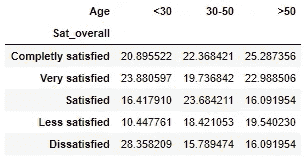

我们所要做的就是添加权重参数(例如`df.weight`)和函数参数`aggfunc=sum`。在本例中，加权分布对应于未加权分布，因为组内病例的比率没有变化。

## 结论

第一步，我们安装了`pyreadstat`，一个我们可以将 sav 文件读入 Python 并进一步处理它们的模块。之后，我们看了标签和价值标签是如何分配的，以及分析是如何以一种易于理解的方式呈现的。我们看到 Python 很好地处理了分类数据，并且易于使用。

## 开源代码库

资料馆:
[https://github.com/bd317/surveydata_with_python](https://github.com/bd317/surveydata_with_python)
笔记本:
[https://Github . com/BD 317/Survey Data _ with _ python/blob/master/Github _ Survey _ Data _ upload . ipynb](https://github.com/bd317/surveydata_with_python/blob/master/Github_Survey_Data_Upload.ipynb)
SPSS-Dataset:
[https://Github . com/BD 317/Survey Data _ with _ python/blob/master/Survey Data . sav](https://github.com/bd317/surveydata_with_python/blob/master/Surveydata.sav)

[如果您喜欢中级和高级数据科学，并且还没有注册，请随时使用我的推荐链接加入社区。](https://medium.com/@droste.benedikt/membership)