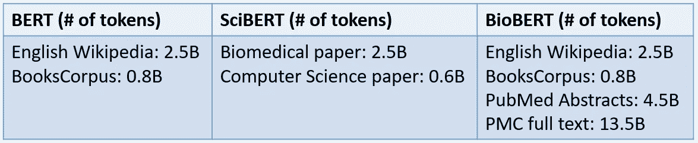
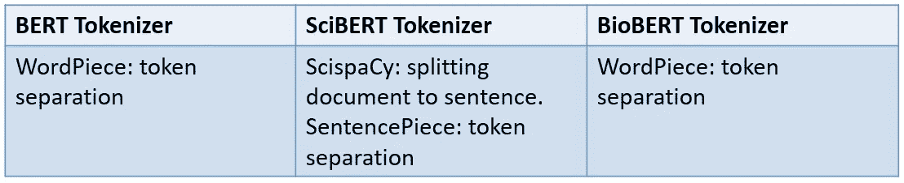
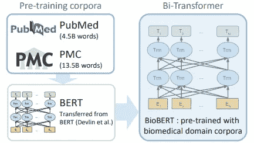
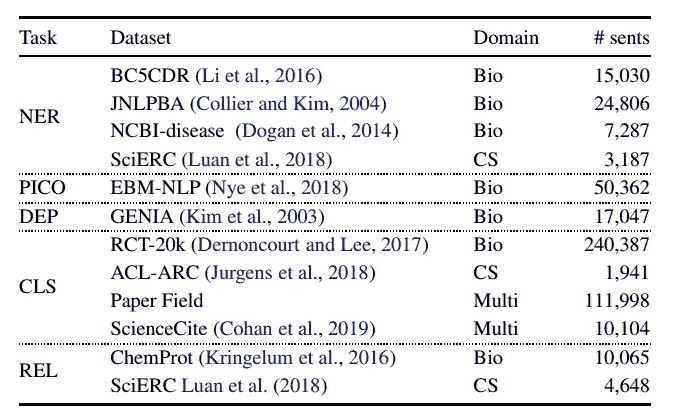
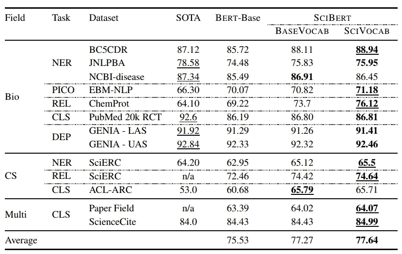
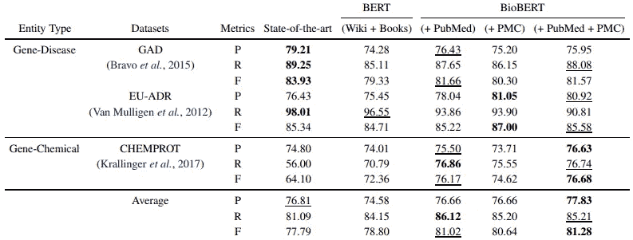
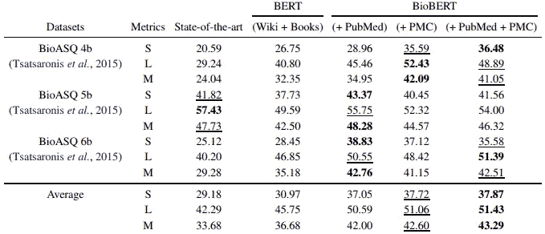

# 在特定领域应用 BERT 的几个例子

> 原文：<https://towardsdatascience.com/how-to-apply-bert-in-scientific-domain-2d9db0480bd9?source=collection_archive---------5----------------------->

## 在特定领域中应用 BERT

Photo by [Kendal James](https://unsplash.com/@hikendal?utm_source=medium&utm_medium=referral) on [Unsplash](https://unsplash.com?utm_source=medium&utm_medium=referral)

2018 年发布了几个新的预训练的情境化嵌入。新的最先进的结果每个月都在变化。伯特是著名的模特之一。在这个故事中，我们将扩展 BERT 来看看我们如何在不同领域问题上应用 BERT。

艾伦人工智能研究所(AI2)对 BERT 进行了进一步研究，并发布了基于 BERT 的 SciBERT，以解决科学数据上的性能问题。它使用来自 BERT 的预训练模型，并通过使用科学出版物(其中 18%的论文来自计算机科学领域，82%来自广泛的生物医学领域)来微调上下文化嵌入。另一方面，Lee 等人从事生物医学领域的工作。他们还注意到，通用的预训练 NLP 模型在特定领域数据中可能不会很好地工作。因此，他们将 BERT 微调为 BioBERT，在生物医学的 NER、关系抽取和问答 NLP 任务中有 0.51% ~ 9.61%的绝对提升。

这个故事将讨论关于 [SCIBERT:科学文本的预训练语境化嵌入](https://arxiv.org/pdf/1903.10676.pdf) (Beltagy 等人，2019)， BioBERT:生物医学文本挖掘的预训练生物医学语言表示模型 (Lee 等人，2019)。将涵盖以下内容:

*   数据
*   体系结构
*   实验

# 数据

SciBERT 和 BioBERT 还为预训练引入了特定领域的数据。Beltag 等人使用从语义学者中随机挑选 1.14M 的论文来微调 BERT 并构建 SciBERT。语料库包括 18%的计算机科学领域的论文和 82%的广义生物医学领域的论文。另一方面，Lee 等人使用 BERT 的原始训练数据来微调 BioBERT 模型，这些数据包括英语维基百科和图书语料库以及领域特定数据，即 PubMed 摘要和 PMC 全文文章。

Training data among models

一些变化被应用在科技文章中以获得成功。ScispaCy 作为 spaCy 的科学专用版本，用于将文档拆分成句子。之后，Beltagy 等人使用 [SentencePiece](https://aclweb.org/anthology/D18-2012) 库为 SciBERT 构建新的单词表，而不是使用 BERT 的词汇表。

Different tokenization method among models.

# 体系结构

SciBERT 和 BioBERT 都遵循 BERT 模型架构，该架构是多双向转换器，并通过预测屏蔽令牌和下一句来学习文本表示。标记序列将被转换成标记嵌入、分段嵌入和位置嵌入。标记嵌入指的是语境化的单词嵌入，片段嵌入只包括 2 个嵌入，它们或者是 0 或者是 1 来表示第一个句子和第二个句子，位置嵌入存储相对于序列的标记位置。你可以访问这个[故事](/how-bert-leverage-attention-mechanism-and-transformer-to-learn-word-contextual-relations-5bbee1b6dbdb)来了解更多关于伯特的事情。

BioBERT Architecture (Lee et al., 2019)

# 实验

## 科学伯特(SciBERT)

命名实体识别(NER)和参与者干预比较结果提取(PICO)都是序列标记。依存句法分析(DEP)是预测句子中标记之间的依存关系。分类(CLS)和关系分类(REL)是分类任务。

Evaluation dataset (Beltagy et al., 2019)

Evaluation result among different dataset (Beltagy et al., 2019)

## 生物医学伯特

从下表中，你可以注意到 BioBERT 在特定领域数据集上的表现优于 BERT。

Comparison between BERT and BioBERT on relation extraction dataset (Lee et al., 2019)

Comparison between BERT and BioBERT on question answering dataset (Lee et al., 2019)

# 拿走

*   通用的预训练模型在特定领域可能无法达到最先进的结果。因此，需要微调步长来提高目标数据集的性能。
*   在伯特和伯特的基础模型之后，Transformer(多重自我关注)变得越来越有名。我还注意到，BERT 的基本模型保持了最先进的性能。

# 关于我

我是湾区的数据科学家。专注于数据科学、人工智能，尤其是 NLP 和平台相关领域的最新发展。欢迎在 [LinkedIn](https://www.linkedin.com/in/edwardma1026) 上与我联系，或者在 [Medium](http://medium.com/@makcedward/) 或 [Github](https://github.com/makcedward) 上关注我。

# 延伸阅读

*   [变压器的双向编码器表示(BERT)](/how-bert-leverage-attention-mechanism-and-transformer-to-learn-word-contextual-relations-5bbee1b6dbdb)
*   [西伯特 GIT 回购](https://github.com/allenai/scibert)
*   BioBERT GIT 回购[【1】](https://github.com/naver/biobert-pretrained)/[【2】](https://github.com/dmis-lab/biobert)

# 参考

*   贝尔塔吉、科汉和罗。 [SCIBERT:科学文本的预训练语境化嵌入](https://arxiv.org/pdf/1903.10676.pdf)。2019
*   J.李，尹文伟，金圣贤，金圣贤，苏春河和姜俊杰。 [BioBERT:用于生物医学文本挖掘的预训练生物医学语言表示模型](https://arxiv.org/pdf/1901.08746.pdf)。2019