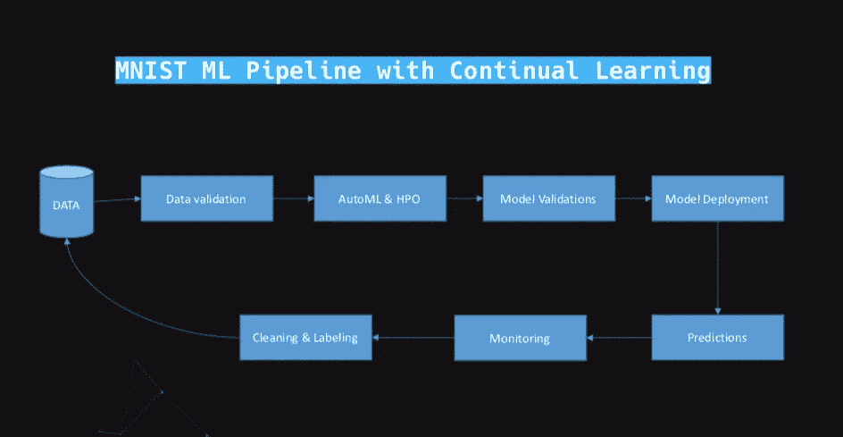
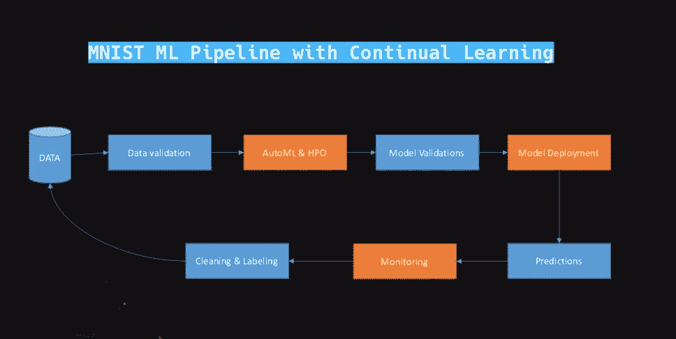

# 如何将持续学习应用到你的机器学习模型中

> 原文：<https://towardsdatascience.com/how-to-apply-continual-learning-to-your-machine-learning-models-4754adcd7f7f?source=collection_archive---------2----------------------->

## 通过持续学习提高模型准确性并增强性能

什么是持续学习？

学者和从业者都认为持续学习(CL)是迈向人工智能的基本步骤。持续学习是模型从数据流中持续学习的能力。在实践中，这意味着支持模型在新数据到来时自主学习和适应生产的能力。有些人可能称之为自适应学习或连续自动学习。CL 的想法是模仿人类在其一生中不断获取、调整和转移知识和技能的能力。如你所知，在[机器学习](https://blog.cnvrg.io/5-steps-to-maximize-business-impact-with-machine-learning)中，目标是通过生产环境部署模型。通过*持续学习*，我们希望使用进入生产环境的数据，并根据新的活动重新训练模型。例如，我们都体验过网飞非常成功的“下一个”推荐系统。网飞推荐系统会在你的最后一集结束后直接推荐一个节目，通常随着时间的推移，你很难抗拒这种诱惑。这种生产模式需要定期重新培训，因为市场上有新电影、新口味和新趋势。通过不断学习，目标是使用输入的数据，并使用它来自动重新训练模型，这样您就可以真正获得高精度并保留高性能的模型。

为什么我们需要不断学习？

答案很简单，数据在不断变化。数据可能会因趋势或用户采取的不同行动而发生变化。例如，亚马逊 2000 年的畅销书是哈利波特。今天，你可能会惊讶地发现，畅销书是一个完全不同的类型:*火与怒:特朗普白宫内部*。

Why continual learning? Data is changing.

因此，亚马逊将不得不重新训练这种模式，并根据新的数据和趋势向客户推荐新书。更新一点的例子是巨幅下跌前的比特币价格。2017 年，比特币价值 19K 美元。大约一个半月后，降到了 6K 美元。

不仅数据在变化，而且[研究人员](https://arxiv.org/abs/1802.07569)已经表达了“终身学习仍然是机器学习和神经网络模型的一个长期挑战，因为从非平稳数据分布中不断获取增量可用信息通常会导致灾难性的遗忘或干扰。”持续学习的理由仍然很充分。对于数据科学家来说，持续学习将最终优化模型的准确性，提高模型性能，并通过使模型自适应来节省再培训时间。

**不断学习的机器学习管道**

Machine learning pipeline

上图展示了在应用持续学习的生产环境中，机器学习管道是什么样子的。你会注意到管道看起来很像任何其他机器学习管道。我们必须有数据，某种验证。这可能包括测试或内部基准，如确定数据质量。也可能是你操作的预处理。

接下来，即将推出的是 [AutoML](http://help.cnvrg.io/en/articles/2971371-build-your-own-computer-vision-automl-pipeline-using-flows) 。持续学习中的 AutoML 是流水线中非常重要的一部分，类似于典型机器学习流水线中的训练步骤。但是，我们将在后面详细讨论。

培训之后，您将做一些模型验证来测试模型，并确保它们都工作良好。在这里，您还可以选择最好的一个，并将其部署到生产环境中。到目前为止，这个管道看起来像一个经典的机器学习管道。为了应用持续学习，我们增加了监控并将循环连接回数据。

Machine learning with closed loop continual learning

将监视在模型部署区域收集的预测。监控完成后，您将清理数据并在需要时贴上标签。但是，对于像推荐系统或预测这样的东西，您将能够在没有人为标记的情况下关闭环路。在标记和清理数据之后，我们将把它移回数据，再次重复训练和验证过程。现在我们已经像飞轮一样闭合了回路。

**持续学习管道中的 AutoML**

AutoML 是应用持续学习的一个重要组成部分，因为我们处理的是持续不断的数据流。你可以保持简单，用相同的参数重新训练相同的算法，但因为我们仍然希望获得非常高的精度，我们将使用 AutoML。

AutoML 不一定是非常复杂的元学习。你可以只使用超参数优化、开源算法和框架——你会惊讶于它是多么简单。作为你研究的一部分，当你开始研究你的机器学习管道时，你必须选择你的算法空间。例如，如果你在做一个计算机视觉问题，你可能想用迁移学习作为训练算法。通过迁移学习，你有许多预先训练好的模型，你可以用它们来重新训练网络的最后一层，然后部署你的模型。

在这种情况下，你会选择一个流行的预建模型，如 VGG，盗梦空间，ResNet 和其他一些。对于每个模型，我们还必须指定其参数范围。

这可能会变成一个非常大的计算问题。作为一名数据科学家，你应该真正研究什么样的算法和参数对你的机器学习问题有用。

AutoML 链接: [AutoKeras](https://autokeras.com/) ， [Auto SciKitLearn](https://github.com/automl/auto-sklearn) ，[特征工程的特征工具](https://www.featuretools.com/)

**追踪你的汽车**

使用 AutoML，不仅要跟踪生产中的模型，而且要跟踪整个过程，这一点尤为重要。如果你让你的机器学习自动驾驶，你必须确保一切都被跟踪和管理。您需要跟踪一切:您使用的算法类型、超参数是什么、使用的计算类型、内存消耗、指标、准确性等等。假设你今天正在训练 60 个不同的实验。被跟踪的数据可能会在下周尝试重新部署和重新训练模型时使用。

你也可以使用这些信息进行元学习，试图了解什么样的算法对问题有效，这将使每次的实验次数最少。

**自动化您的基础设施**

关于 AutoML 的另一个关键问题——尤其是深度学习——是自动化你的机器学习基础设施。启动一个深度学习就绪的实例可能需要很多时间(想想 CUDA、依赖项、数据、代码等等)。我们建议在您所有首选的云提供商之上使用 Kubernetes。事实上，您将拥有一个 Kubernetes 集群并运行，这使得部署新的实验变得非常容易。使用 Kubernetes，您可以非常快速地启动许多实验，并跟踪它们以确保所有实验都运行良好。

但是请记住，维护 Kubernetes 集群并不那么简单，可能需要 IT/数据工程团队的额外帮助。

**在持续学习管道中部署模型**

一旦您训练并选择了具有最佳性能的模型，您的模型就可以部署了。持续学习的一个主要挑战是如何在不影响用户体验和保持高准确性的情况下将新模型部署到相同的环境中。

为持续学习部署模型与经典的模型部署有点不同。通常，即使是一个数据科学家也能够部署一个模型，但是因为这是自动化的，我们必须非常小心。正如您不会将一个有缺陷的软件部署到生产环境中一样，您也不会部署一个没有被成功训练和验证的模型。为了确保您的新模型运行良好，您将在部署之前和部署期间对旧数据进行测试。此外，您还需要监控系统的性能和健康状况。

现在，在软件开发中，有很多不同的方法来部署新软件。对于机器学习来说，这个领域仍然很新，但是我们推荐使用[金丝雀部署技术](https://martinfowler.com/bliki/CanaryRelease.html)。Canary 是一种引入新软件版本的技术，以某种方式影响部分用户，根据测试逐渐增加用户数量。使用这种技术将会逐渐将模型部署到更大的用户子集。

在实现层面——我们建议使用 Kubernetes 和 Istio 进行模型部署，这样您就可以进行 A/B 测试，并确保您的模型部署良好。我们的博客上还有一个关于[如何使用 Kubernetes](https://blog.cnvrg.io/deploy-models-with-kubernetes) 部署机器学习模型的指南。

**持续学习管道的监控**

随着持续学习，监控是机器学习的一个特别重要的部分。您需要确保，如果您的模型发生了不好的事情，或者如果发送到您的模型的数据被破坏，您有一种机制可以得到警告。

最常见的情况是，一个数据科学家会同时管理几个机器学习管道。所以警报设置至关重要。一旦将新模型部署到生产环境中，目标就是为数据科学家或数据工程师提供监控机器学习模型所需的控制和透明度。为了能够自动部署模型的新版本，您必须监控输入数据，以检测数据漂移和异常。监测对于预测数据也很重要，以确保高性能和准确性。

除了 AlertManager 之外，Kubernetes 或 Prometheus 中也有很好的工具，可以用来监控所有的输入数据。你应该利用云服务和 Kubernetes 来自动化你的机器学习基础设施和实验。

**触发并重新训练您的模型，以便继续学习**

连续学习 ML 管道的最后一步是触发再训练并结束循环。您的 ML 渠道为持续学习做好了准备:

*   你有数据
*   实验正在进行训练
*   预测正在被收集和监控
*   正在清理新数据

接下来，您必须决定重新训练您的模型的触发器。有几种方法可以做到这一点。我们的客户会定期重新培训他们的模型。例如，对于推荐系统或广告，我们看到团队每 30 分钟重新培训一次。您也可以考虑只根据新的数据来重新训练模型。

其他方法是跟踪和监控模型衰减和模型偏差、低置信度以及生产环境中触发再训练的任何其他类型的警报。最重要的是，如果你自动触发了机器学习管道，你应该跟踪和验证触发器。不知道您的模型何时被重新训练会导致重大问题。您应该始终控制模型的再训练，即使这个过程是自动化的。这样，您就可以在生产环境中理解和调试模型。

**关闭 ML 循环**

一旦你的自动化、部署和监控系统到位，你就能完成机器学习的循环。您的模型将不断学习，并自动适应新的数据和趋势。不仅你的模型精度会自动提高，而且总体上你的模型在应用程序中的表现会更好。