# 如何将机器学习和深度学习方法应用于音频分析

> 原文：<https://towardsdatascience.com/how-to-apply-machine-learning-and-deep-learning-methods-to-audio-analysis-615e286fcbbc?source=collection_archive---------2----------------------->

*作者:Niko Laskaris，面向客户的数据科学家，* [*Comet.ml*](http://www.comet.ml/)

要查看本文末尾的代码、训练可视化和关于 python 示例的更多信息，请访问 [Comet 项目页面](https://www.comet.ml/demo/urbansound8k/view/)。

# 介绍

虽然许多关于深度学习的写作和文献都涉及计算机视觉和[自然语言处理(NLP)](https://becominghuman.ai/a-simple-introduction-to-natural-language-processing-ea66a1747b32) ，但音频分析——一个包括[自动语音识别(ASR)](https://pdfs.semanticscholar.org/5129/350ec0bd8f1fe78a9b864865709f8d8de058.pdf) 、数字信号处理以及音乐分类、标记和生成的领域——是深度学习应用的一个不断增长的子域。一些最受欢迎和最广泛的机器学习系统，虚拟助手 Alexa，Siri 和 Google Home，很大程度上是建立在可以从音频信号中提取信息的模型之上的产品。

我们在 [Comet](http://comet.ml/) 的许多用户都在从事音频相关的机器学习任务，如音频分类、语音识别和语音合成，因此我们为他们构建了工具，使用 Comet 的元机器学习平台来分析、探索和理解音频数据。

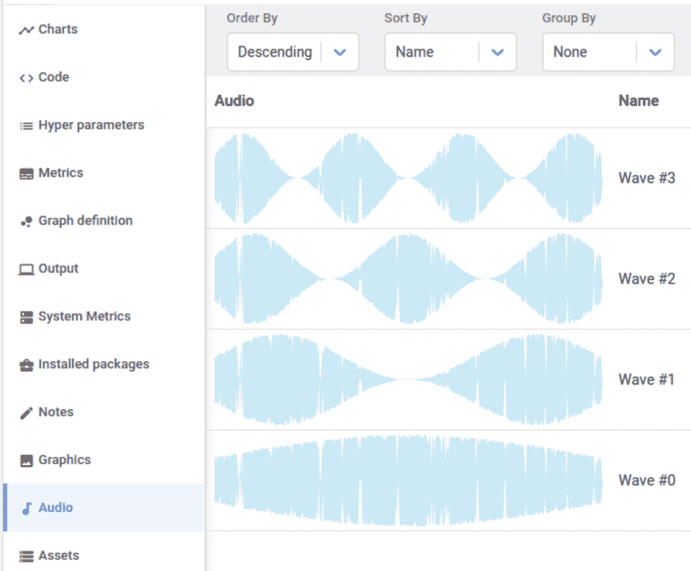

使用 [Comet](http://www.comet.ml/) 进行音频建模、训练和调试

这篇文章专注于展示数据科学家和人工智能从业者如何使用 Comet 在音频分析领域应用机器学习和深度学习方法。为了理解模型如何从数字音频信号中提取信息，我们将深入探讨一些用于音频分析的核心特征工程方法。然后，我们将使用 [Librosa](https://librosa.github.io/librosa/) ，一个用于音频分析的伟大 python 库，来编写一个简短的 python 示例，在 [UrbanSound8k](https://urbansounddataset.weebly.com/urbansound8k.html) 数据集上训练神经架构。

# 音频的机器学习:数字信号处理，滤波器组，梅尔频率倒谱系数

构建机器学习模型来分类、描述或生成音频通常涉及输入数据是音频样本的建模任务。

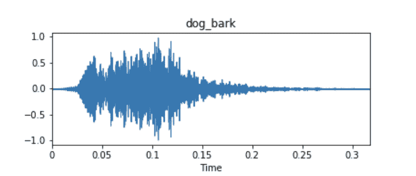

来自 UrbanSound8k 的音频数据集样本的示例波形

这些音频样本通常表示为时间序列，其中 y 轴度量是波形的幅度。振幅通常作为最初拾取音频的麦克风或接收器设备周围的压力变化的函数来测量。除非有与音频样本相关联的元数据，否则这些时间序列信号通常将是拟合模型的唯一输入数据。

查看下面的样本，这些样本取自 Urbansound8k 数据集中的 10 个类别中的每一个类别，从目测可以清楚地看出，波形本身可能不一定产生清晰的类别识别信息。考虑发动机怠速、汽笛和手提钻的波形，它们看起来非常相似。

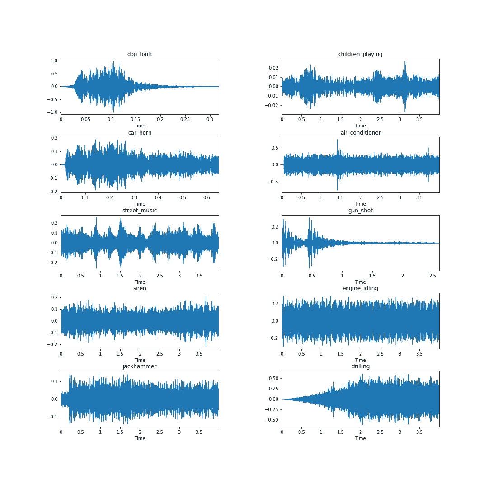

事实证明，从音频波形(以及一般的数字信号)中提取的最佳特征之一自 20 世纪 80 年代以来一直存在，并且仍然是最先进的:梅尔频率倒谱系数(MFCCs)，由 [Davis 和 Mermelstein 于 1980 年](https://users.cs.northwestern.edu/~pardo/courses/eecs352/papers/Davis1980-MFCC.pdf)提出。下面我们将从技术上讨论 MFCCs 是如何产生的，以及为什么它们在音频分析中有用。这部分有些技术性，所以在开始之前，我们先定义几个与数字信号处理和音频分析相关的关键术语。如果你想更深入地了解，我们将链接到维基百科和其他资源。

# 混乱但有用的术语

[采样和采样频率](https://en.wikipedia.org/wiki/Sampling_(signal_processing))

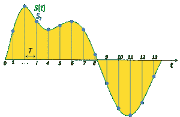

在信号处理中，**采样**是将连续信号缩减为一系列离散值。**采样频率**或**速率**是在一定时间内采集的样本数量。高采样频率导致较少的信息损失，但是计算费用较高，而低采样频率具有较高的信息损失，但是计算快速且便宜。

[振幅](https://en.wikipedia.org/wiki/Amplitude)

声波的**振幅**是其在一段时间(通常是时间)内变化的量度。振幅的另一个常见定义是变量极值之间的差值大小的函数。

[傅立叶变换](https://en.wikipedia.org/wiki/Fourier_transform)

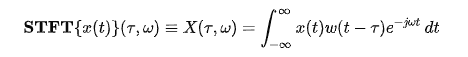

**傅立叶变换**将时间函数(信号)分解成组成频率。同样，音乐和弦可以通过其组成音符的音量和频率来表达，函数的傅立叶变换显示了基础函数(信号)中每个频率的振幅(量)。

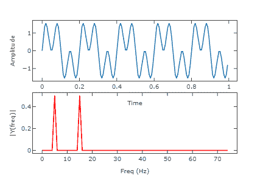

顶部:数字信号；下图:信号的傅立叶变换

傅立叶变换有多种变体，包括[短时傅立叶变换](https://en.wikipedia.org/wiki/Short-time_Fourier_transform)，它在 Librosa 库中实现，涉及将音频信号分割成帧，然后对每帧进行傅立叶变换。一般来说，在音频处理中，傅立叶变换是将音频信号分解成其组成频率的一种优雅且有用的方式。

*资源:到目前为止，我找到的最好的傅立叶变换视频来自 [3Blue1Brown](https://www.youtube.com/watch?v=spUNpyF58BY&t=1s) *

[周期图](https://en.wikipedia.org/wiki/Periodogram)

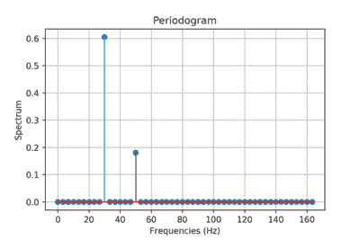

在信号处理中，**周期图**是对信号频谱密度的估计。上面的周期图显示了大约 30Hz 和大约 50Hz 的两个正弦基函数的功率谱。傅立叶变换的输出可以被认为是(不完全)本质上的周期图。

[光谱密度](https://en.wikipedia.org/wiki/Spectral_density)

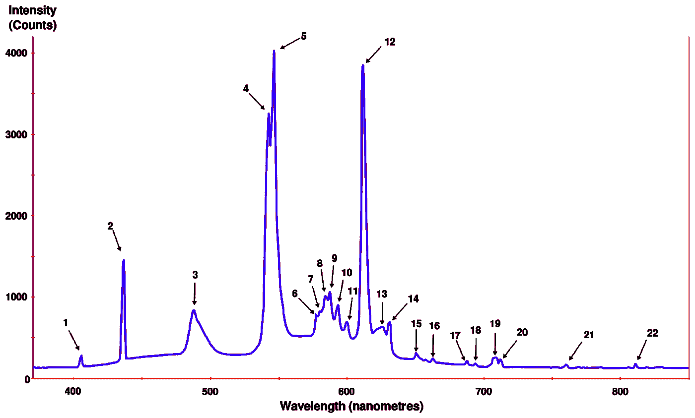

时间序列的**功率谱**是一种将功率分布描述为组成该信号的离散频率分量的方式。一个信号的统计平均值，通过它的频率含量来测量，被称为它的**频谱**。数字信号的**频谱密度**描述了信号的频率成分。

[梅尔标度](https://en.wikipedia.org/wiki/Mel_scale)

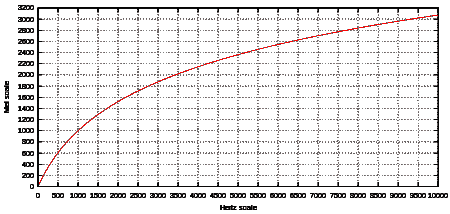

梅尔标度是一种由听众判断彼此距离相等的音高标度。mel 标度和正常频率测量之间的参考点是通过将 1000 mels 的感知音调分配给 1000 Hz 来任意定义的。在大约 500 Hz 以上，越来越大的音程被听众判断为产生相等的音高增量。名称 **mel** 来自单词 melody，表示音阶基于音高比较。

将 f 赫兹转换成 m 英里的公式是:

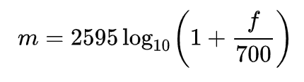

[倒谱](https://en.wikipedia.org/wiki/Cepstrum)

**倒谱**是对信号的估计功率谱的对数进行傅立叶变换的结果。

[心电图](https://en.wikipedia.org/wiki/Spectrogram)

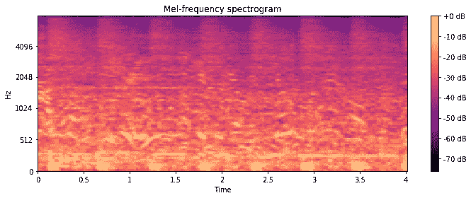

Urbansound8k 数据集中音频样本的 Mel 频谱图

**频谱图**是信号频谱随时间变化的直观表示。考虑频谱图的一个好方法是将一些时间间隔数字信号的周期图叠加起来。

[耳蜗](https://en.wikipedia.org/wiki/Cochlea)

耳蜗内耳的螺旋腔，包含耳蜗器官，它对声音振动产生神经冲动。

# 音频预处理:数字信号处理技术

数据集预处理、特征提取和特征工程是我们从底层数据中提取信息的步骤，这些信息在机器学习上下文中应该对预测样本的类别或某些目标变量的值有用。在音频分析中，这个过程很大程度上是基于寻找音频信号的成分，这些成分可以帮助我们将其与其他信号区分开来。

如上所述，MFCCs 仍然是从音频样本中提取信息的现有技术工具。尽管 Librosa 之类的库为我们提供了一个 python 命令行程序来计算音频样本的 MFCCs，但底层的数学有点复杂，所以我们将一步一步地讲解它，并包含一些有用的链接以供进一步学习。

# 计算给定音频样本的 MFCCs 的步骤:

1.  将信号分割成短帧(时间)
2.  计算每帧功率谱的周期图估计
3.  将 mel 滤波器组应用于功率谱，并对每个滤波器中的能量求和
4.  对对数滤波器组能量进行离散余弦变换(DCT)

关于 MFCC 推导和计算的精彩附加阅读可以在博客文章[这里](http://practicalcryptography.com/miscellaneous/machine-learning/guide-mel-frequency-cepstral-coefficients-mfccs/)和[这里](https://haythamfayek.com/2016/04/21/speech-processing-for-machine-learning.html)找到。

1.  **将信号分割成短帧**

将音频信号分割成短帧是有用的，因为它允许我们将音频采样成离散的时间步长。我们假设在足够短的时间尺度上，音频信号不会改变。短帧持续时间的典型值在 20-40 毫秒之间。通常每帧重叠 10-15 毫秒。

**注意，重叠的帧会使我们最终生成的特征高度相关。这就是为什么我们必须在最后进行离散余弦变换的基础。**

**2。计算每一帧的功率谱**

一旦我们有了帧，我们需要计算每个帧的功率谱。时间序列的功率谱描述了组成该信号的频率分量的功率分布。根据傅立叶分析，任何物理信号都可以分解成许多离散的频率，或连续范围内的频谱。根据频率成分分析的特定信号的统计平均值称为其频谱。

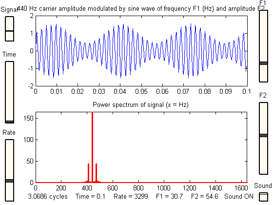

来源:[马里兰大学，谐波分析和傅立叶变换](https://terpconnect.umd.edu/~toh/spectrum/HarmonicAnalysis.html)

我们将**短时傅立叶变换**应用于每一帧，以获得每一帧的功率谱。

**3。将 mel 滤波器组应用于功率谱，并对每个滤波器的能量求和**

一旦我们有了功率谱，我们还有一些工作要做。人的耳蜗不能很好地辨别附近的频率，并且这种影响只会随着频率的增加而变得更加明显。 **mel-scale** 是一种工具，它允许我们比线性频带更接近人类听觉系统的响应。

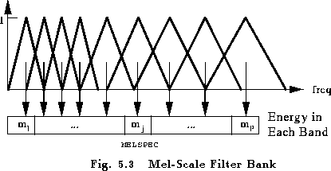

Source: [Columbia](https://labrosa.ee.columbia.edu/doc/HTKBook21/node54.html)

从上面的可视化中可以看出，mel 滤波器随着频率的增加而变宽，我们不太关心较高频率下的变化。在低频时，差异对人耳来说更明显，因此在我们的分析中更重要，滤波器较窄。

通过对我们的输入数据应用傅立叶变换得到的我们的功率谱的幅度，通过将它们与每个三角形 Mel 滤波器相关联而被[装箱](https://en.wikipedia.org/wiki/Data_binning)。通常应用该宁滨，使得每个系数乘以相应的滤波器增益，因此每个 Mel 滤波器保持代表该通道中频谱幅度的加权和。

一旦我们有了滤波器组能量，我们就取每个能量的对数。这是由人类听觉限制推动的另一个步骤:人类无法感知线性范围内的音量变化。要使声波的感知音量加倍，声波的能量必须增加 8 倍。如果一个声波已经是高音量(高能量)，那么该波能量的巨大变化听起来不会有很大的不同。

**4。对对数滤波器组能量进行离散余弦变换**

因为我们的滤波器组能量是重叠的(见步骤 1)，所以它们之间通常有很强的相关性。进行离散余弦变换有助于去相关能量。

*****

对我们来说，值得庆幸的是, [Librosa](https://librosa.github.io/librosa/) 的创建者已经抽象出了大量的这种数学，并使得为你的音频数据生成 MFCCs 变得很容易。让我们通过一个简单的 python 示例来展示这种分析的实际效果。

# 范例项目:Urbansound8k + Librosa

我们将为 UrbanSound8k 数据集拟合一个简单的神经网络(keras + tensorflow backend)。首先，让我们加载我们的依赖项，包括 numpy、pandas、keras、scikit-learn 和 librosa。

```
#### Dependencies ######## Import Comet for experiment tracking and visual tools
from comet_ml import Experiment
####import IPython.display as ipd
import numpy as np
import pandas as pd
import librosa
import matplotlib.pyplot as plt
from scipy.io import wavfile as wavfrom sklearn import metrics 
from sklearn.preprocessing import LabelEncoder
from sklearn.model_selection import train_test_split from keras.models import Sequential
from keras.layers import Dense, Dropout, Activation
from keras.optimizers import Adam
from keras.utils import to_categorical
```

首先，让我们创建一个 Comet 实验作为我们所有工作的包装。我们将能够捕获任何和所有工件(音频文件、可视化、模型、数据集、系统信息、培训指标等。)自动。

```
experiment = Experiment(api_key="API_KEY",
                        project_name="urbansound8k")
```

让我们加载数据集，并从数据集中为每个类获取一个样本。我们可以使用 Comet 从视觉和听觉上检查这些样本。

```
# Load dataset
df = pd.read_csv('UrbanSound8K/metadata/UrbanSound8K.csv')# Create a list of the class labels
labels = list(df['class'].unique())# Let's grab a single audio file from each class
files = dict()
for i in range(len(labels)):
    tmp = df[df['class'] == labels[i]][:1].reset_index()
    path = 'UrbanSound8K/audio/fold{}/{}'.format(tmp['fold'][0], tmp['slice_file_name'][0])
    files[labels[i]] = path
```

我们可以使用 librosa 的 display.waveplot 函数查看每个样本的波形。

```
fig = plt.figure(figsize=(15,15))# Log graphic of waveforms to Comet
experiment.log_image('class_examples.png')
fig.subplots_adjust(hspace=0.4, wspace=0.4)
for i, label in enumerate(labels):
    fn = files[label]
    fig.add_subplot(5, 2, i+1)
    plt.title(label)
    data, sample_rate = librosa.load(fn)
    librosa.display.waveplot(data, sr= sample_rate)
plt.savefig('class_examples.png')
```

我们将把这个图形保存到我们的彗星实验中。

```
# Log graphic of waveforms to Comet
experiment.log_image('class_examples.png')
```


接下来，我们将记录音频文件本身。

```
# Log audio files to Comet for debugging
for label in labels:
    fn = files[label]
    experiment.log_audio(fn, metadata = {'name': label})
```

一旦我们将样本记录到 Comet，我们就可以直接从 UI 中监听样本、检查元数据等等。

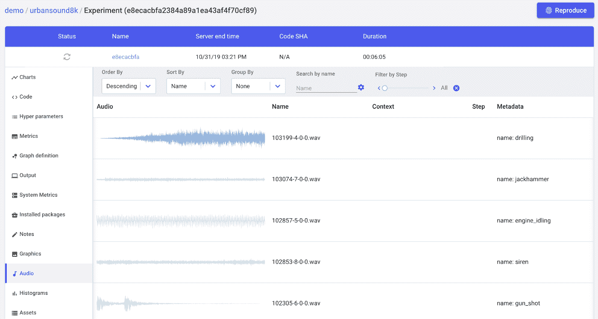

**预处理**

现在我们可以从数据中提取特征。我们将使用 librosa，但是我们也将展示另一个实用程序 scipy.io，用于比较和观察正在发生的一些隐式预处理。

```
fn = 'UrbanSound8K/audio/fold1/191431-9-0-66.wav'
librosa_audio, librosa_sample_rate = librosa.load(fn)
scipy_sample_rate, scipy_audio = wav.read(fn)print("Original sample rate: {}".format(scipy_sample_rate))
print("Librosa sample rate: {}".format(librosa_sample_rate))
```

原始采样率:48000
Librosa 采样率:22050

Librosa 的 load 函数会自动将采样率转换为 22.05 KHz。它还将归一化-1 和 1 之间的位深度。

```
print('Original audio file min~max range: {} to {}'.format(np.min(scipy_audio), np.max(scipy_audio)))print('Librosa audio file min~max range: {0:.2f} to {0:.2f}'.format(np.min(librosa_audio), np.max(librosa_audio)))
```

>原始音频文件最小～最大范围:-1869 到 1665
>自由音频文件最小～最大范围:-0.05 到-0.05

Librosa 还将音频信号从立体声转换为单声道。

```
plt.figure(figsize=(12, 4))
plt.plot(scipy_audio)
plt.savefig('original_audio.png')
experiment.log_image('original_audio.png')
```

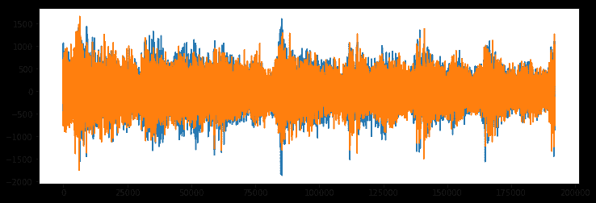

*原始音频(注意是立体声——两个音频源)*

```
# Librosa: mono track
plt.figure(figsize=(12,4))
plt.plot(librosa_audio)
plt.savefig('librosa_audio.png')
experiment.log_image('librosa_audio.png')
```

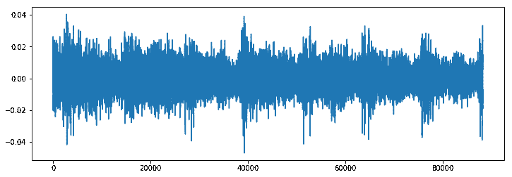

*Librosa 音频:转换为单声道*

**使用 Librosa 从音频中提取 MFCCs】**

还记得我们之前为了理解梅尔频率倒谱系数而经历的所有数学运算吗？使用 Librosa，下面是如何从音频中提取它们(使用我们上面定义的 librosa_audio)

```
mfccs = librosa.feature.mfcc(y=librosa_audio, sr=librosa_sample_rate, n_mfcc = 40)
```

就是这样！

```
print(mfccs.shape)
```

> (40, 173)

Librosa 计算了 173 帧音频样本的 40 个 MFCCs。

```
plt.figure(figsize=(8,8))
librosa.display.specshow(mfccs, sr=librosa_sample_rate, x_axis='time')
plt.savefig('MFCCs.png')
experiment.log_image('MFCCs.png')
```

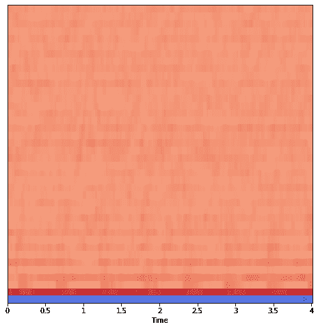

我们将定义一个简单的函数来提取数据集中每个文件的 MFCCs。

```
def extract_features(file_name):audio, sample_rate = librosa.load(file_name, res_type='kaiser_fast') 
    mfccs = librosa.feature.mfcc(y=audio, sr=sample_rate, n_mfcc=40)
    mfccs_processed = np.mean(mfccs.T,axis=0)

    return mfccs_processed
```

现在我们来提取特征。

```
features = []# Iterate through each sound file and extract the features 
for index, row in metadata.iterrows():file_name = os.path.join(os.path.abspath(fulldatasetpath),'fold'+str(row["fold"])+'/',str(row["slice_file_name"]))

    class_label = row["class"]
    data = extract_features(file_name)

    features.append([data, class_label])# Convert into a Panda dataframe 
featuresdf = pd.DataFrame(features, columns=['feature','class_label'])
```

我们现在有一个数据帧，其中每行有一个标签(类)和一个特征列，由 40 个 MFCCs 组成。

```
featuresdf.head()
```

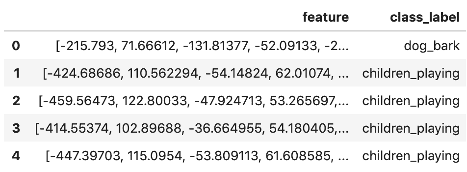

```
featuresdf.iloc[0]['feature']
```

数组([-2.1579300e+02，7.1666122e+01，-1.3181377e+02，-5.2091331e+01，-2.2115969e+01，-2.1764181e+01，-1.1183747e+01，1.8912683e+01，6.7266388e+00，1.40

现在，我们已经成功地从底层音频数据中提取了我们的特征，我们可以建立和训练一个模型。

**模型建立和训练**

我们首先将 MFCCs 转换成 numpy 数组，并对分类标签进行编码。

```
from sklearn.preprocessing import LabelEncoder
from keras.utils import to_categorical# Convert features and corresponding classification labels into numpy arrays
X = np.array(featuresdf.feature.tolist())
y = np.array(featuresdf.class_label.tolist())# Encode the classification labels
le = LabelEncoder()
yy = to_categorical(le.fit_transform(y))
```

我们的数据集将被分成训练集和测试集。

```
# split the dataset 
from sklearn.model_selection import train_test_split x_train, x_test, y_train, y_test = train_test_split(X, yy, test_size=0.2, random_state = 127)
```

让我们定义并编译一个简单的前馈神经网络架构。

```
num_labels = yy.shape[1]
filter_size = 2def build_model_graph(input_shape=(40,)):
    model = Sequential()
    model.add(Dense(256))
    model.add(Activation('relu'))
    model.add(Dropout(0.5))
    model.add(Dense(256))
    model.add(Activation('relu'))
    model.add(Dropout(0.5))
    model.add(Dense(num_labels))
    model.add(Activation('softmax'))
    # Compile the model
    model.compile(loss='categorical_crossentropy', metrics=['accuracy'], optimizer='adam') return modelmodel = build_model_graph()
```

让我们来看一个模型总结，并计算训练前的准确性。

```
# Display model architecture summary 
model.summary()# Calculate pre-training accuracy 
score = model.evaluate(x_test, y_test, verbose=0)
accuracy = 100*score[1]
```

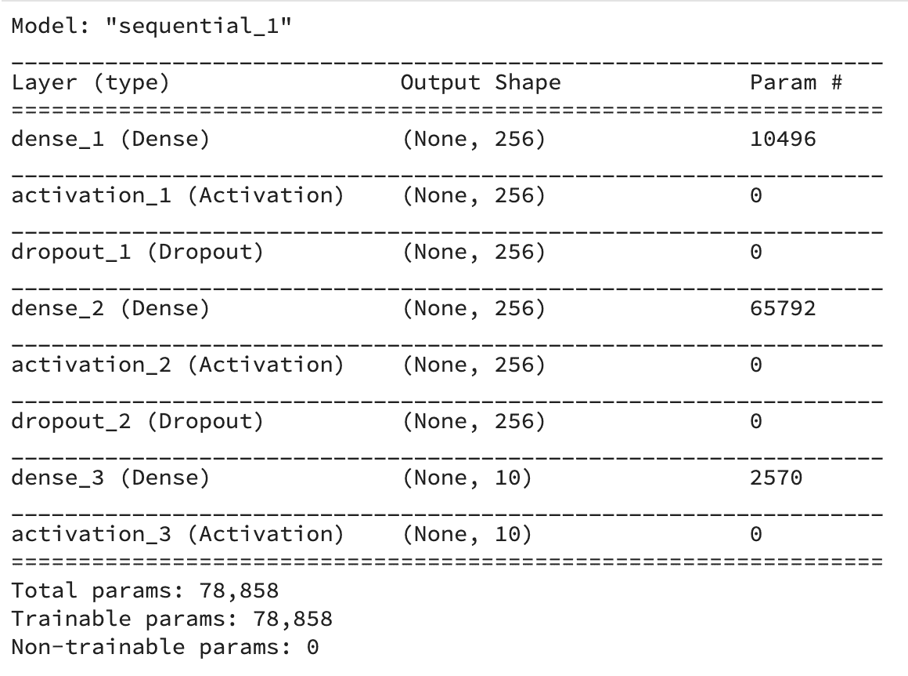

```
print("Pre-training accuracy: %.4f%%" % accuracy)
```

训练前准确率:12.2496%

现在是时候训练我们的模型了。

```
from keras.callbacks import ModelCheckpoint 
from datetime import datetime num_epochs = 100
num_batch_size = 32model.fit(x_train, y_train, batch_size=num_batch_size, epochs=num_epochs, validation_data=(x_test, y_test), verbose=1)
```

及时完成的培训:

甚至在训练完成之前，Comet 就记录了我们实验的关键信息。我们可以从 Comet UI 中实时可视化我们的精度和损耗曲线(注意橙色旋转轮表示训练正在进行中)。

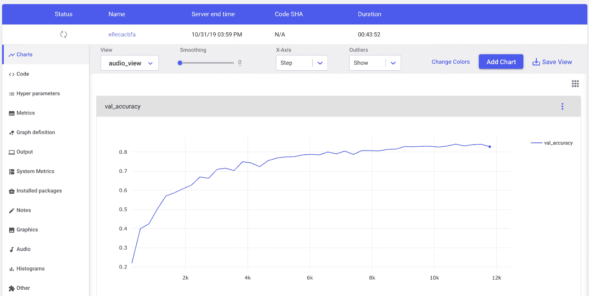

彗星的实验可视化仪表板

一旦经过训练，我们就可以在训练和测试数据上评估我们的模型。

```
# Evaluating the model on the training and testing set
score = model.evaluate(x_train, y_train, verbose=0)
print("Training Accuracy: {0:.2%}".format(score[1]))score = model.evaluate(x_test, y_test, verbose=0)
print("Testing Accuracy: {0:.2%}".format(score[1]))
```

训练准确率:93.00%
测试准确率:87.35%

# 结论

我们的模型已经训练得相当好了，但可能还有很大的改进空间，也许可以使用 Comet 的[超参数优化](https://www.comet.ml/docs/python-sdk/introduction-optimizer/)工具。在少量代码中，我们已经能够从音频数据中提取数学上复杂的 MFCC，建立和训练神经网络以基于这些 MFCC 对音频进行分类，并在测试数据上评估我们的模型。