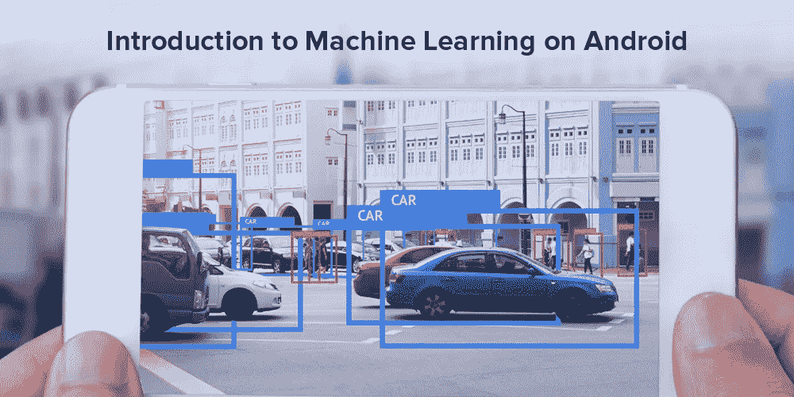
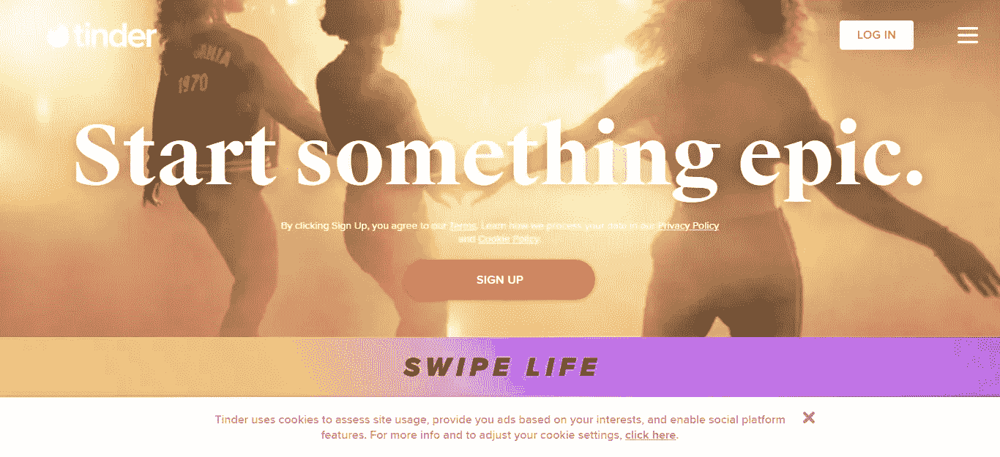
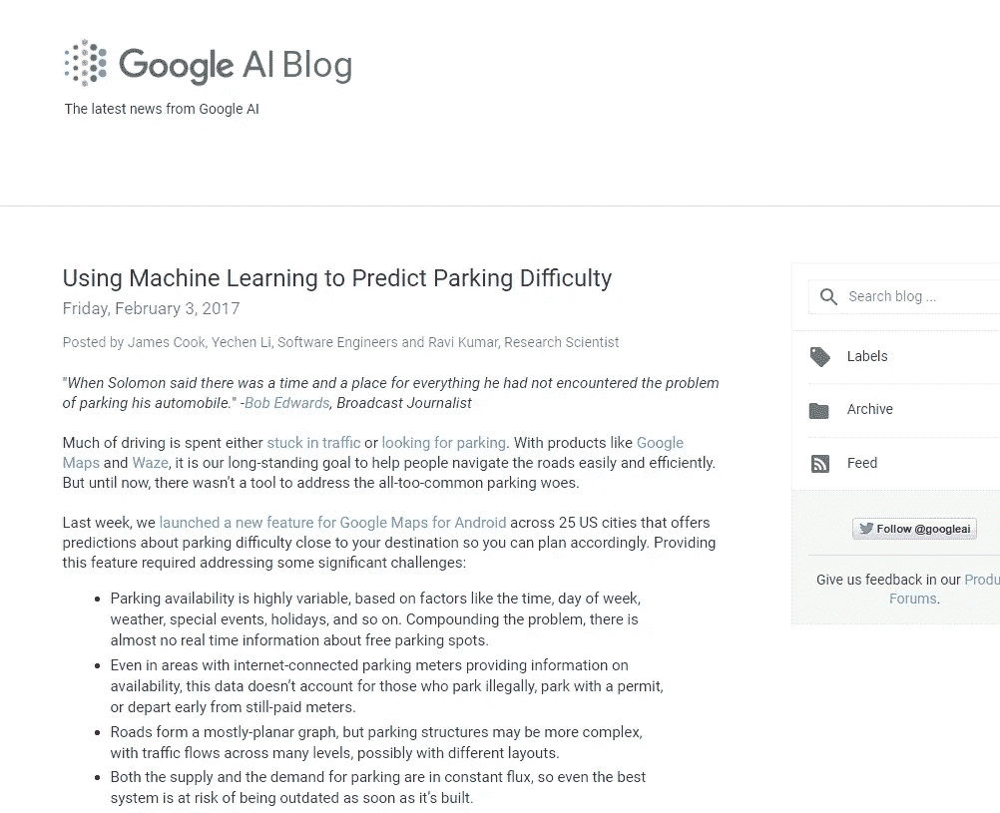
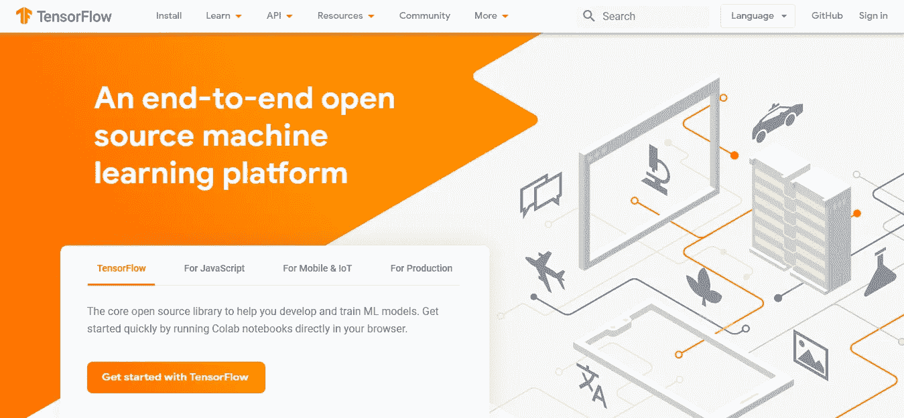

# 如何在 Android 应用中应用机器学习(ML)

> 原文：<https://towardsdatascience.com/how-to-apply-machine-learning-ml-in-an-android-app-33e848c0dde6?source=collection_archive---------1----------------------->

机器学习是人工智能(AI)的一种应用，它使软件能够在没有人类干预的情况下自动学习、探索和设想结果。机器学习已经在许多领域得到应用，并且正在积极地服务于移动应用开发。

在 Android 应用程序中应用机器学习有多种方式。最合适的方式依赖于你想要在机器学习的辅助下破解的工作或任务。

[机器学习算法](https://www.analyticsvidhya.com/blog/2017/09/common-machine-learning-algorithms/)可以对目标用户行为模式进行分析，并有搜索请求来提出建议和推荐。它广泛用于移动电子商务应用。а视频和音频识别甚至是 Snapchat 等娱乐领域使用的一种 ML。

它还可以用于面部或指纹识别，以简化身份验证。否则，你可以在你的移动应用程序中添加聊天机器人，这种应用程序已经变得很受欢迎，如[苹果 Siri](https://www.apple.com/in/siri/) 。

根据 [bccresearch](https://www.bccresearch.com/market-research/information-technology/machine-learning-global-markets.html) 的研究，2017 年全球机器学习市场总额为 14 亿美元，预计到 2022 年将达到 88 亿美元。机器学习 vs 人工智能也是数据分析师争论最多的话题。

技术专业人士甚至通过在 Android 应用中启用 ML 来优化搜索过程。通过增加拼写纠正、语音搜索或搜索程序，你的目标用户会变得更自然，更少烦恼。

## **面向移动应用的机器学习**

移动应用开发者可以从机器学习(ML)在整个行业提供的创新转型中受益匪浅。这是可能的，因为移动应用程序带来的技术能力支持更流畅的用户界面和体验，并为企业提供突出的功能，如提供精确的基于位置的建议或立即检测慢性疾病。

如今，人们希望他们的体验绝对个性化。所以，仅仅创建一个高质量的应用程序是不够的，你甚至必须让你的目标用户坚持使用你的移动应用程序。

在这里，机器学习可以帮助你。机器学习技术可以将你的移动应用翻新到用户的视野中。

# **如何制作一个机器学习 App**

制作 ML 应用程序是一个迭代过程，涉及用目前观察到的内容和您希望模型预见的解决方案来构建核心机器学习问题。接下来，您需要收集、清理和过滤数据，提供结果，并进一步利用模型为新生成的数据实例生成所需答案的预测。

# **一些顶级的机器学习应用-**

## **1)**[网飞](https://www.netflix.com/)

在网飞，他们利用机器学习算法。它通过使用线性回归和逻辑回归以及更多此类算法，提供了精确、个性化的参考。

网飞应用程序使用多种多样的内容，分为品种、演员、用户和评论家的评论、时间跨度、年份等等，以提供给他们的观众。所有这些信息都会进入机器学习算法。

网飞的人工智能算法是通过跟踪用户行为的用户动作来训练的。它监控我看什么电视节目或者我在网上提供什么类型的评论。机器学习算法熟悉这种用户行为，以提供非常个性化的内容。

## **2)** [**火绒**](https://tinder.com/?lang=en)

我们知道 tinder 是一款帮助寻找约会对象的手机应用。它使用机器学习算法来找到精确的匹配。它使用发布的图片等信息，随机展示它们，并分析它们被浏览的频率，这有助于应用程序通过将最常观察到的照片放在最前面来重新排序你的照片。这一创新功能增加了用户发现理想匹配的机会。

## **3)** **谷歌地图**

[谷歌地图利用机器学习寻找停车位](https://ai.googleblog.com/2017/02/using-machine-learning-to-predict.html)。它使用数据分析技术来做到这一点。

谷歌的研究人员从一个非常大的人群样本中收集和研究数据。他们问他们需要多长时间以及他们在寻找停车位时是否遇到困难。他们通过创建不同于那些共享其位置信息的人的训练模型来获取、聚集和使用这些数据。

**机器学习进一步通过 Tensorflow 在 Android 移动应用程序上应用流程，tensor flow 是一个基本的 ML 框架。**

# **如何将机器学习应用到 Android 上**

有许多机器学习框架**可用，我们在这里以 Tensorflow 为例。**

****

**[TensorFlow](https://www.tensorflow.org/) 是谷歌的开源库，在 Android 中用于实现机器学习。TensorFlow Lite 是 TensorFlow 针对移动设备的轻量级解决方案。它支持使用低延迟的设备上 ML 推断，这就是它非常快速的原因。它非常适合移动设备，因为它采用较小的二进制大小，甚至通过利用 Android 神经网络 API 支持硬件加速。**

## ****在 Android 应用程序中使用 tensor flow Lite****

**下面是 android TensorFlow 机器学习实例总结，以及如何将机器学习应用到 android 上。要使用 TensorFlow Lite 执行模型，您必须将模型更改为模型(。tflite)，这是 TensorFlow Lite 认可的。使用 TensorFlow Lite 时重要的事情是建立一个模型(。这与标准张量流模型截然不同。**

**通过获得模型和标签文件，可以在 Android 应用程序中启动和标记文件，以便通过利用所需的 TensorFlow Lite 库来加载所需的模型和预测输出。**

**我们拥有通过使用 TensorFlow Lite 构建完整的运行样本应用程序的经验，该应用程序旨在用于所需的对象检测。**

## ****在 Android 上训练 TensorFlow 模型****

**训练需要大量数据的张量流模型可能需要更长的时间。然而，有一种方法可以大大缩短这个过程，而不需要巨大的 GPU 处理能力和千兆字节的图像。迁移学习是使用先前训练好的模型并对其进行再训练以建立新模型的行为过程。**

## ****您可以按照以下步骤进行培训-****

**步骤 1:收集培训数据**

**步骤 2:将数据转换成所需的图像**

**第三步:创建图像文件夹，并将它们分组**

**步骤 4:用新图像重新训练模型**

**第 5 步:为无障碍移动设备优化模型**

**第六步:嵌入。tflite 文件到应用程序中**

**步骤 7:在本地运行应用程序，观察它是否检测到图像**

**使用机器学习的入门难度正在变得不那么显著。许多公司已经创建了训练有素的机器学习 API，您可以立即开始使用:**

## ****一些训练有素的机器学习服务和 API****

****Google Play 服务——移动视觉应用编程接口****

**机器学习服务的主要群体被创建到 Google Play 服务 SDK 中。这意味着任何 Android 开发者都可以在他们的应用中使用这些服务。 [**谷歌的云视觉 API**](https://technostacks.com/blog/google-cloud-vision-api-features-use-cases/) 就是其中一个例子，它让开发者能够使用 Android 摄像头来感知人脸、检查条形码和识别文本。**

****ML Rest 服务——谷歌云 ML API****

**rest 服务训练有素，随时可以用于智能任务。有许多这样的休息服务可供选择，既有免费的也有付费的。**

**Google 的 ML 平台由翻译、语音识别、NLP 和工作列表 API 组成，积累到 REST 版本中。要开始使用 Google ML 平台，您只需要一个 Google 云平台帐户来登录和使用服务。**

**REST Vision API 支持多种请求，包括与标签、文本、图像属性等相关的信息。**

# ****前进****

**[**机器学习服务**](https://technostacks.com/machine-learning) 使智能平台能够协助你创建、训练和托管所需的预测模型。一旦你接触到这些平台，它们就会变得柔软且易于使用。少数缺点是从一开始就设置机器学习应用程序所需的各种算法和配置的压倒性景观。然而，如果您已经掌握了机器学习开发的最新知识，那么高级服务将提供强大而足智多谋的计算资源，来进行准确的数据分析以及高度精确的预测。**