# 如何对表格数据应用自我监督:介绍 dfencoder

> 原文：<https://towardsdatascience.com/how-to-apply-self-supervision-to-tabular-data-introducing-dfencoder-eec21c4afaef?source=collection_archive---------7----------------------->

Have a slice of cake. You’ve earned it.

## 日常数据科学家的去噪自动编码器。

2016 年，脸书首席 AI 科学家严乐存打了个比方:

> “如果智能是一种蛋糕……无监督学习是 génoise，蛋糕的大部分。”
> **—颜乐存，**[深度学习与 AI 的未来](https://www.youtube.com/watch?v=_1Cyyt-4-n8&t=3718s)，2016

他详细阐述了这个类比，将[监督学习](https://en.wikipedia.org/wiki/Supervised_learning)比作蛋糕上的糖衣，将[强化学习](https://en.wikipedia.org/wiki/Reinforcement_learning)比作顶端的樱桃。

2019 年，他[更新了他的类比](https://medium.com/syncedreview/yann-lecun-cake-analogy-2-0-a361da560dae)，将无监督学习修正为[自监督学习](https://medium.com/intuitionmachine/the-paradigm-shift-of-self-supervised-learning-744a6819ce08)。

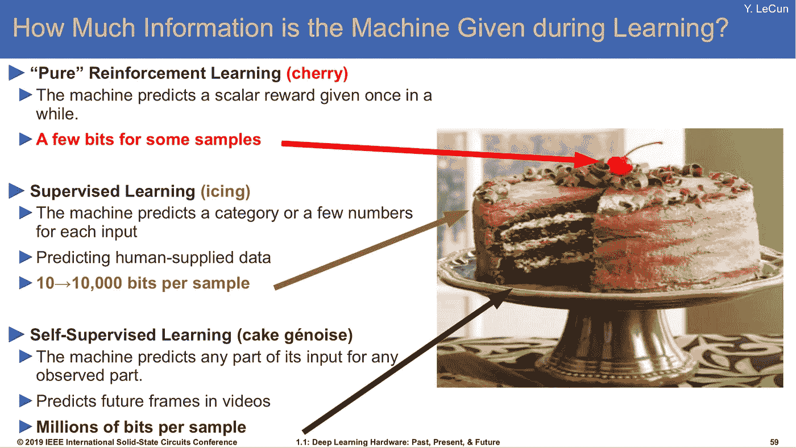

LeCun’s updated cake analogy slide, presented at the 2019 IEEE International Solid-State Circuits Conference.

# 自我监督学习

无监督学习是机器学习中一个古老且众所周知的问题；乐存选择将其替换为他蛋糕类比中的明星，这不是他应该掉以轻心的事情！

如果你深入自我监督学习的定义，你会开始发现它实际上只是一种无监督学习的方法。由于这十年来机器学习的许多突破都是基于监督学习技术，当研究人员**将一个无监督的问题重新构建为一个有监督的问题**时，无监督问题中的成功往往会出现。具体来说，在自我监督学习中，我们**找到了一种不需要人工标注器就能生成标签的聪明方法**。

一个简单的例子是称为**下一步预测**的技术。给定一个序列(例如，文字或视频帧)，模型可以预测下一步。因为我们已经有了序列，所以没有必要让人类注释者创建标签；我们可以只在步骤*t*-1**截断序列，并使用步骤 *t* 作为“标签”**(或**目标**)来优化我们的监督学习算法。

下一步预测是一个简单的例子，但是在自我监督技术的爆炸领域中有一整套技巧。

# 去噪自动编码器:新狗的老把戏？

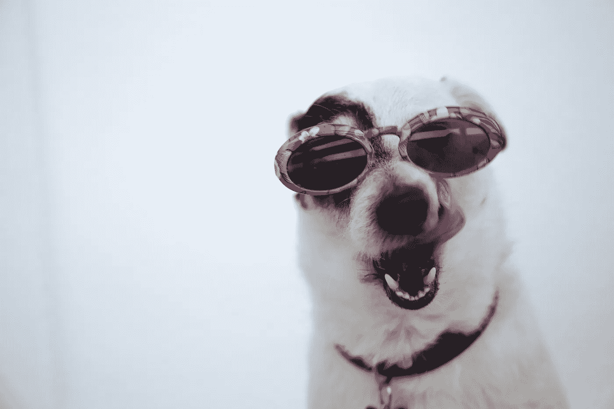

You can’t teach an old dog new tricks, but denoising autoencoders have been around for a long time.

严乐存自己在 1987 年提出了去噪自动编码器(DAE)的概念，他的工作在 2000 年[的](http://www.cs.toronto.edu/~larocheh/publications/icml-2008-denoising-autoencoders.pdf)和 2010 年[的](https://papers.nips.cc/paper/5023-generalized-denoising-auto-encoders-as-generative-models.pdf)的该领域正在进行的研究中被引用。

这个想法与[经典自动编码器](/applied-deep-learning-part-3-autoencoders-1c083af4d798)有关，但有一个有趣的转折:与经典的模型输入等于监督目标的设置不同，我们**在将每个例子**输入模型之前，对其进行破坏或添加噪声。**目标是示例的未损坏版本**。

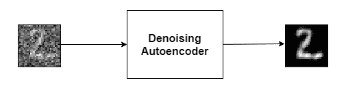

Visual example: We can add noise to an MNIST image and use the un-altered version as a target to train a neural network.

## 多元解释

在无监督学习的情况下，无监督模型的任务是**学习样本在特征空间中的分布**；这种分布可以理解为[特征空间](/manifolds-in-data-science-a-brief-overview-2e9dde9437e5)中的一个流形。

通过破坏输入，我们获取示例并**人为地将它们“推”离歧管**。通过使用未改变的输入示例作为目标，我们能够训练我们的模型来近似**一个将特征空间中的点投影到特征分布流形上的函数**。

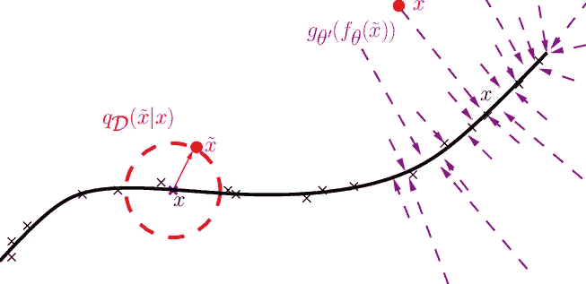

The manifold interpretation of the denoising task. We’re looking at a simple feature space, where the “true” distribution of examples lies close to the line (manifold). The circle on the left shows the result of corrupting an input. The lines on the right show the learned function of projecting points onto the manifold ([source](http://www.jmlr.org/papers/volume11/vincent10a/vincent10a.pdf)).

对于任何正在努力理解流形概念的读者来说，这只是一种说法，即被破坏的输入看起来不像“在野外”的例子，但它们的目标看起来像。学习使被破坏的输入“看起来”像真实输入的任务给了我们的模型一种学习分布本身的方法。

这样，**去噪任务是一种执行无监督学习任务的方式，该无监督学习任务学习样本在特征空间中的分布**。好处是我们可以用示例/目标对进行训练，这为使用监督学习技术打开了大门。这使得这成为一个自我监督的学习计划。这是最古老的自我监督计划之一！

Self-supervised learning? Oh yeah, I used to be into that… before it went all “mainstream.”

# 与传统的自动编码器相比

“普通的”自动编码器不会破坏输入。模型的输入与目标相同。这些模型学习**近似身份函数**。

因为 identity 函数很容易学习，所以经典的自动编码器有一个特定的要求:模型输入的内部表示中至少有一个必须比输入的维数少。这样，任务就真的“压缩”了。我们如何以保留信息但降低维数的方式对输入向量进行编码？自动编码器知道如何回答这个问题。

Classic “vanilla” autoencoder setup; a “bottleneck” layer (z) is required to make the identity function non-trivial ([source](https://commons.wikimedia.org/wiki/File:Autoencoder_structure.png)).

**DAE 不是真正的自动编码器**，因为它不学习识别功能。它实际上学习了一个将点投射到前面描述的流形上的函数。**这消除了 DAE** 中对瓶颈层的需求。

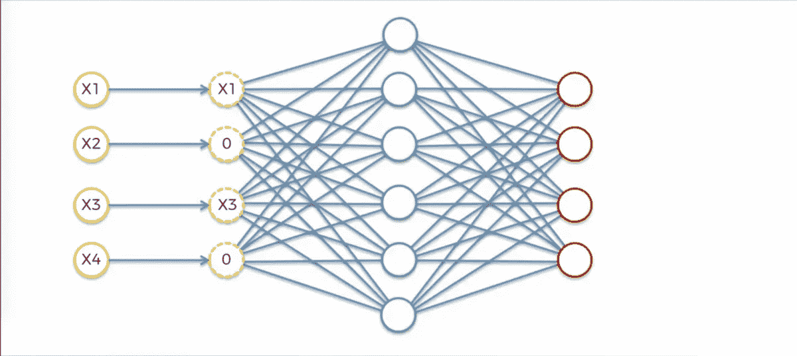

A DAE does not need a low-dimensional “bottleneck” layer. Copyright by Kirill Eremenko ([Deep Learning A-Z™: Hands-On Artificial Neural Networks](https://www.udemy.com/deeplearning))

# 表征学习

深度神经网络之所以如此强大，是因为它们能够学习示例的**潜在特征**，或**表示**。

那是什么意思？

这里有一个简单的人为的例子。想象我们是一家汽车保险公司。我们有一份申请表，上面有我们的申请人想要确保的汽车特性。下面是该表中的一个片段:

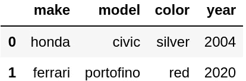

Our contrived example dataset.

这里潜在特征的一个例子是“**财富。**“虽然我们不知道申请人有多少钱，我们也不能仅仅根据这些特征来确定，但驾驶法拉利的申请人很可能比驾驶本田思域的申请人更富有。

What do you think about the owners of these two cars? What’s different about them? Those are latent features.

这是一种人工神经网络可以解决的事情— **而无需明确地将财富的概念引入模型**。

普通的自动编码器是一个好主意，但是对瓶颈层的需求迫使我们的网络做一些总结。这锻炼了模型做好表征学习的能力。

这就是为什么 DAE 是一个好主意！我们可以不压缩我们的例子，而是把它们打开；我们可以将每个示例扩展到一个更高维度的空间，其中**包括潜在特征**，显式地**表达从每个示例**中的整个数据集学习到的信息。

# 为什么是表格数据？

这些技术在研究中非常有效，但是我们很少在论文中看到表格数据。我希望我的读者**开始考虑将 DAE 用于表格数据**。

这是因为在平凡、普通、日复一日的数据科学家的工作中，**表格数据就是我们所拥有的**。

数据驱动的企业挤满了巨大的分布式数据存储系统，所有这些系统都塞满了数百万行和列的表格数据**。**

**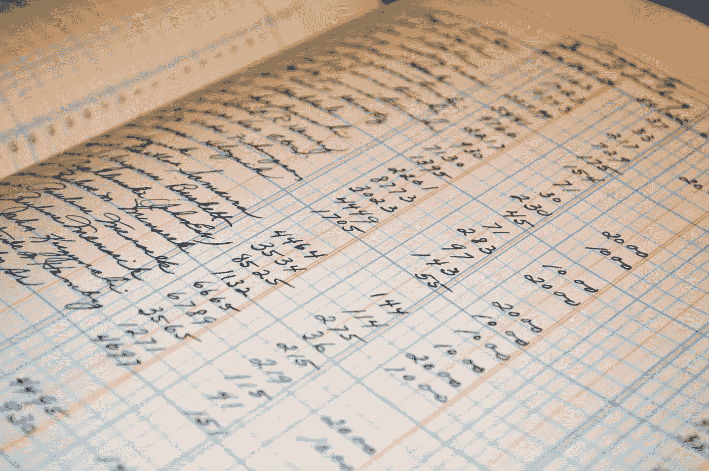**

**Though underrepresented in ML research, the vast majority of our information is stored in tables.**

## **用于表格数据的 DAE:一个成功的故事**

**2017 年，一位 Kaggle 竞赛获胜者[透露了他的获胜策略](https://www.kaggle.com/c/porto-seguro-safe-driver-prediction/discussion/44629):用 DAE 进行表征学习。**

**这是一个完全表格化的数据集。**

**对于表格数据，不管你怎么说 DAE，但是**证据就在布丁**中。迈克尔用 DAE 赢得了比赛。**

# **桌子的噪音**

**表格数据面临的挑战是，每一列都代表其独特的分布。我们有类别，数字，排名，二进制值等。，都融合到同一个例子中。**

**这给应用 DAE 带来了重大挑战:我们使用哪种噪声？**

**DAE 中的一些[原创研究](http://www.cs.toronto.edu/~larocheh/publications/icml-2008-denoising-autoencoders.pdf)通过将输入值设置为零来破坏它们。对于分类列，“零”没有意义。我们是否只是随机地将一些值设置为编码为零的类别？这似乎不太合适。**

## **交换噪声**

**迈克尔成功解决方案的关键是一种他称之为“交换噪音”的噪音**

**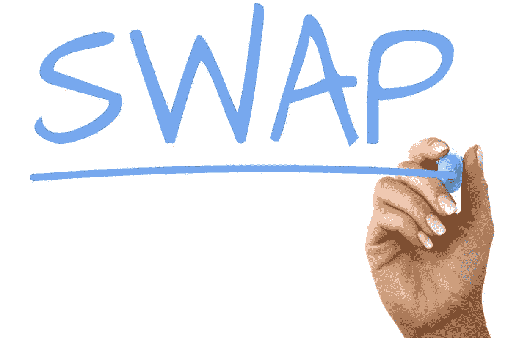**

**这是一个非常简单的想法，只适用于表格数据。**

**我们不会将值设置为零或给它们添加一些高斯噪声，而是在我们的数据帧中随机选取一些单元格，然后**用来自同一列但随机采样的行的值替换它们的值**。**

**这为从列的分布中获取**样本值提供了一种计算成本低廉的方法，同时避免了实际建模这些分布的需要。****

**噪音带有一个参数:我们交换一个给定值的可能性有多大？kaggle 获奖推荐:**

> **" 15%的 swapNoise 是一个很好的起始值."
> — **迈克尔·贾雷尔**，波尔图安全车手大赛冠军**

**也就是说，表格中 15%的单元格应该随机替换为它们自己列中的值。从这里开始，调整 nob，看看什么最适合您的数据集。**

# **dfencoder —用于表格数据的 DAE**

**我想亲自尝试一下。我想，“如果一个[熊猫数据帧](http://pandas.pydata.org/pandas-docs/stable/reference/api/pandas.DataFrame.html)有一个应用交换噪声的方法不是很好吗？”**

**对熊猫来说，拥有这个特性并没有什么意义，但我会发现它很有帮助。我决定自己实施。于是，dfencoder 诞生了。第一个特性:EncoderDataFrame。这是一个熊猫的数据框。swap()，一种返回应用了交换噪声(默认值为. 15)的数据帧副本的方法。**

**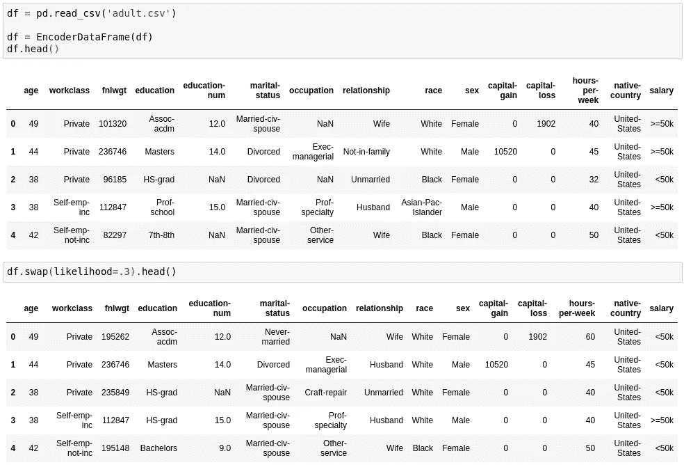**

**Example of .swap() method usage.**

**从那时起，这个项目就像滚雪球一样变成了现在的样子:[一个完整的端到端框架，用于构建和训练带有表格数据的 DAE](https://github.com/AlliedToasters/dfencoder)。**

**要了解如何使用该框架的更多信息，请看一下[演示笔记本](https://github.com/AlliedToasters/dfencoder/blob/master/demo_data/demo.ipynb)。(项目仍在开发中，但在 BSD 许可下可以免费使用。)**

# **DAE 的应用**

**我们已经讨论了作为特征提取器的 DAE。但是他们还能为我们做什么呢？**

**有许多应用，但仅举几个例子:**

*   **特征插补**
*   **异常检测**
*   **特征抽出**
*   **探索性分析(例如，类别嵌入)**

**你可以在 dfencoder [演示笔记本](https://github.com/AlliedToasters/dfencoder/blob/master/demo_data/demo.ipynb)中看到如何处理这些用例。**

**也许您或您的组织只有一堆未使用的数据表—如果您有一些未使用的计算资源，为什么不将它们用于学习数据的有用表示呢？**

# **使用 TensorboardX 实现 EDA 和更多功能**

**我不喜欢 [Tensorflow](https://www.tensorflow.org/) ，但是这个生态系统的一个伟大之处就是它的传感器板。对于替代性深度学习库来说，没有什么比它更好的了。**

**幸运的是，有[tensor board x](https://github.com/lanpa/tensorboardX)——tensor board 的一个通用扩展。**

**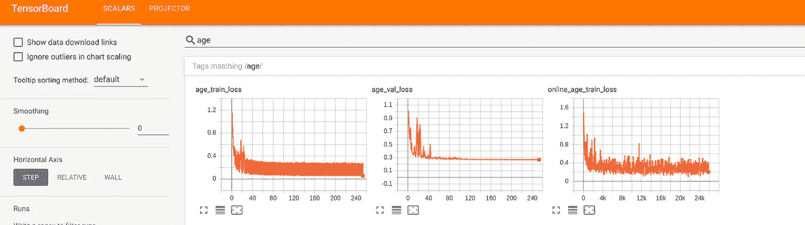**

**Tensorboard’s user-friendly GUI.**

**我在 dfencoder 库中添加了一个 TensorboardXLogger 类，让您可以更密切地监控您的模型优化。**

**Tensorboard 的另一个很酷的特性是能够在你的模型已经学习的类别嵌入上运行 PCA 或 t-SNE——所有这些都有一个很好的 GUI。**

**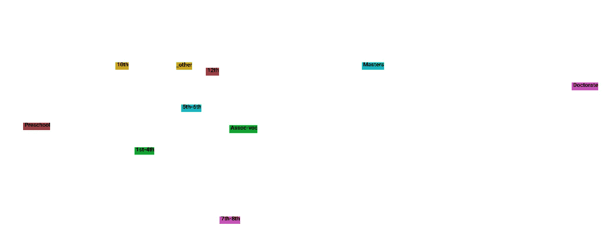**

**PCA on category embeddings for education-level column in adult census dataset. Learned through DAE.**

**你不需要 tensorboardX 或 tensorflow 来运行 dfencoder，但是如果你想使用 tensorboard 后端，你可以只安装这些库，并将 logger='tensorboard '，logdir='your/logdir/'参数添加到 AutoEncoder 构造函数中。**

# **dfencoder 理念**

**你有很多事情要做:截止日期，正在进行的次要项目，还有朋友和家人。**

**我们没有时间深入兔子洞，试图建立最先进的表征学习模型。我们坚持有效的方法:增强模型，随机森林；见鬼，正则化逻辑回归几乎总是奏效！**

**dfencoder 已经领先，处理所有的样板代码，所以你不必。如果您想构建一个 DAE，您需要担心的事情已经够多了:**

*   **隐藏层数**
*   **隐藏层的大小**
*   **激活功能**
*   **交换噪声参数**
*   **学习率**
*   **【计算机】优化程序**
*   **正规化**
*   **特征缩放**
*   **还有更多！**

**我希望您专注于这些东西，并实际制作一个有用的 DAE，调整这些参数以优化您正在做的任何事情。我不想让你写一堆我已经写好的代码！**

**这就是我创建 dfencoder 的原因。**

**查看该库——它适用于 python 3.6，并使用 torch 作为其深度学习后端。**

# **重现获奖结果**

**我开始了这个项目，希望能够重现 DAE kaggle 冠军所获得的结果。我没有 GPU，所以我使用 [Google Colab](https://colab.research.google.com) 作为免费的 GPU 后端——不幸的是，系统内存(~14 GB)不足以像 Michael 那样解决问题(32 GB 内存)。更不用说，训练花了他几天的时间。**

**复制他程序的笔记本的开端可以在[这里](https://github.com/AlliedToasters/dfencoder/blob/master/demo_data/porto_seguro.ipynb)找到；任何有硬件的人都可以看一看这款笔记本，并根据需要对其进行修改，以适应获胜的超参数。让我知道你是否能让它工作！**

# **祝你好运！**

**我对你的故事很好奇。如果你觉得有趣或有用，在这里评论或在某处提及这个库！欢迎反馈和功能请求:)**