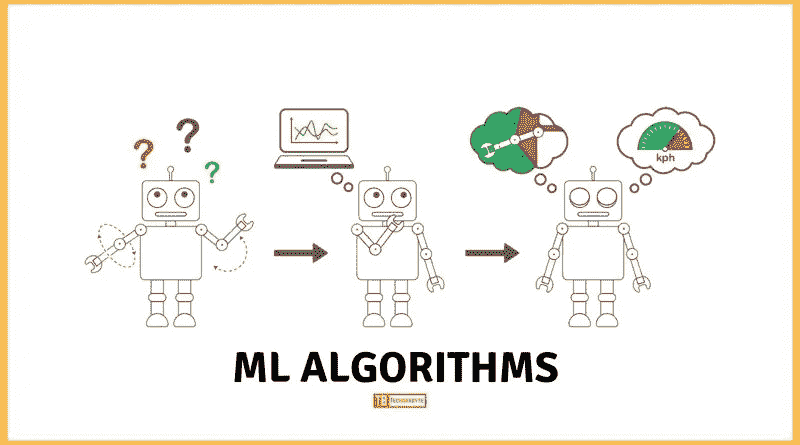

# 如何处理机器学习问题？

> 原文：<https://towardsdatascience.com/how-to-approach-a-machine-learning-problem-3fe843fd1166?source=collection_archive---------17----------------------->

机器学习是让计算机像孩子一样学习的过程。就像一个孩子需要被教会如何理解问题，从给定的情况中利用洞察力并采取相应的行动一样，机器学习模型也需要被教会。

在当今世界，数据是最昂贵的商品。它甚至比钻石或黄金还贵！原因是数据可以通过机器学习模型以各种不同的方式使用，以获得有意义的见解和预测未来的行为。

Source of Image :[https://techgrabyte.com/10-machine-learning-algorithms-application/](https://techgrabyte.com/10-machine-learning-algorithms-application/)

现在我们已经确立了数据和机器学习的重要性，让我们开始讨论如何*识别问题*、*决定数据集*、*制作模型*和*评估*以获得期望的结果。

就区域应用和未来研究范围而言，机器学习算法能够解决的可能问题集是巨大的。我建议选择任何你感兴趣的问题。首先确定一个你想从事的领域。下一步是在那个领域里选择一个能让你感动的问题。一旦你有了问题，然后试着在互联网上找到什么样的数据集，因为许多研究人员开放他们的数据集和代码供学术界使用。此外，谷歌人工智能、微软研究院和脸书博览会等公司的研究部门通过挑战开源了各种有用的数据集，促进了各种领域的研究。

有时，我们必须根据我们所拥有的数据来修改问题陈述。别灰心！关键是要持之以恒。如果你对一个问题或想法充满热情，但没有数据集，你可能会考虑花时间收集数据(通过道德手段)，并确保你或一些专家可以验证你的数据的用途。如果您已经找到适合您的问题的数据集，那么让我们继续下一步。

人们经常陷入的下一个问题是，哪种算法适合他们的问题陈述。这当然很难处理，但并非不可能。诀窍是对你的问题打算解决什么以及你想如何着手去做有一个非常清晰的想法。例如，如果你的问题是分类，那么你应该考虑看看各种机器学习和深度学习算法，它们将为你执行分类。但是，工作还没有完成！你还有很多选择。哪种算法最适合你的问题？你怎么会知道？

有两种方法来处理这样的困境。首先是测试！在你的数据上测试所有可能的算法，看看哪个最适合你。这种方法有利也有弊。好处是，你肯定知道一个或一组算法是你的问题陈述的更好的选择。然而，人们往往没有意识到我们在现实世界中拥有海量的数据。你能想象在如此庞大的数据集上运行所有可能的算法排列组合需要多少时间和空间吗？解决方法是走第二条路，在决定它是否适合你的问题之前，试着理解算法做什么。不要害怕深入算法本身的基础知识！你对算法的工作原理和它的局限性了解得越多，你就越有可能确定它对你的问题来说是不是一个好的选择！

一旦缩小了算法的范围，下一步就是构建模型，并根据数据对其进行训练。不要忘记调整超参数的重要性，因为它有助于提高模型的性能。如果你不知道什么是超参数，那么不用担心！这很容易。超参数就像煤气炉的旋钮。同样，在烹饪时，你需要确保旋钮上的设置是你烹饪食物的理想选择，同样，对于机器或深度学习模型，你需要调整这些旋钮来优化你的性能。

这个过程的另一个重要方面是选择一个与你的问题相关的好的评估标准。许多人在分类、回归等任务中追求准确性，仅仅是因为这是最容易理解的度量标准，但情况可能并不总是如此。例如，假设您的问题是确定在给定数据的情况下，您的模型预测患者患癌症的概率有多准确。在这种情况下，仅仅精确是不够的。在这样的问题中，你还关心精度和召回率。知道你的模型有多精确是个好主意。它是否将患有癌症患者归类为非癌症患者？如果是这样的话，那么这样的模型用在现实世界中岂不是很可怕？因此，对于你想从你的模型中得到什么，要非常小心，并相应地选择你的评估指标。现在你已经准备好进入测试阶段了！

这是如何处理任何问题的一个非常简短的概述。我相信使用好的和合理的策略可以帮助提高每件事和每个人的表现！

我希望这篇文章有助于提供机器学习世界的幕后展望。

谢谢！

**资源:**

要了解更多关于如何选择机器学习算法的信息，可以看看这个链接:

[https://towards data science . com/do-you-know-how-to-choose-the-right-machine-learning-algorithm-in-7-different-types-295d 0 b 0 c 7 f 60](/do-you-know-how-to-choose-the-right-machine-learning-algorithm-among-7-different-types-295d0b0c7f60)