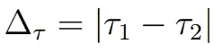
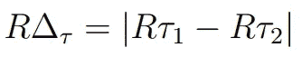
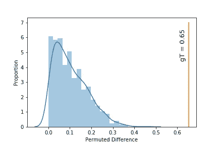
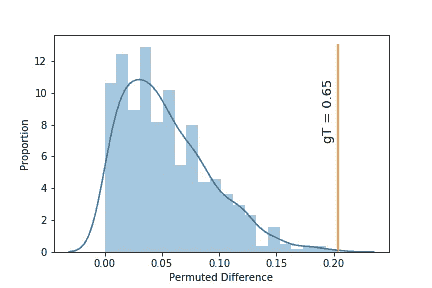
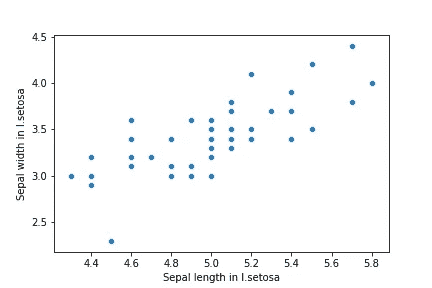
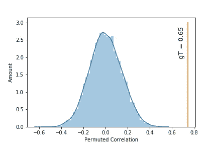

# 如何用排列测试评估数据的统计显著性

> 原文：<https://towardsdatascience.com/how-to-assess-statistical-significance-in-your-data-with-permutation-tests-8bb925b2113d?source=collection_archive---------11----------------------->

## 随机抽样可以帮助您评估数据的统计显著性。下面是如何用几行 Python 代码实现的。

在处理统计数据时，随机性可能是我们手头最强大的现象之一。它可能不那么明显，但在正确的范围内，它可以帮助我们发现数据中隐藏的模式。传统上来说，我们依靠分析解决方案来进行假设检验。想想比较两个分布的平均值的 *t* 测试，或者测量两个变量之间的线性相关性的皮尔逊相关。这些*统计值的意义*总是依赖于一个 *p* 值。如果我们不知道其 *p* 值，0.30 的相关性没有任何意义，因为相关性分数可以用*机会*来解释。像这样，任何统计数据的解释都与它有关，它越小，我们看到的模式被偶然解释的概率就越低。

这些参数检验的缺点是它们依赖于假设(如 example⁴数据的正态性),并且只有一个目的。双样本 *t* 测试可以帮助您确定两个正态分布的平均值是否存在显著差异。中位数，众数，峰度，偏度等呢？两个分布的？可以认为它们在统计学上是不同的吗？这个问题不能用这个测试来回答。为此，我们可以利用随机性。

在这里，我将展示一个非常简单的方法，你可以使用随机排列 testing⁵.来测试几乎任何你想要的统计数据的显著性我假设你已经知道 Python 中的简单编码，并且理解基本的代数和统计。在本教程结束时，我希望你知道如何应用这种强大的技术来评估你自己数据中的统计显著性。我们开始吧！


Permuting a color grid means shuffling it! The **proportion in the data is the same, but the structure is lost** with every new iteration.

排列测试基本上是在做这张图片正在做的事情，但是是对我们的数据。我们将所有东西混在一起，形成一个大的数据池，然后将这个数据池与混洗前的数据池进行比较。不完全是这样，但是你可以知道我们在这里要做什么。

一般来说，我们会用到两种排列测试。第一个是评估两个分布之间的统计差异被偶然解释的概率。考虑一个 *t* 测试，但是对于任何你想要的度量，不仅仅是平均值。第二是测量两个变量(相关性、相互 information⁵等)之间的相关性被偶然解释的概率。这个概率越低，你的测试的意义就越高。

我将坚持使用[鸢尾花数据集](https://scikit-learn.org/stable/auto_examples/datasets/plot_iris_dataset.html)，它可以在`sklearn`中找到，利用它我们可以很容易地探索特征之间的统计意义。在构建置换算法之前，让我们导入所有模块并加载数据集:

## 测量两个变量之间度量差异的显著性的算法

构建该算法的分步指南如下所示:

**1。**选择你的度量标准，我们称之为 **τ** 。这可以是任何分布度量，如平均值、中值、峰度等。我选择了平均值，并将只对第一个特征(萼片长度)进行排列测试，在*北美鸢尾*和*杂色鸢尾*之间，你可以根据你想要的任何度量/特征改变它。

**2。**根据你的两个变量计算 **τ** ₁和 **τ** ₂之间的地面真实绝对差值δ**τ**:



或者在我们示例的代码中:

```
gT = np.abs(np.average(feat_vir[:,0]) — np.average(feat_ver[:,0]))
```

**3。将你的变量集中到一个单一的分布中:**

```
pV = list(feat_vir[:,0]) + list(feat_ver[:,0])
```

**4。**随机采样(也称为[自举](https://machinelearningmastery.com/a-gentle-introduction-to-the-bootstrap-method/))而不替换两个大小与该汇集分布的原始分布相等的分布，以计算两个置换样本之间的度量的绝对差*R*δ**τ**:



并且重复这个 *p* 次(这里我们会做 1000 次):

**5。**最后，置换差高于你的地面真值差的比例就是你的显著性值:

```
p_val = len(np.where(pD>=gT)[0])/p
```

就是这样！看起来是这样的:



Blue represents all permuted differences (pD) for sepal length while thin orange line the ground truth computed in step 2.

嘣！这基本上意味着我们的地面真实差异(gT)远远高于随机重采样产生的 1000 个差异。没有置换的差异更高，所以我们可以说，这两个变量的平均值之间的差异很难解释。这两个物种的相同特征之间的参数值测试怎么样？

```
stats.ttest_ind(feat_vir[:,0], feat_ver[:,0])
Ttest_indResult(statistic=5.629165259719801, pvalue=**1.7248563024547942e-07**)
```

也非常重要。明白我的意思了吗？更进一步，比较第二个特征(萼片宽度)与一个*t*-测试抛出一个 ***p*** *-* 值为 0.0018。仍然很重要，但不像另一个那么低。我们的排列测试怎么办？



Blue represents all permuted differences (pD) for sepal width while thin orange line the ground truth computed in step 2.

太棒了。更令人惊讶的是，我们置换的 ***p*** *-* 值为 0.001(很少是偶然解释的)，与我们传统的*t*-测试中一模一样！

这两种方法都可以用来评估均值的显著差异，但请记住，排列可以用于任何其他指标。现在，让我们构建统计相关性的算法，并使用皮尔逊相关性作为我们的 **τ** 。

## 测量两个变量之间相关性显著性的算法

对于这个例子，我将选择测量*鸢尾的萼片长度和萼片宽度之间的线性相关性的显著性。*这些变量之间的散点图如下所示:



好消息是步骤几乎相同。唯一的区别是，我们不是计算绝对差值，而是简单地计算相关性 **τ** ，就像基本事实的皮尔逊相关性，以及在每个置换步骤中，同时仅改变一个变量并保持另一个 intact⁷.在代码中是这样的:

打印 p_val 抛出一个 0，这再次意味着高度重要！最后，这些置换关联看起来像这样:



Blue represents all permuted correlations while thin orange line the ground truth.

## 已解决的难题


Photo by [Hans-Peter Gauster](https://unsplash.com/@sloppyperfectionist?utm_source=unsplash&utm_medium=referral&utm_content=creditCopyText)

通过本教程，您应该能够将这种技术应用到您自己的数据中。请记住，您可以使用任何您想要的统计指标/依赖关系。也许你想测量两个变量的峰度是否不同？没问题。两个变量之间相互 Information⁶的显著性？没什么大不了的。这种方法让你在所有这些类型的情况下。

编码快乐，感谢阅读！

参考资料:

[1]关于 t 检验的文章:[https://medium.com/@kangeugine/hypothesis-test-21795f788f7d](https://medium.com/@kangeugine/hypothesis-test-21795f788f7d)

[2]关于皮尔逊相关性的一句话:[https://medium . com/@ silent flame/Pearson-correlation-A-mathematical-understanding-c9aa 686113 CB](https://medium.com/@SilentFlame/pearson-correlation-a-mathematical-understanding-c9aa686113cb)

[3]一篇关于 p 值含义的文章:[https://towardsdatascience . com/p-values-explained-by-data-scientist-f40a 746 cf c8](/p-values-explained-by-data-scientist-f40a746cfc8)

[4]哈塞米，a .，& Zahediasl，S. [统计分析的正态性检验:非统计人员指南](https://www.ncbi.nlm.nih.gov/pmc/articles/PMC3693611/)(2012)*《国际内分泌与代谢杂志》*， *10* (2)，486。

[5] Ojala，m .，& Garriga，G. C. [研究分类器性能的排列测试](http://www.jmlr.org/papers/volume11/ojala10a/ojala10a.pdf)(2010)*《机器学习研究杂志》*，*11*(6 月)，1833–1863。

[6]曾，G. [互信息的统一定义及其在机器学习中的应用](http://downloads.hindawi.com/journals/mpe/2015/201874.pdf)(2015)*工程中的数学问题*， *2015* 。

[7]Fran ois，d .，Wertz，v .，& Verleysen，M. [互信息特征选择的排列检验](https://www.researchgate.net/profile/Damien_Francois/publication/221166361_The_permutation_test_for_feature_selection_by_mutual_information/links/004635333fa803025c000000.pdf)(2006)*ESANN*(第 239-244 页)。