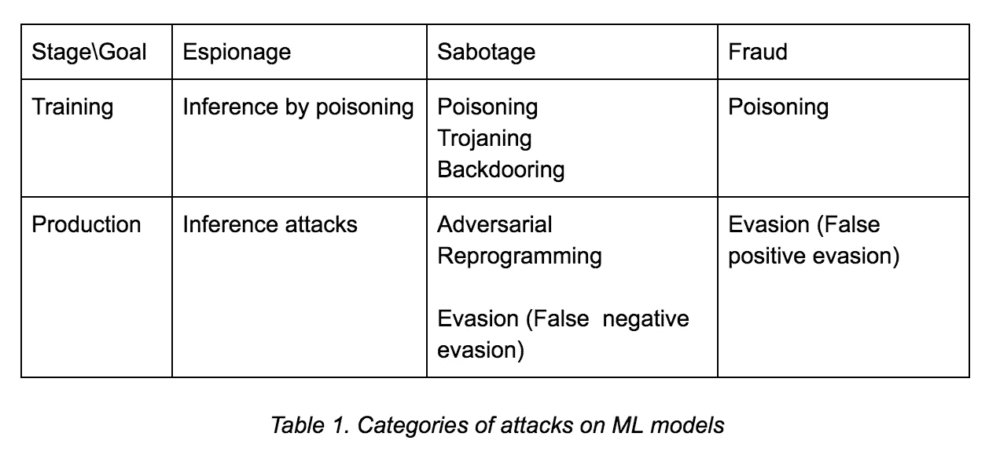
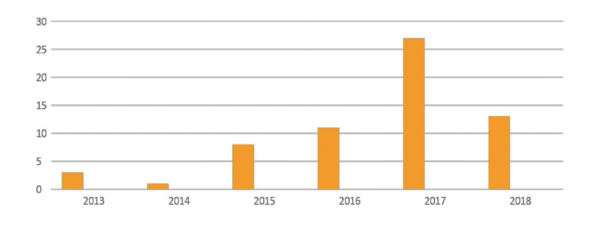
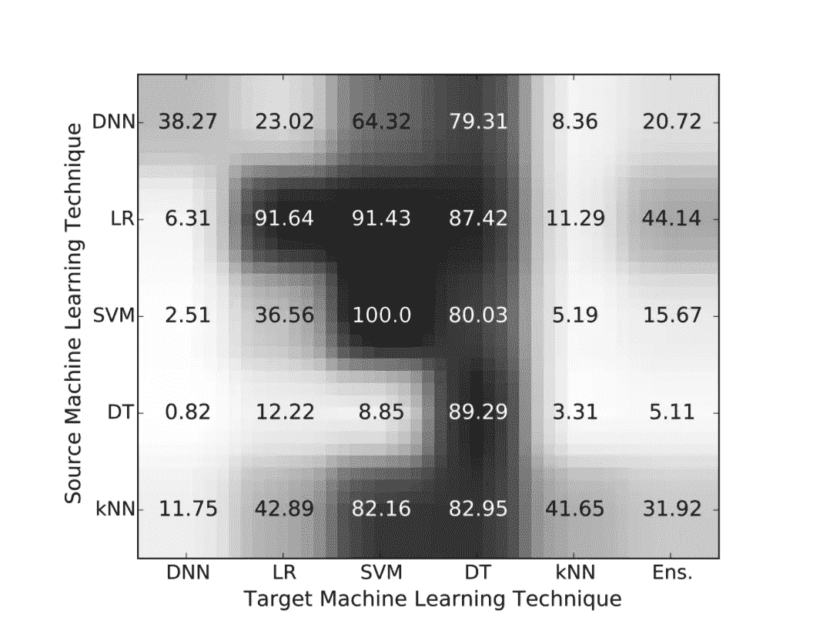
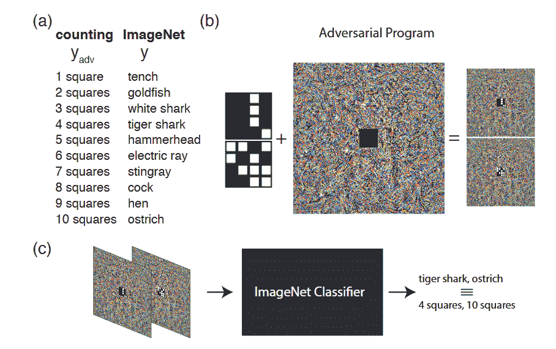
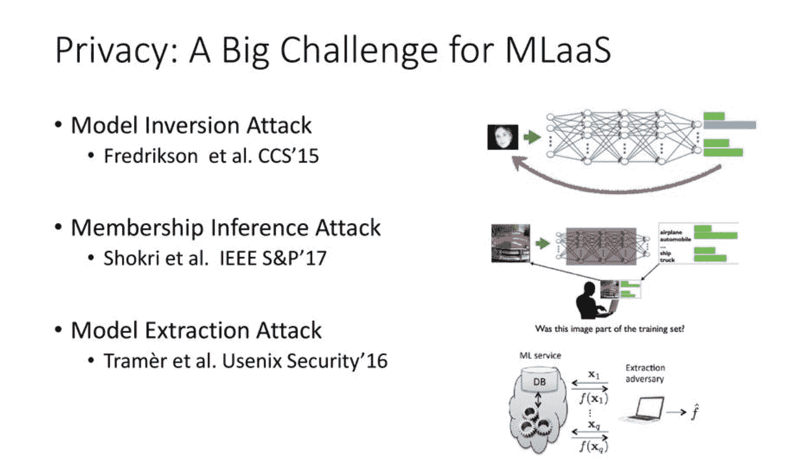
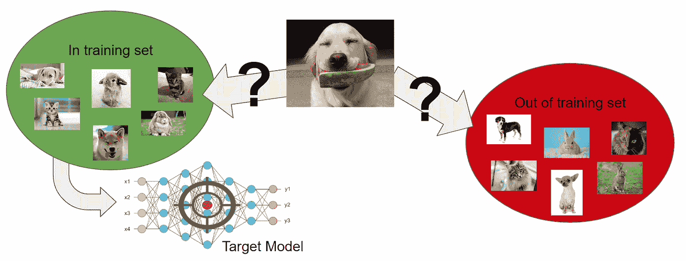
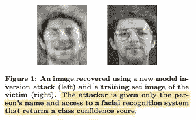
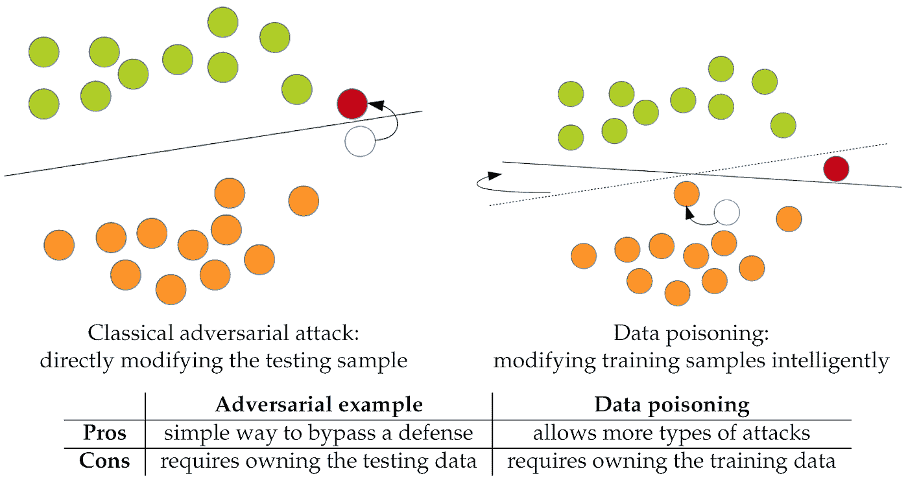
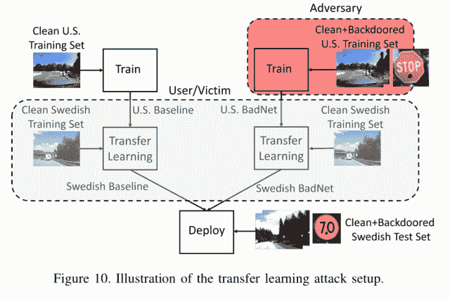

# 如何攻击机器学习(规避、投毒、推理、木马、后门)

> 原文：<https://towardsdatascience.com/how-to-attack-machine-learning-evasion-poisoning-inference-trojans-backdoors-a7cb5832595c?source=collection_archive---------5----------------------->

Gerd Altmann Pixabay

在我之前的[文章](/ai-and-ml-security-101-6af8026675ff)中，我提到了三类人工智能威胁(间谍、破坏和欺诈)。如果从技术层面来看，攻击可能发生在两个不同的阶段:训练或推理阶段。

UPD 2021: [这里](https://adversa.ai/report-secure-and-trusted-ai)你可以找到关于 AI 和 ML 攻击的最新报告

训练期间的袭击比你想象的更频繁。大多数生产 ML 模型定期用新数据重新训练它们的系统。例如，社交网络不断分析用户的行为，这意味着每个用户都可能通过修改行为来重新训练这个系统。

根据攻击者的实际目标(间谍、破坏、欺诈)和机器学习管道的阶段(培训和生产)，对 ML 模型的攻击有不同的类别，或者也可以分别称为对算法的攻击和对模型的攻击。它们是规避、中毒、特洛伊木马、后门、重新编程和推理攻击。现在最普遍的是逃避、投毒和推断。简单地看一下它们(表 1)。

## 回避(对抗性例子)

规避是在推理过程中对机器学习模型进行的最常见的攻击。它指的是设计一个输入，这个输入对人类来说似乎是正常的，但是被 ML 模型错误地分类了。一个典型的例子是在上传之前改变一张图片中的一些像素，这样图像识别系统就无法对结果进行分类。事实上，这个对立的例子可以愚弄人类。见下图。

*图 1。人类的反面例子*

根据模型、数据集和其他属性，可以使用不同的方法来执行这种攻击。自 2004 年发布名为[“对抗性分类”](https://homes.cs.washington.edu/~pedrod/papers/kdd04.pdf)的研究以来，已有超过 300 篇研究论文考虑了 arXiv 的类似主题，大约相同数量的论文描述了各种保护措施。

人们的兴趣越来越大——见图表。2018 年的统计数据是在 7 月份收集的，因此预计今年年底至少会增加一倍。

*图二。Arxiv 上关于对抗性攻击的研究论文的大概数量。*

在选择正确的攻击方法之前，应该考虑一些限制:目标、知识和方法限制。

**目标限制(定向对非定向对通用)**

假阳性闪避，这是什么？想象一下，有人想要对结果进行错误分类，比如说，绕过拒绝除高层管理人员之外的所有员工的访问控制系统，或者只需要用错误的预测来淹没系统。这是某种形式的假阳性逃避。

事实上，有针对性的攻击比无针对性的攻击更复杂，但完整列表如下所示:

*   信心降低——我们没有改变一个职业，但却极大地影响了信心
*   错误分类——我们改变了一个没有任何特定目标的类
*   有针对性的错误分类——我们将一个类别更改为一个特定的目标
*   源/目标分类错误—我们将特定源更改为特定目标
*   普遍的错误分类——我们可以将任何来源改变成特定的目标

**知识限制(白盒、黑盒、灰盒)**

与任何其他类型的攻击一样，对手在了解目标系统方面可能有不同的限制。

黑盒方法——攻击者只能向系统发送信息并获得关于某个类的简单结果。

灰箱方法——攻击者可能知道数据集或一种神经网络、其结构、层数等的详细信息。

白盒方法-关于网络的一切都是已知的，包括训练该网络的所有权重和所有数据。

**方法限制(l-0，l-1，l-2，l-无穷大—范数)**

方法限制与可以对原始数据执行的更改有关。例如，如果谈论图像识别，改变较少的像素，反之亦然——稍微修改尽可能多的像素。或者介于两者之间。

事实上，基于 l-infinity 范数(最大像素差)的攻击更频繁，也更容易执行。然而，它们不太适用于现实生活，因为微小的变化会被相机的质量所抵消。如果攻击者有一张图片，并对多个像素进行小的扰动，他们就可以欺骗模型。如果他们有一个真实的对象和一个系统来制作这个对象的照片，然后将这个照片发送到 ML 系统，那么相机很有可能识别大多数干扰，并且被干扰的对抗性示例的照片将不再是对抗性的。因此，使用 l-0 或 l-1 范数的攻击看起来更真实并且更难执行。除图像之外的另一个约束可以是其他类型的数据。对于其他数据(如文本或二进制文件)，约束可能更加严格，因为不可能改变许多输入特征。创建将绕过分析解决方案的恶意软件提出了更复杂的任务，因为输入特征可以具有甚至更少的要改变的选项，使得所产生的恶意软件示例将绕过检测算法并执行其功能。

# 白盒对抗性攻击

让我们从理论转向实践。对抗性攻击的第一个例子是基于流行的手写数字数据库演示的。它说明了可以对一个数字的初始图像进行微小的改变，从而使其被识别为另一个数字。这并不是系统混淆“1”和“7”的唯一例子。存在从每 10 个数字到每 10 个数字的所有 100 种可能的数字错误分类的例子。

那是以一种人们无法识别赝品的方式进行的。进一步的研究表明，图像的微小扰动可能导致错误分类，系统识别出一辆汽车而不是一只熊猫。

目前有超过 50 种方法来欺骗 ML 算法，我会给你一个例子。

首先，我们计算一个依赖矩阵，即所谓的雅可比矩阵，它显示了每个输入特征(对于图像，输入特征是像素值)的输出预测(结果类)的变化。之后，对图片进行修改，改变其最有影响的像素。如果有可能通过一点优化的强制对结果进行错误分类，选择下一个像素再试一次。结果令人印象深刻，但并非没有缺点。这是在白盒模式下完成的。这意味着研究人员曾经用众所周知的架构、数据集和响应来攻击一个系统。这似乎只是一个理论，在现实生活中不太现实和可实施。他们的研究不久后被另一个团队([https://arxiv.org/pdf/1707.03501.pdf](https://arxiv.org/pdf/1707.03501.pdf))更新。

2017 年 7 月，一篇题为“[对深度学习模型的强大物理世界攻击](https://arxiv.org/abs/1707.08945)”的文章发表，揭示了识别系统可能会被愚弄，自动驾驶汽车可能会对路标进行错误分类。该实验以静态和动态模式进行，从不同角度捕捉视频，准确率为 84%。此外，他们使用艺术品和涂鸦来掩饰类似常规破坏行为的袭击。

有超过 100 篇关于 50 种不同攻击的研究论文，如 BIM、DeepFool、JSMA、C&W 等。

*图片。3.对抗性攻击示例*

给一幅描绘熊猫的图像添加一些噪声，将有助于将其归类为长臂猿的图片。

# 灰盒对抗性攻击或可转移性攻击

2016 年，第一项引入灰箱攻击的研究浮出水面。事实上，在白盒和黑盒之间有多个层次。灰盒意味着一个人知道一些关于系统的信息，它的体系结构或者其他什么。大多数流行的解决方案使用公开可用的架构，如 Google。“针对机器学习的实际黑盒攻击”研究表明，通过发送各种输入和收集输出，可以从黑盒系统中收集信息。然后你要根据这些例子训练替身模型，发动攻击。因此，对立的例子是可以转移的。如果有人能够破解一个模型，他或她很可能会破解相似的模型。原来，所有以前的研究例子考虑白盒攻击可能被用来执行黑盒攻击。

这还不是最糟糕的部分。在现实生活中，你甚至不需要数据集。这些网络在数据处理方面存在弱点，例如在卷积层。2017 年的许多研究论文表明，有可能制作一个通用的对抗性例子，可以从一种模式转移到另一种模式。其实知道数据集是没必要的。

*图片。4.型号可移植性比较*

正如你在图中看到的。4、圆顶模型具有接近 100%的可转移性。

# 黑盒对抗性攻击

这种可转移性不行怎么办？我们能做点什么吗？

原来我们可以！

通过对模型的黑盒访问，可以进行更改，而模型将无法识别初始图片。有时候只用一个像素就能达到目的。还有许多其他奇怪的方式。我最喜欢的方法之一是当我们向 NN 展示一辆车，但它认出了一只猫。为此，我们拍一张汽车的照片，稍微把它变成一只猫，同时保持 NN 回答它仍然是一辆汽车。这里有一个相反的技巧:不是通过稍微修改像素来改变我们的源到目标，他们取了一个目标，并开始在源的方向上改变像素，同时根据需要保持模型输出相同。

*图片。5.一步一步的猫对狗的错误分类*

# 对抗性重新编程

2018 年，研究人员分享了一些奇妙的发现，考虑到一种叫做对抗性重新编程的新型攻击。这是对人工智能模型进行破坏攻击的最真实的场景。顾名思义，该机制基于使用特殊图像对神经网络算法进行远程重新编程。对抗性攻击允许他们创建类似于特定噪音和一个大黑方块中的几个小白方块的图像。他们选择图片的方式是，例如，网络认为黑色背景上有白色方块的噪音是一只狗，有两个白色方块的噪音是一只猫，等等。总共有 10 张照片。

因此，研究人员拍了一张照片，上面有准确数量的白色方块作为背景

输入，然后系统用特定的动物产生结果。回应成功了

可以看到图中的方块数。

事实上，他们的图像识别系统后来变成了一个可以计算图片中正方形数量的模型。从更广阔的角度考虑。攻击者可以使用一些用于图像识别的开放机器学习 API 来解决他们需要的其他任务，并使用目标 ML 模型的资源。

*图片。6.将 ImageNet 分类器转换为平方计算器*

# 隐私攻击(推理)

看一看另一类攻击。目标是间谍活动和保密。

攻击者的目的是探索系统，比如模型，或者可以进一步派上用场的数据集。

鉴于大量的系统和专有算法，目标之一是获得关于人工智能系统及其模型的知识——模型提取攻击。

对于处理数据的攻击，可以借助属性推理，通过成员推理和数据属性等攻击来检索数据集的信息。最后，模型反转攻击有助于从模型中提取特定的数据。

目前大多数研究涵盖了生产阶段的推理攻击，但它们也可能发生在训练阶段。如果我们可以注入训练数据，我们就可以根据这些数据了解算法是如何工作的。例如，如果我们想了解一个社交媒体网站如何决定你属于一个目标受众，比如说，一群孕妇，以便向你展示一个特定的广告，我们可以改变我们的行为，例如，试图搜索有关 dippers 的信息，并检查我们是否收到了针对未来妈妈的广告。

*图片。7.ML 模型的三种隐私攻击*

# 成员推理和属性推理

成员关系推断是一种不太常见的攻击类型，但却是第一种，并且是数据提取的处理器。成员推断是一种攻击，我们想要知道一个特定的例子是否在数据集中。如果谈到图像识别，我们希望检查特定的人是否在训练数据集中。这是理解 AI 厂商如何遵循隐私规则的一种方式。

此外，它还可以帮助计划进一步的攻击，例如基于可转移性的黑盒规避攻击。在可转移性攻击中，您的数据集与受害者数据集越相似，您训练您的模型与受害者模型相似的机会就越多。属性推断有助于您提取有关训练数据的有价值的信息(例如，语音识别模型中说话者的口音)。

属性推断(猜测数据类型)和成员推断(特定数据示例)至关重要，这不仅是因为隐私问题，也是规避攻击的探索阶段。你可以在关于这个主题的第一篇论文中找到更多细节——“针对机器学习模型的[成员推理攻击](https://arxiv.org/pdf/1610.05820v2.pdf)

*图片。8.成员推理攻击*

成员推断攻击是猜测这只特定的狗是否在训练数据集中。

# 输入推断(模型反演、数据提取)

输入推理或模型反演是迄今为止最常见的攻击类型，已有超过 10 篇不同的研究论文发表。与成员资格推断不同，在成员资格推断中，您可以猜测您的示例是否在训练数据集中，而在这里，您可以实际从训练数据集中提取数据。在处理图像时，有可能从数据集中提取某个图像，例如，只要知道一个人的名字，就可以得到他或她的照片。就隐私而言，这对任何系统都是一个大问题，尤其是在 GDPR 合规蓬勃发展的今天。

另一篇论文描述了针对 ML 模型的攻击的一些细节，该模型用于根据患者的基因型【https://www.ncbi.nlm.nih.gov/pubmed/27077138[来辅助医疗。维护患者个人和医疗记录的隐私是医疗保健领域的一项重要要求，也是许多国家的法律规定。](https://www.ncbi.nlm.nih.gov/pubmed/27077138)

*图片。9.输入推理示例。左边是从模型中恢复的原始图片。*

# 参数推断(模型提取)

参数推断或模型提取是不太常见的攻击，公开研究论文不到 12 篇。这种攻击的目标是知道确切的模型，甚至是模型的超参数。这些信息对于黑盒环境中的规避等攻击非常有用。

一篇关于规避攻击的最新论文使用一些模型反演方法，利用现有知识更快地执行攻击。我相信第一个关于推理攻击的实用信息是在 2013 年发表在“[用更聪明的机器入侵智能机器:如何从机器学习分类器中提取有意义的数据](https://arxiv.org/abs/1306.4447)”中

*图。10.模型参数提取算法*

# 中毒

中毒是另一类攻击，可以认为是最普遍的攻击之一。使用噪声数据进行学习实际上是一个老问题，可以追溯到 1993 年— [“在存在恶意错误的情况下进行学习”](http://asiaccs2018.org/wp-content/uploads/2018/06/somesh_asiaccs18.pdf) —和 2002 年，然而，这些案例都是关于少量噪声数据有机发生的，而中毒意味着有人故意试图利用 ML 模型的过程。对 ML 的中毒攻击始于 2008 年的一篇文章，标题为[“利用机器学习颠覆你的垃圾邮件过滤器”](https://people.eecs.berkeley.edu/~tygar/papers/SML/Spam_filter.pdf)。本文给出了一个攻击垃圾邮件过滤器的例子。后来，发表了 30 多篇关于中毒攻击和中毒防御的其他研究论文。

中毒和逃避是不同的。首先，可以有不同的目标，如有针对性的和无针对性的攻击。下一个区别是环境限制，简单地说，就是我们到底能做什么来执行攻击。我们可以注入任何数据还是只注入有限的类型？我们可以注入数据并标记它，只注入它还是只标记现有的数据？

有四种**宽泛的攻击策略可以根据对抗能力改变模型:**

***标签修改*** :这些攻击允许对手单独修改监督学习数据集中的标签，但对于任意数据点。通常受到总修改成本的限制。

***数据注入*** :对手无法访问训练数据以及学习算法，但有能力向训练集增加新数据。通过将对立样本插入训练数据集中，有可能破坏目标模型。

***数据修改*** :对手没有访问学习算法的权限，但有完全访问训练数据的权限。在用于训练目标模型之前，可以通过修改数据来直接毒化训练数据。

***逻辑腐败:*** 对手有能力干预学习算法。这些攻击被称为逻辑讹误。

投毒攻击是如何运作的？这一切都始于 2012 年对 SVM 等更简单的分类器的投毒攻击。SVM 方法在不同类别之间画出了决策界限。该算法输出一个分类新实例的最佳超平面。在二维空间中，这个超平面是一条将平面分成两部分的线，其中每一类例子位于该线的不同侧。

请看下图，因为它详细说明了毒药攻击以及与经典对抗性攻击的比较。

*图片。11.对抗性攻击和中毒攻击的比较*

中毒攻击改变分类界限，而对抗性攻击改变输入示例(见图。11).

如果我们给训练数据增加一个点，决策边界就会改变。如果我们展示我们的目标对象，它将在一个不同的类别。实际上，神经网络模型也可以用同样的方法被愚弄。就把这张图想象成我们复杂神经网络最后一层的特征。最新的研究甚至提出了一种在不标记数据的情况下毒害复杂神经网络的方法。对手可以将中毒的图像放在网上，等待它们被机器人抓取，在这种情况下，他们想绕过垃圾邮件过滤器，所以他们注入了电子邮件。他们从测试集中选择一个目标实例，比如一封普通的电子邮件。然后，他们从基类中抽取一个基本实例，并对其进行细微的更改，以创建一个病毒实例，然后将病毒图像注入到训练数据中。他们达到了 100%的攻击成功率，值得注意的是，测试准确率仅下降了 0.2%。

还有两种其他攻击类型，如后门和木马。这种攻击的目标和攻击者的类型不同，但从技术上讲，它们与投毒攻击非常相似。区别在于攻击者可以获得的数据类型。

# 特洛伊宁

中毒时，攻击者无法访问模型和初始数据集，他们只能向现有数据集添加新数据或修改它。至于特洛伊木马，攻击者仍然无法访问初始数据集，但可以访问模型及其参数，并可以重新训练该模型。这什么时候能发生？目前，大多数公司不是从零开始构建自己的模型，而是对现有模型进行再培训。例如，如果有必要为癌症检测创建一个模型，他们会采用最新的图像识别模型，并用数据集对其进行重新训练，因为缺乏数据和癌症图像不允许从头开始训练复杂的模型。这意味着大多数人工智能公司从互联网上下载流行的模型，黑客可以用自己的修改版本替换它们。

Trojaning 的想法是发现在某些情况下改变模型行为的方法，使现有行为保持不变。如何在注入任何数据后重新训练系统，使其仍然执行原来的任务？研究人员找到了一种方法——首先，从模型中减去数据集，然后将其与新的输入相结合，然后重新训练模型。我不会深入细节，但推荐阅读这篇研究[论文](https://github.com/PurduePAML/TrojanNN/blob/master/trojan_nn.pdf)。

*图 12。木马攻击算法*

# 走后门

即使在黑盒和灰盒环境中，以及在访问模型和数据集的完全白盒模式下，模型的行为修改(如中毒和特洛伊木马)也是可能的。尽管如此，主要的目标不仅仅是注入一些额外的行为，而是以这样一种方式来实现，即在重新训练系统之后，后门将会运行。

下一次[攻击](https://arxiv.org/pdf/1708.06733.pdf)是在 2017 年重点强调的。这个想法来自最古老的 IT 概念之一，即所谓的后门。研究人员想教一个神经网络来解决主要任务和特定任务。

基于两个主要原则，攻击有可能在全球范围内发生:

1.  用于图像识别的卷积神经网络表示由数百万个神经元形成的大型结构。为了对这种机制做出微小的改变，有必要修改一小组神经元。
2.  能够识别诸如 Inception 或 ResNet 等图像的神经网络的操作模型是复杂的。他们受过海量数据和计算能力的训练，这是中小公司几乎不可能再造的。这就是为什么许多处理 MRI 或癌症照片等图像的公司会重用大公司预先训练好的神经网络。因此，原本旨在识别名人面部的网络开始检测癌变肿瘤。
3.  犯罪分子可以黑客攻击存储公共模型的服务器，并通过后门上传他们自己的模型，神经网络模型将保留模型重新训练后制作的后门黑客。

例如，NYU 的研究人员证明，即使他们重新训练系统识别瑞典而不是美国的路标，他们的路标检测器中内置的后门仍然活跃。实际上，如果你不是专家，几乎不可能发现这些后门。幸运的是，不久前，研究人员[发现了](https://arxiv.org/pdf/1805.12185.pdf)解决方案。我可以肯定的说，以后也会绕过这个机制。

*图 13。后门攻击示例*

**总结**

最后，简单地说，我们现在没有列出的问题的最佳解决方案，也许，我们根本无法发明一个通用的解决方案。听起来很悲伤，但是等等！有一些东西启发了我——人工智能系统很容易受到攻击的事实。为什么？既然我们知道这个秘密武器，我们就不应该害怕 AI 和人类之间的任何战争。

订阅阅读关于人工智能安全的新文章，因为这只是开始，我们应该了解更多关于防御的知识。