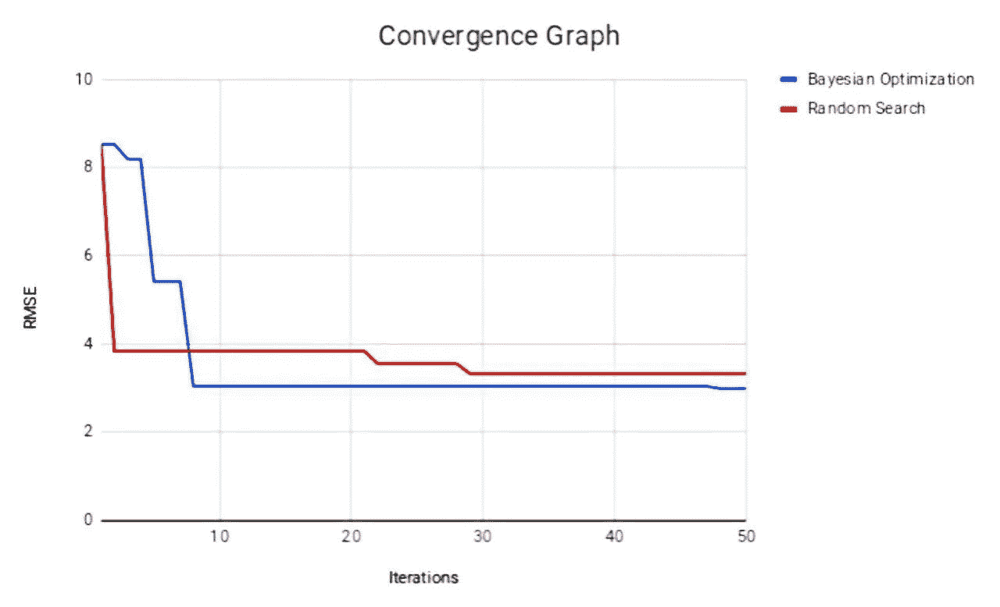

# 如何自动化超参数优化

> 原文：<https://towardsdatascience.com/how-to-automate-hyperparameter-optimization-73950c9fdb5?source=collection_archive---------16----------------------->

## 将贝叶斯优化与 Scikit-Optimize 结合使用的初学者指南


Photo by [Crew](https://unsplash.com/@crew?utm_source=medium&utm_medium=referral) on [Unsplash](https://unsplash.com?utm_source=medium&utm_medium=referral)

在机器学习和深度学习范例中，模型“参数”和“超参数”是两个经常使用的术语，其中“参数”定义模型内部的配置变量，其值可以从训练数据中估计出来，而“超参数”定义模型外部的配置变量，其值不能从训练数据中估计出来([)参数和超参数之间有什么区别？](https://machinelearningmastery.com/difference-between-a-parameter-and-a-hyperparameter/))。因此，超参数值需要由专业人员手动指定。

我们制作的每个机器学习和深度学习模型都有一组不同的超参数值，需要进行微调才能获得满意的结果。与机器学习模型相比，深度学习模型往往具有大量需要优化的超参数，以便获得所需的预测，这是由于其架构比典型的机器学习模型复杂。

手动重复试验不同的值组合以获得每个超参数的最佳超参数值可能是一项非常耗时且乏味的任务，需要良好的直觉、丰富的经验和对模型的深刻理解。此外，一些超参数值可能需要连续值，这将具有未定义数量的可能性，即使超参数需要离散值，可能性的数量也是巨大的，因此手动执行这项任务相当困难。说了这么多，超参数优化似乎是一项艰巨的任务，但由于网络上有几个现成的库，这项任务变得更加简单。这些库有助于轻松实现不同的超参数优化算法。一些这样的库是 [Scikit-Optimize](https://scikit-optimize.github.io/) 、 [Scikit-Learn](https://scikit-learn.org/stable/) 和[hyperpt](https://github.com/hyperopt/hyperopt)。

多年来，有几种超参数优化算法被频繁使用，它们是网格搜索、随机搜索和自动超参数优化方法。网格搜索和随机搜索都建立了超参数网格，但是在网格搜索中，每个单个值的组合都将被彻底地探索，以找到给出最佳精度值的超参数值组合，这使得该方法非常低效。另一方面，随机搜索将从网格中重复选择随机组合，直到达到指定的迭代次数，并被证明比网格搜索产生更好的结果。然而，即使它设法给出一个好的超参数组合，我们也不能确定它实际上是最好的组合。自动超参数优化使用不同的技术，如贝叶斯优化，它对最佳超参数进行引导式搜索([使用网格和随机搜索](https://www.kaggle.com/willkoehrsen/intro-to-model-tuning-grid-and-random-search)进行超参数调整)。研究表明，贝叶斯优化可以产生比随机搜索更好的超参数组合([超参数调整的贝叶斯优化](https://arimo.com/data-science/2016/bayesian-optimization-hyperparameter-tuning/))。

在本文中，我们将提供一步一步的指导，通过采用使用高斯过程的贝叶斯优化，在深度学习模型上执行超参数优化任务。我们使用由 [Scikit-Optimize (skopt)](https://scikit-optimize.github.io/) 库提供的 [gp_minimize](https://scikit-optimize.github.io/#skopt.gp_minimize) 包来执行这个任务。我们将对使用 [TensorFlow](https://www.tensorflow.org/) 开发的简单股票收盘价预测模型执行超参数优化。

# sci kit-优化(skopt)

Scikit-Optimize 是一个比其他超参数优化库相对容易使用的库，并且拥有更好的社区支持和文档。该库通过减少昂贵且嘈杂的黑盒函数，实现了几种基于顺序模型的优化方法。更多信息你可以参考 neptune.ai 的文章，他们对 skopt 的功能和用法做了全面的分析。

# 使用高斯过程的贝叶斯优化

贝叶斯优化是 skopt 提供的众多功能之一。贝叶斯优化找到一个后验分布作为参数优化过程中要优化的函数，然后使用一个采集函数(如预期改善-EI、另一个函数等)从该后验分布中采样，以找到下一组要探索的参数。由于贝叶斯优化基于考虑可用数据的更系统的方法来决定下一点，因此与诸如网格搜索和随机搜索之类的穷举参数优化技术相比，它有望更快地获得更好的配置。你可以从[这里](https://orbi.uliege.be/bitstream/2268/226433/1/PyData%202017_%20Bayesian%20optimization%20with%20Scikit-Optimize.pdf)阅读 skopt 中关于贝叶斯优化器的更多信息。

# 代码警报！

所以，理论说够了，让我们言归正传！

这个示例代码是使用 python 和 TensorFlow 完成的。此外，该超参数优化任务的目标是获得能够为我们的深度学习模型给出最低可能均方根误差(RMSE)的一组超参数值。我们希望这将是非常直截了当的任何第一次。

首先，让我们安装 Scikit-Optimize。您可以通过执行以下命令使用 pip 安装它。

```
pip install scikit-optimize
```

请注意，您将必须对现有的深度学习模型代码进行一些调整，以便使其与优化一起工作。

首先，我们来做一些必要的导入。

```
import skopt
from skopt import gp_minimize
from skopt.space import Real, Integer
from skopt.utils import use_named_args
import tensorflow as tf
import numpy as np
import pandas as pd
from math import sqrt
import atexit
from time import time, strftime, localtime
from datetime import timedelta
from sklearn.metrics import mean_squared_error
from skopt.plots import plot_convergence
```

我们现在将设置 TensorFlow 和 Numpy 种子，因为我们希望获得可重复的结果。

```
randomState = 46
np.random.seed(randomState)
tf.set_random_seed(randomState)
```

下面显示了一些我们已经声明的重要 python 全局变量。在变量中，我们还声明了希望优化的超参数(第二组变量)。

```
input_size=1
features = 2
column_min_max = [[0, 2000],[0,500000000]]
columns = ['Close', 'Volume']

num_steps = None
lstm_size = None
batch_size = None
init_learning_rate = None
learning_rate_decay = None
init_epoch = None
max_epoch = None
dropout_rate = None
```

“输入大小”描述了预测形状的一部分。“特征”描述了数据集中特征的数量,“列”列表具有两个特征的标题名称。“column_min_max”变量包含两个特征的缩放上限和下限(这是通过检查验证和训练分割获得的)。

在声明了所有这些变量之后，最后是时候为我们希望优化的每个超参数声明搜索空间了。

```
lstm_num_steps = Integer(low=2, high=14, name='lstm_num_steps')
size = Integer(low=8, high=200, name='size')
lstm_learning_rate_decay = Real(low=0.7, high=0.99, prior='uniform', name='lstm_learning_rate_decay')
lstm_max_epoch = Integer(low=20, high=200, name='lstm_max_epoch')
lstm_init_epoch = Integer(low=2, high=50, name='lstm_init_epoch')
lstm_batch_size = Integer(low=5, high=100, name='lstm_batch_size')
lstm_dropout_rate = Real(low=0.1, high=0.9, prior='uniform', name='lstm_dropout_rate')
lstm_init_learning_rate = Real(low=1e-4, high=1e-1, prior='log-uniform', name='lstm_init_learning_rate')
```

如果您仔细观察，您将能够看到我们在 log-uniform 之前声明了“lstm_init_learning_rate ”,而不仅仅是放入 uniform。这样做的目的是，如果您将 prior 设为 uniform，优化器将不得不在均匀分布中从 1e-4 (0.0001)到 1e-1 (0.1)进行搜索。但是当声明为 log-uniform 时，优化器将在-4 和-1 之间搜索，从而使这个过程更加高效。当 skopt 库为学习率分配搜索空间时，这已经被[告知](https://scikit-optimize.github.io/notebooks/hyperparameter-optimization.html)。

有几种数据类型可以用来定义搜索空间。它们是绝对的、实数的和整数的。当定义一个包含浮点值的搜索空间时，你应该选择“实数”，如果它包含整数，就选择“整数”。如果你的搜索空间涉及分类值，比如不同的激活函数，那么你应该选择“分类”类型。

我们现在将在“尺寸”列表中记下要优化的参数。这个列表稍后将被传递给‘gp _ minimize’函数。您可以看到，我们还声明了“default_parameters”。这些是我们给每个超参数的默认参数值。**记住按照您在“尺寸”列表中列出超参数的顺序输入默认值。**

```
dimensions = [lstm_num_steps, size, lstm_init_epoch, lstm_max_epoch,
lstm_learning_rate_decay, lstm_batch_size, lstm_dropout_rate, lstm_init_learning_rate]

default_parameters = [2,128,3,30,0.99,64,0.2,0.001]
```

要记住的最重要的事情是“default_parameters”列表中的超参数将是您的优化任务的起点。贝叶斯优化器将使用您在第一次迭代中声明的默认参数，根据结果，采集函数将确定下一步要探索的点。

可以说，如果您之前已经运行过该模型几次，并且找到了一组合适的超参数值，您可以将它们作为默认的超参数值，并从那里开始您的探索。这将有助于算法更快地找到最低的 RMSE 值(更少的迭代)。然而，请记住，这可能并不总是正确的。另外，请记住，在分配默认值时，要分配一个在您已定义的搜索空间内的值。

到目前为止，我们所做的是为超参数优化任务设置所有的初始工作。我们现在将重点关注我们的深度学习模型的实现。我们将不讨论模型开发过程的数据预处理，因为本文仅关注超参数优化任务。我们将在本文末尾包含完整实现的 GitHub 链接。

然而，为了给你更多的背景知识，我们将数据集分成三部分，分别用于训练、验证和测试。训练集用于训练模型，验证集用于执行超参数优化任务。如前所述，我们使用均方根误差(RMSE)来评估模型并执行优化(最小化 RMSE)。

使用验证分割评估的精度不能用于评估模型，因为在超参数优化过程中，使用验证分割最小化 RMSE 的所选超参数可能会过度拟合验证集。因此，标准程序是使用尚未在管道中的任何点使用的测试分割来测量最终模型的准确性。

下面显示的是我们深度学习模型的实现:

```
def setupRNN(inputs, model_dropout_rate):

  cell = tf.contrib.rnn.LSTMCell(lstm_size, state_is_tuple=True, activation=tf.nn.tanh,use_peepholes=True)

  val1, _ = tf.nn.dynamic_rnn(cell, inputs, dtype=tf.float32)

  val = tf.transpose(val1, [1, 0, 2])

  last = tf.gather(val, int(val.get_shape()[0]) -1, name="last_lstm_output")

  dropout = tf.layers.dropout(last, rate=model_dropout_rate, training=True,seed=46)

  weight = tf.Variable(tf.truncated_normal([lstm_size, input_size]))
  bias = tf.Variable(tf.constant(0.1, shape=[input_size]))

  prediction = tf.matmul(dropout, weight) +bias

  return prediction
```

“setupRNN”函数包含了我们的深度学习模型。尽管如此，您可能不想理解这些细节，因为贝叶斯优化将该函数视为一个黑盒，它将某些超参数作为输入，然后输出预测。因此，如果你没有兴趣理解我们在函数中有什么，你可以跳过下一段。

我们的深度学习模型包含一个 LSTM 层、一个辍学层和一个输出层。模型工作所需的必要信息需要发送给这个函数(在我们的例子中，是输入和辍学率)。然后，您可以在该函数中继续实现您的深度学习模型。在我们的例子中，我们使用 LSTM 层来识别股票数据集的时间依赖性。

然后，出于正则化目的，我们将 LSTM 的最后一个输出馈送到漏失层，并通过输出层获得预测。最后，请记住将该预测(在分类任务中，这可能是您的 logit)返回给将被传递给贝叶斯优化的函数(“setupRNN”将被该函数调用)。

如果您正在为机器学习算法执行超参数优化(使用 Scikit-Learn 等库)，您将不需要单独的函数来实现您的模型，因为模型本身已经由库给出，您将只需编写代码来训练和获得预测。因此，这段代码可以放在将返回给贝叶斯优化的函数内部。

现在，我们来到了超参数优化任务中最重要的部分，即“适应度”函数。

```
@use_named_args(dimensions=dimensions)
def fitness(lstm_num_steps, size, lstm_init_epoch, lstm_max_epoch,
            lstm_learning_rate_decay, lstm_batch_size, lstm_dropout_rate, lstm_init_learning_rate):

    global iteration, num_steps, lstm_size, init_epoch, max_epoch, learning_rate_decay, dropout_rate, init_learning_rate, batch_size

    num_steps = np.int32(lstm_num_steps)
    lstm_size = np.int32(size)
    batch_size = np.int32(lstm_batch_size)
    learning_rate_decay = np.float32(lstm_learning_rate_decay)
    init_epoch = np.int32(lstm_init_epoch)
    max_epoch = np.int32(lstm_max_epoch)
    dropout_rate = np.float32(lstm_dropout_rate)
    init_learning_rate = np.float32(lstm_init_learning_rate)

    tf.reset_default_graph()
    tf.set_random_seed(randomState)
    sess = tf.Session()

    train_X, train_y, val_X, val_y, nonescaled_val_y = pre_process()

    inputs = tf.placeholder(tf.float32, [None, num_steps, features], name="inputs")
    targets = tf.placeholder(tf.float32, [None, input_size], name="targets")
    model_learning_rate = tf.placeholder(tf.float32, None, name="learning_rate")
    model_dropout_rate = tf.placeholder_with_default(0.0, shape=())
    global_step = tf.Variable(0, trainable=False)

    prediction = setupRNN(inputs,model_dropout_rate)

    model_learning_rate = tf.train.exponential_decay(learning_rate=model_learning_rate, global_step=global_step, decay_rate=learning_rate_decay,
                                                decay_steps=init_epoch, staircase=False)

    with tf.name_scope('loss'):
        model_loss = tf.losses.mean_squared_error(targets, prediction)

    with tf.name_scope('adam_optimizer'):
        train_step = tf.train.AdamOptimizer(model_learning_rate).minimize(model_loss,global_step=global_step)

    sess.run(tf.global_variables_initializer())

    for epoch_step in range(max_epoch):

        for batch_X, batch_y in generate_batches(train_X, train_y, batch_size):
            train_data_feed = {
                inputs: batch_X,
                targets: batch_y,
                model_learning_rate: init_learning_rate,
                model_dropout_rate: dropout_rate
            }
            sess.run(train_step, train_data_feed)

    val_data_feed = {
        inputs: val_X,
    }
    vali_pred = sess.run(prediction, val_data_feed)

    vali_pred_vals = rescle(vali_pred)

    vali_pred_vals = np.array(vali_pred_vals)

    vali_pred_vals = vali_pred_vals.flatten()

    vali_pred_vals = vali_pred_vals.tolist()

    vali_nonescaled_y = nonescaled_val_y.flatten()

    vali_nonescaled_y = vali_nonescaled_y.tolist()

    val_error = sqrt(mean_squared_error(vali_nonescaled_y, vali_pred_vals))

    return val_error
```

如上所示，我们将超参数值传递给一个名为“fitness”的函数“适应度”函数将被传递到贝叶斯超参数优化过程( *gp_minimize* )。请注意，在第一次迭代中，传递给该函数的值将是您定义的默认值，从那里开始，贝叶斯优化将自行选择超参数值。然后，我们将选择的值赋给我们在开始时声明的 python 全局变量，以便我们能够在适应度函数之外使用最新选择的超参数值。

然后，我们来到优化任务中的一个相当关键的点。如果您在本文之前使用过 TensorFlow，您会知道 TensorFlow 通过为您制作的任何类型的深度学习模型创建计算图来运行。

在超参数优化过程中，在每次迭代中，我们将重置现有的图形并构建一个新的图形。这样做是为了最小化图形占用的内存，并防止图形相互堆叠。重置图表后，您必须立即设置 TensorFlow 随机种子，以获得可重复的结果。经过以上过程，我们终于可以宣告 TensorFlow 会话了。

在这之后，你可以像平常一样开始添加负责训练和验证你的深度学习模型的代码。这一部分实际上与优化过程无关，但是在这一点之后的代码将开始利用贝叶斯优化选择的超参数值。

这里要记住的要点是**返回**为验证分割获得的最终度量值(在本例中为 RMSE 值)。该值将被返回到贝叶斯优化过程，并将在决定它想要探索的下一组超参数时使用。

**注意**:如果你正在处理一个分类问题，你会想把你的精度作为一个负值(例如-96)，因为，即使精度越高，模型越好，贝叶斯函数将继续试图减少这个值，因为它被设计为找到返回给它的**最低**值的超参数值。

现在让我们把整个过程的执行点，即“主”函数写下来。在 main 函数中，我们声明了“gp_minimize”函数。然后，我们向该函数传递几个基本参数。

```
if __name__ == '__main__':

    start = time()

    search_result = gp_minimize(func=fitness,
                                dimensions=dimensions,
                                acq_func='EI', # Expected Improvement.
                                n_calls=11,
                                x0=default_parameters,
                                random_state=46)

print(search_result.x)
print(search_result.fun)
plot = plot_convergence(search_result,yscale="log")

atexit.register(endlog)
logger("Start Program")
```

“func”参数是您希望使用贝叶斯优化器最终建模的函数。“dimensions”参数是您希望优化的一组超参数,“acq_func”代表采集函数，该函数有助于决定应使用的下一组超参数值。 *gp_minimize* 支持 4 种采集功能。它们是:

*   LCB:信心下限
*   EI:预期改进
*   PI:改善的可能性
*   gp_hedge:在每次迭代中概率性地选择上述三个获取函数中的一个

以上信息摘自文件。这些都有自己的优势，但如果你是贝叶斯优化的初学者，尝试使用“EI”或“gp_hedge ”,因为“EI”是最广泛使用的采集函数，“gp_hedge”将从上述采集函数中选择一个，因此，你不必太担心。

请记住，使用不同的采集功能时，您可能需要更改其他参数，这些参数会影响您选择的采集功能。请参考[文档](https://scikit-optimize.github.io/#skopt.gp_minimize)中的参数表。

回到解释其余的参数,“n_calls”参数是您想要运行适应度函数的次数。优化任务将通过使用由“x0”定义的超参数值(默认超参数值)开始。最后，我们设置超参数优化器的随机状态，因为我们需要可重复的结果。

现在，当您运行 *gp_optimize* 函数时，事件流将是:

适应度函数将与传递给 x0 的参数一起使用。将使用指定的历元对 LSTM 进行训练，并将运行验证输入来获取其预测的 RMSE 值。然后，根据该值，贝叶斯优化器将在采集函数的帮助下决定它想要探索的下一组超参数值。

在第二次迭代中，适应度函数将使用贝叶斯优化已经导出的超参数值运行，并且相同的过程将重复，直到它已经迭代了“n_call”次。当整个过程结束时，Scikit-Optimize 对象将被赋给“search _result”变量。

我们可以使用这个对象来检索文档中提到的有用信息。

*   x[列表]:最小值的位置。
*   fun [float]:函数值最小。
*   模型:用于每次迭代的代理模型。
*   x _ iters[列表列表]:每次迭代的函数求值位置。
*   func_vals [array]:每次迭代的函数值。
*   空间[Space]:优化空间。
*   specs [dict]`:调用规范。
*   rng [RandomState instance]:最小化结束时随机状态的状态。

“search_result.x”为我们提供了最佳超参数值，使用“search_result.fun ”,我们可以获得与所获得的超参数值相对应的验证集的 RMSE 值(为验证集获得的最低 RMSE 值)。

下面显示的是我们为模型获得的最佳超参数值和验证集的最低 RMSE 值。如果您发现在使用“search_result.x”时很难确定超参数值的排列顺序，那么它与您在“dimensions”列表中指定超参数的顺序相同。

**超参数值:**

*   第六步
*   lstm_size: 171
*   lstm_init_epoch: 3
*   最大纪元:58
*   lstm _ learning _ rate _ decay:0 . 54686 . 38686868661
*   lstm_batch_size: 24
*   lstm _ dropout _ rate:0 . 20015 . 38383838661
*   lstm _ init _ learning _ rate:0 . 36867 . 38686868686

**最低的 RMSE:**2 . 54686 . 38686868661

# 收敛图

在该图中产生贝叶斯优化最低点的超参数是我们得到的超参数值的最优集合。



该图显示了贝叶斯优化和随机搜索中每次迭代(50 次迭代)记录的最低 RMSE 值的比较。我们可以看到，贝叶斯优化已经能够比随机搜索更好地收敛。然而，在开始时，我们可以看到随机搜索比贝叶斯优化器更快地找到了更好的最小值。这可能是因为随机抽样是随机搜索的本质。

我们终于到了这篇文章的结尾，所以总结一下，我们希望这篇文章通过向您展示找到最佳超参数集的更好方法，使您的深度学习模型构建任务变得更容易。不要再强调超参数优化了。编程快乐，各位极客！

# 有用的材料:

*   完整的代码可以通过这个[链接](https://github.com/suleka96/Bayesian_Hyperparameter_optimization/tree/master)找到。
*   关于贝叶斯优化的更多信息，可以参考这篇[论文](https://arxiv.org/pdf/1807.02811.pdf)。
*   有关采集功能的更多信息，请参考这篇[论文](https://www.cse.wustl.edu/~garnett/cse515t/spring_2015/files/lecture_notes/12.pdf)。

*原载于*[*https://dzone.com*](https://dzone.com/articles/how-to-automate-hyperparameter-optimization)*。*