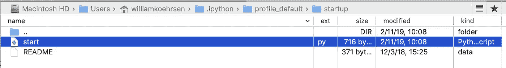
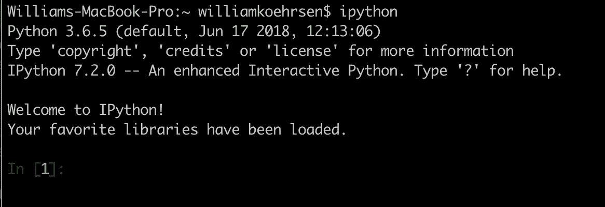

# 如何自动将您喜欢的库导入 IPython 或 Jupyter 笔记本

> 原文：<https://towardsdatascience.com/how-to-automatically-import-your-favorite-libraries-into-ipython-or-a-jupyter-notebook-9c69d89aa343?source=collection_archive---------1----------------------->


[(Source)](https://www.pexels.com/photo/ocean-water-wave-photo-1295138/)

## 不再需要每天十次输入“进口熊猫作为 pd”

如果您经常使用交互式 IPython 会话或 Jupyter 笔记本，并且厌倦了一遍又一遍地导入相同的库，请尝试以下方法:

1.  导航至`~/.ipython/profile_default`
2.  创建一个名为`startup`的文件夹(如果它还不存在的话)
3.  添加一个名为`start.py`的新 Python 文件
4.  把你喜欢的进口货放在这个文件里
5.  启动 IPython 或 Jupyter 笔记本，您喜欢的库每次都会自动加载！

以下是可视化的步骤。一、`start.py`的位置:



Full path of Python script is ~/.ipython/profile_default/startup/start.py

以下是我的`start.py`的内容:

现在，当我启动一个 IPython 会话时，我会看到:



我们可以通过检查`globals()`来确认库已经加载:

```
globals()['pd']**<module 'pandas' from '/usr/local/lib/python3.6/site-packages/pandas/__init__.py'>**globals()['np']
**<module 'numpy' from '/usr/local/lib/python3.6/site-packages/numpy/__init__.py'>**
```

我们现在都可以很好地使用我们的交互式会话，而不必键入命令来加载这些库！这也适用于 Jupyter 笔记本。

## 笔记

*   该文件可以命名为任何名称(`start.py`很容易记住)，并且在`startup/`中可以有多个文件。当 IPython 启动时，它们按照[字典顺序](https://stackoverflow.com/questions/45950646/what-is-lexicographical-order)执行。
*   如果你在 Jupyter 笔记本中运行这个，你不会得到一个带有导入的单元格，所以当你共享笔记本时，确保将`start.py`内容复制到第一个单元格中。这将让人们知道你在使用什么库。(作为替代，你可以使用我写的`default_cell` [Jupyter 笔记本扩展。](/how-to-write-a-jupyter-notebook-extension-a63f9578a38c))
*   如果您在多台计算机上工作，您将不得不重复这些步骤。确保使用相同的`start.py`脚本，以便获得相同的导入！
*   感谢这个[栈溢出回答](https://stackoverflow.com/a/11124846/5755357)和[官方文档](https://ipython.readthedocs.io/en/stable/interactive/tutorial.html#startup-files)

这当然不会[改变生活(不像写数据科学)](/what-i-learned-from-writing-a-data-science-article-every-week-for-a-year-201c0357e0ce)，但每次你启动 IPython 时，它都会为你节省几秒钟。这也是一个有用的演示，展示了如何定制您的工作环境，以尽可能提高效率。你可以通过阅读文档(比如关于 [IPython magic commands](https://ipython.readthedocs.io/en/stable/interactive/magics.html) )找到许多其他的技巧，自己尝试，甚至关注有用的 Twitter 账户。如果你发现自己对一天打十次键盘这样的低效率感到沮丧，不要只是接受，要找到更好的工作方式。

一如既往，我欢迎反馈和建设性的批评。可以在推特上找到我 [@koehrsen_will](http://twitter.com/@koehrsen_will) 。