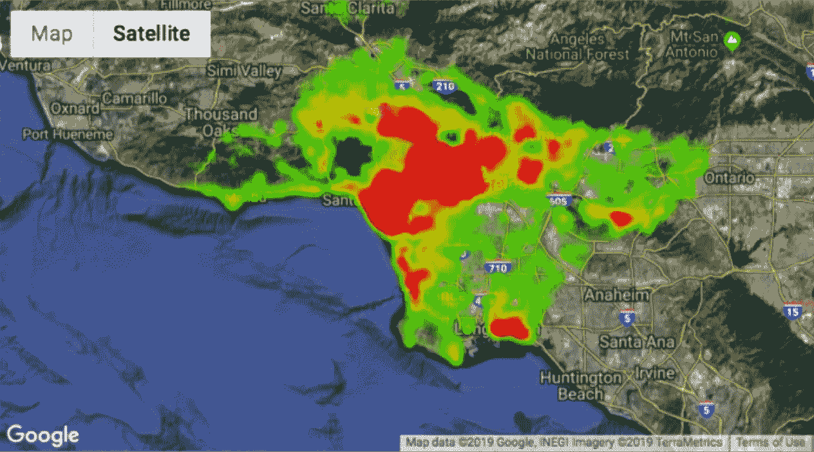
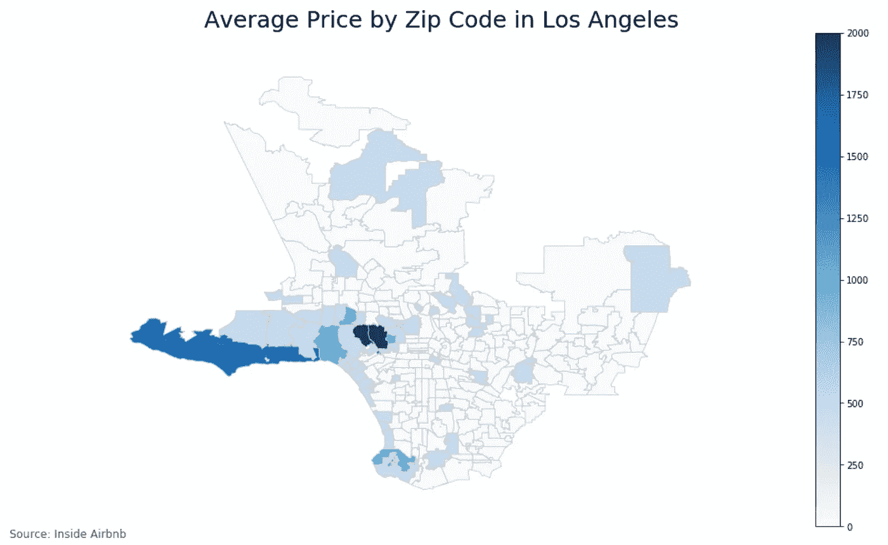
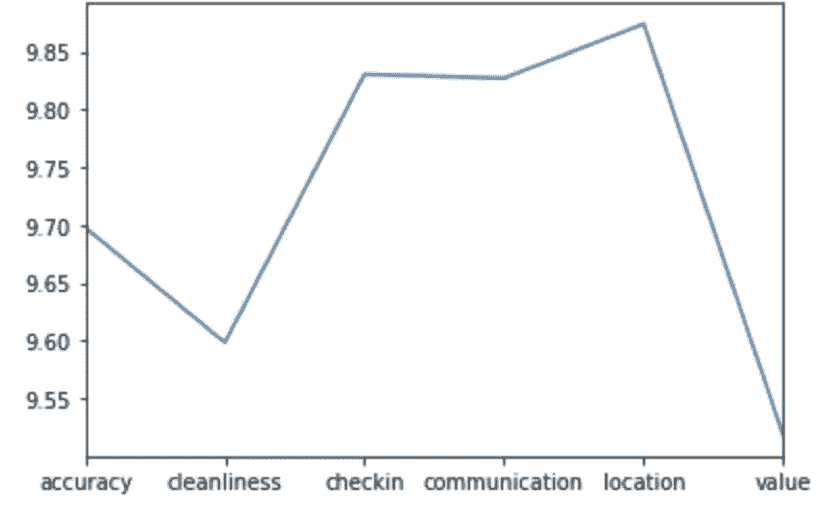
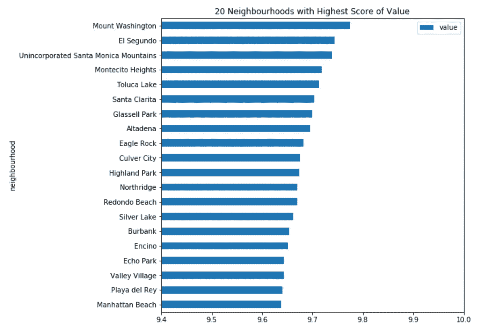
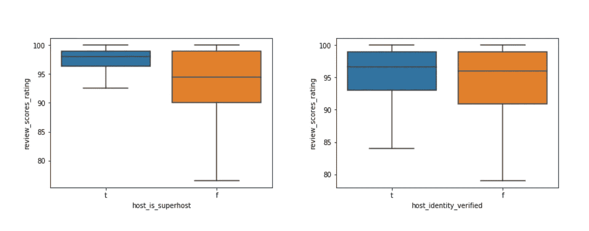
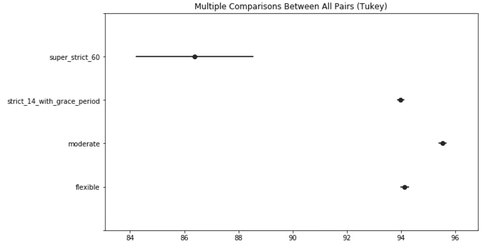
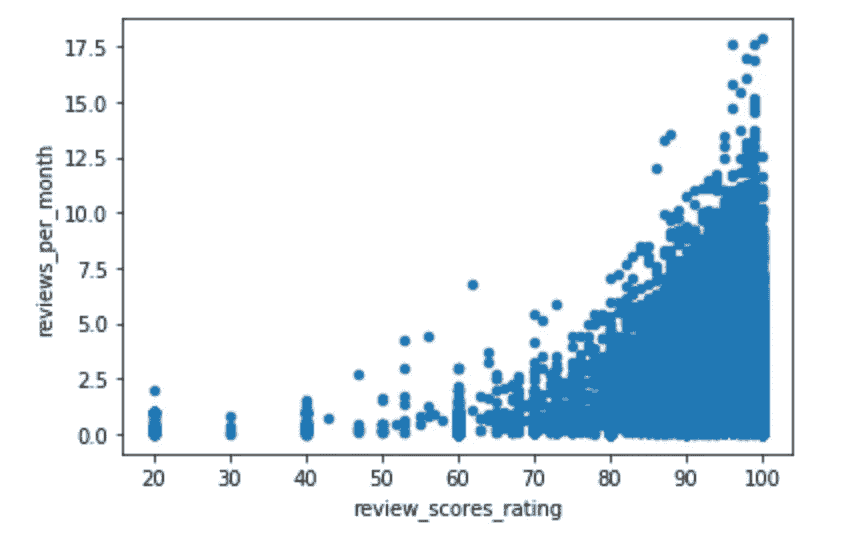

# 如何避免悲惨的 Airbnb 入住？

> 原文：<https://towardsdatascience.com/how-to-avoid-a-miserable-airbnb-stay-2563b9f20cc7?source=collection_archive---------24----------------------->

## 用 Python 对 Airbnb 在洛杉矶的数据进行探索性分析

Heat map of Airbnb listings in Los Angeles

我相信不少人对 Airbnb 既爱又恨，一些美好的回忆因 Airbnb 的出色房源而高兴，也夹杂着其他令人失望甚至恐惧的住宿体验。有没有可能选择一个“满意保证”的 Airbnb 住宿，去一个我们从未去过的地方旅行？

我将对来源于 Airbnb 内部的[的洛杉矶 Airbnb 数据集进行探索性分析，作为一个例子来演示如何在一个陌生的城市中以省时和准确的方式从数百个可用房源中筛选出一个值得信任的房源。](http://insideairbnb.com/index.html)

分析是用 Python 语言完成的。所有的源代码都可以转移到 Airbnb 内部列出的其他城市，并可以在我的 Github 上找到:【https://github.com/jystacy/Airbnb。

# 数据描述

作为世界闻名的旅游目的地，大量寻求物有所值的游客促进了 2008 年以来洛杉矶 Airbnb 的发展。截至 2018 年 12 月，天使之城的 25487 个主机拥有 43026 个房源。从文章开头展示的热图来看，Airbnb 房源集中分布在一系列旅游景点，从洛杉矶市区、好莱坞、西好莱坞、圣莫尼卡海滩一直延伸到这里。马里布和长滩也有很多上市选择。

我选择了上市获得第一次审查的年份作为上市年份的指标，发现 2015 年后的年增长率稳定在 40%至 60%之间。与此同时，在连续 8 年增长后，新主机从 2016 年开始出现负增长。2018 年，只有 2721 名新主机首次房源加入 Airbnb，数量仅为 2015 年增长高峰时的 58%。新房源和主机的反向增长趋势表明，近三年来，Airbnb 主机中有多个房源的数量有所增加。

# 住在哪里？

在选择住宿地点时，安全总是一个重要的考虑因素。该网站([www.bestplaces.net](http://www.bestplaces.net/))提供犯罪数据，按邮政编码从 1(低犯罪率)到 100(高犯罪率)排列，其粒度比联邦调查局(仅按县)提供的犯罪数据更细。我用 Python 编写了代码来自动收集暴力犯罪数据，并在此基础上创建了一个洛杉矶邮政编码犯罪 choropleth。

对比热图可以看到，最热门的上市区域都避开了洛杉矶最危险的区域。但游客最好不要去市中心以南，并小心市中心、圣莫尼卡海滩和长滩等热点周围的财产和暴力犯罪。有趣的是，这个位于洛杉矶市中心以南、北邻圣莫尼卡高速公路(I-10)的地区几乎没有 Airbnb 房源。这个历史上被称为“中南部”的地区，长期以来一直遭受着集中贫困和高犯罪率的困扰。

P **米**是另一个重要的度量标准。在洛杉矶 Airbnb 住宿平均花费 **198.74** 美元，另一家每晚 83.30 美元的清洁费。不同地区的挂牌价格差别很大。位于海岸和贝弗利山附近的房屋的短期租金价格推高了洛杉矶的平均水平。

Malibu 和 Bel Air 的房源平均价格最高，超过 1000 美元。评分分布表明，这些地区的房源在地理位置、入住服务和主客沟通方面得到了很高的评分，而在价值和清洁度方面的评分相对较低。在洛杉矶，有 13 个房源的价格高于每晚 10，000 美元，其中有 11 个房源属于同一个主机。

Rating distribution of the listings in the zip code areas whose average price per night is higher than $1,000

irbnb 使游客能够通过对清洁度、准确性、登记流程、与主人的沟通、位置和价值进行评级并留下评论来评估列表和他们的体验。其中“价值”是指付出的成本和获得的收益之间的回报(Curhan，Elfenbein，& Eisenkraft，2010)。我检查了所有拥有超过 100 个 Airbnb 房源的社区，发现以下 20 个社区的房源获得了最高的**值**分。

# 要选择哪个列表？

> **什么样的主机可以信任？**

在共享经济平台上，陌生人之间的一种新的信任被命名为“分布式信任”(Botsman，2017)，这种信任通过代表产品或服务分数、评级或评论的评估机制(Pettersen，2017)得到了脆弱的培育。

主机的可信度部分基于这样一个事实:Airbnb 使用各种方法来验证主机的身份。在这一部分，我想验证这些认证的有效性。

“Ssuper host”是一项每季度审核一次的计划，旨在奖励平均综合评分达到 4.8 分或更高、在过去一年中至少接待过 10 次住宿、在 24 小时内保持 90%的回复率且一年内没有取消预订的主人。Airbnb 通过在他们的个人资料和列表中添加徽章来突出显示这些合格的主机，并为列表搜索优先考虑他们的可见性。t 检验的结果证实了“Superhost”拥有的列表的平均评分显著高于其他列表。

Boxplot of listings’ rating scores between different host groups

为了加强平台上的分布式信任，Airbnb 还鼓励主机上传他们的个人资料照片，并完成个人资料验证。t 检验的结果也验证了主机验证的有效性，而有和没有个人资料图片的主机之间的列表评分没有显著差异。

W 主机取消政策怎么样？Airbnb 为房东提供五种取消选择——灵活、适度、有宽限期的严格、30 天超级严格和 60 天超级严格。前三种政策分别对应于在入住时间前 24 小时、5 天和 14 天取消住宿的全额退款，而后两种政策仅提供 30 天和 60 天取消的 50%退款。

Listing rating score comparison among host groups with different cancellation policies

我的许多朋友倾向于避开有严格取消政策的主人。然而，这并不能保证。正如所料，选择超级严格取消政策的主机的评级分数明显低于其他主机，而选择 14 天严格取消政策的主机仍然是可靠的。相比之下，在 Airbnb 的所有主机中，取消政策适中的主机评分最高。

基于主机分析，理想主机的画像包括完整的配置文件验证、“超级主机”认证和相对灵活的注销策略。

取消保单部分的 **ANOVA** 分析和**事后分析** ( [Tukey HSD](https://en.wikipedia.org/wiki/Tukey%27s_range_test) )的代码也可以在[这里查看](https://github.com/jystacy/Airbnb/blob/master/Host%20analysis.ipynb)。由于“严格”类别已完全被“有宽限期的严格”取代，并且数据集中只有 63 个具有“超级严格 30 天”取消政策的列表，我从 Tukey 的 HSD(诚实地说，显著差异)测试中删除了这两个类别。

> **评分和评论说明了什么？**

Scatter plot displaying the relationship between rating score and the number of reviews of listings

建议厌恶风险的客人选择有大量评论的列表。所有每月收到超过 7.5 条评论的列表项在 100 分中被评为不低于 80 分，而所有被评为低于 60 分的列表项每月收到不超过 5 条评论。把评论少的房源排除在外太武断了，尤其是这些新上市的房源。然而，选择具有大量评论的列表将减少遇到不满意停留的概率。

在缩小到点评量可观的优质房源后，如何从甚至多达 700 条的点评中形成房源一目了然的印象？这种印象应该包括对最流行的话题的了解，但也包括对那些不经常出现的话题的了解。通过这种印象传达的信息量应该足以决定是否列名。

Word clouds for three random selected listings

传统的方法——基于单词在列表评论中出现的频率的单词云——对于这项任务有一些明显的问题。如果我们比较以上从三个包含 100 多条评论的列表生成的词云，词云提取的信息提供了高度的同质性，并提出了可读性的问题。

I nstead，**基于语义相似度对评论进行聚类，并从每个聚类中提取典型句子，满足了客人对支持快速决策的有效评论摘要的需求。在去除了非英语评论(来自 langdetect 库)和句子标记化(来自 NLTK 库)之后，在句子嵌入方面，我使用了 [Skip-Thought model](https://arxiv.org/pdf/1506.06726.pdf) ，该模型考虑了句子中单词的顺序而不仅仅是词频，从而语义相似的句子的嵌入在向量空间中彼此更接近，因此适合于聚类。然后我把高维向量空间中的这些嵌入聚类成预定义数量的聚类。聚类的数量等于总结中句子的数量，在这种情况下，我选择它作为评论中句子总数的第五个根。**

从以上列表中获得的示例摘要如下:

Review summary based on Skip-thought clustering involves more amount of information than word cloud. Those who are dog-lovers may select Sherren’s listing. Tom’s listing seems more suitable for tourists. For John’s one, guests need to trade off between the unbeatable location and small size.

最后但并非最不重要的一步是记住，由于在线评论的积极性偏差，签到时的失望或多或少是不可避免的。积极的评论占据了 Airbnb 的评论区，即使考虑到 Airbnb 的双盲或“同步揭示”评论系统。我用情感函数(来自 textblob 库)对每个嘉宾留下的评论进行了**情感分析**。该函数返回范围为[-1，1]的极性得分，其中 1 表示肯定陈述，-1 表示否定陈述，0 表示中性陈述。大多数评论(98%)绝对不是负面的，尽管结果是基于这样一个事实，即带有一两个投诉的评论与其他正面评论一起出现，仍被职能部门归类为“正面”。

随着共享经济的发展和 Airbnb 的兴起，一批研究者和商业记者(如 Ho，2015；弗拉德金、格雷瓦尔、霍尔茨和皮尔森，2015 年；Yannopoulou 等人，2013 年；泽卡诺维奇-科罗纳&格尔祖诺夫，2014；Zervas 等人，2015)已经注意到 Airbnb 评分的这种异常积极的倾斜。可能的原因包括礼貌和礼貌的社会文化因素，以及恐惧或报复，以及担心自己的网络身份与负面评论相关联(Bridges，j .，& Vásquez，c .，2018)。

希望我们在 Airbnb 陪伴下的下一次旅行会很愉快！

本节中文本挖掘包括文本清洗、词云、聚类摘要的所有代码均可参考:[https://github . com/jystacy/Airbnb/blob/master/Review % 20 analysis . ipynb](https://github.com/jystacy/Airbnb/blob/master/Review%20analysis.ipynb)