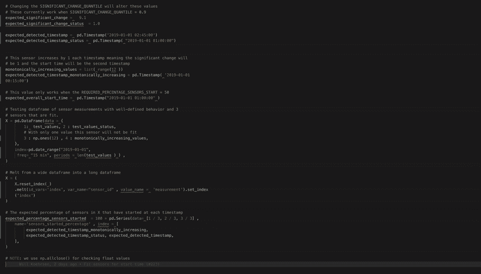
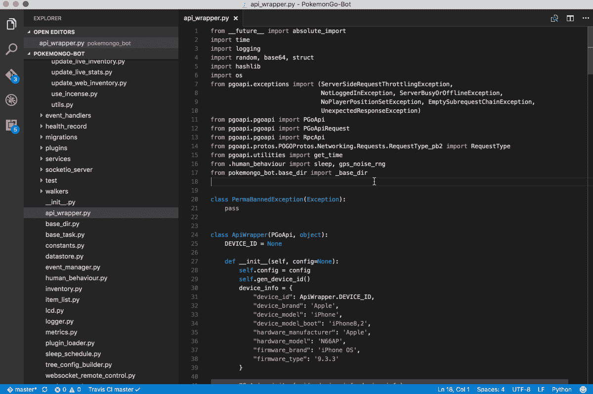

# 如何避免数据科学编程环境中的常见困难

> 原文：<https://towardsdatascience.com/how-to-avoid-common-difficulties-in-your-data-science-programming-environment-1b78af2977df?source=collection_archive---------12----------------------->

[(Source)](https://www.pexels.com/photo/photo-of-lake-during-daytime-2301172/)

## 减少编程环境中的附带问题，这样您就可以专注于重要的数据科学问题。

考虑以下情况:你正试图练习你的[足球](https://en.wikipedia.org/wiki/2019_FIFA_Women%27s_World_Cup)技能，但是每次你走上球场，你都会遇到一些问题:你的鞋子穿错了脚，鞋带没有系好，你的袜子太短，你的短裤太长，以及球的大小不对。这是一个荒谬的情况，但它类似于许多数据科学家由于一些常见的、容易解决的问题而发现自己的处境:

*   **无法管理库依赖关系**
*   **代码风格不一致**
*   **不一致的命名约定**
*   **团队中不同的开发环境**
*   **不使用集成开发环境进行代码编辑**

所有这些错误都会“绊倒”你，耗费你的时间和宝贵的精神资源去担心小细节。您没有解决数据科学问题，而是发现自己在设置环境或运行代码时遇到了一些附带的困难。幸运的是，使用正确的工具和方法，上述问题很容易解决。在本文中，我们将探讨数据科学编程环境的最佳实践，这将让您有更多的时间和精力来解决重要的问题。

# 1.无法管理库(依赖项)

最令人沮丧的事情莫过于，某一天编写的代码运行良好，但第二天却发现它有许多错误，而你却没有改变一个字符。几乎每次我遇到这个问题，都只有一个原因:*无法跟踪你在代码中使用的库的版本*。这个问题如此普遍，如此令人沮丧，以至于它的名字叫做[依赖地狱](https://en.wikipedia.org/wiki/Dependency_hell)。

为了克服这一点，你必须记住库有[版本](https://the-hitchhikers-guide-to-packaging.readthedocs.io/en/latest/specification.html#versioning-specification):当你说你使用`pandas`，那是不正确的；你实际上用的是`pandas==0.24.0`或者`pandas==0.19.2`等等。您在项目中导入的每个库都将是特定于[的版本](https://github.com/pandas-dev/pandas/releases)，记录您项目的版本对于避免可怕的代码崩溃是至关重要的。围绕着[创建一个隔离环境的想法](https://realpython.com/python-virtual-environments-a-primer/)，有许多解决这个问题的选择:Python 的托管安装，它有自己的独立于系统 Python 的包。

1.  [Python 内置的](https://docs.python.org/3/library/venv.html) `[venv](https://docs.python.org/3/library/venv.html)`:这个是 Python 自带的但是有点难用。
2.  `[conda](https://docs.conda.io/projects/conda/en/latest/user-guide/tasks/manage-environments.html)` [虚拟环境](https://docs.conda.io/projects/conda/en/latest/user-guide/tasks/manage-environments.html):使用 conda 包管理器创建和维护虚拟环境。这是我向虚拟环境新手推荐的方法。
3.  `[pipenv](https://docs.pipenv.org/)`(第三方):也用版本控制的`Pipfile`创建和管理虚拟环境。我发现这个很容易使用。
4.  `[docker](https://www.docker.com/resources/what-container)` [容器](https://www.docker.com/resources/what-container):容器超越了虚拟环境，包含了运行应用程序所需的所有软件和代码(尽管它并不完全是[虚拟机](https://devopsconference.de/blog/docker/docker-vs-virtual-machine-where-are-the-differences/))。Docker 在数据科学中越来越常见，因为你可以将数据、代码和所有需要的库打包在一起，所以学习如何设置和运行 docker 容器[是值得的。](https://docs.docker.com/get-started/)

( [Real Python 在所有这些工具上都有很棒的教程](https://realpython.com/search?q=dependency))。

`pip freeze > requirements.txt`还不够好:您需要使用虚拟环境(可以从`requirements.txt`创建)来确保库与预期版本相匹配。虚拟 env 也有一个指定的 Python 版本，消除了不同 Python 安装的问题。

你选择的方法取决于你的团队的需求和你想要投入多少时间。例如，我在个人工作中使用 conda 环境，在工作中使用`pipenv`。我不打算做推荐，除了说:挑一个用吧！在不知道您调用的每个库的版本的情况下，您永远不应该从事数据科学。

# 不一致的代码风格

如果您必须选择在脚本的每一行使用多少空格，您就没有时间考虑实际的代码了！大部分人的格式化倾向没那么差，但也接近了。你永远不必对[代码格式](http://c2.com/ppr/formatting.html)做出有意识的决定:比如关键字参数周围的空格、行的长度、函数之间的空行、列表中最后一项后面的尾随逗号等等；仅处理代码外观的因素。

与其在每一条线上做选择，不如做一个全球性的决定——为你的项目采用一种风格——并且永远不要再担心它。在工作中，我的团队使用了`[black](https://black.readthedocs.io/en/stable/)` [自动套用格式工具](https://black.readthedocs.io/en/stable/)，该工具在我们整个项目中应用了一种标准的代码风格，只是修复了错误——无需去想它。每次在 vscode 中保存 Python 文件时，我都将其设置为自动运行。`black`工作非常好，也非常容易使用，所以我也把它用于我所有的个人工作。

Python 和其他语言还有其他[自动格式化](https://github.com/hhatto/autopep8)或[林挺选项](https://pypi.org/project/pyflakes/)。我建议采用一套代码风格标准，并使用一个工具来检查所有文件的使用情况。在代码格式化上花费比要求更多的精力，这是对你宝贵时间的一种浪费。

No more code format errors thanks to black autoformatting!

# 不一致的命名约定

在另一个“一次做出全局决定，而不是多次做出局部决定”的应用中，您应该为一个项目建立[命名约定](https://visualgit.readthedocs.io/en/latest/pages/naming_convention.html)。这些应该包括变量、函数、类、文件、测试和目录。命名约定还应包括单位(如`kph`)和聚合(`min`、`max`)的标准化缩写。我在这里写了关于命名变量。

选择精确的约定并不重要，重要的是一致地使用它们。在整个团队(可能只有你自己)中就标准达成一致，把它们写在一个共同的地方，然后毫无偏差地遵循它们。在代码审查中，(另一个至关重要的最佳实践)执行标准，这样每个人都在同一页上。这个小技巧再次告诉我们，必须减少你做出的有意识的决定的数量。当您为函数、变量等编写名称时，应该有一个基于代码和约定的显而易见的选择。

如果你正在挣扎，采用另一个项目使用的标准惯例。不要固执己见，拒绝改变，因为你总是以一种方式做事。在编程中，没有一成不变的个人信念。制定惯例，写下来，应用它们，停止把时间花在数据科学的偶发问题上。

# 团队中不同的开发环境

团队中的每个人都应该使用相同的开发环境，没有例外。作为一个终生(22 年)的 Windows 用户，我完全没有想过抗议在我目前的职位上使用 MacOS 进行开发([Cortex Building Intelligence](https://cortexintel.com))。根本没有选择的余地:其他人都使用 Mac，所以我不得不在整个团队中使用它来实现标准化。我不打算提倡一个系统优于另一个系统([这里是最常用的](https://insights.stackoverflow.com/survey/2019#technology-_-platforms)系统的数字)，但我会大声疾呼同一团队中的每个人使用相同的操作系统。

[“它在我的机器上有效”](https://hackernoon.com/it-works-on-my-machine-f7a1e3d90c63)是任何数据科学家都不想听到的一句话。即使在使用相同的库时，我也发现了这个问题，因为操作系统不同。当我知道我在我的机器上写的分析可以在其他人的机器上工作时，我们的团队可以更有效率(感谢操作系统和依赖管理)。此外，当我们团队中的任何人需要安装新软件时，我们都可以使用完全相同的命令来完成。对于不得不采用新操作系统的人来说，这并不好玩，但为了团队的利益，这是必要的。

Use the same operating system: no excuses

# 在笔记本而不是集成开发环境中编写太多代码

纠正这种做法可能是我从研究数据科学背景到行业的最大变化:程序和个人脚本应该在集成开发环境中编写，而不是在 Jupyter 笔记本上。笔记本非常适合探索、学习、绘图和有文化的编程，但是你不应该养成依赖它来编写所有代码的不健康习惯。

Jupyter 笔记本是一个用许多脚本编写实际程序的可怕地方，因为缺少[工具](https://www.veracode.com/security/integrated-development-environment):没有林挺，没有跨项目的自动格式化代码，糟糕的文件浏览，没有项目范围的查找和替换，没有内置的测试框架，糟糕的调试，没有集成的终端，等等。不，Jupyter 实验室没有解决这些问题；它仍然不是一个你可以或者应该开发脚本的地方。

打破笔记本电脑是令人生畏的，因为它需要你一次在你的大脑中容纳更多的信息。您需要从由许多函数和类组成的整个脚本的角度来考虑代码，而不是代码块。此外，笔记本呈现了从上到下执行的线性代码路径，而真正的程序有许多互锁的部分形成一个循环。一个脚本可能从你的模块中的 10 个其他脚本中导入，这些脚本在一个复杂的结构中相互作用。

我不想进入编码最佳实践，但是您的开发环境对您如何思考和编写代码有着巨大的影响。一个合适的集成开发环境会让你把数据科学代码看作一个软件产品，而不是孤立的笔记本:一个有许多联锁部分和复杂交互的软件产品。

IDE 有许多很好的选择。我建议尝试几个来找到您需要的合适的复杂性和特性数量。

*   [Sublime Text](https://www.sublimetext.com/) 开始是轻量级的，但是有很多插件
*   [Atom](https://atom.io/) 是另一个很好的基本 IDE，提供了更多的功能包
*   [Rodeo](https://rodeo.yhat.com/) 试图为 Python 创造一种 RStudio 的感觉
*   PyCharm 是一个全功能的环境，拥有比你需要的更多的功能，还需要一点学习过程

我个人使用的 [Visual Studio 代码](https://code.visualstudio.com/)，已经成为软件工程师最喜欢的[编辑器](https://insights.stackoverflow.com/survey/2019#development-environments-and-tools)。vscode 通过扩展(包括内置浏览器和 git 集成)给了我上面提到的所有东西，甚至更多。我大约 90%的编码时间都花在 Visual Studio 代码上，我已经像喜欢 Jupyter 笔记本一样喜欢它了。

Jupyter 笔记本没有什么本质上的错误，它们只是从来就不是用来开发严肃程序的。当正确使用时(实现文化编程的概念),它们是一个很好的工具。但是，和任何工具一样，笔记本可以用在不合适的地方。当您想要开始编写生产代码时，您将不得不切换到集成开发环境。即使您还没有做到这一点，我也建议您熟悉编写脚本而不是笔记本的想法，并将许多脚本组合成一个库(您可以将其导入笔记本进行分析)。不使用 IDE 来开发程序是一个严重的障碍:对工作的自己好一点，开始使用全功能的编程环境。

A little intimidating at first, but much more productive. Remember, your environment affects how you think.

# 结论

在他的优秀论文[“没有银弹”](https://en.wikipedia.org/wiki/No_Silver_Bullet)中，大卫·布鲁克斯讨论了软件工程中偶然与本质问题的观点。过去 40 年来，软件工程生产率的提高是通过减少偶然问题实现的——那些与将想法转化为代码相关的问题——而基本困难——构思想法——仍然存在。在数据科学领域，我仍然看到许多人在偶然的困难中挣扎，甚至在开始编码之前就被自己绊倒，因为他们没有一个好的环境或者没有坚持简单的[实践](https://www.cs.utexas.edu/~mitra/csSummer2014/cs312/lectures/bestPractices.html)。

作为一个领域，我认为我们可以做得更好。让我们花更少的时间在数据科学的意外困难上——管理依赖关系、代码格式、命名、操作系统和代码编辑器——花更多的时间在基本困难上——开发算法、建立模型、工程特性和部署训练有素的模型(以及用机器学习[应对气候变化](https://arxiv.org/abs/1906.05433))。通过采用本文中概述的实践，您将有更多的时间和精神资源来解决真正重要的问题。

一如既往，我欢迎反馈和建设性的批评。可以在 Twitter [@koehrsen_will](http://twitter.com/@koehrsen_will) 上找到我。