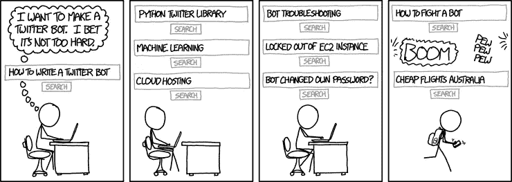
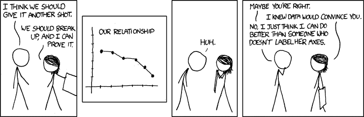

# 如何避免数据科学领域的菜鸟错误？

> 原文：<https://towardsdatascience.com/how-to-avoid-rookie-mistakes-in-the-field-of-data-science-3076017cdab1?source=collection_archive---------18----------------------->

## 数据科学初学者的注意事项指南

我最近开始了通过自学成为数据科学家的旅程。这条路并不总是一帆风顺的，因为没有人给我详细的连续教学大纲。因此，我尝试了一些事情，不太成功，但后来从那里拿起。如果你是一个有抱负的数据科学家，这篇文章可能会帮助你避免犯我犯过的错误。

首先，不要试图记忆或学习机器学习算法。大脑只保留其中的一部分，并丢弃其余部分。吸收它们的最好方法是通过实践。没有捷径！

我犯了一个错误，那就是在 Udemy 上浏览“机器学习 A-Z:数据科学中的 Python 和 R 的实践”课程。我的大脑吸收了课程的前半部分，但最终作为初学者，通读其余部分变得乏味。我确实得到了大多数算法的直觉，但现在回想起来，我觉得我本可以取消这门特殊的课程。

其次，编程是掌握数据科学的一个至关重要的部分。我们不能忽视这个阶段。精通一门编程语言是必须的，尤其是 Python。它是最被接受的语言，因为它有广泛的库，这有助于数据科学家部署随时可用的工具。而且大部分的课程和比赛都需要我们用 Python 编码。因此,“Pythonic 式”思维对数据科学职业生涯至关重要！

我借助了两个资源——一开始是 [Codecademy](https://www.codecademy.com/) ，后来是 [Datacamp](https://www.datacamp.com/) 。我很快就退出了 Codecademy，因为它是从非常基础的水平开始的——可能是为那些不是来自技术领域的人准备的。我在 Datacamp 上购买了一年的订阅，发现从数据科学的角度来看，这是学习 Python 的一个很好的资源。有些课程是为你最终要使用的库准备的——numpy，scipy 等等。有关于数据分析和可视化的项目。同样，人们应该记住没有必要记住语法。熟悉这种语言的功能和包是很重要的，确切的语法总是可以通过谷歌搜索到的。[堆栈溢出](https://stackoverflow.com/)是寻找查询答案以及回答他人问题的绝佳资源。

第三，在没有分析数据集的情况下，人们甚至不应该考虑机器学习算法。机器学习部分只有 2-3 行代码。其余的代码致力于详细的数据分析和可视化。如果不知道数据中的模式，就不可能确定哪些输入对您的输出很重要，消除数据中的噪声并最终转换数据以供模型使用。 [Kaggle](https://www.kaggle.com/) 是一个很好的资源，可以让你开始进行简单的机器学习练习([泰坦尼克号](https://www.kaggle.com/c/titanic) & [房价预测](https://www.kaggle.com/c/house-prices-advanced-regression-techniques))并尝试数据清理和转换。

我将在下一篇文章中涉及更多关于数据工程的内容。在此之前，请保持数据科学家的活力，并寻求任何问题或反馈！