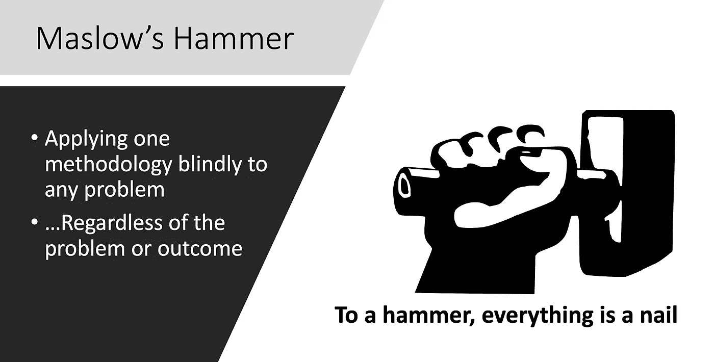
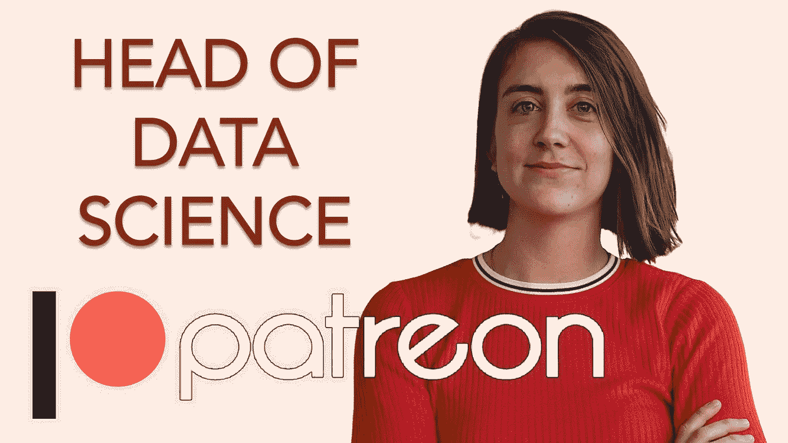

# 如何避免每个数据科学家都会犯的最严重的错误——使用以下两个关键步骤

> 原文：<https://towardsdatascience.com/how-to-avoid-the-worst-mistake-every-data-scientist-can-make-using-these-2-crucial-steps-a25a90b0995?source=collection_archive---------3----------------------->

## [独家 TDS 采访](https://towardsdatascience.com/tagged/tds-interview)

## Patreon 的首席数据科学家分享了职业成功的宝贵技巧和资源以及解决数据方面实际挑战的策略。

Please subscribe to our official [YouTube channel](https://www.youtube.com/channel/UCuHZ1UYfHRqk3-5N5oc97Kw?view_as=subscriber)!

**面试官:**[TowardsDataScience.com 项目负责人 Haebichan Jung](https://medium.com/@haebichan) 。

**受访者:** [Maura Church](https://www.linkedin.com/in/maura-church-8a52a379) ，Patreon 的数据科学主管。曾在谷歌工作，获得应用数学学士学位(哈佛大学)。

> Patreon.com 是一个平台，让创作者很容易通过会员模式直接从粉丝那里获得报酬。你可以上 Patreon，每月支付给最喜欢的创作者一定的费用，以获得独家利益，偷窥等。有了足够的赞助，创意者就可以在 Patreon 上谋生，而不是通过广告或品牌。

你能告诉我们你的专业背景吗？

在 Patreon 之前，我在谷歌的一个数据分析团队从事数据工作。我一直在研究垃圾邮件和滥用，具体来说，就是应用数据来减少谷歌通信产品中的垃圾邮件、滥用和欺诈。在那之前，我在哈佛大学学习应用数学和音乐，特别是技术、艺术和计算机科学的交叉是我的兴趣所在。大约 4 年前，我作为第二名数据科学家加入了 Patreon，从那以后我就一直在这家公司工作。

**刚开始在 Patreon 工作时，你的日常职责是什么？这些年来，您的数据角色发生了怎样的变化？**

当我第一次开始时，Patreon 的主要数据结构是将我们所有的关键指标写入一个 Google sheet，该表通过 Google Sheet 的 API 每天更新，这在当时是有效的。这就是我进入的环境，我们没有任何数据基础设施设置，我们开始学习基础数据问题，我们想问的是像 Patreon 这样的创作者、顾客和企业是如何成长的。

我们第一年花了很多时间做 1)数据工程工作，例如设置我们的第一个 ETL，2)完成从 MySQL 到 redshift 的大迁移，3)定义我们的核心指标和我们想要测量的内容，以及 4)构建我们的第一个关键仪表板。

现在我的一天看起来很不一样。我现在管理着 5 名数据科学家。我对战略有更大的影响力(我们的数据应该帮助我们告诉我们去哪里)，我非常关注产品分析(产品表现如何？如何做好实验？).

**pat reon 的所有数据科学家都研究与产品相关的问题吗？如果不是，你能告诉我数据团队是如何构成的吗？**

我们是一个核心数据科学团队(我们是一个非常集中的团队)。我们在业务中支持 4 个主要功能:

1.  产品分析:衡量产品的性能。
2.  业务分析:与走向市场业务团队(销售、营销、创造者成功、财务、法律等)相关的所有数据和指标。).
3.  核心研究:关于创造者和赞助者的基础性、深层次的问题，这些问题将推动整个行业的发展。
4.  商业智能/数据教育/数据可访问性:对新员工的入职数据进行改进，为公司提供使数据更易访问和解释的资源。

我们每季度 70%的工作都是在产品分析方面。一些人更倾向于 B.A .方面，一些数据教育，这取决于个人和季度以及我们那个月要做的事情。

你能详细说明一下你的主要任务吗:让“Patreon 的创造者、顾客和队友拥有做出卓越决策所需的数据”？

我认为，一方面是基础数据基础设施，另一方面是为我们的数据科学团队的创意经济提供动力的数据产品。今天，我们已经完成了通往另一端的旅程的 60-70%。我的希望是，在未来，我们正在构建嵌入 Patreon.com 的数据产品、API 或模型，使顾客和创造者能够做出更好的决策。

例如，我们可以帮助创作者了解顾客及其会员的流失特征[流失模型和分析]。这有助于创作者采取更好的行动来留住这些会员，并增加他们在 Patreon 的会员人数。或者，我们可以告诉用户他们还没有看到的最受欢迎的帖子或好处，通过数据科学团队建立的东西[内容推荐引擎]。

现在我们只有一个模型在生产，欺诈模型，它主要是帮助 Patreon 不收取欺诈性的承诺。我的希望是，从长远来看，我们正在建立更多的数据产品，为网站提供动力。

**你希望 Patreon 的未来数据科学家具备什么样的特质、品质或背景？**

对我来说，真正重要的事情很少，尤其是因为 Patreon 是一家初创公司，在初创公司担任数据科学家与在拥有一百名数据科学家的更大公司担任数据科学家是不同的。几件关键的事情:

1.  技术障碍:我们每天都在 SQL 中工作，特别是在 Postgres 中，并希望候选人了解 Python/某种统计语言的某种流利程度。此外，有人谁是真正舒适的查询非常大的数据集。
2.  沟通:在我们的角色中，我们每天都要花很多时间来获得深刻的见解或建立模型，并将结果传达给利益相关者，无论是产品经理、营销人员还是财务人员。数据科学考生具备良好的沟通能力是超级关键的。
3.  勇气、韧性和解决难题的意愿:Patreon 是新市场的新产品。我们试图学习的东西和我们试图解决的问题通常都是难题。我希望任何加入数据科学团队的人都对困难的问题和艰难的挑战感到兴奋。
4.  对艺术的热情和对使命的热情:这不是最重要的，但却是最重要的。

**反过来，你不寻找的特质是什么？换句话说，你在数据科学申请者中见过哪些常见的陷阱？**

我经常看到的一个常见陷阱与*马斯洛的锤子*的想法有关。这个观点认为，对于拿着锤子的人来说，任何东西看起来都像钉子。在数据科学中，这是一种愿望，即不管实际问题如何，将候选人可能感到非常舒服的方法应用于任何问题。

例如:候选人可能会进入 Tensorflow 并学习 Keras 和深度学习，对于他们遇到的任何问题，他们会说“哦，让我使用 Tensorflow！让我将深度学习应用于此”。这是一个需要避免的非常重要的陷阱。你将要面对的一些问题可能需要一个简单的 excel 电子表格。或者实际上解决问题的方法是让人们聚在一起讨论。因此，不考虑解决问题的正确方法是非常重要的陷阱。

[https://www.youtube.com/watch?v=Cw0iK9OoETs](https://www.youtube.com/watch?v=Cw0iK9OoETs)

**所以那将是从他们试图解决的问题中抽离出来，并问“为什么”他们正在使用的技术和模型？**

没错。询问我们为什么试图解决这个问题，我们将为企业增加什么价值总是一个很好的开始，而不是用你知道的方法。

对于那些不熟悉商业价值思维的人来说，该如何改进呢？

我推荐两种方法:

1.  有很多关于战略思维的好书。如果你谷歌一下《哈佛商业评论》关于战略思维的书籍，那会有所帮助。对于数据科学家来说，拥有战略性思考的技能，提出更长期的问题，并把事情框定为为什么要这样做，这很好。
2.  候选人思考类似产品的案例研究是非常有价值的。例如，为 Pinterest、Airbnb 或 Lyft 这些非常常见的软件产品想出 10 个功能创意。在分析一个特性之前，先回顾一下，问问自己为什么要构建这个特性。这有助于培养问为什么的能力，并以此为起点，而不是一头扎进去。

**特别关注 Patreon，该公司面临的主要数据挑战是什么？**

我们面临的一个数据挑战是，创建者以许多不同的方式经营他们的会员资格。举个例子:有些音乐家会打开一个 Patreon 页面来支持他们的粉丝。他们只是想把他们的粉丝带到他们创作的音乐中来。另一个例子:一个播客正在创建会员资格以提供独家内容。

事实上，人们为什么使用 Patreon，他们如何使用它，以及他们如何构建他们的定价和利益，有如此多的商业模式，这使得它在数据方面确实具有挑战性。我们确实有基本的聚类来显示这些不同的模型是什么样子，但是它们并不规范。*数据中的这种非结构化商业模式问题*对我们来说确实具有挑战性。因为这意味着我们必须依靠我们在支付行为和定价行为中看到的其他元素和特征，来试图找出对于给定的创作者来说什么是可行的。

第二个主要挑战是 Patreon 已经存在 6 年了，在这段时间里，我们有不同的信息、营销和品牌来配合当时的战略。现在，我们专注于会员资格。帕特里翁是一个你可以建立会员资格并从你最大的粉丝那里获得报酬的地方。但这与我们最早的创造者是非常不同的模式。因此，当我们试图研究这个新的会员市场时，我们的历史数据可能不是最有价值的东西。

这是一个固有的挑战，即你用什么数据来解决什么问题，以及我们在多大程度上依赖旧数据，而不是来自可能在过去一年推出的创作者的数据。

**对于这个冷启动问题，你运用了哪些成功的策略？**

这是个好问题。采取的一个重要步骤，也是更商业的方法，是挑选我们正在寻找的典型的和案例研究的例子。因此，找到一个在会员资格方面做得非常好的创作者，并深入了解他们在做什么？他们是如何建立自己的网页的？他们如何向他们的成员传递价值？并利用这些问题试图找到其他创作者。

举一个具体的例子，我们知道 Patreon 上的播客创作者拥有非常好的留存率，因为他们每周都在发布连载内容。所以如果你知道下周会有全新的剧集，你可能会留下来。我们以此为例说，“好的。怎样才能鼓励其他创作者做连载内容？我们如何从特定的创作者那里获得这种洞察力，并将其更广泛地应用于我们所有的创作者？这就是我们所说的**规范创建者方法**，它在缺乏数据的情况下对我们很有帮助。

> 关于完整的剩余采访，请观看 [YouTube 视频](https://www.youtube.com/watch?v=Cw0iK9OoETs)，其中 Maura 深入研究了在 Patreon 工作的数据科学项目，以及为当前和有抱负的数据科学家提供的其他重要提示和资源。

 [## Haebichan Jung —中等

### 阅读容格在媒介上的作品。项目负责人@ TDS | haebichan@towardsdatascience.com。每天，Haebichan…

medium.com](https://medium.com/@haebichan) 