# 如何批量校正单个单元格

> 原文：<https://towardsdatascience.com/how-to-batch-correct-single-cell-7bad210c7ae1?source=collection_archive---------16----------------------->

## [生命科学的数理统计和机器学习](https://towardsdatascience.com/tagged/stats-ml-life-sciences)

## 单细胞基因组批量校正方法的比较

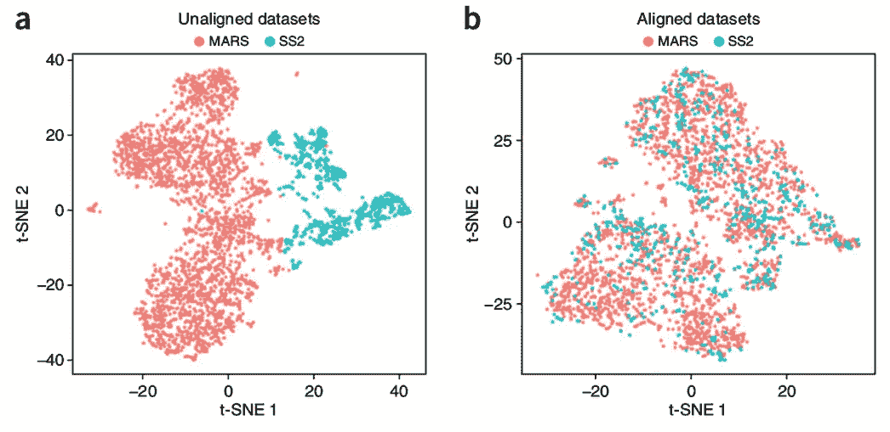

From Butler et al., *Nature Biotechnology* **36**, p. 411–420 (2018), [image source](https://www.nature.com/articles/nbt.4096)

这是专栏 [**生命科学的数理统计和机器学习**](https://towardsdatascience.com/tagged/stats-ml-life-sciences?source=post_page---------------------------) 中的第 11 篇文章，我试图在这里涵盖生物信息学、生物医学、遗传学、进化等领域常见的分析技术。在我之前的一篇文章中，我开始讲述通过比较标准化策略来消除技术变异的方法。在这里，我将对该主题进行扩展，并谈论**校正由不同技术、实验室、方案等测序的相同类型细胞之间的系统差异**，即**批量效应**检测和消除。

# 如何检测批量效应？

批量效应有一个危险，即**混淆**真实的生物信号，即在 scRNAseq 的情况下，在样本中发现**细胞类型**。批次可能来自:不同的测序日期、测序人员、流动池/板、化学/方案、泳道、读数长度、实验室产生的数据，甚至极端情况下的不同生物体。

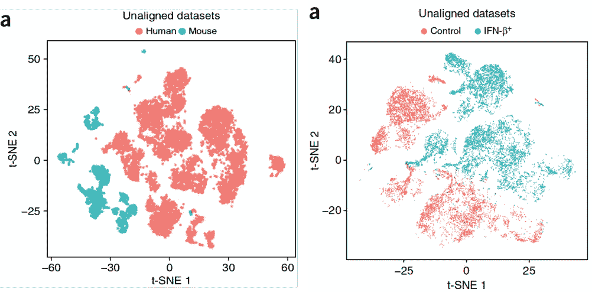

Human vs. mouse (left ) as well as stimulated vs. control (right) same type cells form distinct clusters, from Butler et al., *Nat. Biot.* **36**, 411–420 (2018)

批次效应可以是**全基因组**，即大多数基因都存在，也可以是**基因特异性**，即某些基因恰好受到批次的影响。前者很容易从 PCA 或 tSNE 等降维图中看出。出于演示目的，我将继续使用来自[的先天淋巴细胞( **ILC** ) scRNAseq 数据集。bjrklund 等，*自然免疫学* **17** ，第 451–460 页(2016)](https://www.nature.com/articles/ni.3368) 。下面我计算了来自三个捐赠者的 ILC 细胞的 PCA 和 tSNE 降维图，详情请查看我的 [github](https://github.com/NikolayOskolkov/HowToBatchCorrectSingleCell) 上的完整笔记本。

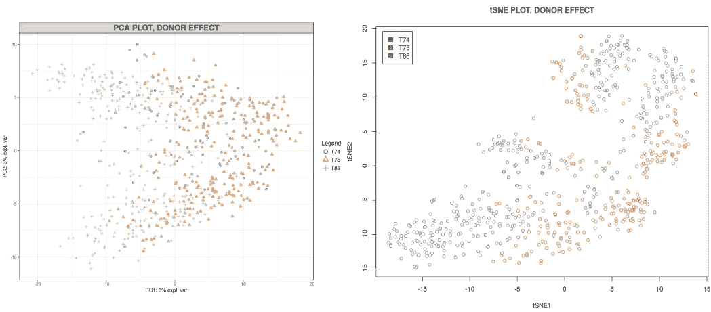

从图中可以清楚地看到**供体特异性批次**，即来自同一供体的细胞倾向于**聚集在一起**，并且与来自其他供体的细胞截然不同。为了进一步量化，让我们显示每个主成分(PC)中有多少变化是由供体、平板和细胞类型解释的。

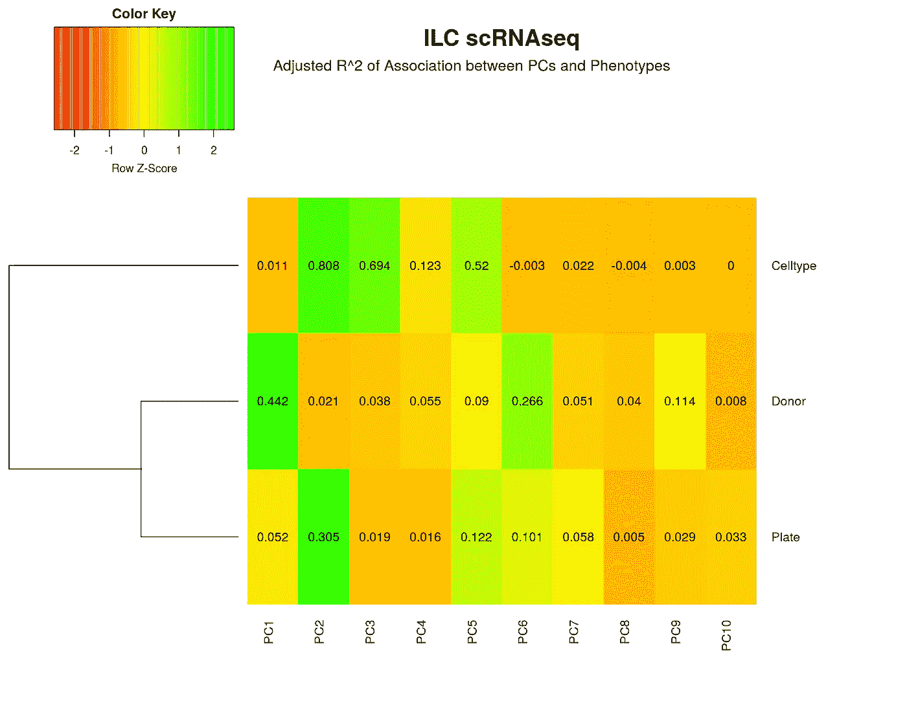

从上面的热图可以看出，PC1 的 44%是由**供体批次**造成的，而细胞类型的贡献可以忽略不计，因此我们有一个严重的全基因组供体相关批次效应。然而，如果我们在上述降维图中没有观察到任何供体聚类，这是否意味着我们的数据集中不存在批效应？不，不是的。**某些基因**在很大程度上仍可能因批次而非细胞类型而存在变异。我们可以通过将它们的表达与供体变量相关联来对受该批次影响的所有基因进行排序。从下面的左图中，我们观察到**有** **个基因由于供体批次**而具有> 20%的变异。为了评估这个数字是多还是少，我们**将批次变量**混洗**多次**并计算** **噪声区**，即由于**随机变量**导致的基因表达的变化。我们也可以做一个正式的统计测试，计算出**偏离噪声区**的显著性的 **p 值**(下图)。通过这种方式，我们最终得到了大约 200 个受批次显著影响的**基因的列表，这些基因对于进一步的下游分析来说是值得关注的。****

**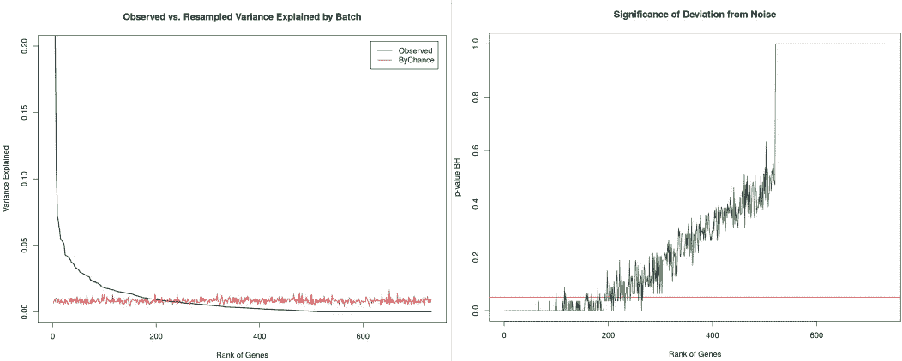**

**Ranking the genes by their variance explained by the batch variable and computing the noise zone**

# **如何纠正批量效应？**

**一旦我们检测到数据中的批量效应，我们就可以应用多个可用的批量校正算法。**我不建议对 scRNAseq 数据进行类似于 [SVA](https://www.ncbi.nlm.nih.gov/pmc/articles/PMC3307112/) 的无监督校正**，因为 scRNAseq 分析也是无监督的，其基础事实(细胞类型)未知，因此移除近似批次的替代变量可能会破坏生物信号。对于监督批次校正，即当批次先验已知时，使用 [**和**](https://www.ncbi.nlm.nih.gov/pubmed/16632515) 方法进行简单的线性校正将是一个良好的开端。**

**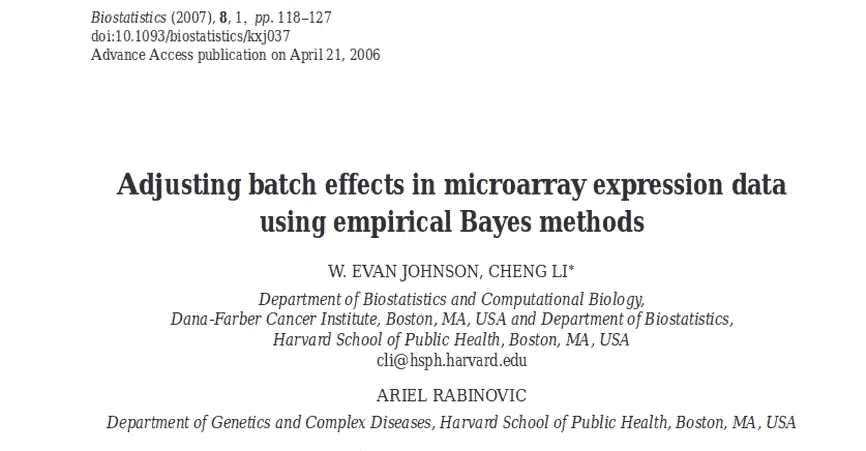**

**战斗通过**贝叶斯线性回归**执行批量校正，因此与例如在 [**Limma**](https://bioconductor.org/packages/release/bioc/html/limma.html) 中实现的简单 aka Frequentist 线性批量移除相比，提供了相当大的改进。除了**对于小样本量**更好的性能，Combat 使用****贝叶斯向均值**收缩，这意味着我们使用来自其他基因的**“均值”**信息来校正每个基因，而 Limma 独立地逐个基因地进行校正。尽管如此，战斗应用了线性批量效果修正。****

****[**相互最近邻(MNN)**](https://www.nature.com/articles/nbt.4091.pdf) 算法采用了受[K-最近邻(KNN)](https://en.wikipedia.org/wiki/K-nearest_neighbors_algorithm) 思想启发的非线性批量效应修正。该方法试图找到批次之间最相似的细胞(共同邻居)，这些细胞被假定为属于**相同类型**和**MNN 细胞之间的系统差异**量化批次的强度，该信息被用于缩放批次中的剩余细胞。****

****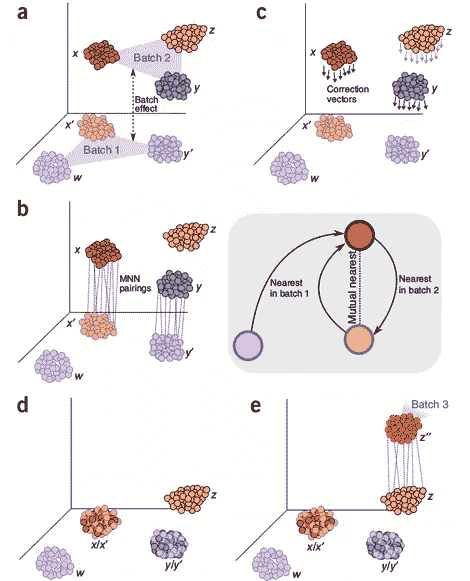****

****Idea behind Mutual Nearest Neighbor (MNN) batch correction, from [Haghverdi et al., Nat. Biot. 36, 2018](https://www.nature.com/articles/nbt.4091.pdf)****

****我对这种方法的一般问题是，我总是无法理解 MNN 细胞应该属于同一类型的假设。我的直觉是，一个批次可以完全**混淆**批次中细胞之间距离的概念，所以批次之间最近的两个细胞实际上可以属于不同的细胞类型但是**因为批次本身的原因**看起来非常相似 **。然而，MNN 批量效应修正在实践中似乎运行良好，我们将在后面看到它在我们的基准测试中表现良好。******

****另一种流行的特定批量校正方法是 [**修拉典型相关分析(CCA)**](https://www.nature.com/articles/nbt.4096.pdf) 技术，该方法有时被视为跨样本整合。CCA 的概念与我在以前的一篇文章中描述的 [**PLS 数据集成**](/supervised-omics-integration-2158e1a6d23f) 非常相似。通过最大化来自不同批次的数据集之间的相关性(或协方差),来自批次的数据被投影到低维空间中。这意味着数据集的投影**相关**但不一定对齐，即在低维空间中没有很好地重叠。后者通过应用 [**动态时间扭曲(DTW)**](https://en.wikipedia.org/wiki/Dynamic_time_warping) 技术来解决，该技术局部地**拉伸和挤压**CCA 数据投影，以便进一步对准它们。****

****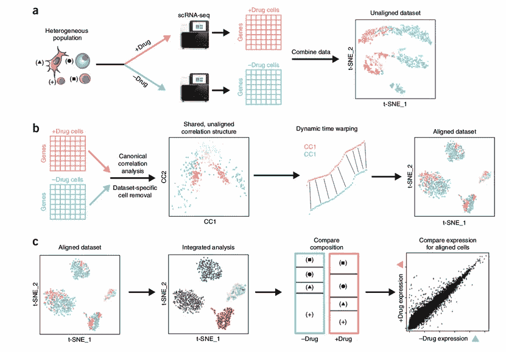****

****Idea behind Seurat Canonical Correlation Analysis (CCA) batch correction, from [Butler et al., Nat. Biot. 36, 2018](https://www.nature.com/articles/nbt.4096.pdf)****

****当战斗时，MNN 和修拉 CCA 试图转换数据以便合并来自不同批次的子集， [**SCMAP**](https://www.nature.com/articles/nmeth.4644) 算法试图将查询细胞投影到参考数据集上，该参考数据集可能是例如 [**人类细胞图谱**](https://www.humancellatlas.org/) ，而不实际产生单个校正的数据集。****

****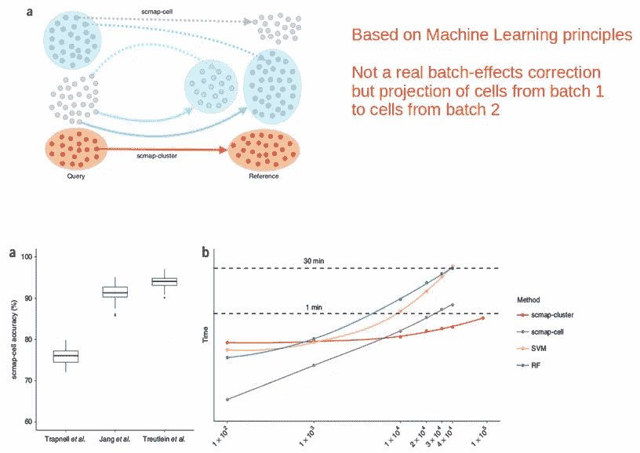****

****Idea behind SCMAP single cell projection onto a reference data set, from [Kiselev et al., Nat. Met. 15, 2018](https://www.nature.com/articles/nmeth.4644)****

****SCMAP 使用 **KNN 分类器**来寻找测试细胞和用于训练分类器的大概大得多的参考数据集之间的对应关系。****

# ****ILC 批量校正方法的比较****

****这些方法在实践中是如何工作的？我们将使用 ILC scRNAseq 数据集来运行它们，并尝试消除与供体相关的批次效应，从而协调批次之间的细胞。完整的笔记本可以在 [github](https://github.com/NikolayOskolkov/HowToBatchCorrectSingleCell) 找到，这里我只给出最终的对比 tSNE 图:****

****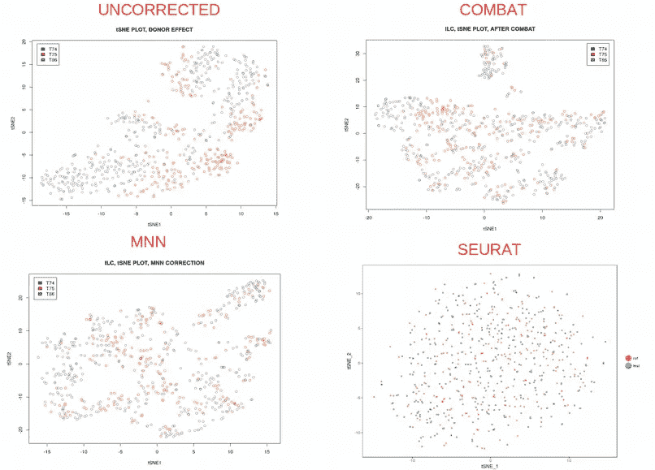****

****看着上面的 tSNE 图，我会说所有的方法都很好地混合了来自不同捐赠者的细胞。遵循[奥卡姆剃刀](https://en.wikipedia.org/wiki/Occam's_razor)原理，我认为最简单的战斗在超级容易理解和编程的同时性能也足够令人满意。****

****有趣的是，当在两个供体上训练 SCMAP 分类器作为参考并将来自第三个供体的细胞投射到参考上时，考虑到大约一半的**细胞**根本不能被可靠地分配到任何群，导致**差的**细胞分配/分类准确度 **84%** 。这可能是由于训练集**不够大**或者数据不满足对于 KNN 分类器至关重要的**球面对称性**。****

****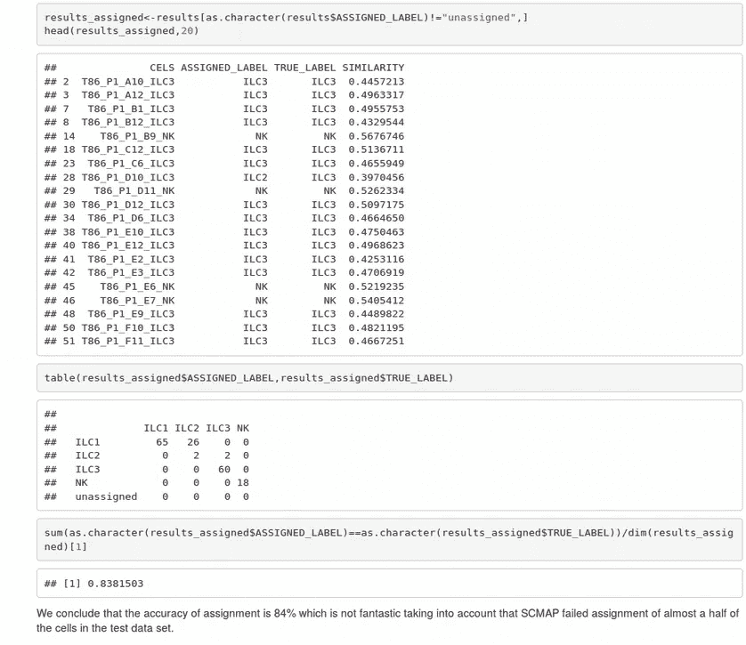****

# ****摘要****

****在这篇文章中，我们了解到批量效应代表了一种技术上的变异，这种变异可能会**混淆 scRNaseq 分析**中的生物信号 **。这些影响可以通过**全基因组**或**基因特异性**方式检测，并使用线性(战斗)或非线性(MNN、修拉 CCA、SCMAP)算法进行校正。总的来说，批量修正方法在基准测试中运行良好，表明最简单的(**战斗**)模型应该优先。******

**在下面的评论中让我知道生命科学中的哪些分析对你来说似乎特别神秘，我会在这个专栏中尽力解答。在我的 [github](https://github.com/NikolayOskolkov/HowToBatchCorrectSingleCell) 上查看帖子中的代码。在媒体[关注我，在 Twitter @NikolayOskolkov 关注我，在 Linkedin](https://medium.com/u/8570b484f56c?source=post_page-----7bad210c7ae1--------------------------------) 关注我。下一次我们将会涵盖**到底如何**[**UMAP**](https://umap-learn.readthedocs.io/en/latest/)**作品**，敬请关注。**