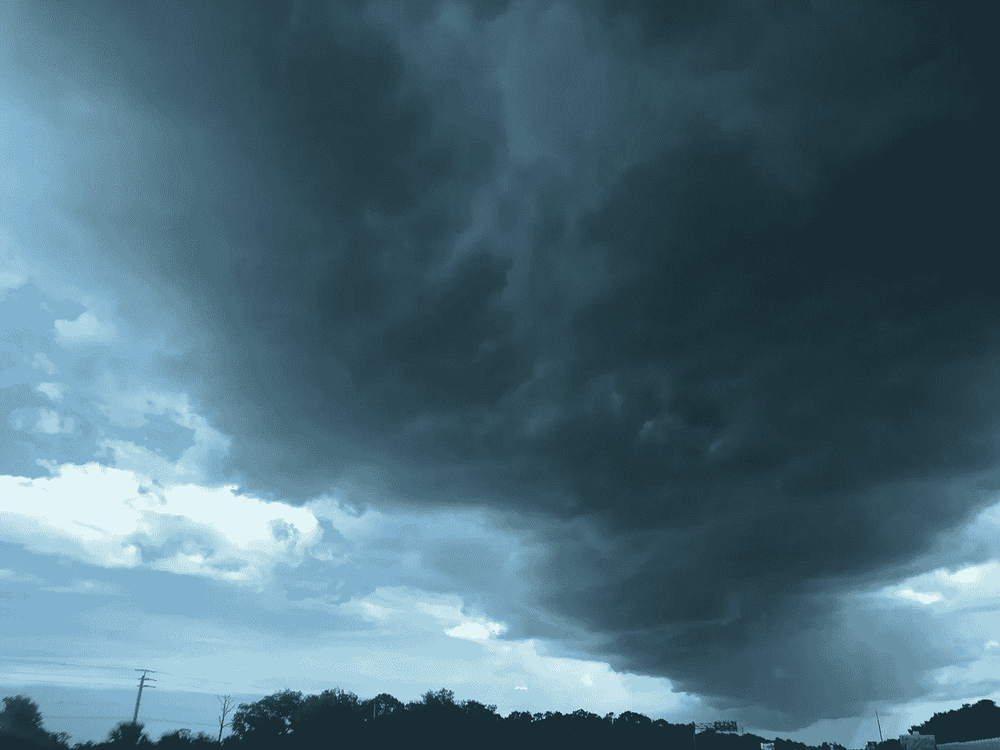
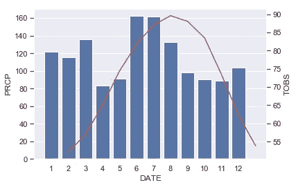
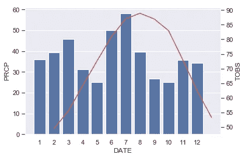
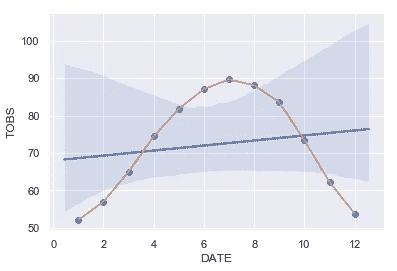
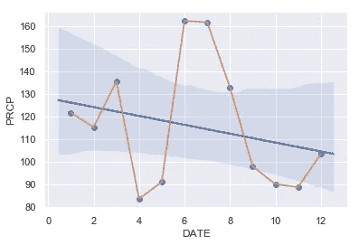
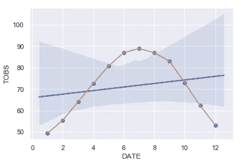
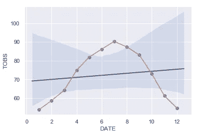
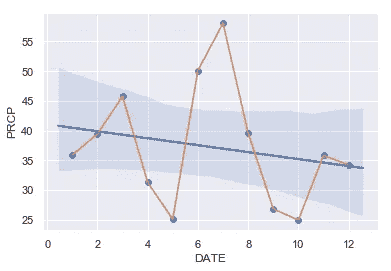
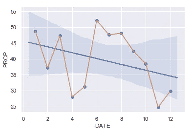
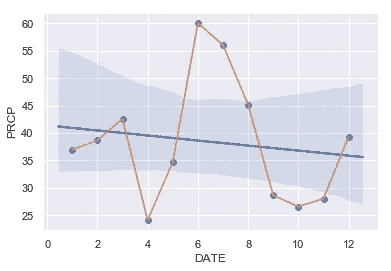

# 如何成为一名气候学家

> 原文：<https://towardsdatascience.com/how-to-be-a-climatologist-f8f017ed01af?source=collection_archive---------19----------------------->

Image taken by author.

这些天，我们从各种新闻渠道中读到和听到了很多关于地球气候的信息。关于这些文章中的大多数，值得注意的一件有趣的事情是，它们中的许多报告来自科学报告。虽然这是一种传播科学信息的完美有效的方式，但它并没有真正告诉读者他们可以如何进行自己的气候学研究。虽然提供信息可以让观众了解信息，但在教育他们这些信息是如何产生的方面却没有什么作用。认识到这样一个事实，即许多人由于时间或缺乏资源而无法进行这些类型的检查，对许多人来说，有一个直接的指南来教他们一些关于气候科学和分析的知识仍然是有用的。今天我将使用来自美国历史气候网络([https://www.ncdc.noaa.gov/cdo-web/](https://www.ncdc.noaa.gov/cdo-web/))的数据。他们有来自全美各站的数据。我在南卡罗来纳州哥伦比亚的车站寻找这个特别的练习。让我们开始吧。

**1。)了解气候正常**

气候正常是该领域大多数人所指的 30 年平均天气模式。有些人也可能把它称为某个研究区域的大气变量的“气候学”。每十年末更新一次正常值。最近的正常时期是 1981 年到 2010 年。你可能会想，“那是 29 年。”但是看似一年的假期却不是，正常情况下，整年都被计算在内，这意味着我们没有计算“到”2010 年，我们考虑的是“到”2010 年的数据，这给了我们完整的 30 年。气候常态有助于理解趋势变化、模式变化和异常事件。除非你是在做一个特定事件的案例研究，否则你应该尽可能多地查看数据，将这项研究视为一项气候学研究。然而，这个规则有一个例外。有句话说，“什么是气候学，取决于正在研究什么。”如果你开始研究一个领域的蒸发和风型的气候学，这是非常正确的。除了偶尔的恶劣天气事件，这些小气候很可能会经历很多变化。在这些更小的尺度上，异常仍然可能发生，但是 30 年的数据对于检查它们是不必要的。因此，当你观察区域、大陆或全球范围的天气模式时，应该应用气候常态。

Climate normal for the Columbia, SC station between 1981 and 2010\. Figure made by author.

Climographs for each decade within the normal: 1980, 1990, and 2000\. Figures made by author.

**2。)季节性**

另一个要考虑的是季节性。大多数气候学家喜欢按季节分解事物。季节分为春季(三月、四月、五月)、夏季(六月、七月、八月)、秋季(九月、十月、十一月)和冬季(十二月、一月、二月)。如果您还没有发现，winter 会要求将前一年的数据与下一年的数据进行分组。因此，我们 1981 年的第一个冬天需要 1980 年 12 月的数据，2010 年的最后一个冬天需要 2011 年 1 月和 2 月的数据。季节性对于确定一年中什么时候事件更有可能发生很有用。例如，如果我们检查从 1981 年到 2010 年所有秋季的飓风频率，我们会看到大多数发生在 9 月。我们也可以比较一段时间内的多个秋季。这让我们在不涉及天气模型或其他变量的情况下，更好地了解未来飓风预测的可变性和不确定性。

**3。)地理**

地理无疑会影响我们在气候学中观察到的模式类型。如果您正在检查亚利桑那州凤凰城和宾夕法尼亚州费城之间的干旱情况，您不会想要宣布凤凰城的干旱情况比费城严重，因为它的周、月或年降水量要少得多。这两个地方由于所处的位置，会经历非常不同的降水模式。费城比凤凰城潮湿得多，从局部对流活动和更大的迁移风暴系统中获得降水。如果要在两个地点之间进行比较，需要计算两个地点的被检查变量的正态分布，然后使用方差、标准差或标准误差等测量方法检查数据。

**4。)时间序列，归属，&视窗**

时间序列和归因可能是大多数气候学研究的主线。气候科学家想知道在观测记录中天气模式是如何变化的，他们也想知道是什么导致了这种变化。有大量的时间序列方法，但最常用的是拟合数据的回归线，以创建一个方程，显示随着时间的变化量。问题是气候数据通常不是高斯分布的，需要转换或者使用其他非参数方法。这是“使用不假设数据是正常的技术”的行话。归因技术可以有多种形式，但最常用的是相关性分析。正相关意味着两个观察点很可能相关，而负相关意味着它们不太可能相关，并且当一个发生时，另一个不相关。中性相关意味着看不出两者之间有任何关系。窗口是被分开来检查变化的时间段。因此，如果我们以 10 年为一个区间来考察我们的常态，我们可以观察到每个十年之间的明显差异。

Temperature (left) and Precipitation (Right) climate normal trends for each month. Notice how these compare to the decadal examinations below. Figures made by author.

Above: Temperature trends for the decades of 1980, 1990, and 2000\. Below: Precipitation trends for the decades of 1980, 1990, and 2000\. Temperature shows an increase over the three decades and precipitation shows a decrease. Figures made by author.

有了以上提供的所有信息，你现在可以练习一些基本的气候学了。随意钻研一些数据源，看看温度、降水、湿度，甚至是恶劣天气事件。通过这种方式，你可以随时了解你所在社区发生的事情。重要的是要注意到气候系统是复杂的，无论你发现的结果如何，都可能有更多的因素在起作用，而不仅仅是数据向你揭示的答案。前国防部长唐纳德·拉姆斯菲尔德说过一句话，在分析任何数据时，我总是喜欢记在心里，“有些事情我们知道我们知道。有已知的未知。也就是说，有些事情我们现在知道我们不知道。但也有不为人知的未知。有些事情我们不知道我们不知道。”