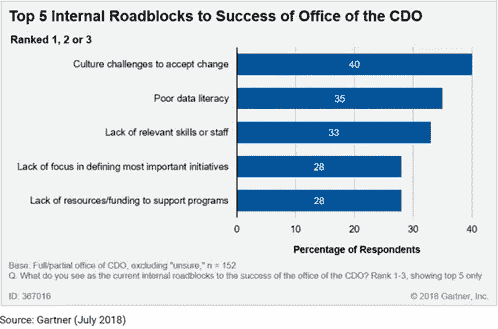
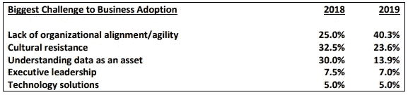
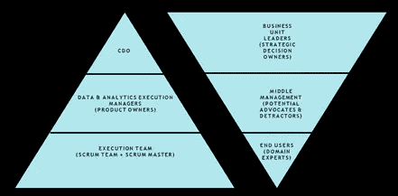
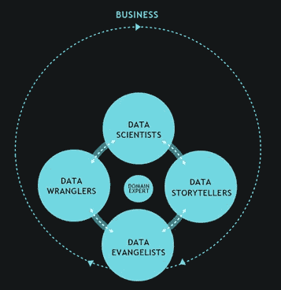
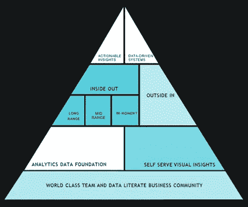
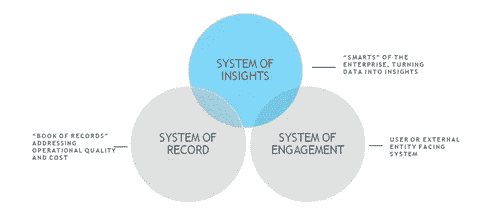
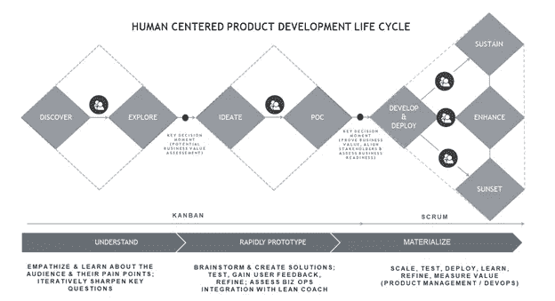

# 如何成为一名成功的首席数据官

> 原文：<https://towardsdatascience.com/how-to-be-a-successful-chief-data-officer-e34b6ae56443?source=collection_archive---------10----------------------->

## 首席数据官为组织创造价值并引领数据驱动型转型的三种方式

Photo by [Ahmer](https://www.flickr.com/photos/ahmerinam/), To the Mountain Top ([Source](https://www.flickr.com/photos/ahmerinam/8022035714/in/dateposted-public/))

**总结**

首席数据官(CDO)是组织内数据的代言人，将数据视为战略性企业资产。CDO 的角色正在演变，在行业中获得了巨大的吸引力，它的成功对于推动组织的发展和创新是必不可少的。CDO 必须将自己的角色从防御型数据战略转变为进攻型数据战略，承担起变革推动者的角色，并负责为其组织创造价值。这是成功的秘诀。

**挑战**

尽管 CDO 的角色正在走向成熟，但许多 CDO 正在失败。Gartner 最近的一项研究预测，50%的 CDO 将因众多内部和外部因素而失败。大多数外部因素是不可控的，因此，了解成功的关键内部障碍非常重要。

● **角色的级别**:头衔“首席”意味着该角色向高管层汇报，但许多 CDO 并不这样做。他们没有资历、决策权和政治影响力来推动企业数据战略。

● **角色清晰性和限制**:CDO 角色的定义仍然没有一致性，角色的期望取决于组织的数据成熟度。这个问题的一个直接后果是对角色本身的限制。

● **缺乏资金和资源**:没有将 CDO 的角色放在组织中足够高的位置，其专用预算影响了对工具、技术和人员的投资。

● **公司文化和变革阻力**:CDO 是一个颠覆性的变革管理角色，不是每个人或每个公司都能很好地适应变革。最重要的是，公司中任何新的“首席”角色都会带来政治动态，根据角色的位置，它可能会给首席信息官和首席技术官带来政治问题。

**建议**

随着组织逐渐走向成熟，并希望由 CDO 来共同主导增长章程，CDO 应首先评估其组织的数据成熟度，然后通过以下方式为其组织创造价值:

● **数据管理**:这是 CDO 角色的核心，涉及数据控制、数据质量、维护、保护和治理。将数据作为企业资产或公司货币进行管理，并建立对数据的信任是一个关键因素，其他一切都取决于此

● **数据丰富和支持**:找到利用现有数据实现业务成果的方法，并用额外的内部和外部数据对其进行扩充。从小处着手，在每一次成功(和失败)中积累。确保整个组织内分析的数据可用性，包括可操作的见解人力资源和财务等职能部门的不足

● **数据货币化**:确定从数据中获取收入的方法。创建创新章程，进行实验，构建原型，传播和实现数据科学、人工智能和机器学习等高级分析，并将数据产品开发为企业知识产权和竞争优势

**评估**

新商业和数字化转型的出现，使得组织越来越依赖数据，无论是从即时交易的角度，还是从制定长期发展战略的角度。许多没有接受这一新现实的组织已经失败并继续挣扎，例如 Sears。数据和分析正在引领市场差异化和以消费者为中心。随着组织开始意识到数据是他们的公司货币，需要将其作为资产进行管理，首席数据官的角色应运而生。

该评估的重点是那些在数字方面非本地的组织，以及那些没有从头开始最大限度地发挥数据和分析作为其商业模式关键驱动因素的潜力的组织，如亚马逊、谷歌、脸书、Airbnb 等。在这些组织中，CDO 的角色通常是不存在的，数据管理，以及用数据和分析推动商业价值是一个基本元素和日常业务现实的一部分。

首席数据官对不同的组织有不同的含义。在一些组织中，风险、合规性和法规可能是创建相对狭窄和深入关注的角色的背后。在其他组织中，它可能更广泛，包含企业数据和分析以及创收驱动因素，或者它可能是对业务模式中断和推动创新需求的响应。从本质上讲，CDO 的角色必须与其数据战略的组织成熟度相关联。Gartner 从四个方面描述了 CDO 角色的演变:

**CDO1.0** :专注于数据管理

**CDO2.0** :开始拥抱分析

**CDO3.0** : Led 数字化改造

**CDO4.0** :以数据产品为重点的货币化

随着数据战略的发展，分析也在不断发展。根据 Thomas Davenport 进行的研究，分析经历了以下发展阶段:

**分析 1.0** :传统商业智能时代

**分析 2.0** :大数据时代

**分析 3.0** :面向快速经济的数据丰富产品时代

**分析 4.0** :认知消费者控制的数据时代

这给 CDO 带来了一个挑战:从哪里开始，关注哪里？CDO 的角色也是一个跨职能的变革管理角色，它从组织调整和政治角度创造了自己的内部挑战。事实上，Gartner 预测约有 50%的 CDO 会倒闭。在 Gartner 的 2017 年 CDO 调查中，文化惯性和数据素养被报告为缺乏成功的首要原因。

这一评估与新 Vantage 合作伙伴进行的研究非常一致，该研究旨在确定业务采用分析的障碍。

Source: New Vantage Partner (2019)

CDO 进气管道中的典型一天包括:

●营销部门对消费者总体水平的营销活动绩效报告的需求

●销售人员说这些数字是错误的，不可信

●首席财务官表示，向他们报告了多个版本的 topline KPIs，他们需要确定哪个版本是正确的

●商业智能团队表示他们没有足够的资源和工具

● CTO 说他们已经决定将数据从内部系统迁移到云中

似乎立即解决这些问题应该是 CDO 的重点，但这是错误的做法，因为这只会加剧围绕这一重点的关切。许多战术工作可以由现有的数据团队采用敏捷或老虎团队的方法来完成，但 CDO 必须专注于建立功能的战略愿景，并获得企业范围的认可。

首先，CDO 必须承担起变革推动者的角色，并理解这是一项跨职能的责任，需要组织能力来建立联盟和伙伴关系。了解组织如何运作至关重要。这应导致创建一个基于文化并与企业使命相联系的职能愿景。

接下来，CDO 必须开发一种组织结构，这种结构旨在通过一种跨越业务单位中的多个层级的参与模式来推动采用。CDO 应该根据变革的速度和组织的政治环境来评估集中型、分散型和混合型组织结构——建立信任和协作比建立帝国更好。

Copyright: [Ahmer Inam](https://www.linkedin.com/feed/)

CDO 也应该是以人为中心的设计、[设计冲刺](https://www.gv.com/sprint/)和敏捷方法的支持者，并创建以领域专家或业务单位用户为中心的多学科敏捷团队。这使得采用成为从发现和设计阶段向前的计划的一部分。领导这些敏捷团队的一个重要角色应该是能够用数据和策略语言进行有效沟通的数据翻译者/传播者。

Copyright: [Ahmer Inam](https://www.linkedin.com/feed/)

这里要考虑的一个关键因素是 CDO 想要领导的变革程度以及他们想要前进的速度。这些雄心应该与组织对变革的准备和 CEO 的支持相匹配。来自 Standish Group 的混沌报告显示，从大型计划开始有更高的失败可能性。

识别并专注于可解决的问题。不要一开始就野心太大，先把基础打好。平衡潜在的长期计划和短期项目，并尽早和经常地交付组件，提高成功率和价值。CDO 应该以价值而不是数量来衡量他们组织的生产力和成功。在向企业领导人讲述透明的价值驱动的故事中磨练出来的沟通策略将逐步在组织中建立声誉和信任。

解决组织战略的这些基本问题将导致 CDO 组织章程的制定，并为组织的成功奠定基础。

Copyright: [Ahmer Inam](https://www.linkedin.com/feed/)

现在，我们来探讨一下 CDO 为其组织创造价值的三种方式。

**建议 1:数据管理**

许多 CDO 组织都是从这个领域(数据运营)开始的。这是 CDO 的核心责任领域，必须如此管理。没有掌握的、精心整理的、良好治理的和安全的数据，其他一切都是空谈。这不仅仅是一个维持的领域，也是一个将继续挑战 CDO 组织的创新领域。例如，确定如何最好地存储和检索高维高基数纵向时间序列数据，或者在 GDPR 时代掌握消费者数据，以有效地推动消费者参与战略。CDO 必须关注的一些价值驱动因素:

●将企业数据作为资产进行保护，并管理风险和合规性

●利用先进的治理原则减少敏感数据的暴露

●单一真相来源与多个真相来源的策略

●数据架构和系统的发展，以保持领先于市场的步伐

●持续评估和应用精益数据运营方法，以较低的成本提供高价值

●建立高标准的数据质量，消除“垃圾进垃圾出”的风险

**建议 2:数据丰富和支持**

CDO 必须对现有数据进行全面评估，对它们进行编目，并创建元数据。这将有助于最终用户更好地理解数据，也可以用来培养组织的数据素养。然后，探索组织利用现有数据还能做什么和做多少。从获得“易得之果”开始，并以此为基础。继续评估现有数据中的差距，并利用外部来源和合作伙伴进行补充和扩充。随着现有数据被用来推动组织价值，它将缓解对数据扩充和丰富策略的额外资金的请求。此外，使跨业务部门的数据访问民主化，以赢得更多支持者。向人力资源和财务等数据匮乏的组织表达爱意，并赢得这些强大业务职能部门的支持，因为他们拥有资源和预算方面的关键决策。

采取一种渐进的方法来逐步开发一个“洞察系统”，该系统必须集成数据孤岛，并作为一个干净的、治理的、扩充的数据系统，该系统将继续推动组织的价值。使用财务和销售数据来创建仪表板，以衡量对交付给组织的顶线 KPI 的影响。

Source: Forrester

**建议 3:数据货币化**

数据货币化本质上是数据丰富、利用和支持的延伸。CDO 必须专注于在现有流程和职能之外寻找新的收入和创收机会。这将需要挑战现有的商业模式，并通过宣传来获得组织盟友，以推动创新，并从项目导向转向产品导向。CDO 必须为产品创新创造空间，无论是在其组织内部还是与其他互补组织合作

●使组织的思维模式从数据是业务的副产品转变为 it 具有内在的货币价值:将数据视为组织的货币

●在当前项目之外增加关注点，以增加现有收入或降低成本

●利用数据产品确定新的收入来源，例如，商家服务提供商可以通过 SaaS 洞察门户向其商业客户授权聚合洞察

●在数据和分析领域之外进行思考，并将其视为创新练习。以人为中心的设计为先导，识别潜在的有价值的想法，将其原型化，无情地迭代、测试和学习，并在价值驱动因素确立后扩大规模。以下框架可用于建立以人为中心的产品开发生命周期(PDLC)流程

●不要一个人去争取。作为合作伙伴，带着战略财务、公司战略和其他高管一起踏上旅程

●确定拓展分析边界的机会，并将基于人工智能和机器学习的知识产权作为竞争优势

Copyright: [Ahmer Inam](https://www.linkedin.com/feed/)

**结论**

使用此处规定的框架来处理首席数据官的角色，可以让 CDO 率先在一个安全且治理良好的环境中提供来自组织内外的最佳数据。这将推动组织的价值，并建立一个成功的和创新的价值驱动的 CDO 组织。

**参考文献**

[1] J. Heizenberg，A. Duncan，[设计有效的数据和分析组织时要避免的 5 个陷阱](https://www.gartner.com/en/documents/3884664/5-pitfalls-to-avoid-when-designing-an-effective-data-and) (2018)，Gartner Research

[2] R. Bean，T. Davenport，[大数据和人工智能高管调查](https://newvantage.com/wp-content/uploads/2018/12/Big-Data-Executive-Survey-2019-Findings-Updated-010219-1.pdf) (2019)，新 Vantage Partners

[3] M. Faria， [Gartner 研究委员会任命首席数据官](https://www.gartner.com/en/newsroom/press-releases/2019-07-30-gartner-research-board-identifies-the-chief-data-officer-4point0) (2019)，Gartner 研究委员会

[4] C. Pettey，[Gartner 首席数据官调查的 3 大要点](https://www.gartner.com/smarterwithgartner/3-top-take-aways-from-the-gartner-chief-data-officer-survey/) (2018) Gartner Research

[5] J. Bennett，[为什么只有一半的 CDO 做好了成功的准备](https://www.gartner.com/smarterwithgartner/half-of-cdos-succeed/) (2016)，Gartner Research

[6]斯坦迪什集团国际有限公司，[混乱报告](https://www.standishgroup.com/sample_research_files/CHAOSReport2015-Final.pdf) (2015)

[7] M.Teerlink，B. Gow，K.Banerjee，[大数据和分析的新英雄](https://www.ibm.com/downloads/cas/MQBM7GOW) (2014)，IBM 商业价值研究所

[8] L. DalleMule，T. Davenport，[你的数据战略是什么](https://hbr.org/2017/05/whats-your-data-strategy) (2017)，《哈佛商业评论》

[9] T .达文波特，[分析的四个时代](https://slideplayer.com/slide/10193362/) (2015)，分析前沿会议

[10] S. Soares，[《首席数据官数据治理手册》](https://books.google.com/books/about/The_Chief_Data_Officer_Handbook_for_Data.html?id=3KcXrgEACAAJ) (2014)，MC 出版社

[11] C .卡鲁泽斯，p .杰克森，[首席数据官的剧本](https://books.google.com/books/about/The_Chief_Data_Officer_s_Playbook.html?id=24c9DwAAQBAJ) (2018)，刻面出版

[12] D. Laney，[信息经济学:如何将信息货币化、管理和衡量为竞争优势的资产](https://books.google.com/books?id=_29QDwAAQBAJ&source=gbs_navlinks_s) (2017)，Routledge

[13] B. Evelson，[洞察系统:下一代商业智能](https://go.forrester.com/blogs/15-07-21-systems_of_insight_next_generation_business_intelligence/) (2015)，Forrester

[14] A. Inam，B. Franks，[以人为中心的变革推动分析采用](https://www.iianalytics.com/human-centered-transformation-driving-analytics-adoption) (2019)，国际分析研究所

[15] A. Inam，B. O'Neill，[以人为中心的设计如何增加对数据科学计划、产品和解决方案的参与](https://designingforanalytics.com/resources/episodes/020-how-human-centered-design-increases-engagement-with-data-science-initiatives-products-and-solutions-with-ahmer-inam/) (2019)，体验数据播客

[16] A. Inam，A. Hartsoe，[实现客户终身价值(CLV)](https://www.ambitiondata.com/customer-equity-accelerator-podcasts/ep.-98-operationalizing-customer-lifetime-value-clv) (2019)，客户资产加速器

[17] A. Inam，P. Capon，[播客#40](https://www.youtube.com/watch?v=_h-L4kqHW3w) (2019)，创新社区