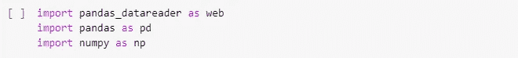
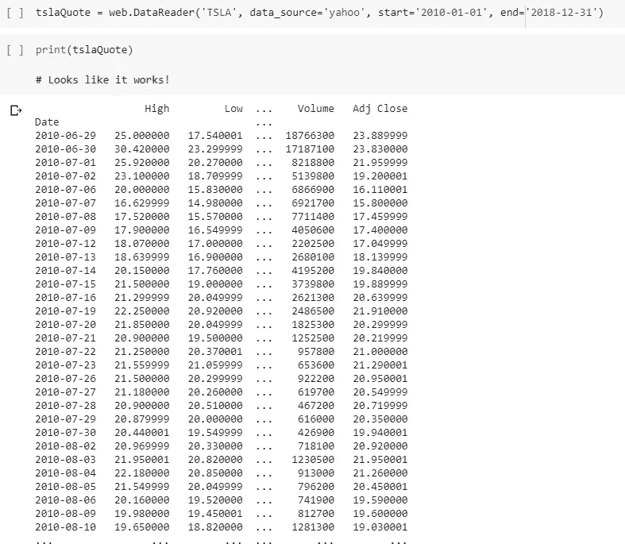
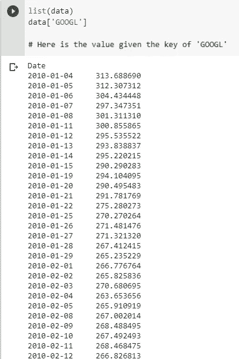
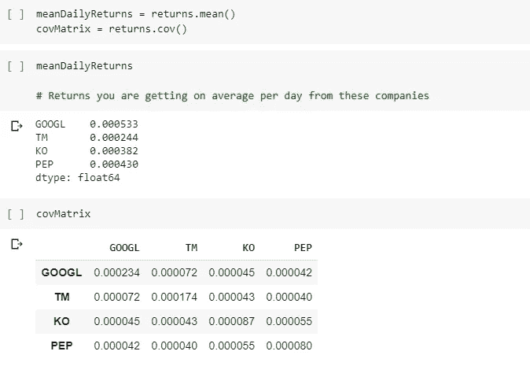
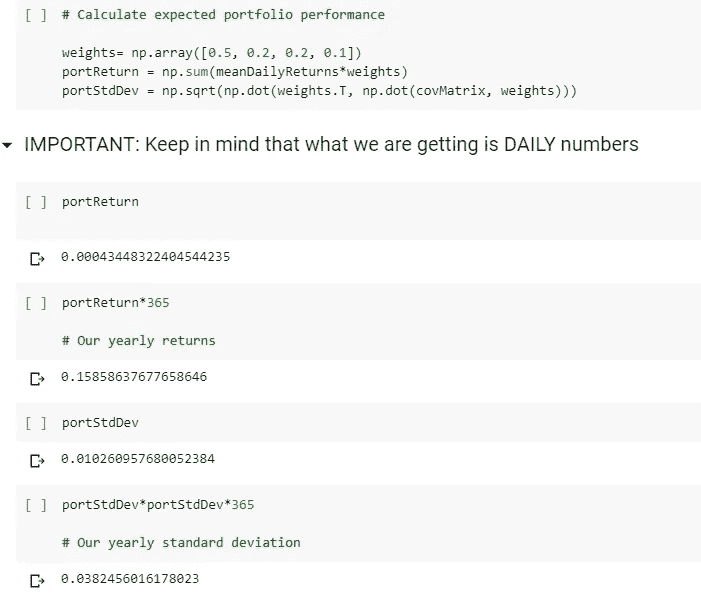
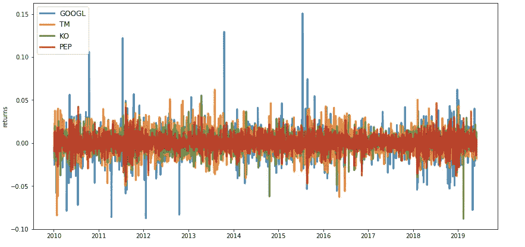
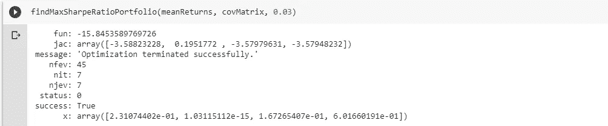
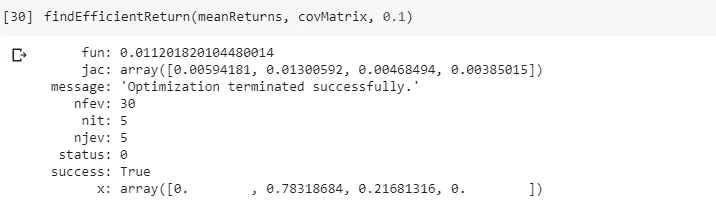

# 如何成为一个成功的投资者:用 Python 进行简单的投资组合分析

> 原文：<https://towardsdatascience.com/how-to-be-a-successful-investor-simple-portfolio-analysis-with-python-7b66fc90fa68?source=collection_archive---------9----------------------->

## 阅读这篇文章是一项值得的投资

It’s amazing what you can do with this

你知道你去的那个地方，在那里你会投入大量的金钱，放弃四年(或更长)的宝贵时间，作为交换，你可以和一群你从未见过的同龄人一起住在一个狭小的空间(你也必须付钱)，参加一系列聚会，你可以坐在那里看老年人说话，在白板上写东西(或使用 PowerPoint)， 度过许多不眠之夜，了解最起码的营养是什么，所有这些都是为了得到一张小纸片或电子文档？

Feels bad…

我是不是不小心给你带来了生存危机？学院/大学是实际回报不固定的投资的完美例子。远非如此。事实上，投资的回报几乎完全取决于学生投入的精力和时间。

这就是投资的全部。它只是简单地放弃一些东西，希望一段时间后你会得到一些东西回来。在金融界，放弃金钱是希望你能得到更多的回报。这个非常简单的概念推动了商业和整个经济的大部分发展。银行不断发放贷款和/或接受贷款。为什么有人会给我一堆钱，除非他们知道他们会拿回来，再加上更多？

散户投资者(为自己投资的人，而不是像专业投资者那样的公司)投资的一种相当常见的方式是将他们的钱存入储蓄账户。他们投入一些钱，然后随着时间的推移，他们的钱的利率复合，然后最终当他们拿回他们的钱时，它会略有增长。

这样做的问题是你的钱增长太慢。还有很多很多其他的投资方式和投资对象。快速定义，你投资的那些东西叫做**资产。**资产可以是:股票、债券、短期国库券、储蓄账户，任何最终能为你赚钱的东西。如果你想最大化你的回报，你需要有一个计划，考虑到你将投资的所有资产，以及每种资产你将投资多少。一旦你列出了你所有的资产和你的**权重**，它们是你投资于单个资产的总资金的百分比，你就得到你的**投资组合。**

Just like mixing ingredients for cooking, you want the best mix for your delicious investment portfolio

举个简单的例子，假设 Amber 有 100 美元是她在当地地铁工作赚来的。她想用这笔钱投资，这样她会得到一些好的回报。她决定将一些钱存入储蓄账户，一些钱用于购买股票。她决定将 40 美元或 40%存入利息为 3%的储蓄账户。她用剩下的 60 美元，即 60%，购买了埃克森美孚公司(XOM)的股票。一年后，她的 100 美元变成了 107 美元。那就是 7%的回报率。这可能看起来很小，但是想象一下，如果 Amber 不投资 100 美元，而是投资 100，000 美元？！回报率是一样的，但实际收益是巨大的！一年后，安珀将有 107，000 美元。如果 Amber 在接下来的五年里将她所有的收益进行再投资，她可能会净赚超过 15 万美元！如果她在接下来的 15 年里一直这样做呢？那就超过了 **$30 万**！*(顺便说一句，这都是假设安珀没有把任何额外的钱投入她的投资组合，只是把她的收益再投资。)*

既然我已经激起了你的兴趣，让我们来看看使用 Python 寻找最优投资组合的简单方法。

**重要声明:接下来的大部分内容将是高度技术性的，所以如果有你不理解的术语和概念，请参考底部的参考资料部分。此外，本文的主要目的是提供投资组合分析的入口，而不是提供实际的投资建议，所以请不要将这些技术用于自己的投资决策。**

# 数据

让我们首先设置下载股票数据来计算我们需要的重要参数:平均收益和方差。我们将使用 pandas 自带的数据阅读器库从 Yahoo Finance 获取股票数据。

让我们通过抓取特斯拉上的一些股票数据来确保该库能够工作。

现在我们已经建立了如何收集一些数据，让我们得到一些其他公司的股票。

现在让我们检查一下，看看我们是否有必要的数据。

让我们继续前进！

# 基于历史数据计算参数

现在我们有了历史数据，我们可以计算好的东西。

首先，我们从对数收益开始。这些是每天股票价格的百分比变化。

现在我们有了百分比变化，我们可以计算每项资产的平均日收益和协方差矩阵。为了确保每个人都清楚，协方差矩阵用于计算波动率。

现在我们有了所有这些信息，让我们创建一个假设的投资组合，看看我们得到什么回报和波动。如前所述，我们将对资产使用一些随机权重，看看我们的代码会给出什么。至于分配，我们就这么做吧:谷歌——50%，丰田——20%，可口可乐——20%，百事可乐——10%。

因此，我们看到，从我们的迷你投资组合中，我们的年回报率约为 16%，标准差约为 4%。鉴于这是基于 2010 年至 2019 年的数据，这些数字实际上相当不错。最酷的是，我们甚至还没有优化投资组合权重，因此还有很大的改进空间！

# 可视化数据

在我们真正开始优化我们的投资组合之前，让我们看看我们的股票(GOOGL，TM，KO，PEP)如何相互叠加。很多时候，可视化我们的数据使我们能够看到模式、趋势和见解，这在单独通过数据时会非常麻烦和困难。

这是我们得到的。你可以清楚地看到，一只股票通常回报越高，其波动性就越大。

# 优化我们的投资组合权重

现在让我们开始有趣的部分。让我们弄清楚(利用代码的力量)如何让我们的资产获得最大的回报。

我现在警告你，接下来你将看到的很多东西看起来就像一堆疯狂的编程奇才的胡言乱语。只要你遵循代码，理解所有东西并不是最重要的。

我们将首先定义一组函数，使这个过程变得容易得多。Python 有一个名为 **scipy** 的库，它有一个优化功能，使我们试图实现的东西变得相当简单。

第一个函数基本上完成了我们刚刚完成的工作，即在输入权重、平均回报和协方差矩阵后，计算投资组合回报和标准差。

我们将用来优化我们投资组合的一个指标叫做**夏普比率**，本质上是每单位波动率的平均回报率。从字面上来看，这意味着你所投入的风险能获得多少回报。

该函数根据前面提到的参数计算负夏普比率。我们计算负夏普比率的原因是因为 scipy 优化函数只能最小化。

在这里，我们实际上使用了 scipy 优化函数，通过优化我们刚刚定义的函数来找到最佳的投资组合权重。

当我们运行函数时，我们得到这些权重:[0.231，0，0.167，0.602]

There we go! We just got our optimal portfolio!

让我们试着在最小化波动的基础上优化我们的投资组合。

如果我们运行这个函数，我们得到权重:[0，0.783，0.217，0]

# 结论

在所有这些之后，我们可以看到在投资组合优化方面有很多东西要学。现实世界显然没有这么简单。对于我们的优化函数来说，输入和金融环境中最微小的变化都会极大地改变结果。尽管如此，这仍然是一个有趣的小练习。请随意尝试不同的技术和方法，看看什么适合你！

# 需要改进的地方

感谢您花时间通读这篇文章！请随意查看我的[作品集网站](https://jerrytigerxu.github.io/?source=post_page---------------------------)或[我的 GitHub](https://github.com/jerrytigerxu?source=post_page---------------------------) 。

## 1.使用不同的股票数据

还有许多其他股票可能以相对较低的风险获得巨大的回报，所以要勤奋地做研究，找到这些公司。

## 2.尝试不同的优化功能

您不仅仅局限于 scipy 优化功能。还有很多其他的选择，比如求解算法。

## 3.了解更多关于投资分析的信息

这篇文章仅仅触及了金融和投资分析的表面。想学多少就学多少，想探索多少就探索多少。无论你是想为华尔街公司投资，还是仅仅为个人投资，这里都有适合每个人的东西。

# 资源

1.  [收益和波动](https://www.youtube.com/watch?v=bE1Uq-sUFh8)
2.  [风险承受能力](https://www.investopedia.com/terms/r/risktolerance.asp)
3.  [在无风险和风险资产之间分配](https://thismatter.com/money/investments/capital-allocation.htm)
4.  [风险证券分配](https://www.investopedia.com/terms/c/cal.asp)
5.  [夏普比率](https://www.investopedia.com/terms/s/sharperatio.asp)
6.  [基于夏普比率最大化的最优投资组合](https://www.coursera.org/lecture/portfolio-selection-risk-management/finding-the-optimal-risky-portfolio-maximizing-the-sharpe-ratio-jHu9L)