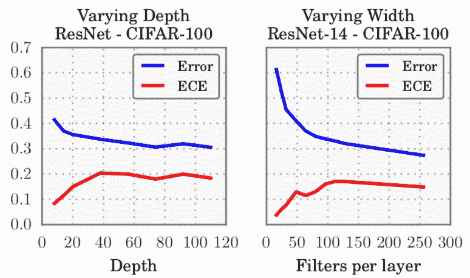
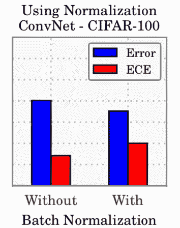
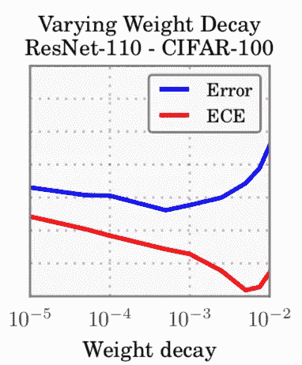
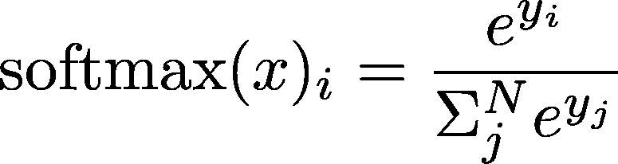
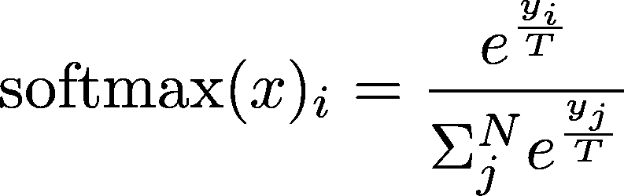
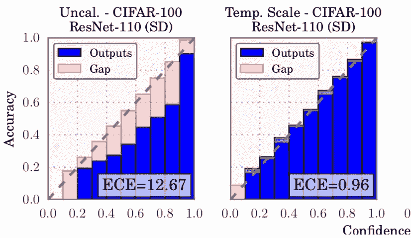

# 如何对自己的神经网络自信

> 原文：<https://towardsdatascience.com/how-to-be-confident-in-your-neural-network-confidence-10d10dcf8003?source=collection_archive---------17----------------------->

这些笔记基于[**关于现代神经网络**校准的研究论文(郭等，2017。)](https://arxiv.org/abs/1706.04599)。

在 CIFAR100 等计算机视觉数据集上，ResNet 等非常大而深的模型远比 LeNet 等较老的模型准确。**然而，尽管他们更擅长对图像进行分类，我们对他们自己的信心却不太有信心！**

大多数用于分类的神经网络使用 softmax 作为最后一次激活:它产生每个目标(猫、狗、船等)的概率分布。).这些概率总计为 1。我们可以预期，如果对于给定的图像，我们的模型将 0.8 的分数与目标“船”相关联，我们的模型有 80%的把握这是正确的目标。

超过 100 个图像被检测为船，我们可以预期大约 80 个图像确实是真实的船，而剩余的 20 个是假阳性。

对于 LeNet 这样的浅层模型来说是正确的，但是随着新模型精度的提高**，它们的置信度变得与“真实置信度”不相关**。

这对深度神经网络不再有效:

Figure 1: *Miscalibration in modern neural network [*[*source*](https://arxiv.org/abs/1706.04599)*]*

如您所见，LeNet 等较老的网络准确度较低(55%)，但它们的可信度实际上与准确度相当！ResNet 等现代网络具有更高的准确性(69%)，但如图 1 所示，它们过于自信。

模型置信度和实际准确度之间的差异被称为**校准错误**。

# 为什么它很重要

除了学院中使用的玩具数据集，了解我们的模型有多少可信度也是有用的。

想象一下，我们有一个预测欺诈的模型。我们希望根据模型置信度将某个交易标记为可疑，因为它是一个欺诈。我们可以明确地计算出验证集的最佳阈值，然后超过该阈值的所有置信度都将被标记为欺诈。然而，这个计算的阈值可以是 0.2 或 0.9，但是对人类来说可能更有意义。

没有错误校准的模型将有助于用户更好地解释预测。

# 为什么会这样

作者从经验上探索了现代网络中这种失调的原因。

他们用**预期校准误差** (ECE)来测量误校准:置信度和准确度之间的平均差值。这个指标应该最小化。

# 更高的容量和交叉熵

错误校准的最可解释的原因是容量的增加和交叉熵损失。

模型容量可以被看作是一个模型可以记忆多少的度量。由于容量无限，该模型可以简单地记住整个训练数据集。必须在低容量和高容量之间进行权衡。如果太低，模型将无法学习数据的基本特征。如果它太高，模型将学习太多和过度拟合，而不是一般化。实际上，理解就是压缩:通过留下足够少的容量，模型必须挑选出最有代表性的特征(非常类似于 PCA 的工作方式)，然后将更好地概括(但是容量太少&将不会发生学习！).

ResNet 之类的新体系结构比老的 LeNet 具有更大的容量(前者 25M 参数，后者 20k 参数)。这种高容量导致了更好的准确性:训练集几乎可以被记住。

此外，模型优化了交叉熵损失，这迫使他们正确并且非常自信。更高的容量有助于降低交叉熵损失，从而鼓励深度神经网络过于自信。正如您在图 1 中看到的，新模型现在过于自信了。

*Figure 2: More capacity (in depth or width) increases the miscalibration [*[*source*](https://arxiv.org/abs/1706.04599)*]*

# 神秘的批量标准化

Figure 3: *Batch Normalization increases the miscalibration. [*[*source*](https://arxiv.org/abs/1706.04599)*]*

**批量归一化**归一化网络中的张量。这大大提高了训练收敛&的最终表现。为什么它能如此有效还不太清楚([见更多](https://arthurdouillard.com/posts/normalization))。

作者凭经验评论说，使用批量标准化增加了错误校准，但找不到确切的原因。

这种方法在训练中的帮助会促进过度自信吗？

# 正规化

Figure 4: *More regularization decreases the miscalibration. [*[*source*](https://arxiv.org/abs/1706.04599)*]*

**重量衰减**是一种额外的损失，它损害了重量的 L2 标准。权重越大，标准越大，损失也就越大。通过约束权重的大小，它避免了模型寻找可能使其过度拟合的极端权重值。

作者发现，正如预期的那样，增加正则化会降低模型精度。

然而，它也减少了误校准！答案还是因为正则化避免了过度拟合&从而避免了过度自信。

# 如何修复校准错误

这篇文章的标题，“如何对你的神经网络自信”，让你相信你会发现如何减少错误校准。

您不会减少容量、取消批处理规范化并增加正则化:您会过多地损害您宝贵的准确性。

幸运的是，有后处理解决方案。作者描述了几种，但最有效也是最简单的一种:**温度标度**。

不是像这样计算 softmax:

所有 logits(最终激活前的值，此处为 softmax)除以相同的温度值:

类似( [Hinton 等人，2015。](https://arxiv.org/abs/1503.02531))，这个温度*软化了概率*。

极端概率(高置信度)比较小概率(低置信度)减少得更多。作者通过最小化验证集上的预期校准误差来找到最佳温度。

校准错误几乎完全得到纠正:

*Figure 5: Temperature Scaling fixes the miscalibration. [*[*source*](https://arxiv.org/abs/1706.04599)*]*

温度缩放的另一个很酷的特性:因为所有的 logits 都除以相同的值，并且 softmax 是一个[单调函数](https://en.wikipedia.org/wiki/Monotonic_function)，精度保持不变！

*原载于 2019 年 5 月 29 日*[*https://arthurdouillard.com*](https://arthurdouillard.com/post/miscalibration/)*。*