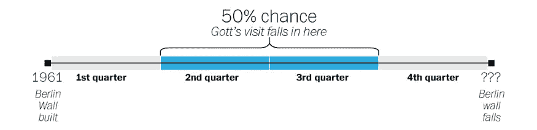

# 如何少犯错误

> 原文：<https://towardsdatascience.com/how-to-be-less-wrong-5d6632a08f?source=collection_archive---------17----------------------->

## 用有限数据预测未来的贝叶斯指南

柏林墙还能屹立多久？这就是 j .理查德·戈特 1969 年访问德国时的想法。

仔细想想，这是一个棘手的问题，因为没有太多关于柏林墙寿命的数据(事实上，柏林墙是 T2 唯一的数据点)。那么，在我们几乎一无所知的情况下，如何处理这样一个问题呢？

Remains of the Berlin Wall. (Source: [Pixabay](https://pixabay.com/photos/berlin-wall-east-side-gallery-berlin-50730/))

戈特现在是普林斯顿大学的天体物理学教授，他是这样想的:他在那一年的某一天看到长城并没有什么特别的。如果你把这堵墙的整个生命周期分成四个等长的部分，那么有 50%的可能性他会在中间的两个部分到达。这反过来又转化为对墙应该保留多长时间的估计:到目前为止它的寿命的三分之一(如果他碰巧在两个中间部分的末尾访问)，到目前为止它的寿命的三倍(如果他碰巧在两个中间部分的开始访问)。

鉴于当时的长城在 1969 年已经建了 8 年，他得出结论说，有 50%的把握，它还能再用 3 到 24 年。这堵墙又持续了 20 年。

There is a 50% chance that Gott’s visit falls within the middle two segments of the Wall’s existence. ([Source](http://desispeaks.com/richard-gott-princeton/))

## 哥白尼原理:我们并不特别

戈特的推理是，他没有在任何特殊的时刻拜访长城，这实际上是更广泛的 [*哥白尼原理*](https://en.wikipedia.org/wiki/Copernican_principle) 的应用，该原理指出，我们在宇宙历史中既不占据特殊的位置，也不存在于特殊的时间。地球不是一个特别的地方，我们的太阳系或银河系也不是。2019 年并不是一个特别的活着的时间。

Gott 基于哥白尼原理的计算至少可以帮助我们在完全不知情的情况下对事件发生的时间做出*估计*。用它来估计各种世界大事可能是一项有趣的练习:

*   朝鲜有 50%的可能性作为一个孤立的国家再存在 24 到 213 年。
*   英国退出欧盟谈判有 50%的可能性会再持续 8 个月到 6 年。
*   欧元有 50%的可能性会再存在 7 到 60 年。
*   有 50%的可能性*人类物种*会再存在 7 万到 60 万年。

公平地说，戈特并不是第一个运用这种推理方式根据有限的数据做出预测的人。考虑一下 [*德军坦克问题*](https://en.wikipedia.org/wiki/German_tank_problem) :二战期间，盟军试图根据目前缴获的坦克序列号来估算德军坦克总数。在极端的情况下，一辆缴获的坦克至少可以提供总共有多少辆坦克的线索。如果它的序列号是 60，那么有 50%的可能性坦克的总数在 80 到 240 之间。实际上，随着更多的坦克被俘获，这个估计会变得更准确。

Earth, as seen from Jupiter. ([Nasa](https://www.nasa.gov/image-feature/cassini-earth-and-saturn-the-day-earth-smiled))

戈特基于哥白尼原理的计算实际上是应用*贝叶斯定律*的结果，该定律更广泛地告诉我们如何在面对新信息时更新我们的概率估计。Gott 展示了如何根据一个*单一数据点*更新我们的估计。然而，在大多数情况下，我们仅仅从我们的生活经验中获得了关于现象预期结果的额外信息，这些额外信息使我们的预测更加准确。

## 先验塑造了我们的预测

在我们的世界中，大致有两种不同类型的观察:围绕自然值聚集的事物，以及不围绕自然值聚集的事物。我们称前者为高斯分布，后者为幂律分布。人类寿命是高斯分布的一个例子，人类体重、卡路里摄入量、每晚睡眠时间、电影长度、老鼠尾巴长度等等也是如此。

以人类的寿命为例。我们对寿命有很好的预期:例如，在美国，平均寿命约为 78 岁，分布大致呈高斯型。用统计学术语来说，这个额外的信息是我们的*先于*。

由于我们的先验，我们可以根据某人的年龄来更新他们剩余寿命的概率，这比用哥白尼原理更准确——我们有*额外的信息*。例如，社会保障局每年都会更新这一计算方法，保险公司也是如此:根据他们的表格，7 岁儿童的预期剩余寿命约为 70 岁，而 70 岁老人的预期剩余寿命约为 14 岁。这是高斯先验的一个基本结果:你活得越久，你预期的额外寿命就越短。

Source: [Unsplash](https://unsplash.com/photos/KYxXMTpTzek)

## 幂律

并非世界上的一切都遵循高斯分布。当观察值在许多数量级上发生变化时，我们很可能在处理一种*幂律*分布——例如城市人口、图书销售、电影票房、人们的财富和收入。

以电影票房为例。2018 年最成功的电影*【黑豹】*，拍出了大约 [7 亿美元](https://www.the-numbers.com/market/2018/top-grossing-movies)，而*亿万富翁男孩俱乐部*，表现最差的电影之一，拍出了微薄的 600 美元——这是 6 个数量级的差距！换句话说，幂律分布没有自然尺度:它们是无尺度分布。电影可以赚几亿或几亿美元。

利用贝叶斯定律，我们可以再一次估计我们期望一个观察结果在哪里结束，给定我们今天看到它的地方，给定幂律先验。事实证明，幂律先验隐含着一个*乘法预测规则*:将目前观察到的量乘以一个常数因子，这就是预期的最终结果。例如，对于电影票房，这个倍数大约是 1.4:鉴于一部电影已经赚了 1000 万美元，它很可能会达到 1400 万美元(对于*亿万富翁男孩俱乐部，*前景相当严峻)。乘法法则是幂律无尺度性质的直接结果，在幂律中，唯一能给我们尺度感的是我们所拥有的单一观察。

因此，Gott 的柏林墙预测——它将比它已经存在的时间长三分之一到三倍——类似于具有幂律先验的贝叶斯预测，不同之处在于乘法因子未知。由于缺乏数据，戈特的柏林墙计算更加无知。

因此，高斯先验和幂律先验之间最重要的区别是:*有了高斯先验，事情持续的时间越长，我们期望它持续的时间就越短。有了幂律先验，事情持续的时间越长，我们期望它持续的时间就越长。*

Source: [Unsplash](https://unsplash.com/photos/2Hzmz15wGik)

## 生活就是学习的过程

无论我们承认与否，我们都会根据我们每天对世界的观察，含蓄地了解我们一生中世界上各种现象的先验知识。我们了解到人们的身高、体重和寿命集中在一个典型值上，而城市人口、电影票房和财富却没有。我们最终都是贝叶斯思想家。

> "生活是一所概率学校."—沃尔特·巴杰特

以呼叫中心等待时间为例:研究人员 Tom Griffith 和 Josh Tenenbaum 根据已经等待的时间调查了人们认为他们的总等待时间。通过将他们的答案拟合到不同的分布，他们了解到，平均而言，人们对等待时间的预期是幂律的，乘法参数约为 1.3:在等待 5 分钟后，他们预计总共会等待 7 分钟。等了 50 分钟后，他们预计总共要等 67 分钟。

## 前科很重要

在《T2:T3 前的生存算法》一书中，作者布莱恩·克里斯蒂安和汤姆·格里菲斯讲述了哈佛生物学家史蒂芬·杰·古尔德的悲惨故事，他在 1982 年被诊断出患有一种致命的癌症。通过阅读医学文献，古尔德了解到他在这个阶段的平均寿命只有 8 个月。

然而，他推断，这个统计数字并没有说明任何关于预期寿命的 T4 分布。如果是高斯型的，那么他的预期寿命大约是 8 个月，越接近这一点，预期寿命就越短。

另一方面，如果这是一个幂律，他活得越久，他就能活得越久！古尔德发现这种分布实际上是严重偏斜的(更像是幂律)，并在确诊后又活了 20 年。

前科很重要:我们的前科越多，我们的预测就越准确。