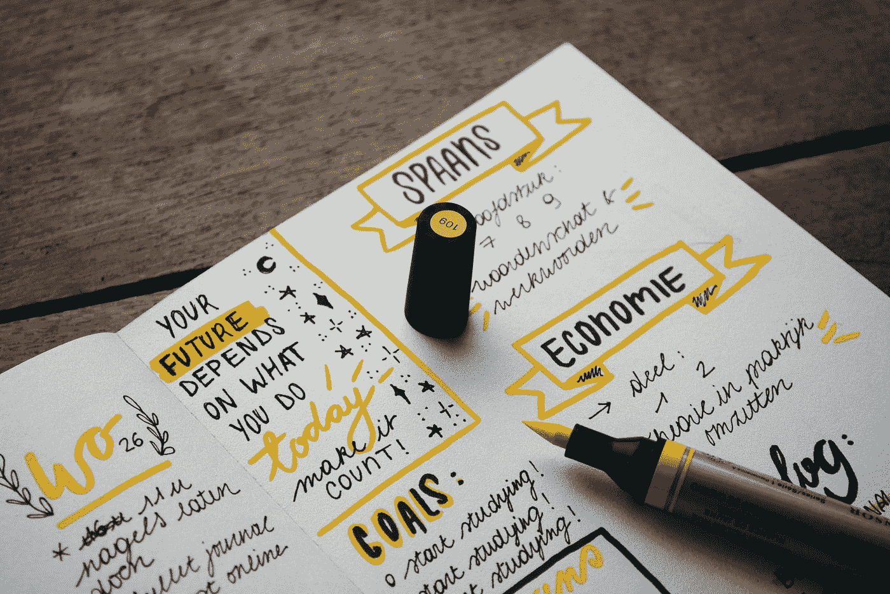
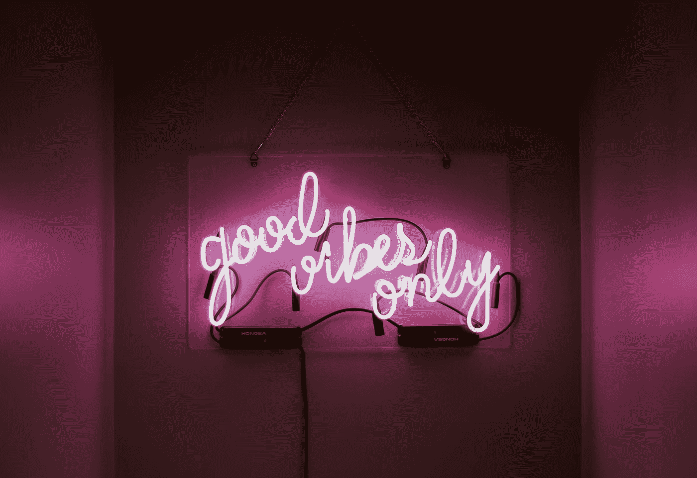

# 如何在迈向数据科学的旅程中保持灵感

> 原文：<https://towardsdatascience.com/how-to-be-motivated-in-learning-data-science-d459811b4aab?source=collection_archive---------17----------------------->

## 以下是保持学习数据科学积极性的 7 个技巧。

Photo by [Kristopher Roller](https://unsplash.com/@krisroller?utm_source=medium&utm_medium=referral) on [Unsplash](https://unsplash.com?utm_source=medium&utm_medium=referral)

由于数据科学是一个相对较新的领域，如果没有正确的心态和方向，学习数据科学可能会令人疲惫不堪。此外，仅仅通过使用 [Scikit-learn](https://scikit-learn.org) 掌握数据可视化或了解所有[机器学习](https://en.wikipedia.org/wiki/Machine_learning)术语，你不会立即成为数据科学家。这需要几个月甚至几年的实践和对不完美数据的亲身实验。它是软技能(黑客技能)和硬技能(沟通)的融合。

也就是说，学习它将是你一生中最好的投资之一。难学甚至更难掌握的事实使得这个领域在未来的岁月里非常有价值。同样值得理解的是，你不能只学习数据科学，因为它是许多[技能](/the-most-in-demand-skills-for-data-scientists-4a4a8db896db)的组合，你所能做的就是提高这些技能。

现在，在我进入改变生活的建议——获得动力和燃烧激情之前，我相信如果你心满意足地发现自己需要学习数据科学的动力，那么你可能根本就不应该走这条路。一个真正热爱数据，热爱用黑客技巧和数学分析事物的个体，应该是愿意不断学习数据科学的。每一天都应该被视为学习的机会。

> 如果你经常发现自己需要学习数据科学的动力，那么你就不应该一开始就追求它。

尽管如此，这里有 7 种方法可以点燃你内心的火，让你开始感到被点燃了去实现你的目标。突出对你来说很重要的想法，仔细思考，花时间思考，好好阅读。

# 1.不要让金钱成为你的动力

Photo by [Alexander Mils](https://unsplash.com/@alexandermils?utm_source=medium&utm_medium=referral) on [Unsplash](https://unsplash.com?utm_source=medium&utm_medium=referral)

首先，金钱不应该是你的首要目标或动机。我这么说是因为你可能已经决定进入数据科学领域，因为那里有丰厚的薪水和难以置信的高需求。据 [Glassdoor](https://www.glassdoor.com/Salaries/data-scientist-salary-SRCH_KO0,14.htm) 报道，数据科学家的平均工资为 120495 美元/年，最高为 163000 美元/年。

> “钱通常是被吸引来的，而不是被追求来的。”—吉米·罗恩

尽管社会传播着这样一种观点，即获得大学学位的动力是受雇于一家有声望的公司，有一份赚钱的工作，以便谋生和偿还债务，等等。即便如此，我认为金钱不应该成为一个人进入数据科学或任何工作的动机。

在我看来，这是因为从长远来看，金钱并不能给你带来动力。当然，你可能对你在优步或脸书的新数据科学工作充满热情，而且你在财务上做得很好，但如果你正在做的事情不是你喜欢的，迟早你会意识到，当钱可以用来实现上帝赋予你的目的和使命时，它不值得你宝贵的生命。同样，许多数据科学家正在离开他们的工作岗位，主要是因为他们的期望与现实不符。所以好好想想，反复思考这个问题。

# 2.设定你自己的目标

Photo by [Estée Janssens](https://unsplash.com/@esteejanssens?utm_source=medium&utm_medium=referral) on [Unsplash](https://unsplash.com?utm_source=medium&utm_medium=referral)

目标是你发展和成功的基石。没有它们，就像跑一场没有终点线的比赛。没有目标意味着你的生活没有意义。所以很明显，有目标是很重要的。

即使你已经有了目标，挑战也在于确保这些目标是你独有的，而且只属于你一个人。永远不要根据别人说的或做的来设定目标。它应该符合你对生活的愿景，而且是没人能说服你放弃的事情。

> “如果你想快乐，就设定一个目标，这个目标能控制你的思想，释放你的能量，激发你的希望。”—安德鲁·卡内基

将你的目标分为短期和长期也是很好的，这样你就可以有所作为。短期目标可以为你提供短暂的推动力，驱使你努力实现长期目标。

假设你的目标是获得一份与数据科学相关的工作。短期目标是学习基本的 Python 和与数据科学家建立联系，长期目标是在数据科学领域找到一份工作，成为一名全栈数据科学家。

一个建议是试试[概念](https://medium.com/u/efd97a1c507b?source=post_page-----d459811b4aab--------------------------------)应用，它有很棒的模板，可以用来设定目标、待办事项、笔记等等。这将是一个非常有用的反思工具，提醒你关于你的目标和日常反思，无论你是否朝着你的目标努力。现在就试用！

# 3.用创造性的视觉想象结果

Photo by [Caleb Jones](https://unsplash.com/@gcalebjones?utm_source=medium&utm_medium=referral) on [Unsplash](https://unsplash.com?utm_source=medium&utm_medium=referral)

创造性想象描绘了一种方法，利用你的想象力来想象你想要的结果，并为你构建一幅精神画面来重新连接你的大脑。这让你的头脑有努力的目标，就像灯塔用它的光束指引船只驶向安全。

它是许多成功人士自觉或不自觉使用的一个不可或缺的工具，让他们高度专注于实现自己的梦想和抱负。通过想象自己成功，他们实际上吸引了成功。

> “在做之前想象一下你想做什么。可视化是如此强大，当你知道你想要什么，你就会得到它。”
> 
> ——奥黛丽·弗莱克

如果你决定进入数据科学，那么你必须有一份理想的工作或公司，GAFA 公司——谷歌、苹果、脸书和亚马逊是许多数据爱好者渴望进入的知名科技公司。

举例来说，如果你的梦想是成为一名首席数据科学家，想象自己是 GAFA 公司的一员，管理一个由数据科学家、ML 工程师和大数据专家组成的团队，规划数据项目，建立预测模型等。

现在试试吧，去吧。闭上眼睛，想象自己处于最后阶段，想象每一个过程的细节。每天花些时间这样做，甚至你最疯狂的梦想也可能实现。

# 4.驾驭习惯的力量

Photo by [Drew Beamer](https://unsplash.com/@drew_beamer?utm_source=medium&utm_medium=referral) on [Unsplash](https://unsplash.com?utm_source=medium&utm_medium=referral)

T 尽管习惯被认为是不好的，不利于一个人的生活，比如吸烟，甚至是在 Instagram 上随意滚动，但习惯也可以是好的。专业人士将习惯视为给他们的生活提供结构的东西，并关注他们生活中的某些基本惯例。例如，比尔·盖茨读书很多，事实上，他一年读 [50 本书](https://www.inc.com/marcel-schwantes/bill-gates-reads-50-books-per-year-but-only-these-6-leadership-books-made-his-list-of-recommendations.html)。通过使阅读成为一种习惯，它已经成为他的第二天性。他强烈的好奇心和求知欲培养了他阅读的习惯，这造就了他今天的成就。

在查尔斯·杜希格的《习惯的力量》一书中，他提到成功的关键在于理解习惯是如何工作的。所有爬上成功阶梯的人都到达了顶端，因为他们专注于塑造他们生活的潜在模式，并建立了培养成功的习惯。

> “冠军不做不平凡的事。他们做普通的事情，但他们不加思考地做，快得让另一个团队反应不过来。他们遵循他们已经学会的习惯。”查尔斯·杜希格

在学习阶段，你应该养成无数的习惯，以便更好地为未来做准备。首先，收集一份来自可靠来源的 A 级内容的资源列表，这样，你就有一个独特的渠道来跟上数据科学每日的最新消息，并跳过互联网上的所有垃圾。

接下来，养成问很多很多问题的习惯。作为一名数据科学家，你的工作就是做一名科学家，对数据做出假设。关键在于提出正确的问题，并据此做出理想的决策。此外，为了管理复杂性并使您的数据科学项目更不容易出错，您应该养成某些[编码习惯](https://www.thoughtworks.com/insights/blog/coding-habits-data-scientists)——例如保持代码整洁和使用函数。

# 5.极其乐观

Photo by [Allie Smith](https://unsplash.com/@creativegangsters?utm_source=medium&utm_medium=referral) on [Unsplash](https://unsplash.com?utm_source=medium&utm_medium=referral)

O 乐观主义被定义为一种倾向于事物积极一面的精神优势。乐观主义者对事物有更高的期望，梦想更大，而悲观主义者(相反)通常期望较低，并认为一切都是最坏的。因此，乐观主义者更快乐，更健康，情商也更高。

> “悲观者在每个机会中都看到困难；乐观主义者在每一个困难中都看到机遇。”温斯顿·丘吉尔

很明显，我们的思想对我们的行为和态度有很大的影响。如果你一直面对障碍和路障，你很容易失去自信。如果你让你的失败有害地影响你的想法，你会开始认为其他人都比你更有资格，你只是一个模仿者。这就是专家所说的冒名顶替综合症。

简而言之，当你对自己的成功有不确定性，并且永远害怕被暴露为“伪装者”时，就会出现冒名顶替综合症。这种综合症在数据科学领域非常普遍，原因有很多，但主要是因为 ML 工具的激增和数据科学定义不明确的事实。正如亚历克斯·兰姆所解释的，

> 这些工具的真相是，它们中的大多数都有很大的重叠。你不需要把它们都冷冻起来。但这不会阻止你的感觉。

应对这种不断把你推下去的综合征可能很难，但乐观地看，你会以不同的方式看待这个世界，并意识到有很多人和你一样面临这种综合征。不要让消极情绪征服你，要意识到即使是最好的人也会跌倒。相信自己，在任何情况下都保持乐观。

# 6.让你周围都是专家

Photo by [Product School](https://unsplash.com/@productschool?utm_source=medium&utm_medium=referral) on [Unsplash](https://unsplash.com?utm_source=medium&utm_medium=referral)

你可能听说过这句话“你周围的人，你会成为什么样的人。”之前。生活给我们设置了许多障碍，在通往成功的道路上，总会有人质疑你的信念，挑战你。还有什么更好的方法能让你重新站起来，和那些听你说话并推动你前进的人一起前进。

不要成为房间里最聪明的人也很重要，因为那只会限制你真正的潜力，阻碍你成长和个人发展的空间。通过将聪明人包围在你周围，并与他们交换意见，你才能完全重新构建你对世界的框架，并提高你的期望

> "你是和你相处时间最长的五个人中的平均水平。"—吉米·罗恩

为了让自己周围都是数据科学专家，你可以尝试在 LinkedIn、Twitter 等网站上与数据科学专家建立联系，因为在这个领域，联系是无价的。此外，参加[聚会](https://www.meetup.com/topics/data-science/)和[会议](https://www.kolabtree.com/blog/top-20-data-science-conferences-in-2020-that-you-cant-miss/)也是让自己置身于来自世界各地的专家之中的另一个好方法。这不仅会拓展你的思维，而且你会从他们的激情和能量中汲取营养，让你充满活力和热情，开始为你的目标和梦想而努力。

ODSC 东方 2020 由 [ODSC -开放数据科学](https://medium.com/u/2b9d62538208?source=post_page-----d459811b4aab--------------------------------)是 2020 年 4 月举行的最大的人工智能会议之一！不要错过！去那里，让你自己被人工智能中最大的名字包围。

# 7.查看大图

Photo by [pine watt](https://unsplash.com/@pinewatt?utm_source=medium&utm_medium=referral) on [Unsplash](https://unsplash.com?utm_source=medium&utm_medium=referral)

放眼全局意味着对你的目标有一个总体的想法。在你的头脑中有一个大的图景是非常重要的，因为有时候你会在你的学习过程中走极端，偏离你最初的目标。你现在看到的有益的东西从长远来看未必有益。

> 学会看清大局。我们常常目光短浅，看不到大局，也看不到我们真正想要完成的目标。—罗伯特·奇克

一个看不到全局的例子是，你可能会沉迷于学习太多的 ML 工具，最终成为一个万事通，但没有一个是大师。虽然掌握 ML 工具的知识在数据科学中是必不可少的，但是您只需要一些重要的工具来完成您的工作。因此，从这个意义上来说，大局可能是在数据科学世界中找到自己的位置。

问自己这个问题:数据科学的哪一部分首先让你着迷？是在 it 的业务方面，您与领导者和投资者交流数据吗？或者是机器学习不可思议的潜力和无限的能力？如果什么都不懂，那就去争取全栈数据科学家的职位。

你想达到的目标是什么？你清单上的第一个？把它写下来，放在你每天都能看到的地方。确保它不是一个你可以在一天或几周内完成的目标，它必须是值得你每天为之奋斗的东西，是让你感动并在你内心燃烧的东西。有了这个，你就能走在自己定义的成功之路上。

# 摘要

1.  不要让金钱成为你的动力
2.  为你的生活设定独特的目标
3.  用创造性的视觉想象结果
4.  驾驭习惯的力量
5.  异常乐观
6.  和志同道合的人在一起
7.  查看大图

感谢阅读，我希望这篇文章对你有深刻的见解，并激励你去实现你的激情。

查看我的文章《给数据科学初学者的可行建议》!

 [## 给数据科学初学者的 5 条可行建议

### 这里是给进入数据科学的人的 5 个建议

towardsdatascience.com](/5-actionable-advice-for-data-science-beginners-50fd912aa2d6) 

关注我在 LinkedIn 和 T2 Twitter 上的更新。