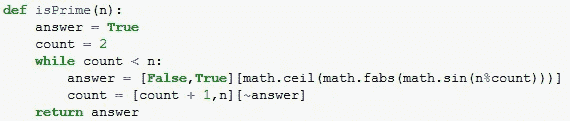

# 如何成为 Pythonic 式的，为什么你应该关心

> 原文：<https://towardsdatascience.com/how-to-be-pythonic-and-why-you-should-care-188d63a5037e?source=collection_archive---------4----------------------->

## 提高 Python 软件质量的常用策略


Token photo of a Python for an article about [the other kind of] Python. Photo by [Tyler B](https://unsplash.com/@carstyler?utm_source=medium&utm_medium=referral) on [Unsplash](https://unsplash.com?utm_source=medium&utm_medium=referral)

# 蛇就是蛇，就是这样

我已经正式写了十几年的代码，最后 5 年是全职软件工程师，虽然我还有很多要学的(确切地说，是一辈子的学习！)，在那段时间里，我已经见识了相当多的软件，并且(我敢说)极大地发展了我在该领域的技能。我仍然记得我写的第一批程序，晚上躺在床上回想我做程序员新手时的噩梦。虽然我永远无法逃脱过去的罪行(编写五重嵌套循环是最大的罪行)，但也许我可以通过帮助其他新手学习一些最佳实践来编写更快、更干净、更好的代码，从而部分地救赎自己，即使只是轻微的救赎。


Photo by [Rock'n Roll Monkey](https://unsplash.com/@rocknrollmonkey?utm_source=medium&utm_medium=referral) on [Unsplash](https://unsplash.com?utm_source=medium&utm_medium=referral)

# 蟒蛇——一种仿生蟒蛇？

与几乎所有编程语言一样，Python 社区接受了某些特定的风格和常规指导原则，以促进统一、可维护和简洁的应用程序，这些应用程序是按照该语言设计的方式编写的。这些指导方针从适当的变量、类和模块命名约定，到循环结构，甚至是包装代码行的适当方式。“Python”这个名字是用来描述任何遵循这些准则并利用 Python 独特功能的程序、函数或代码块的。

为什么所有这些都很重要？这个问题可以有多种解释，但是您应该关注的几个关键原因可以归结为代码的清晰性、效率和可信度。让我们进一步分析一下。

## 清楚

如果你想成为一名开发者，代码的清晰对你的成功至关重要。随着您在该领域的成长，您可能会在某个时候与其他人一起工作，这将需要同事阅读您的代码。如果你的代码写得很差，别人破译你的意图可能是一场噩梦，即使代码很短。从 [r/badcode 子编辑](https://www.reddit.com/r/badcode/comments/b9djrv/if_statements_are_evil/)中选取以下示例:



The definition of insanity

这个代码有用吗？没错。函数名描述了函数的用途吗？确实如此。如果您更改了函数名，是否很容易确定这段代码应该完成什么？如果不花一个小时分析它，可能不会。

正如我所知道的每一个开发新手(包括我自己)的情况一样，当涉及到代码时，有一种普遍持有的“它能工作——不要碰它”的心态。当我们可以写一些东西来解决我们的问题时，我们害怕对代码做任何事情，害怕我们会破坏一切并且无法再次修复它。

我鼓励任何开发人员尽早打破这种心态(这适用于所有语言)。即使你自己编写了糟糕的代码，一个星期，一个月，甚至一年后，你也很难再回头去看它，试图揭开它的神秘面纱。更糟糕的是，如果你自己都不能破译代码，你怎么能指望队友或合作者来揭开其中的含义呢？

通过按照语言设计的方式编写程序，开发人员自然会编写出看起来与同行相似的代码。这使得它易于理解，易于分享，易于更新。

## 效率

回到我在大学实习的时候，我在工作中遇到的一个实习生同事告诉我“不要费心去写已经用 Python 写好的东西，因为你不可能写出更好的东西。”虽然我最初对这种令人沮丧的想法感到沮丧，但我最终意识到他的说法有些道理。到目前为止，Python 已经存在了近三十年，并迅速成为全世界开发者最流行的语言之一。Python 还以包含大量库而闻名，这些库几乎可以做你想要或需要的任何事情。这些库和特性中的许多都见证了成千上万的成员在几年内创建更新，尽可能地从每一行代码中榨取尽可能多的性能。虽然我们当然欢迎您编写自己的最佳字符串比较函数，但您得到的结果可能不会比现有的结果更快，而且开发新函数所花的时间可能已经花在了您试图解决的实际问题上。一般来说，寻找一个内置函数或数据类型来实现你所寻找的。很有可能，这将是完成任务最快的方法。如果没有，检查是否有任何可以安装的库或包可以满足您的需要。如果你仍然没有解决方案，现在是时候创造自己的解决方案了！

## 可靠性

对于第一次学习如何用 Python 之外的语言编程的人来说，通常很清楚开发人员来自哪种语言。以下面这个问题为例:

*   求 10 到 1000 之间所有数字的和

C(或 C++)开发人员可能会按照下面的思路写一些东西:

```
int a = 10;
int b = 1000;
int total_sum = 0;while (b >= a) {
    total_sum += a;
    a++;
}
```

对此的直接 Python 重写看起来非常相似:

```
a = 10
b = 1000
total_sum = 0while b >= a:
    total_sum += a
    a += 1
```

虽然上面的语句会产生预期的输出，但大多数 Python 开发人员会对这段代码不满，抱怨它不是 Python，没有利用该语言的强大功能。从头开始，你可以用 Pythonic 的方式来解决这个问题:

```
total_sum = sum(range(10, 1001))
```

这一行代码生成了与上面完全相同的结果(为了记录，我*打算在代码中写`1001`，因为 Python 的`range`命令有一个包含的下限和一个不包含的上限，这意味着较低的数字将是循环的一部分，而较高的数字则不是)。如果您使用第一个例子编写 Python 代码，您作为 Python 开发人员的可信度将会下降，因为 Python 社区非常热衷于按照指南编写代码。这是另一个例子:*

*   确定特定字符串是否在数组中

对于大多数非 Python 开发人员来说，第一个解决方案可能是这样的:

```
#include <stdbool.h>
char * arr[] = {"apples", "oranges", "bananas", "grapes"};
char * s = "cherries";
bool found = false;
int len = sizeof(arr) / sizeof(arr[0]);for (int i = 0; i < len; i++) {
    if (!strcmp(arr[i], s)) {
        found = true;
    }
}
```

和以前一样，直接的 Python 翻译应该是:

```
arr = ["apples", "oranges", "bananas", "grapes"]
s = "cherries"
found = False
size = len(arr)for i in range(0, size):
    if arr[i] == s:
        found = True
```

我相信你已经猜到了，用 Python 写这个有一个更简单的方法:

```
arr = ["apples", "oranges", "bananas", "grapes"]
found = "cherries" in arr
```

无论你选择上面的哪种方法，`found`最终总会评估到`False`(或`false`)。然而，当谈到 Pythonic 代码时，最后一个选择显然是冠军。它简明易懂。即使那些从未读过 Python(或任何相关代码)的人也有机会理解最后一个代码块的意图，这与前两个不同。

最后一个例子是我最喜欢的 Python 工具之一，**列表理解**。这种技术允许你在一个列表中嵌入一个循环来创建一个新的列表。请考虑以下情况:

*   将数组中每个偶数的值加倍

首先，这里是 C 代码:

```
int[] arr = { 1, 2, 3, 4, 5, 6 };
int length = sizeof(arr) / sizeof(arr[0]);for (int i = 0; i < length; i++) {
    if (arr[i] % 2 == 0) {
        arr[i] *= 2
    }
}
```

直接的 Python 翻译:

```
arr = [1, 2, 3, 4, 5, 6]
length = len(arr)for i in range(0, length):
    if arr[i] % 2 == 0:
        arr[i] *= 2
```

现在大蟒道:

```
arr = [1, 2, 3, 4, 5, 6]
arr = [x * 2 if x % 2 == 0 else x for x in arr]
```

如果你从未见过列表理解的实际应用，这可能看起来很滑稽。我发现从右向左看理解列表通常是最容易的。首先，它遍历列表中的每个元素`for x in arr`，然后检查元素是否为偶数`if x % 2 == 0`。如果是这样，它将数字加倍`x * 2`，如果不是`else x`，则保持不变。无论元素最终是什么，它都会被追加到一个新的列表中。在我们的例子中，我们用新的列表覆盖了`arr`的原始值。

这些只是编写代码 Pythonic 化的几种常见方法。您可能已经注意到，所有这些例子都包含某种循环。虽然有许多方法可以编写 Pythonic 代码，但是一个很好的做法是问问自己是否真的需要一个循环，或者是否可以用一个惯用的替代方法来代替它。

如果您关心您在软件世界中的可信度，并且想自豪地称自己为 Python 开发人员，那么请确保您知道并在代码中使用这些适用的技术。


Photo by [Carolyn V](https://unsplash.com/@sixteenmilesout?utm_source=medium&utm_medium=referral) on [Unsplash](https://unsplash.com?utm_source=medium&utm_medium=referral)

# 叶老指引道

希望您现在理解了编写 Pythonic 代码的重要性。在这一点上，你可能想知道一些指导方针是什么，以及你如何能遵循它们。请允许我向您介绍一下 [Python 增强提案#8 (PEP 8)。对于那些不熟悉 pep 的人来说，它们是由社区编写的提案，旨在改进 Python 的某些方面，从性能到新功能和文档。具体来说，第 8 个提议提供了关于样式指南和约定的建议。这是一个经常被引用的关于如何成为 Pythonic 的资源，如果你还没有读过，我强烈推荐你读一读。以下是我认为最重要的一些话题:](https://www.python.org/dev/peps/pep-0008/)

## 命名规格

命名约定对于任何语言都很重要，它提供了一种标识类型和对象的通用方法。以下是命名约定的简略版本:

*   **包/模块:**必须全小写。必要时可以使用下划线，但不鼓励使用。例如:`package`或者`module.py`。
*   **类:**必须使用 CapWords。建议不要在名字中使用`Class`二字。例:`class BasketballTeam:`。
*   **常量:**必须使用尖叫蛇格。例:`API_URL = '...'`。
*   **函数/变量:**必须使用标准蛇盒。例如:`home_team_points = ...`或者`def final_boxscore(...)`。
*   **函数/方法参数:**必须使用标准 snake case。例:`home_team_name`。

## 注释的正确使用

注释是代码清晰的重要辅助。我通常建议在代码的任何部分上面添加注释，这些注释的目的对于其他人来说并不明显。一般来说，注释应该是完整的句子，位于代码块之上，用英语写。此外，建议使用文档字符串(或“文档字符串”)来记录函数的用途，以及描述输入和输出的类型、名称和描述(如果适用)。PEP 257 包含了大量关于如何使用文档字符串的信息。

## 将行换行到 79 个字符或更少

Python 开发中一个更有争议的话题与换行有关。PEP 8 要求每行代码少于或等于 79 个字符。一些嵌入式系统的屏幕尺寸有限，一行最多只能显示 80 个字符，如果更长的话，就需要很难看的代码包装。此外，如果某一行代码长达数百个字符，那么阅读起来会非常困难，因为该行中可能会丢失许多变量和函数调用。

虽然在大多数情况下这可能不是问题，但有时一行代码需要大量的空间，尤其是当它包含长变量名或复杂的列表理解时。解决这一问题的几种方法是，每次在函数调用中使用逗号时创建一个换行符。例如，替换

```
some_function(first_var, second_var, third_var, ... twelfth_var)
```

随着

```
some_function(first_var,
              second_var,
              third_var,
              ...
              twelfth_var)
```

上面的两个块将被完全相同地执行。而在括号(或元组)中，逗号后新行上的任何代码都将作为下一个参数包含在语句中。

Python 还允许使用反斜杠来分隔不包含在元组或其他类似对象中的代码。例如，替换

```
if first_boolean_variable == accepted_value and not second_boolean_variable:  # This is all one line
    print('Accepted')
```

随着

```
if first_boolean_variable == accepted_value and \
   not second_boolean_variable:  # This is a second line
    print('Accepted')
```

虽然这些改变会给你的程序增加额外的代码行，但它会变得更容易阅读，尤其是在一系列的显示类型和尺寸上。


Photo by [Jared Rice](https://unsplash.com/@jareddrice?utm_source=medium&utm_medium=referral) on [Unsplash](https://unsplash.com?utm_source=medium&utm_medium=referral)

# Python 的禅

另一个经常被引用的资源是 Python 的 *Zen。以下短文是蒂姆·皮特斯写的 [PEP 20](https://www.python.org/dev/peps/pep-0020/) 的唯一内容:*

> 漂亮总比难看好。
> 明的比暗的好。
> 简单胜于复杂。
> 复杂总比复杂好。
> 扁平比嵌套好。
> 稀不如密。可读性很重要。特例不足以特殊到打破规则。
> 虽然实用性胜过纯粹性。错误永远不会悄无声息地过去。
> 除非明确消音。
> 面对暧昧，拒绝猜测的诱惑。应该有一种——最好只有一种——显而易见的方法。虽然这种方式一开始可能并不明显，除非你是荷兰人。
> 现在总比没有好。
> 虽然从来没有经常比现在*好。如果实现很难解释，这是个坏主意。如果实现很容易解释，这可能是个好主意。
> 名称空间是一个非常棒的想法——让我们多做一些吧！

虽然上面的几行是不言自明的，但最重要的主题可以用第七条来概括:“可读性很重要。”对我来说，这意味着任何 Python 开发人员，不管他或她的经验如何，都应该能够阅读和理解代码。Python 使用一种简单的语法，这种语法比几乎所有其他语言都更接近自然英语。因此，代码应该简单美观。用英语传达信息的最好方法是以简洁的方式表达。Python 也是如此。

不管你的代码要实现什么，永远记住 Python 的禅。如果您的代码不遵循这些原则，那么它就不是真正的 Pythonic 应用程序。


Every developer needs a set of useful tools. Photo by [Cesar Carlevarino Aragon](https://unsplash.com/@carlevarino?utm_source=medium&utm_medium=referral) on [Unsplash](https://unsplash.com?utm_source=medium&utm_medium=referral)

# 编写 Pythonic 代码的工具

我们现在已经了解了为什么 python 代码很重要，一些关键原则是什么，以及一些 python 代码的例子。毕竟，是时候我们学习如何实际应用这些技术了。幸运的是，有几个工具可以用来检查我们的代码是否符合 Python 的指导方针。第一个工具，`pycodestyle`(以前的`pep8`)检查任何指定的 Python 模块，以确定它是否违反了 PEP 8 中列出的任何准则。更多信息可以在 [GitHub 库](https://github.com/PyCQA/pycodestyle)上找到。

另一个常用的工具是`[pylint](https://www.pylint.org/)`。`pylint`的基本前提与`pycodestyle`相同，但它更进一步，在范围和建议上更具侵略性。我个人更喜欢`pycodestyle`，因为我在过去遇到过几次`pylint`的误报。虽然有一些方法可以对抗这些误报，但我发现不值得不断地修改我的源代码来解决问题，并解释为什么某些行没有通过，但应该通过。

我还应该注意到，还有额外的代码验证和林挺工具，但是上面提到的两个是最常用的资源。

**编辑:**感谢 [Tarun Chadha](https://medium.com/u/48a898c32082?source=post_page-----188d63a5037e--------------------------------) 提到这些工具可以与流行的 ide 集成，比如 [PyCharm](https://www.jetbrains.com/help/pycharm/reformatting-source-code.html) 和 [Visual Studio Code](https://code.visualstudio.com/docs/python/linting) 。


Photo by [Sara Kurfeß](https://unsplash.com/@stereophototyp?utm_source=medium&utm_medium=referral) on [Unsplash](https://unsplash.com?utm_source=medium&utm_medium=referral)

# 为地道的未来干杯！

如果您已经做到了这一步，那么现在您应该掌握了编写更快、更干净、更好的 Python 应用程序的知识。这不仅有助于您的开发技能，还会赢得 Python 社区的更多尊重。实践这个行业，你可能会被认为是伟大的 Python 开发者的神圣领域。