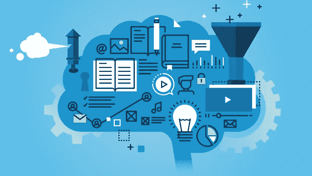
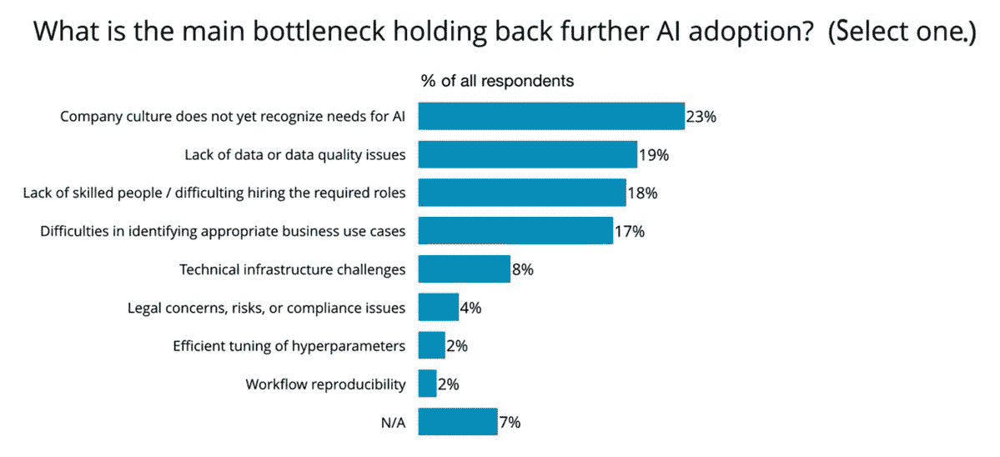
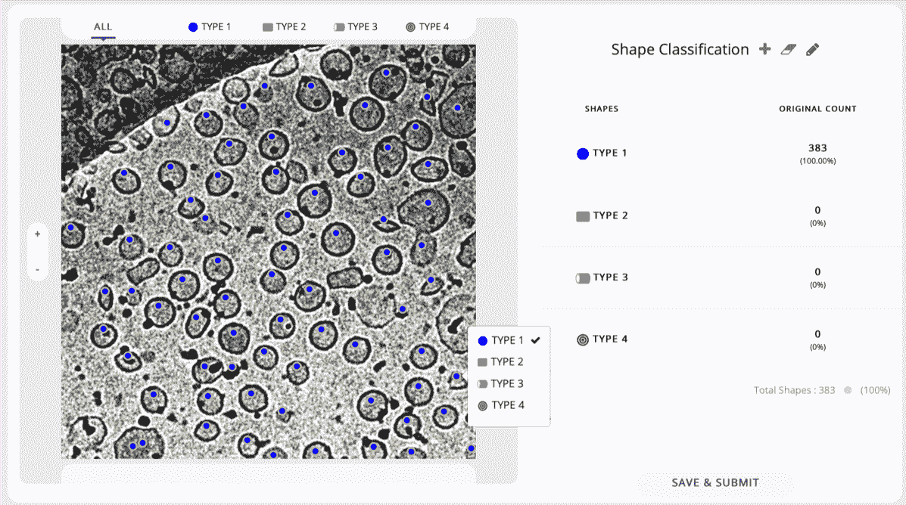
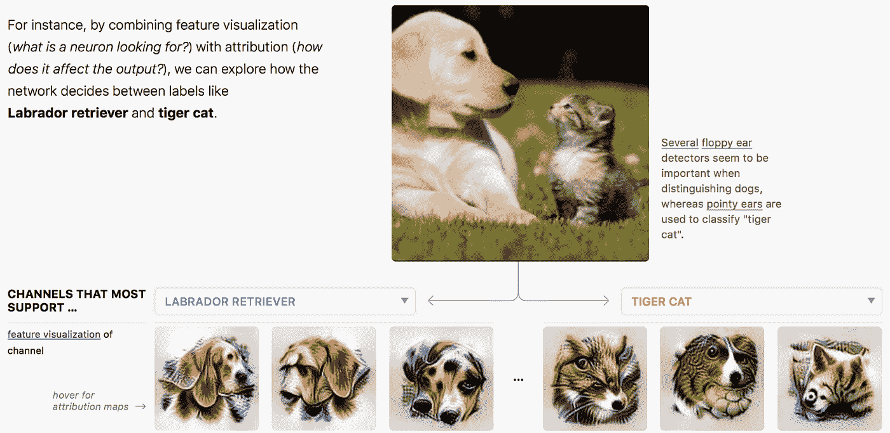

# 如何战胜人工智能项目的阻力:3 个步骤

> 原文：<https://towardsdatascience.com/how-to-beat-resistance-to-ai-projects-3-steps-bb191c310c4a?source=collection_archive---------23----------------------->

## 是什么阻碍了人工智能在您的组织中的采用？了解制药公司如何克服 3 个最常见的障碍

在最近由 O'Reilly 进行的一项调查中，受访者称“公司文化”是在他们的组织中采用人工智能的最大瓶颈。尽管人们对人工智能议论纷纷，但组织中的大多数人还没有认识到人工智能的必要性。

*Pic: O’Reilly* [*survey*](https://www.oreilly.com/data/free/ai-adoption-in-the-enterprise.csp) *on AI adoption in the enterprise*

在我看来，每个组织的高管都面临三个常见的障碍:

1.  人工智能从何入手？
2.  这对企业来说是否可行？
3.  你如何获得预算和买入费？

让我们看一个真实的例子，一个制药行业客户如何在药物发现中采用人工智能来解决这些问题。

# 1.找到你的人工智能可以解决的商业问题

启动任何数据分析项目的最糟糕方式是询问关于数据或分析的问题。相反，通过识别最大的商业挑战来开始你的人工智能之旅。

> 启动任何数据分析项目的最糟糕方式是询问关于**数据**或分析的问题。

数据科学只有在解决业务问题时才能发挥价值。第一步是识别业务挑战并确定其优先级。

这家制造仿制药的制药公司渴望开始一场人工智能之旅。通过绘制他们的现有业务流程，他们发现药物特性是一个需要改进的领域。这是药物发现的关键一步，包括研究分子的大小、形状和特性。

这里的挑战之一是从显微图像中计数生物细胞。这是一项痛苦的手动任务，耗费了病理专家数小时的时间。这是应用人工智能的潜在候选者。

*Pic: Microscopic image showing the biological cells*

# 2.评估人工智能试点的可行性和潜力

确定了最大的业务挑战后，对它们进行优先级排序。发现挑战对业务团队有多重要。检查是否可以通过数据和分析解决。

评估一下是否真的需要 AI 的火力。很多问题通过简单的分析就可以更高效的解决。当你必须应用人工智能时，通过建立一个快速试验来检查可行性。

> *算法从来都不是 AI 项目中最大的挑战。今天，大多数常见用例都有开源模型库。*

今天，有[个开源](https://github.com/torch/torch7/wiki/Cheatsheet#images)库的 [AI 算法](https://www.tensorflow.org/resources/models-datasets)可供通用用例使用。检查如何利用它们。公司文化抵制人工智能，因为缺乏熟悉和无法感知其好处。试点有助于正面解决这一问题。

制药客户选择解决手动细胞计数问题。人们发现这类似于人群计数——估计人群中的人数。一项文献研究揭示了关于人工智能驱动的人群计数的学术论文。

下一步是重用公共算法。在 Gramener 人工智能实验室，我们已经使用人工智能在购物中心进行了人群计数的试点实施。我们把它改装成一个工作试点来计算生物细胞。该试点项目展示了可行性、工作量和成本影响。利用潜在的时间和金钱节约，计算投资回报(ROI)。

*Pic: AI pilot solution with a UI to count cells of different shapes*

# 3.展示投资回报率和人性化的人工智能模型的结果

一旦你确定了商业问题的潜在人工智能解决方案，你必须在内部销售它们。高管们可能想知道人工智能项目是否是他们 IT 预算的最佳用途。由于可解释性和准确性的问题，用户可能会怀疑人工智能解决方案。他们担心人工智能是否会取代他们。所有这些导致了一种抵制文化。

> *始终使用视觉叙事来解释和人性化人工智能模型的结果。*

通过展示业务投资回报，说服管理层预算。人工智能的不断进步有助于带来信任和透明的元素。利用它们和视觉故事向用户解释人工智能模型的结果。通过建立人的反馈和改进的渠道，让人们了解情况。

制药客户的 IT 主管证明，每张图像节省了 80%的时间。一年处理数千张图像，投资回报非常明显。

该解决方案构建了丰富的可视化层，以使模型输出易于理解。审查、编辑和添加手动输入的交互功能使人保持在循环中。人工智能可以通过人类输入的自动再训练来改善每一次运行。

*Explainable AI: A* [*framework*](https://distill.pub/2018/building-blocks/) *to visualize what the AI uses to distinguish dogs from cats*

# 将人工智能项目视为业务转型计划

总之，人工智能项目与业务转型项目没有什么不同:选择正确的问题来解决。通过试点评估想法。用可消费的福利说服用户。

然而，实践者经常被解决方案冲昏头脑。他们忽略了必须解决的问题。另一方面，用户被围绕人工智能的大肆宣传吓倒了。所有这些导致了一种抵制人工智能项目的文化。

技术领导者必须促进人工智能从业者和工具使用者之间的合作。他们需要教育人们人工智能将如何授权而不是压制他们。

您还必须导航人工智能项目要求的变更管理。通过教育、授权和启发来带动整个组织。

*这篇文章最初是由* [*发表在*](https://enterprisersproject.com/article/2019/7/artificial-intelligence-ai-how-to-beat-resistance) *企业家项目上。增加了插图。*