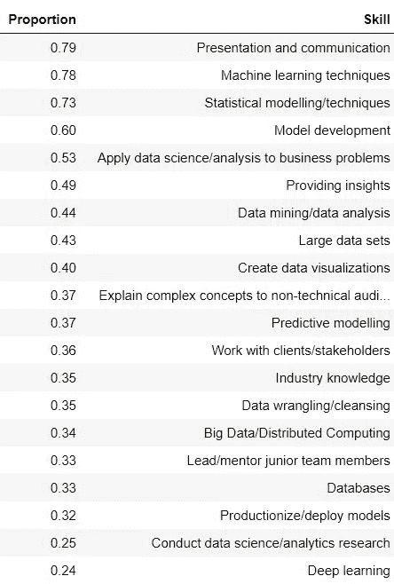
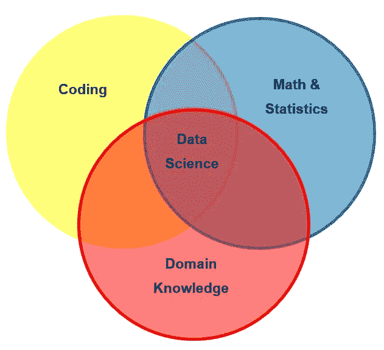
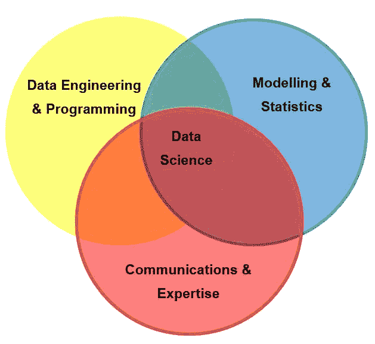

# 如何成为数据科学三重威胁

> 原文：<https://towardsdatascience.com/how-to-become-a-data-science-triple-threat-bb41e0664ca5?source=collection_archive---------7----------------------->

所以，前几天晚上我在看*闪电侠*(别评头论足)，我起来看了*闪电侠/超女*穿越集、*二重唱*，其中闪电侠(格兰特·古斯汀)和超女(梅利莎·拜诺伊斯特)被困在一部音乐剧中，为了逃离不得不唱歌跳舞。

很明显，这一集之所以成为可能，是因为 Gustin 和 Benoist(以及他们的许多合作明星)都是非常有才华的演员，能歌善舞，还会演戏。

也就是说，他们是“三重威胁”。精通三种关键的、受欢迎的技能的人，会有令人难以置信的就业前景(如果你感兴趣，你可以在这里和这里[看到这一集](https://www.youtube.com/watch?v=TeSySg5KEGk)[的片段)。](https://www.youtube.com/watch?v=7UPun57MMoU)

这让我开始思考。如果演艺界的“三重威胁”是会唱歌、跳舞、演戏的人，那么数据科学的三重威胁是什么样子的？你如何着手成为一个人呢？

# 数据科学家最重要的三项技能

为了回答这个问题，我研究了 2019 年 4 月 22 日至 2019 年 5 月 5 日期间在 [LinkedIn](https://www.linkedin.com/jobs/) 上发现的四个英语国家(澳大利亚、加拿大、英国和美国)的 100 个数据科学招聘广告。

这些招聘广告被选择来代表雇主类型、规模、行业和工作级别的广泛代表性，而纯粹的管理角色没有被考虑。

从这些招聘广告中，我手动提取了作为选择标准或在角色的日常职责中列出的技能的详细信息，并根据这些技能在招聘广告中出现的比例，确定了最受欢迎的 20 项数据科学技能。

他们在这里:

[如果你想知道，在创建这个列表时，我专注于一般技能，而不是特定的编程语言或技术，这就是为什么像 R、Python 和 Hadoop 这样的东西不值得一提。]

这些技能可以大致分为三类:

*   **建模和统计**:包括机器学习、统计建模和模型部署；
*   **数据工程(和编程)**:包括数据争论、使用数据库和分布式计算(如果我们在分析中包括编程语言，我也会把它们放在这里)；和
*   **沟通和专业知识**:包括提供见解、行业知识、领导和指导初级员工。

这三个类别与数据科学技能集的经典维恩图中显示的类别大体一致(下面给出了一个版本)。

然而，在我们的版本中:

*   我们扩大了“数学和统计”类别，以包括所有类型的建模(包括机器学习，它通常被认为是介于统计学和计算机科学之间)，以及整个端到端的建模过程，直到部署；
*   我们用一个更接近软件或数据工程的类别来代替“编码”;和
*   我们扩大了“领域知识”类别，以包括对数据科学成功至关重要的其他软技能。

我们新版本的图表变成了:

基于此，我们可以认为数据科学领域的三重威胁是那些擅长数据工程和编程的人；建模和统计；交流和专业知识。

因此，要成为数据科学的三重威胁，有必要在这些类别中的每一个类别中培养自己的技能。

假设你已经对机器学习和编程有了一定的了解，以下是你可以重点培养的六项技能，以此来证明你对三重威胁的重视:

**建模和统计**

*   统计建模
*   模型部署

**数据工程与编程** **通信与工程**

*   从数据中获得洞察力
*   领导和指导初级团队成员
*   沟通

让我们更详细地看一下每一项。

# 技能 1:统计建模

当许多数据科学家想到数据建模时，他们会立即想到大多数机器学习课程中教授的监督学习算法的集合。然而，除了这些算法之外，统计学还包括许多技术，这些技术适用于一些最常见的数据类型，而许多数据科学家似乎完全没有意识到这一点。

一些例子包括:

*   **地理空间分析**:与时间序列分析一样，地理空间分析技术是为应用于基于位置的数据(例如不同位置的降雨量测量)而设计的，并考虑了地理上接近的数据点之间的相关性。
*   **广义线性模型**:这些模型是标准线性回归模型的推广，可以应用于标准回归模型的假设不成立的许多情况。例如，在偏斜和计数数据的情况下。

在您的工具包中添加一些这样的技术，可以极大地拓宽您能够处理的问题的范围。

# 技能 2:模型部署

每一个称职的数据科学家都知道如何建立一个模型(模型好不好是另一回事)。但是在你造好它之后，你用它做什么呢？

当然，你不会期望将你的代码交给你的利益相关者(他们可能认为 Python 只是一种爬行动物，R 是字母表中的第 18 个字母)并让他们继续运行它吧？您需要能够部署您已经构建的模型。

模型部署在不同的情况下意味着不同的事情，不幸的是，在大多数数据科学学位或 MOOCs 中很少教授。

在某些情况下，部署可能只是意味着获取从模型中获得的见解，并使用它们来生成报告。

在其他情况下，这可能意味着开发一个前端/应用程序(例如，使用 Flask 或 Shiny)，以便其他人可以自己运行您的模型，而不必接触代码。

在第三种情况下，它可能涉及到将您的代码转换成 R 或 Python 包，并上传到 CRAN 或 PyPi，以便其他人可以使用它。

意识到这一步，并学习一些把你的工作从电脑中拿出来，放在那些重要的人面前的替代方法，将会降低你的工作因缺乏关注而浪费的风险。

# 技能 3:使用数据库

如果你工作的(或想要工作的)公司有合理数量的数据(如果他们雇佣数据科学家，他们应该有)，那么他们不会将这些数据存储在 csv 文件或 Excel 电子表格中。他们会把它保存在某种数据库里。

这意味着你，数据科学家，需要能够从数据库中提取数据。

最常见的数据库类型仍然是传统的关系数据库，在这种数据库中，数据存储在相互关联的表的集合中的行和列中。

如果招聘广告将 SQL 技能列为选择标准之一，那么你可以保证，如果你得到这份工作，你将与关系数据库一起工作，因为 SQL 是关系数据库的语言。

你不必学习所有关于关系数据库的知识。毕竟，你是数据科学家，不是数据库管理员。但是，如果您学习了连接(内部、外部、左侧和右侧)、键(主和外部)以及足够的 SQL 来合并和过滤一组表，那么您应该没问题。

# 技能 4:从数据中获得洞察力

每当我向我的前老板提交一份工作时，他总是会问的第一个问题是“那又怎么样？”

他为什么要关心我刚刚放在他面前的工作？里面有什么对我们的组织或客户有益的东西吗？我刚刚完成的工作意味着什么？

回答“那又怎样”是寻找洞见的全部内容，也是数据科学家可以为雇主增加价值的地方(从长远来看，如果你想保住工作，这一点很重要)。

如果你是一个组织或行业的新成员，那么寻找见解可能会很有挑战性。这就是行业知识(雇主看重的另一项技能)变得重要的地方。

通过花时间了解你工作(或有兴趣工作)的行业，通过与该行业的其他人交谈，或只是通过一般的研究，你提供见解的能力将会增加，你工作的价值也会增加。

# 技能 5:领导和指导初级团队成员

对于入门级的数据科学职位，领导和指导初级团队成员的能力并不那么重要。毕竟，在这样的位置上，你是团队中其他成员指导你的人，而不是相反。

然而，如果你渴望有一天爬上数据科学的阶梯，成为高级/首席数据科学家，甚至是数据科学团队的经理，那么发展你的领导和指导技能是你应该尽早考虑的事情。

从这个角度来看，虽然只有 6.7%的入门级数据科学职位广告提到能够领导/指导初级团队成员，但 18.2%的中级数据科学职位广告和 58.5%的高级数据科学职位广告都提到了这一点。

但是，领导和指导团队不应该是团队经理的职责吗？

通常，数据科学团队经理本身并不是数据科学家，因此培训初级团队成员的任务必然会落到数据科学团队的高级成员身上。

此外，经理通常是非常忙碌的人，因此他们需要高级团队成员的协助才能完成所有工作。这可能意味着更高级的团队成员指导初级成员，以便团队经理可以专注于指导高级团队成员。

不要等到别人问你。好事将会降临到那些自愿帮助团队其他成员并承担领导责任的人身上，不管这些责任有多小。

# 技能 6:沟通(不是你想的那样)

每个人都知道，要成为一名成功的数据科学家，你需要能够写下你的工作成果，并向他人展示。然而，这只是交流的一个方面。

交流是双向的。这不仅仅是说，也是听和解释对方在说什么。

当你被分配一项任务时，你需要和分配这项任务的人一起工作，准确地理解他们想要你做什么。这在一定程度上与倾听有关，但也包括提出正确的问题，以确定这个人所说的他们想要的实际上是否是他们解决问题所需要的(而事实往往并非如此)。

如果你能给别人提供他们真正需要的东西，而不仅仅是他们说他们想要的，那么这将会为你的声誉创造奇迹。

沟通也是关于能够影响他人。例如，根据您的分析结果，您可能需要能够影响他人做出正确的决定。

对于数据科学家来说，在管理层获得一个席位并不罕见，但如果你一旦到了那里，就无法影响这些人的决策，那么你还不如根本不在那里。

如果你和我一样，你永远也不会像梅利莎·拜诺伊斯特或格兰特·古斯汀那样能歌善舞(尽管，如果你能，那不是很棒吗？).

然而，如果你从上面提到的三种技能中选择一种，并且每周花几个小时来发展它们，很快你就会开始建立自己的令人敬畏的技能组合。这将使你成为数据科学世界的三重威胁。

它可能不会让你成为超女或闪电侠，但它肯定会让你变得超级。

*Genevieve Hayes 博士是数据科学家、教育家和人工智能及分析专家，拥有*[*Genevieve Hayes Consulting*](https://www.genevievehayes.com/)*。你可以在*[*LinkedIn*](https://www.linkedin.com/in/gkhayes/)*或者*[*Twitter*](https://twitter.com/genevievekhayes)*上关注她。她还是* [*价值驱动数据科学*](https://www.genevievehayes.com/episodes/) *的主持人，这是一个每月两次的播客，面向希望最大化其数据和数据团队价值的企业。*

*想要发掘企业数据的价值，但不知道从哪里开始？**[***下载免费的数据科学项目发现指南。***](https://www.genevievehayes.com/discovery-guide/)*