# 如何成为一名数据科学家

> 原文：<https://towardsdatascience.com/how-to-become-a-data-scientist-2a02ed565336?source=collection_archive---------0----------------------->

Image of Chandrasekaran showing a possible trail that inspires me to create the trail below.

## 课程、书籍和电影几乎都是免费的

最近几个月，许多人问我如何才能成为一名数据科学家，在了解了大多数人的主要问题并随着时间的推移改进了我的答案后，我决定花大量时间制作这份指南，以便大多数人都能获得它。

**索引**
1-什么是数据科学家？
2-需要什么背景？
3-学什么？
4-受试者的循序渐进。
5-课程、书籍、电影推荐。
6-下一步。

# 1.什么是数据科学家？

如果你知道什么是数据科学家，你很难找到，因为即使是最有经验的专业人士也很难定义该领域的范围。一种可能的界定是，数据科学家是负责使用机器学习和统计学生成预测和/或解释模型的人。更完整(或详细)的描述可在以下链接中找到:

 [## 毕竟，数据科学中有什么新东西？

### 数据科学家的工作范围和角色是什么。

medium.com](https://medium.com/swlh/data-science-and-the-data-scientist-db200aac4ea0)  [## 每个人都需要掌握的 10 种偏见和因果关系技巧。

### 第 1 部分—数据科学和机器学习中的偏差、因果关系、实验设计和辛普森悖论

medium.com](https://medium.com/@marcos.silva0/the-10bias-and-causality-techniques-of-that-everyone-needs-to-master-6d64dc3a8d68) 

作为一名数据科学家，要不断学习、更新和提高。学习应用机器学习不会让你成为一个人，改变不仅仅是技术的集合，而是面对问题的思维方式的改变，它是怀疑的思考，没有偏见，它不会很快到来。
这份入门指南可以节省您寻找最佳材料或学习顺序的时间，而不是取代您培训所需的数百个小时。

# 2.必要的背景是什么？

第一波数据科学家主要来自开发人员、计算机科学家和工程师。他们创造了机器学习模型，优化了流程，最小化了成本函数。他们将分析非结构化数据，为每个问题创建特定的程序，并且由于计算处理的限制，进行手动映射/简化。幸运的是，时间一去不复返了，高性能程序和软件包极大地促进了这些操作，目前大多数数据科学家在建模上花费的时间更多，而在工程上花费的时间更少。

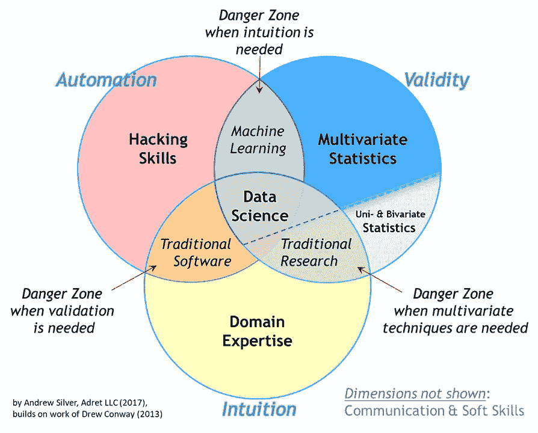

Image of Andrew Silver showing the great pillars of Data Science.

好消息是，今天，这个学习曲线不再那么陡峭了。来自不同背景的人有机会加入这个领域，其中一个主要原因是 Python 的大量使用，Python 是一种高级语言，作为更具表演性的低级语言的 API。换句话说，你不必浪费精力担心复杂的语法，因为，用 Python 写就像用英语写一样。你只需要在几周内学习掌握基础知识。除此之外，数据科学家的大部分耗时工作正在自动化或专门用于其他领域，如机器学习工程师和数据工程师。因此，把科学的一部分留给科学家。

如今，处理大数据已经变得像在 [DataBricks](https://databricks.com/) 等环境中编写 SQL 一样简单。

有了像 [SageMaker](https://aws.amazon.com/pt/sagemaker/) 及其竞争对手这样的工具，让算法在生产中高度可扩展和可用变得更加简单。

使用 [AutoML](https://arxiv.org/pdf/1907.08392v1.pdf) ，甚至复杂特征工程的创建也实现了自动化。

简而言之，今天编程背景仍然重要，但重要性正在下降，我对未来的预期是，编程将不再是核心，它将成为 it 专业人员的专属活动。所以，我给你一个建议:把你的时间和精力集中在分析、建模和科学上。

# 3.那么学什么呢？

**编程:Python & SQL**

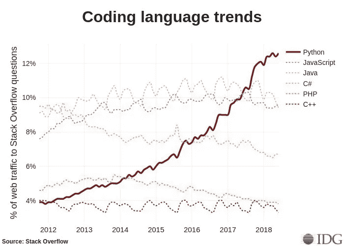

你肯定需要学习如何编程，许多语言都满足这一需求，无论是像 Scala 这样最具执行性的语言，还是像 R 这样更学术和统计性的语言，或者像 Python 这样通用的语言，后者对于任何初学者来说都是最明显的选择。原因很简单。Python 拥有最大的数据分析社区，在 [Kaggle](https://www.kaggle.com/) (机器学习竞赛网站成为数据科学家的作品集)中找到分析的例子，在 [Stackoverflow](https://stackoverflow.com/) (Q &一个拥有大多数初学者和经常是高级问题的网站)中找到代码例子，以及职位空缺，因为它是市场上最受欢迎的语言。

**机器学习:公分母。**

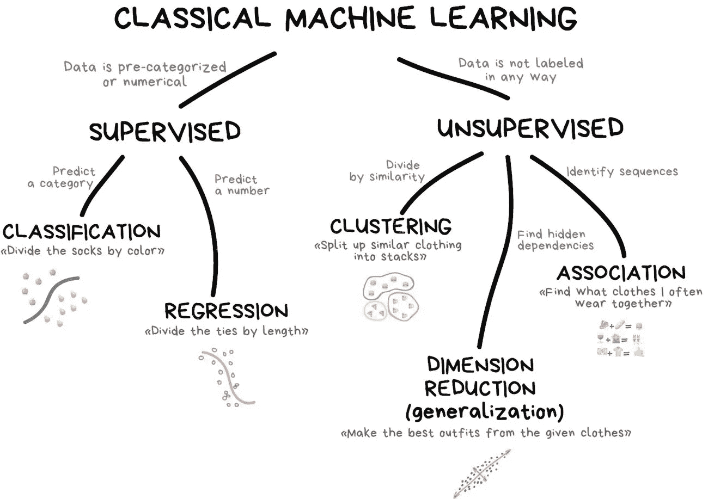

没办法跑，你不可避免的要经过机器学习的基础。当我在 2014 年第一次开始学习机器学习时，大多数课程都专注于推导模型，就像正规学位所期望的那样，许多 DS 都是这样训练的，
这给了你巨大的能力来理解不同模型内部如何工作，甚至思考每个问题的最佳模型。我建议你不要这样做。研究许多不同模型类别的成本收益非常小，你需要知道(每小时)模型是一个黑盒，可以将输入(我们的变量，如人的身高，他们住在哪里，他们赚多少钱)转化为输出(如他们成为欺诈者的可能性)。几乎每个模型都有许多共同的技术，我的建议是，你先学习这些技术，然后再专注于理解它们的数学差异和实现细节。

**统计:基本做得好。**

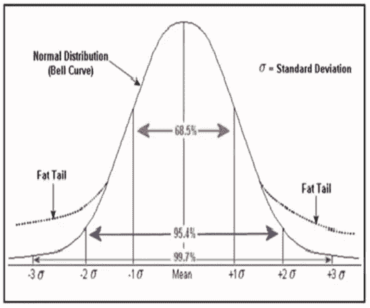

我把最好的，最重要的，也是(不幸的)最难的留到了最后。正是这种技能将区分数据科学家和机器学习工程师。这里没有太多的捷径。你应该从描述统计学开始，知道如何做一个好的探索性数据分析( [EDA](https://en.wikipedia.org/wiki/Exploratory_data_analysis) )，或者至少是概率和推理的基础知识，很好地理解选择偏差、[辛普森悖论](https://en.wikipedia.org/wiki/Simpson%27s_paradox)、变量关联(特别是方差分解方法)、统计推理的基础知识(以及著名的、市场上已知的作为推理的 A / B 检验)，以及实验设计的好主意。

# 4.什么是理想的赛道？

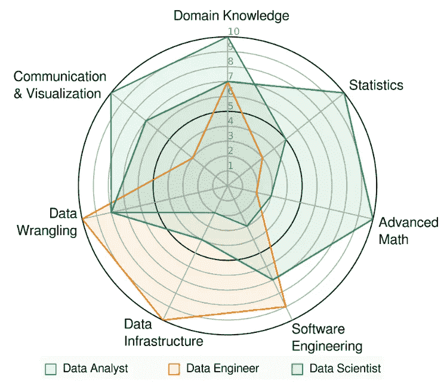

这是一个很难的问题，根据每个人的背景可能会有不同的答案。但是万一你是初学者，我会建议，随着你的进步，你应该按照你最喜欢的细分领域去做。

**先决条件:**

*   **数学**:代数- >微积分。
*   **统计**:描述性统计- >概率>推断
*   **Python** :数据类型- >迭代- >条件- >函数

**基本**:

我把基础知识称为任何数据科学家都应该具备的知识，无论背景或专业如何。

*   **熊猫数据分析**(打开不同的文件并操纵它们)
*   **统计**:变量之间的关联、方差分析、假设检验；
*   **即**:matplotlib；seaborn 散景；
*   **数据** : SQL，查询 APIs
*   **监督机器学习**:梯度下降- >偏差和方差的权衡- >验证- >正则化-
    >回归和分类度量- >平衡- >参数化- >特征选择；—>观念的整体性；
*   **无监督机器学习**:聚类、降维

**中介**:

在这一点上，一个数据科学家应该专攻一个更小的(也是更困难的)领域；在这个阶段，几乎没有人是所有领域的专家，但我会向您展示每个领域:

*   **统计**:贝叶斯统计，因果实验；计量经济学(如果实验是不可能的)，数据管理；
*   **数据**:数据摄取、Web 报废、非结构化数据、大数据环境；
*   **生产算法**:转换流水线；容器和创建 APIs
*   创建多层模型(堆叠)和元模型，
    嵌入模型；用莱姆和 SHAP 解释模型；
*   **具有自相关数据(或仪表板数据)的机器学习**；

**高级:**

我选择以下主题作为高级，不是因为它的难度，而是因为它们是最专业的知识。对于一个有经验的数据科学家来说，仅仅因为他或她在工作中没有机会，而不必使用这些技能的一部分是完全可以接受的。不过还是那句话，
了解所有技能的基础很有意思。

**深度学习**:深度强化学习、自然语言处理、计算机视觉；

**统计学** : MCMC，带有倾向分数匹配和工具变量的因果建模，合成反事实。

**数据**:面向图形的数据、数据湖、流数据、低延迟 API、kubernetes

# 5.这些都是从哪里学来的？

由于我已经为生活在世界任何地方的任何对数据科学感兴趣的人写了这个指南，我将只推荐在线课程，最好是免费的。所有这些至少都有英文字幕，涵盖了上述线索的基本部分。

**Python:**

最完整的推荐 Python 课程是 MITx 的[计算机科学和使用 Python 编程入门](https://go.redirectingat.com/?id=111346X1569483&url=https%3A%2F%2Fwww.edx.org%2Fcourse%2Fintroduction-computer-science-mitx-6-00-1x-11&sref=https%3A%2F%2Fwww.pcworld.com%2Farticle%2F3287981%2Fbest-python-courses.html&xcust=US_001_3287981_000_000000_web)(>120 小时)或 Michigan 的[Python for Everybody](https://www.coursera.org/specializations/python?ranMID=40328&ranEAID=vedj0cWlu2Y&ranSiteID=vedj0cWlu2Y-huVolUOE0FDYdTDWzWaZSQ&siteID=vedj0cWlu2Y-huVolUOE0FDYdTDWzWaZSQ&utm_content=10&utm_medium=partners&utm_source=linkshare&utm_campaign=vedj0cWlu2Y)(>30 小时)，你可以根据你有多少时间来选择。两个课程都已经从零开始形成了几千人，所以你没有先决条件，你会写小程序。

如果你已经熟悉其他编程语言，但不了解 Python，你可以选择来自 [DataCamp](https://www.datacamp.com/courses/intro-to-python-for-data-science?tap_a=5644-dce66f&tap_s=463826-784532) (免费)的 4 小时短期课程。

**机器学习:**

一大群 DS 在斯坦福著名的[机器学习](https://www.coursera.org/learn/machine-learning)课程中向 Andrew NG 学习。我不能不推荐。他采用了更技术性的方法，使用 Octave 语言(一种开源的 Matlab)。课程约 60h，先修线性代数和基本统计。

其他完整选项包括:

[机器学习](https://www.coursera.org/specializations/machine-learning?ranMID=40328&ranEAID=vedj0cWlu2Y&ranSiteID=vedj0cWlu2Y-UNRjbGWagHnw80LW..1z5A&siteID=vedj0cWlu2Y-UNRjbGWagHnw80LW..1z5A&utm_content=10&utm_medium=partners&utm_source=linkshare&utm_campaign=vedj0cWlu2Y)来自华盛顿大学 Coursera ( > 180h)

[Nanodegree](https://www.udacity.com/course/intro-to-machine-learning-nanodegree--nd229?cjevent=659604c5ff6011e982b302b50a24060f) de 机器学习由 Udacity 提供(不免费)(> 120h)

**统计数据**

**(更长更饱满)** [统计学基础](https://www.edx.org/course/fundamentals-of-statistics-3)，MIT，免费，> 160h。这是一门非常广泛的课程，如果你没有数学或相关领域的背景，它可能太专业了，因为这是一门推导概念背后的数学的课程。本课程将教会你:

*   特定的模型对于特定的数据集有多合适？
*   线性回归如何选取变量？
*   如何对非线性现象建模？
*   如何查看大数据？

**如果你想从短期(和基础)课程开始，这里有**个替代选项 **:**

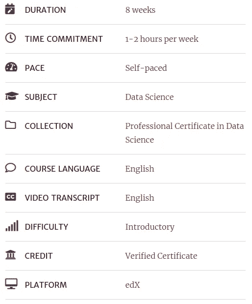

[概率由哈佛，edX，免费](https://online-learning.harvard.edu/course/data-science-probability?delta=0) ~ 12h。这是一门比前一门更实用的入门课程，侧重于概率的主题，你将学到几个基础知识，例如:

*   随机变量，
*   独立，
*   蒙特卡洛模拟，
*   期望值，
*   标准误差，
*   中心极限定理。

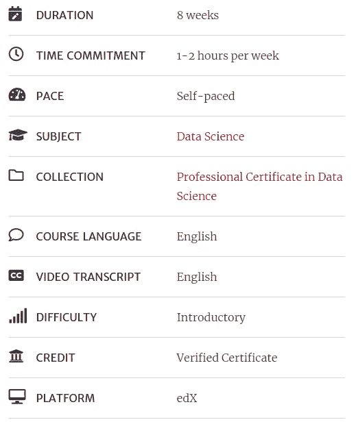

[推理与建模，哈佛，edX，免费](https://online-learning.harvard.edu/course/data-science-inference-and-modeling?delta=0) ~ 12h。补充前面实用性课程的另一个重要主题是同样由哈佛团队开发的推理课程。在本课程中，您将学习制作良好的统计模型所需的基础、误差范围，并了解本课程样本的预测可靠性，所有这些都有真实世界的例子，如 2016 年选举的数据。

# 书籍推荐

## 介绍性:

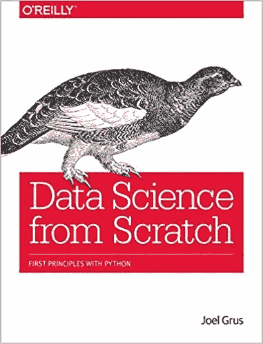

[我不推荐给任何已经有基础的人，因为它太慢了。最近发布了这本书的第二版。](https://www.amazon.com/Data-Science-Scratch-Principles-Python/dp/149190142X/ref=sr_1_2?keywords=data+science+from+scratch&qid=1572967470&sr=8-2)

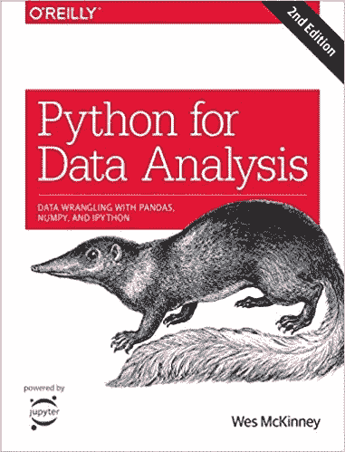

[**用于数据分析的 Python:与熊猫、NumPy 和 IPython 的数据角力**作者 Wes McKinney](https://www.amazon.com/Python-Data-Analysis-Wrangling-IPython/dp/1491957662/ref=sr_1_1?keywords=Python+for+Data+Analysis%3A+Data+Wrangling+With+Pandas%2C+NumPy+and+IPython+by+Wes+McKinney&qid=1572967545&sr=8-1) 。这里所有的书显然都是很好的读物，但这里有一个阅读案例，是简单(或不那么简单)技巧的很好汇编，它会为你节省很多时间。
这不是一本统计学或机器学习的书，但你需要通过这些技术来做任何最接近真实世界的事情。

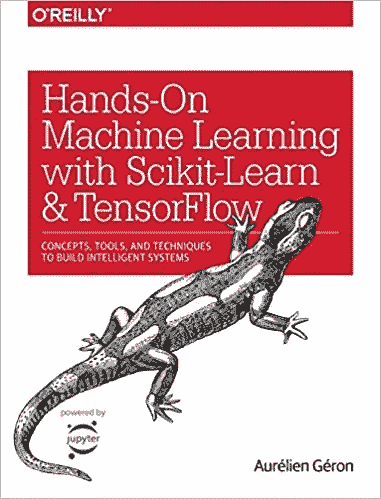

[**用 Scikit-Learn 和 TensorFlow 进行动手机器学习:构建智能系统的概念、工具和技术**](https://www.amazon.com/gp/product/1491962291/ref=as_li_tl?ie=UTF8&tag=buy05cb-20&camp=1789&creative=9325&linkCode=as2&creativeASIN=1491962291&linkId=b7606b82f6151571b0ceefbd4b1f95d6) 。这里有一本优秀且最新的书(我甚至推荐最近发布的已经更新到优秀 tensorflow 2.0 的这本书的第二版)。第一部分讨论机器学习算法的“共同点”，第二部分重点讨论神经网络。

除此之外，还有一个很棒的 github 库，里面有这本书的所有代码。可用[此处-v2](https://github.com/ageron/handson-ml2) ou [此处-v1](https://github.com/ageron/handson-ml) 。

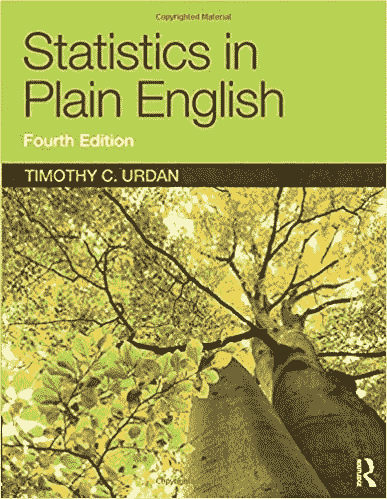

[**说白了就是统计**](https://www.amazon.com/Statistics-Course-Pack-Set-Op/dp/1138838349/ref=sr_1_1?keywords=Statistics+Plain&qid=1572967665&sr=8-1) 。对那些没有统计学背景的人来说是轻松简单的阅读。每章描述一种不同的统计技术，从基本概念如集中趋势和分布的描述到更高级的概念如测试，回归，重复测量方差分析和因素分析。
每一章都以统计数据的简要描述和何时使用开始，随后是可选的进一步阅读。

[**Think Stats:程序员概率统计**](http://greenteapress.com/thinkstats/thinkstats.pdf) 点击链接即可免费获得。在这本令人愉快的读物中，你将放下沉重的公式，开始分析国家卫生研究院的实际数据。对于那些需要比理论更实际的东西来学习的人，或者如果他们已经很好地了解了理论，并且想看看如何在现实世界中应用它。。肤浅有趣的书。

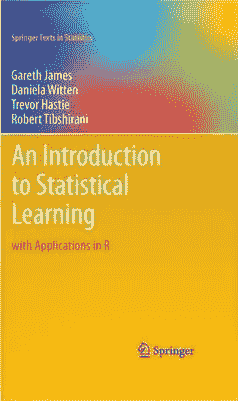

[**统计学习入门**](https://www.amazon.com/Introduction-Statistical-Learning-Applications-Statistics/dp/1461471370/ref=sr_1_1?keywords=An+Introduction+to+Statistical+Learning+b&qid=1572967879&sr=8-1) 一本经典，满满的例子和应用(用 R 语言)。不可或缺！涵盖的主题包括线性回归、分类、重采样方法、收缩方法、基于树的方法、支持向量机、聚类等。
使用颜色图表和真实世界的例子来说明所提出的方法。

# 没那么入门..

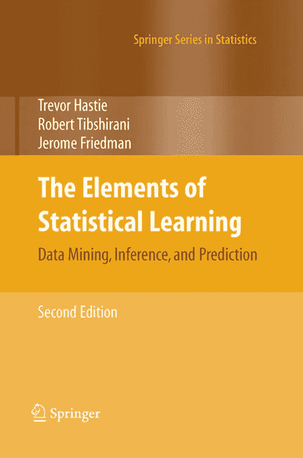

****【免费链接】这篇文章是该领域的一个里程碑。在此之前，不同的地区发展了他们自己的语言和符号来使用统计概念，作者在统计学的阴影下收集了所有这些。这里强调的是概念而不是数学。
借助好的彩色图形给出了很多例子。对于统计学家和任何对科学或工业中的数据挖掘感兴趣的人来说，这是一个有价值的资源。它探讨了不同的算法和统计用途的机器学习技术。****

****.****

****.****

****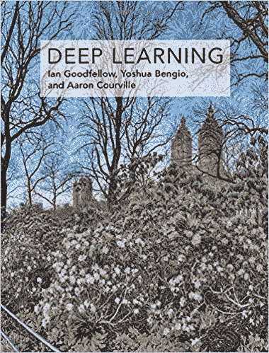****

****伊恩·古德菲勒、约舒阿·本吉奥和亚伦·库维尔合著的《深度学习》一书，埃隆·马斯克这样评价这本书:“由该领域的三位专家撰写，深度学习是该领域唯一一本全面的书。”这本书的第一部分是对更传统的机器学习的相当全面的介绍，同时关注其余部分。这本书的主题是深度学习和知识前沿。网上免费提供。****

****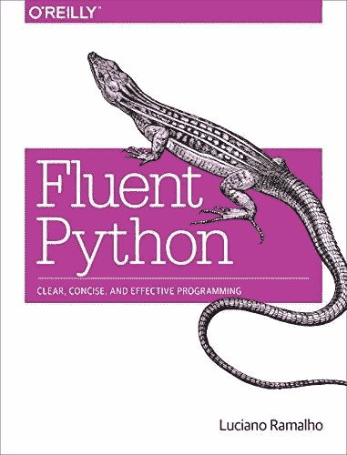****

****[**流畅的 Python:清晰、简洁、有效的编程**](https://www.amazon.in/Fluent-Python-Concise-Effective-Programming-ebook/dp/B0131L3PW4) 一本真正完整的书(我不知道还有比这本书更完整的了)让你学习 Python 哪怕是最小的细节。高级素材，不推荐现在开始用 Python 的人。****

****.****

****.****

****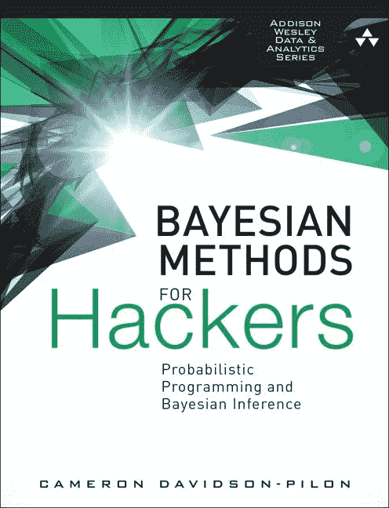****

****[。
。
。
。
。
**黑客的贝叶斯方法**](http://camdavidsonpilon.github.io/Probabilistic-Programming-and-Bayesian-Methods-for-Hackers/) 作者:Cam Davidson-Pilon。阅读有助于给这个超级重要的领域一些实用主义，但与 frequentist 统计相比，内容相当贫乏。轻量级文本主要关注概念和应用，将数学留在背景中，
最终可以在一本优秀的书中将概率编程与贝叶斯统计结合起来。****

****.****

****.****

****.****

# ****电影和纪录片推荐。****

********

******MoneyBall，2011** 这是那种让我们对数据分析充满热情的电影。他讲述了比利·比恩抓住一个相当小的棒球队的故事，通过数据分析，大量的勇气和一点政治可以将旧的感觉方法抛在身后，并彻底改变一项超级传统的运动。IMDB 注释 7.6。不可错过的
。(一个参考是 8 级在电影史上前 250 名)****

****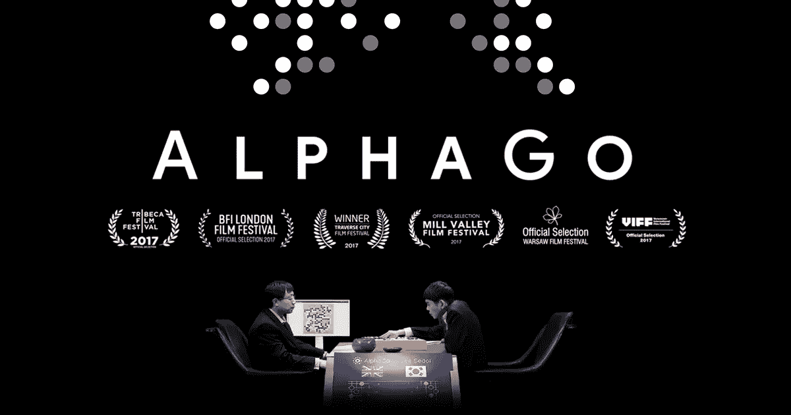****

****alpha go 2017 纪录片是如何将复杂的机器学习算法转变为所有观众都能理解的纪录片的又一个光辉例子。在网飞上可以看到，你将在一个几年前被认为是人类固有的游戏中学习机器学习的不可思议的潜力。附注 7.9。****

****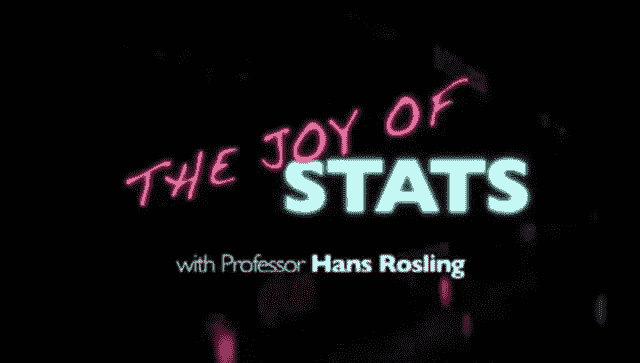****

******统计的快乐，2010** 是对使用统计数据的道歉，由兴奋的汉斯·罗斯林教授提出，他用各种视觉技巧展示了不同的领域如何处理这个数据泛滥的新时代。IMDB Note 7.3(太棒了！)****

******2013 年大数据时代** bbc quee 纪录片探索了三个非常有趣的案例:****

*   ****洛杉矶警方预测未来 12 小时内哪里最有可能发生犯罪****
*   ****伦敦金融城的科学家转行做交易员，他相信自己已经找到了用数学赚几百万的秘密****
*   ****南非天文学家，他想通过聆听所有的星星来记录天空。****

# ****推荐的最新去处..****

******。第一个推荐并不完全是最新的，但它是一个相当丰富的例子和讨论的来源，它是 Google 购买的 Kaggle 网站。那里有竞赛(包括高额奖金)、课程、大量笔记本、讨论，最近它正在成为一种数据科学家课程。
所以如果你想成为其中一员，这是值得了解的。******

******[**KDnuggets**](https://twitter.com/kdnuggets) 。不要让这个 90 年代的网站欺骗了你，但它确实创建于 1997 年，从那时起就收集了大量高质量的帖子和内容，大部分是技巧和应用。******

****[**AnalyticsVidhya。**](https://www.analyticsvidhya.com/blog/)**&**[**TDS**](https://towardsdatascience.com/)这些都是由成千上万各种水平的数据科学家组成的分享内容的博客。这需要一点经验来区分谷壳和小麦，但有很多质量。****

****[**Montreal . ai**](https://montrealartificialintelligence.com/)**我最喜欢的枢纽之一，他们在不同的社交网络上发帖，如果你关注你的频道，就会不断更新前沿知识。高质量的内容很难跟上该领域的创新步伐。******

# ******6.后续步骤:******

******显然后面还有很多步骤要做。但是每个人最终都会专攻你最感兴趣的某个领域，比如:******

******[**贝叶斯统计**](https://pt.coursera.org/learn/bayesian-statistics) ，加州大学。******

****[**计量经济学**](https://pt.coursera.org/learn/erasmus-econometrics) **s** (因果推断)鹿特丹伊拉兹马斯大学****

****[**深度学习**](https://www.coursera.org/specializations/deep-learning?edocomorp=mar19affiliate20off&ranMID=40328&ranEAID=vedj0cWlu2Y&ranSiteID=vedj0cWlu2Y-G2VPg1Wv5gdJ69BOLsVhRw&siteID=vedj0cWlu2Y-G2VPg1Wv5gdJ69BOLsVhRw&utm_content=10&utm_medium=partners&utm_source=linkshare&utm_campaign=vedj0cWlu2Y)**by Deep Learning . ai******

******[**计算机视觉**](http://Convolutional Neural Networks Course by deeplearning.ai (Coursera))**by deep learning . ai********

******[**高等经济学院自然语言处理**](https://www.coursera.org/learn/language-processing?ranMID=40328&ranEAID=vedj0cWlu2Y&ranSiteID=vedj0cWlu2Y-OrAzV2bnlHpKg9LjGrbtzw&siteID=vedj0cWlu2Y-OrAzV2bnlHpKg9LjGrbtzw&utm_content=10&utm_medium=partners&utm_source=linkshare&utm_campaign=vedj0cWlu2Y) 或 TensorFlow 中的 [NLP](https://www.coursera.org/specializations/tensorflow-in-practice)******

****[**艾伯塔大学强化学习**](https://www.coursera.org/specializations/reinforcement-learning)****

## ****如果你喜欢这篇文章，你可能也会喜欢以下内容:****

*   ****[数据科学](https://medium.com/swlh/data-science-and-the-data-scientist-db200aac4ea0) [的范围是什么；](https://medium.com/beacon-insight/ci%C3%AAncia-de-dados-e-o-cientista-de-dados-72634fcc1a4c)****
*   ****[口译机器学习；](/the-ultimate-guide-using-game-theory-to-interpret-machine-learning-c384cbb6929)****
*   ****[统计学简史](http://a%20brief%20history%20of%20statistics/)；****