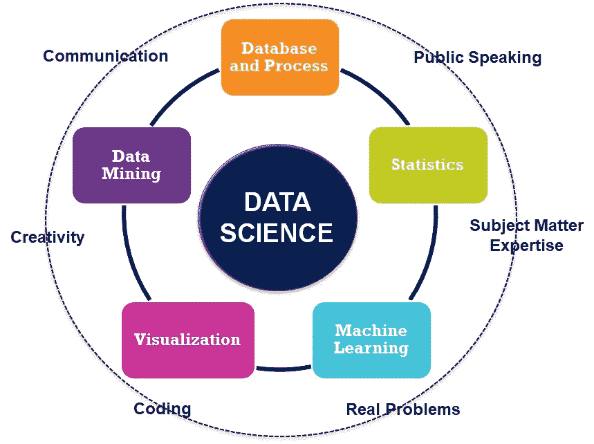
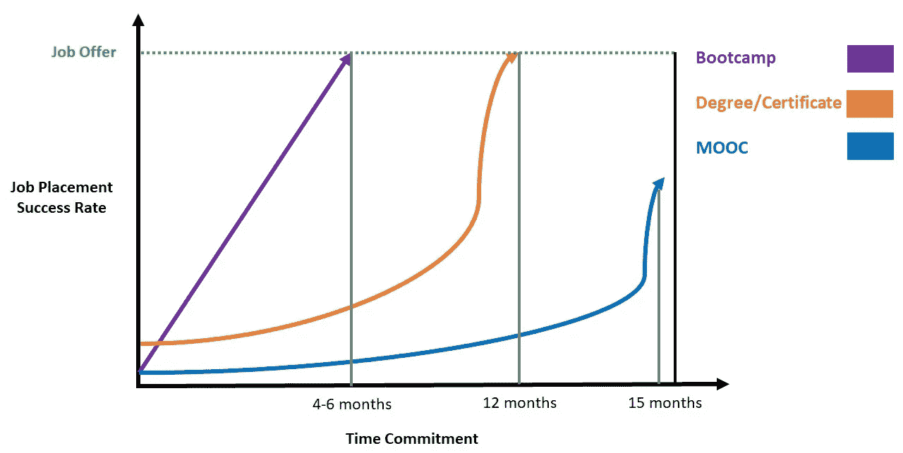
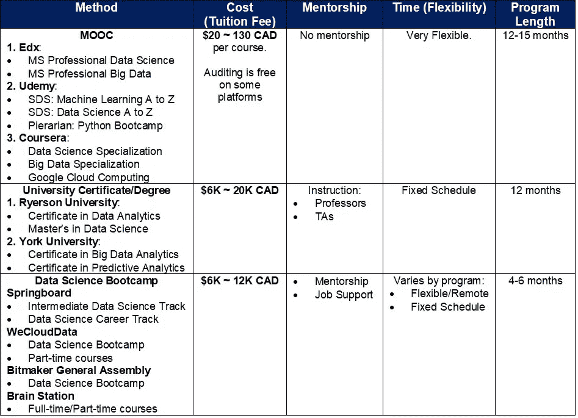
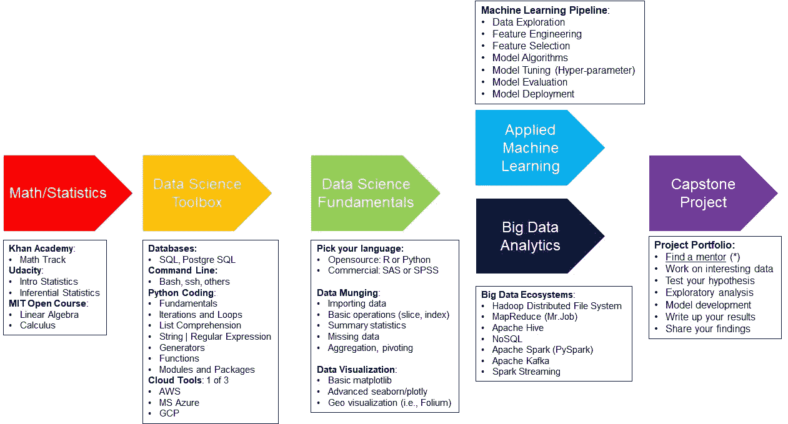
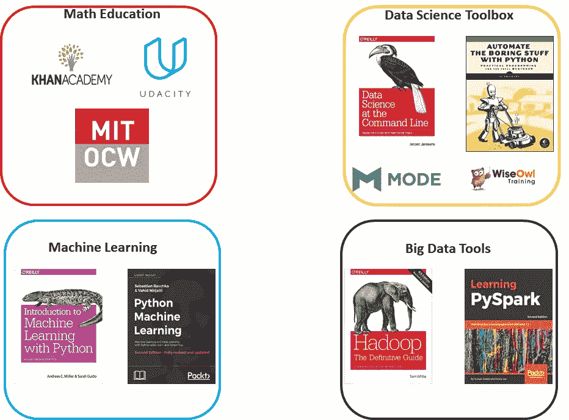

# 如何成为一名数据科学家？

> 原文：<https://towardsdatascience.com/how-to-become-a-data-scientist-3f8d6e75482f?source=collection_archive---------1----------------------->

**简介:**

我很确定我们中的许多人都在 2012 年看过《哈佛商业评论》的这篇文章。数据科学家是被称为 21 世纪最性感的职业。此外，麦肯锡全球研究所早在 2013 年进行的研究预测，到 2018 年，北美将分别有大约 425，000 和 475，000 个空缺的数据分析职位。这里要传达的信息是，所有行业都将需要源源不断的分析人才，公司在这些行业收集和使用数据以获得竞争优势。

**到底什么是数据科学家？**

在一个过于简化的描述中，数据科学家是能够处理大量数据并提取分析见解的专业人士。他们向利益相关者(即高层领导、管理层和客户)传达他们的发现。因此，公司可以受益于做出最明智的决策来推动其业务增长和盈利能力(即，取决于行业环境)。

**为什么成为数据科学家这么难？**

数据科学的本质是许多学科的混合。由不同的学科领域组成，如数学(如统计学、微积分等。)、数据库管理、数据可视化、编程/软件工程、领域知识等。在我看来，这可能是有意跳入入门级数据科学职业的人常常感到完全迷失的首要原因。大多数人不知道从哪里开始，因为你可能在一个领域完全缺乏，或者多个领域取决于一个人的教育背景和工作经验。

不过，好消息是，你不需要对此过于担心。这些天来，我们面对一个完全相反的问题。有太多的资源可供选择。所以，你不一定知道哪一个最适合你。在本文中，我将从三个角度重点介绍如何成为一名数据科学家。

**第一节:从哪里学习数据科学？**

Figure 1\. Data Science Education Path and Job Placement Rate

先从哪里学数据科学开始吧。从海量开放在线课程(MOOC)、大学学位/证书和新兵训练营培训中获得数据科学教育有三大途径。

下面是一个示例图，展示了每个选项的预计时间承诺与工作安排成功率。这提供了一个想法，即训练营教育可以让你比其他两种选择更快地获得数据科学家的工作。

下面是一个汇总表，提供了有关每个教育途径的更多详细信息。基本上，每个选项在成本、灵活性和项目长度方面都有优点和缺点。然而，做出正确决定的最佳建议是问问自己什么对你来说最重要。比如，你有充裕的时间，想把投资成本降到最低。或者你可能是一个想尽快找到工作的人，即使最初的投资成本很高。

Table 1\. Breakdown Analysis of Data Science Learning Path Comparison

**第二节:学什么数据科学？**

作为一名数据科学家，肯定有很多东西要学。让我们从五个主要步骤开始了解数据科学教育途径。

Figure 2\. Data Science Learning Pathways

第一步，补上与统计、微积分和线性代数相关的基础数学是一个好的开始。作为一名数据科学家，这对于理解不同算法背后的机制至关重要。它建立了关于如何调整或修改算法以解决独特业务问题的直觉。此外，了解统计数据有助于您将实验性设计测试(即 A/B 测试)中的发现转化为关键业务指标。

第二步，数据科学家必须熟悉在各种环境中处理数据的工具集。工具集包含 SQL、命令行、编码和云工具的组合。这里总结了每种工具的使用方法。对于从关系数据库中提取和操作数据，SQL 是几乎在任何地方使用的基本语言。用于一般编程目的(即函数、循环、迭代等)。)，Python 是一个不错的选择，因为它已经打包了许多库(例如，可视化、机器学习等)。).对于额外的提升，了解命令行提供了额外的好处，特别是对于在云环境中运行作业。

第 3 步，这是学习一些语言来构建数据科学基础的最佳时机。对于商业软件，你可以选择 SAS 或者 SPSS。从开源平台，很多人要么选择 R，要么选择 Python。从这里，您可以了解有关数据管理/争论的概念(即，导入数据、聚合、透视数据和缺失值处理)。在此之后，您将从数据可视化(即，条形图、直方图、饼图、热图和地图可视化)中获得最有趣的数据。

第四步，你可以选择应用机器学习或大数据生态系统途径。请注意，你可以随时回来掌握另一条道路。就我而言，我选择先学习应用机器学习。基本上，它涵盖了从端到端建立机器学习模型的方面(即，从数据探索到模型部署)。为了了解大数据，我将更多地介绍从哪里获得这种教育(即书籍和课程)。

第五步，这是展示你作为数据科学家候选人潜力的最关键的一步。一旦你熟悉了数据科学，你必须有一个项目组合。项目组合是你展示你从学习和工作经历中所做的最好机会。从数据收集开始(即，你自己在哪里挑选或收集数据)，提出你的假设，进行探索性分析(即，提取一些有趣的见解)，建立你的机器学习模型，最后分享你在写作或演示中的发现。就我而言，我通过与指定的导师一起完成顶点项目，完成了一篇报道和一个视频播客。对于拥有一个可以直接与你一对一合作的导师的重要性，我怎么强调都不为过。当你陷入一些项目想法、调整你的模型、交流你的结果等时，你的导师是指导你并寻求帮助的最好朋友。事实上，一些研究提到，有一个导师可以比没有导师的人多五倍地促进你的职业发展。

**第三节:如何学习数据科学？**

在本节中，您将学习如何挑选成为数据科学家的最佳资源。我想根据我的学习经验提出建议。

Figure 3\. Suggested Resource on Learning Data Science Education

对于 SQL 教育来说，微软从 Edx 提供的 DAT201x 课程是最好的选择之一。本课程从数据类型、筛选、连接、聚合(分组)、窗口函数和高级概念(如存储过程)等方面介绍了 SQL 的以下内容。本课程确保您通过使用最佳样本数据仓库(即 AdventureWorks)进行大量练习。或者，您可以使用模式分析平台来练习和增强您的 SQL 技能。模式分析最大的好处是，您不需要在机器上安装 SQL server 和示例数据仓库。你所需要的是有一个免费的帐户和互联网连接来享受你的学习。

对于机器学习教育，我喜欢推荐两个选项。第一个课程是该领域的任何数据科学从业者都熟知的。吴恩达的机器学习课程来自 Coursera。我用这个课程来理解如何调整我的机器学习模型的基本概念和技巧。从编码体验的角度来看，我强烈推荐塞巴斯蒂安·拉什卡的《Python 机器学习第二版》。我真的觉得这是最好的机器学习书。这本书从每个算法的基本机制、大量的编码示例和补充参考资料(即研究文章)来帮助你理解。这本书最棒的一点是，他一行一行地详细解释了如何实现每个机器学习算法。正如许多数据科学家提到的，这非常重要，人们应该能够从头开始编写代码，并知道如何实现它。如今，有许多复杂的问题无法通过使用 Python 现有的库直接解决。

这里是一个完整的资源列表，您可以参考这些资源来学习数据科学教育的每个组成部分。

**1。数学:**

可汗学院数学赛道

麻省理工学院开放课件:线性代数与微积分

Udacity:介绍和推断统计学

**2。数据科学工具包:**

结构化查询语言

o Edx: DAT201x —使用 Transact SQL 进行查询(*)

o 模式分析:SQL 教程(高级入门)

o WiseOwl: SQL 教程(高级入门)(*)

命令行

o Book:命令行中的数据科学

Python 编码

o Udemy:完整的 Python 训练营

o 书:艰难地学习 Python(第三版)

o Book:用 Python 自动化枯燥的东西

**3。机器学习:**

Coursera:吴恩达的机器学习(*)

Coursera:应用机器学习(密歇根大学)

哈佛:CS109 —数据科学简介(*)

书:Python 机器学习(第二版)Sebastian Raschka (*)

书:Python 机器学习示例

书:Python 机器学习入门

**4。大数据:**

Hadoop

o 图书:Hadoop 权威指南

o uda city:Hadoop 和 MapReduce 简介

o IBM: Hadoop 基础知识学习徽章

火花

o Edx:加州大学伯克利分校星火课程(CS105，CS120)

o data camp:PySpark 简介，在 PySpark 中构建推荐引擎

o 图书:学习 PySpark，使用 Spark 进行高级分析

**奖励部分:寻求帮助和建立关系网**

现在，我想通过提供一些额外的技巧来结束这篇文章。一开始，作为一个新手数据科学爱好者，你不一定有一个可以指导你学习经验的导师。因此，您需要一个向数据科学社区征求意见和反馈的地方。好消息是，有几个论坛你可以寻求帮助来解决你的问题。少数网站如 StackOverflow、Quora 等。让您发布您的问题，并收到对您帖子的回复。

另一个提示与网络有关。这真的适用于任何真正寻找新机会和建立联系的人。在多伦多，有许多与数据科学相关的本地聚会和大型会议。尽量多参加活动，介绍自己(即动机、目标、激情)。此外，如果你有机会接触演讲者和活动组织者，努力与他们建立有意义的联系。我认为我从经验中学到的一个有用的策略是寻找机会在任何可用的媒体上展示我的项目组合。我指的是在本地会议上发表演讲的机会，甚至是通过远程数据科学办公时间进行的视频网络广播。从这次经历中，我能够从我愚蠢的错误中学习，并从一个演示文稿到另一个演示文稿做出改进。这为数据科学家候选人带来了很多价值，可以提供有效的演示，并能够清晰地传达分析见解。

感谢阅读这篇文章。随着我在成为数据科学家的旅程中获得更多经验，我希望带来更多令人愉快和丰富的信息。