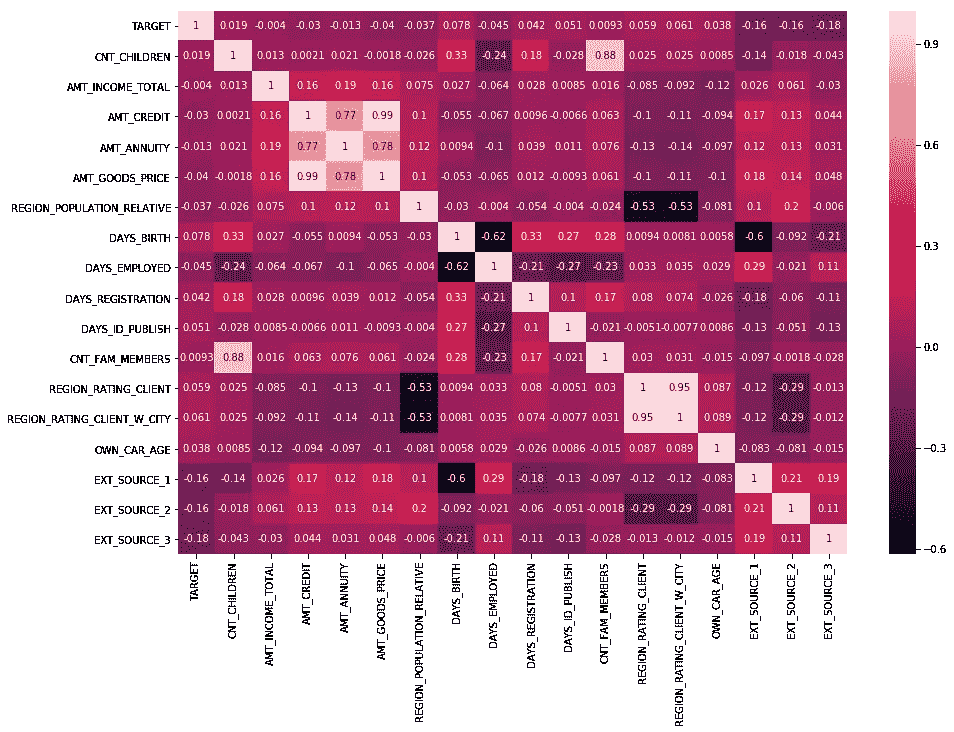

# 如何在 Kaggle 上开始比赛

> 原文：<https://towardsdatascience.com/how-to-begin-competing-on-kaggle-bd9b5f32dbbc?source=collection_archive---------2----------------------->


你刚刚完成了你的第一门机器学习课程，但你不知道从哪里开始应用你的新知识。你可以从玩 Iris 数据集或梳理泰坦尼克号记录开始(这可能是你*应该*做的第一件事)。但是有什么比直接跳进来和网上的陌生人竞争金钱更有趣的呢？

如果你正在阅读这篇文章，你可能已经知道 Kaggle 是一个数据科学竞赛平台，爱好者使用结构化(表格格式的数字和/或分类数据)和非结构化数据(例如，文本/图像/音频)在一系列机器学习主题中进行竞赛，目的是获得奖金和令人垂涎的 Kaggle 金牌。虽然你可能会发现与他人竞争的想法令人生畏，但重要的是要记住，目标永远是尽可能多地学习，而不是专注于结果。通过这种心态，你会发现竞争变得有趣，有益，甚至上瘾。

# 选择比赛的第一步

**找一个你感兴趣的比赛。**

这是开始新比赛时要考虑的最重要的事情。你想给自己大约两个月的时间来梳理一个问题，并真正熟悉数据的来龙去脉。这是相当多的时间。选择一个你不感兴趣的比赛会让你变得不感兴趣，放弃几周的时间。在时间线的早期加入还会让您有更多的时间来获取背景知识，并在您与社区的其他成员一起处理问题的各个阶段时提高您的学习质量。

**专注学习**

如果你发现自己对一场比赛感到沮丧，认为它太难了，那就专注于尽可能多的学习，然后继续前进。通过这种方式，你可以通过接触这些材料学到更多。当你不再担心自己在排行榜上的位置时，你甚至会发现自己取得了突破！

**努力理解最高得分内核的每一行**

问问自己，是否有一些明显的方法可以改进他们的工作。例如，有没有一个你可以创造的新颖的功能可以提高他们模型的分数？你能稍微调整一下他们用来提高性能的学习速度吗？追求唾手可得的果实，不要试图多此一举。这种心态将大大加快你的学习，同时确保你不会发现自己变得沮丧。

**查看规则中是否有奇怪的规定**

这一个没有其他的重要，但仍然值得一提。最近的一次竞赛中有一条规则规定如下:

> [您的提交内容]不包含机密信息或商业秘密，并且不是注册专利或未决专利申请的主题

一名[用户在论坛](https://www.kaggle.com/c/two-sigma-financial-news/discussion/66828393792)上表示，这项规定将使退学成为非法，因为这是谷歌的专利技术！

# 内核和讨论

**在比赛过程中应该定期检查内核和讨论标签**

首先查看一些 EDA(探索性数据分析？，探索性数据分析的？探索性数据分析？)和衡量你对领域和主题的兴趣程度。当你浏览其他人的作品时，在数据的合适模型类型、特征工程等方面，想想你想到的任何新颖的想法。

**讨论标签中的“欢迎”帖子提供了很好的背景阅读**

获得竞争领域的领域知识不会有什么坏处。这有助于深入了解模型的执行情况，并极大地有助于特征工程。我通常会在比赛开始时花一两周时间尽可能多地阅读，以了解问题空间。为了有助于这一点，大多数竞赛组织者在论坛上创建一个 onboarding 帖子，链接到该领域的重要论文/文章。他们还可能提供关于如何处理较大数据集的技巧和对数据的基本见解。当您获得关于手头问题的更多信息时，这些线索总是值得检查和回顾的。

# 探索性数据分析

## 你应该关注什么？

您对数据集的初始分析将根据您正在检查的数据类型而有所不同。但是，这些概念在不同领域中通常是相似的，下面的信息可以根据您的具体领域进行调整。为了简化事情，让我们假设我们正在看结构化数据。在任何初始 EDA 中，都有一些基本问题要问:

1.  目标是如何分布的？
2.  特征之间有什么显著的相关性吗？
3.  数据中是否有缺失值？
4.  训练和测试数据有多相似？

**目标是如何分配的？**

在任何数据集中，首先要注意的是类的分布。你会想要很快发现是否有阶级不平衡，因为这会对你的模型产生重大影响。特别是如果一个班级在培训中淹没了其他班级的信息。有许多技术可以处理类别不平衡(例如， [SMOTE](https://jair.org/index.php/jair/article/view/10302) ， [ADASYN](https://sci2s.ugr.es/keel/pdf/algorithm/congreso/2008-He-ieee.pdf) ，手动移除样本，模型参数来处理不平衡的数据集)，但首先我们想知道类别是否在数据中不均衡地表示。检查这一点的快速方法是通过绘图库 [seaborn](https://seaborn.pydata.org/) ，基于流行的 [matplotlib](https://matplotlib.org/) 。

```
**import** seaborn **as** snssns.countplot(df['target'])
```


Multi-class target imbalance

正如我们所看到的，90 级在我们的数据中占了很大比例。前述 SMOTE 技术和其他技术可以创建更平衡的训练数据集。反过来，这可以导致一个模型，更好地推广到看不见的数据，这种不平衡可能不存在。

**特征之间有没有显著的相关性？**

计算特征之间的皮尔逊相关系数可以提供对特征的一些宝贵见解。知道特性是否相关可以允许创造性的特性工程或删除不必要的列。例如，在下面显示的热图中，`EXT_SOURCE_1`是由外部来源提供的贷款申请人的信用评级。`DAYS_BIRTH`，申请人的年龄天数(负整数)，与`EXT_SOURCE_1`负相关。这可能意味着`EXT_SOURCE_1`的计算涉及申请人的年龄。一般来说，我们希望避免包含可以从另一个特征线性导出的特征(这被称为*线性相关性)*，因为它为模型提供了冗余信息。

```
**import** seaborn **as** sns
**import** matplotlib.pyplot **as** plt**def** correlation_map(df, columns, figsize=(15,10)):
    correlation = (df.loc[:, columns]).corr()

    fig, ax = plt.subplots(figsize = figsize)
    sns.heatmap(correlation, annot = **True**, ax = ax)
```



Correlation heatmap showing positive and negative values for Pearson correlation coefficient between numerical features

**数据中是否有缺失值？**

您总是希望确保拥有一个完整的训练数据集，并且丢失的值尽可能少。例如，如果您的模型发现某个要素非常重要，但事实证明该要素中有大量的行缺少值，则可以通过输入缺少的值来大大提高模型的性能。这可以通过基于不包含`NaN`的相似行来推断特性的值来完成。另一种策略(称为*回填)*是用下一个非空值填充缺失值。其余要素的平均值、中值或众数有时也用于估算缺失值。`[pandas.DataFrame.fillna()](https://pandas.pydata.org/pandas-docs/stable/reference/api/pandas.DataFrame.fillna.html)`方法提供了一些不同的选项来处理这个场景，并且[这个 Kaggle 内核](https://www.kaggle.com/residentmario/data-types-and-missing-data-reference)是一个非常有用的资源。

但是，缺少值并不总是意味着没有记录数据。有时，为某个特性包含一个`NaN`值是有意义的，这个值不适用于单独的行。例如，假设一个贷款申请数据集有一个二进制目标(申请人是否被批准),其中包括一个关于个人是否拥有汽车的特性。如果一个给定的人没有汽车，那么汽车注册日期的另一个特征将包含一个`NaN`值，因为在这里没有信息可以填写。

**训练和测试数据有多相似？**

*熊猫* `DataFrame`对象包含一个`[pandas.Dataframe.describe()](https://pandas.pydata.org/pandas-docs/stable/reference/api/pandas.DataFrame.describe.html)`方法，该方法提供数据集中每个特征的统计数据，如最大值、平均值、标准差、第 50 百分位值等。该方法返回另一个`DataFrame`,因此您可以根据需要添加更多信息。例如，您可以使用以下函数让另一行检查该列中缺失值的数量:

```
**def** describe_df(df):
    stats_df = df.describe()
    stats_df.append(pd.Series(df.isna().any(), name='nans'))
    **return** stats_df
```

这是一个非常有用的方法，允许您快速检查训练和测试中的特征之间的相似性。但是，如果你有一个单一的数字值，给你一个很好的想法，只是如何密切训练和测试一目了然？这就是*对抗性验证*进入*的地方。*我知道这听起来有点吓人，但一旦你理解了这一技巧，你会发现它非常简单。对抗性验证包括以下步骤:

1.  将训练数据集和测试数据集连接成一个大数据集
2.  将所有列车行的目标特征设置为值 0
3.  在所有测试行中为目标特性填充值 1(您可能会看到这是怎么回事)
4.  从数据中创建分层折叠(我喜欢使用 [*sklearn*](https://scikit-learn.org/stable/modules/generated/sklearn.model_selection.StratifiedKFold.html) 实现)
5.  将类似 [LightGBM](https://lightgbm.readthedocs.io/en/latest/) 的模型安装到培训文件夹中，并在验证文件夹中进行验证
6.  对整个数据集进行验证预测，并计算[接收器操作特征曲线(ROC AUC)](https://en.wikipedia.org/wiki/Receiver_operating_characteristic) 下的面积。我使用这个实现[来计算面积。](https://scikit-learn.org/stable/modules/generated/sklearn.metrics.roc_auc_score.html)
7.  ROC 曲线下 0.5 的面积意味着模型无法区分训练行和测试行，因此这两个数据集是相似的。如果面积更大，模型可以看到训练和测试之间的一些差异，因此值得您深入挖掘数据，以确保您的模型可以很好地预测测试。

我发现以下两个内核有助于掌握这项技术:

*   [https://www.kaggle.com/tunguz/adversarial-santander](https://www.kaggle.com/tunguz/adversarial-santander)
*   [https://www . ka ggle . com/pnussbaum/adversarial-CNN-of-PTP-for-vs b-power-v 12](https://www.kaggle.com/pnussbaum/adversarial-cnn-of-ptp-for-vsb-power-v12)

# 为什么从基于树的模型开始？

在你第一次开始的时候，找出正确的模型是很重要的，而且可能会很混乱。让我们再次假设您正在处理结构化数据，并且您希望在陷入建模之前对数据有所了解。我发现 [LightGBM](https://lightgbm.readthedocs.io/en/latest/) 或 [XGBoost](https://xgboost.readthedocs.io/en/latest/) 型号非常适合在你刚参加新的比赛时就把数据扔给你。这两个都是基于树的提升模型，具有很强的可解释性并且易于理解。两者都提供了绘制分割图的功能，因此创建`max depth = 3`左右的树并从一开始就查看模型分割的具体特征是很有用的。

`lightgbm.Booster.feature_importance()`方法根据模型对特定特征的分割次数(`importance_type="split"`)或对特定特征的每次分割所获得的信息量(`importance_type="gain"`)来显示模型最重要的特征。查看要素的重要性在匿名化的数据集中特别有用，您可以获取前 5 个左右的要素，并推断出这些要素可能是什么，知道它们对模型有多重要。这可以极大地帮助特征工程。

您还会发现 LightGBM 特别快(请原谅双关语),即使不使用 GPU 也能进行训练。最后，这两种模型都有很好的文档，所以初学者应该不难掌握。

# 估价

如果不使用可靠的评估方法，您可能在竞争中拥有性能最佳的型号，但却不知道这一点。在参赛之前，了解比赛的官方评估标准是至关重要的。一旦您对如何评估您的提交有了坚实的理解，您应该确保在培训和验证中使用官方评估指标(或者如果不容易获得合适的实现，则使用您自己的版本)。将这一点与可靠的验证集相结合，将避免您在提交时焦头烂额，并允许您快速、经常地进行试验。

除此之外，您希望以这样一种方式设置您的模型评估，以使您最终得到一个单一的数字。查看训练损失与验证损失或一系列指标，包括精确度、召回率、F1 分数、AUROC 等。有时在生产中很有用，但在竞争中，您希望能够快速浏览一个数字，然后说“这个型号比我以前的型号好”。同样，这个数字应该是官方指标。如果不是，你应该有一个很好的理由。

如果你遵循上面的建议，你将会达到这样一个点，在那里你会经常实验，以至于你需要一个可靠的方法来跟踪你的结果。我喜欢使用在 [*Docker*](https://www.docker.com/) 容器中运行的 [*MongoDB*](https://www.mongodb.com/) 实例，每次运行我的评估脚本后，我都会将我的模型参数和验证分数发送到该容器中。我为每个模型保留了一个单独的表(或者 MongoDB 喜欢称之为*集合*)。当我运行完一些实验后，我将记录作为一个 MongoDB `.archive`文件和一个`.csv`文件转储到我机器上的一个本地目录中，以便快速通读。代码可以在[这里](https://github.com/cchadha2/santander/tree/master/reporting)找到。应该注意的是，关于如何处理记录结果有不同的思想流派，这是我的首选方法，但我很想听听其他数据科学家如何处理它！

Chirag Chadha 是爱尔兰都柏林 UnitedHealth Group/Optum 的数据科学家。你可以通过他的电子邮件(chadhac@tcd.ie)，通过他的[*LinkedIn*](https://www.linkedin.com/in/chirag-chadha-83316333/)*，或者在*[*ka ggle*](https://www.kaggle.com/cchadha)*和*[*GitHub*](https://github.com/cchadha2)*上关注他。*