# 如何将您的数据科学项目投入生产

> 原文：<https://towardsdatascience.com/how-to-bring-your-data-science-project-in-production-b36ae4c02b46?source=collection_archive---------7----------------------->

## 将 Azure 数据块与 Spark、Azure ML 和 Azure DevOps 一起使用

# 1.介绍

许多公司努力将他们的数据科学项目投入生产。一个常见的问题是，模型越接近生产，就越难回答以下问题:

*   为什么模型会预测到这一点？

拥有数据科学项目的构建/发布管道有助于回答这个问题。它使您能够追溯:

*   模型 M 由人 P 用算法 A 在数据集 D 上训练
*   型号 M 在 R 版中于时间 T 投入生产

这种审计跟踪对于生产中运行的每个模型都是必不可少的，并且在许多行业中都是必需的，例如金融业。

***博客/git 回购最后更新:2021 年 7 月 21 日。感谢***[***Pardeep Singla***](https://www.linkedin.com/in/pardeepsingla87)***修复了 Azure ML 中一些突破性的改动。***

***我了解到这个博客/回购经常用在演示、教程等中。如果你也这样做，请不要犹豫联系我，我很想知道。***

# 2.目标

在本教程中，机器学习项目的构建/发布管道创建如下:

*   创建一个 HTTP 端点，使用年龄、每周工作时间、教育程度等特征来预测一个人的年收入是高于还是低于 50k。
*   Azure Databricks 与 Spark、Azure ML 和 Azure DevOps 一起用于创建模型和端点。Azure Kubernetes 服务(AKS)同时用作测试和生产环境。

该项目可以在以下高级概述中进行描述:

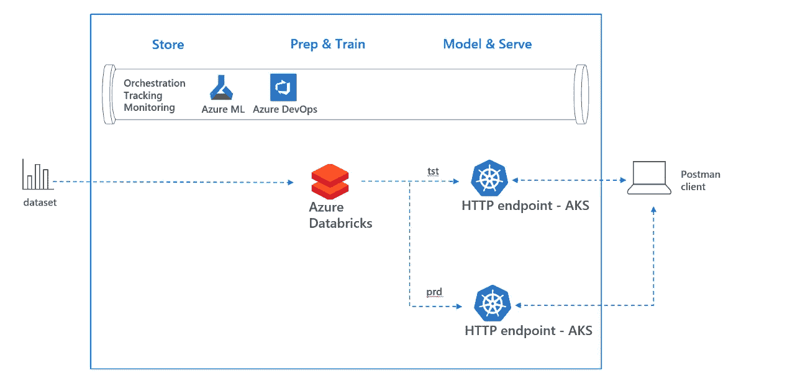

2\. High level overview

在本博客的剩余部分，将执行以下步骤:

*   3.先决条件
*   4.在 Azure Databricks 中创建机器学习模型
*   5.Azure 机器学习服务中的管理模型
*   6,7.在 Azure DevOps 中构建和发布模型
*   8.结论

博客的后续可以在[这里](/how-to-embed-security-in-your-azure-data-science-project-55ef3f2ab47)找到，其中安全性被嵌入到构建/发布管道中。此外，审计跟踪的细节将在的博客[中讨论。最后，如果你对如何在 Azure Data Factory 中使用 Azure Databricks 感兴趣，请参考这个](/how-to-troubleshoot-your-azure-data-science-project-in-production-5382b66cbaf9)[博客](https://cloudarchitected.com/2019/04/devops-in-azure-with-databricks-and-data-factory/)。

# 3.先决条件

本教程需要以下资源:

*   [Azure 数据块](https://docs.azuredatabricks.net/getting-started/try-databricks.html#step-2-create-a-databricks-workspace)
*   [Azure 机器学习服务](https://docs.microsoft.com/en-us/azure/machine-learning/service/quickstart-get-started#create-a-workspace)
*   [蔚蓝 DevOps](https://visualstudio.microsoft.com/team-services/)

# **4。在 Azure Databricks 中创建机器学习模型**

Azure Databricks 是一个基于 Apache Spark 的分析平台，针对 Azure 进行了优化。它可以用于许多分析工作负载，其中包括机器学习和[深度学习](/how-to-create-your-own-deep-learning-project-in-azure-509660d8297)。在此步骤中，将完成以下工作:

*   4a。创建新集群
*   4b。导入笔记本
*   4c。运行笔记本

## ***4a。创建新的集群***

启动 Azure Databricks 工作区并转到群集。使用以下设置创建新集群(2020 年 9 月编辑:在 devOps pipeline 中，Databricks Runtime 6.6。被使用，建议在数据块中也使用这个运行时版本进行交互式分析):


4a1\. Create cluster

## ***4b。导入笔记本***

转到您的 Azure Databricks 工作区，右键单击，然后选择导入。在单选按钮中，选择使用 URL 导入以下笔记本:

```
[https://raw.githubusercontent.com/rebremer/devopsai_databricks/master/project/modelling/1_IncomeNotebookExploration.py](https://raw.githubusercontent.com/rebremer/devopsai_databricks/master/project/modelling/1_IncomeNotebookExploration.py)
```

另请参见下图:


4b1\. Import notebook

## ***4c。运行笔记本***

选择您在 4b 中导入的笔记本，并将该笔记本连接到您在 4a 中创建的集群。确保集群正在运行，否则启动它。阅读笔记本中的步骤，其中研究了数据，并尝试了几种设置和算法，以创建一个预测一个人收入阶层的模型。使用快捷键 SHIFT+ENTER 逐个单元格地浏览笔记本。


4c1\. Steps in notebook

# 5.Azure 机器学习服务中的管理模型

Azure 机器学习服务(Azure ML)是一种云服务，您可以使用它来训练、部署、自动化和管理机器学习模型。在这个上下文中，上一步中创建的模型将被添加到您的 Azuere ML 实例中。将执行以下步骤

*   5a。将库添加到数据块群集中
*   5b。使用 Azure ML 将笔记本导入到 Azure Databricks
*   5c。在 Azure ML 中查看结果

## 5a。将库添加到数据块群集中

右键单击您的工作区并选择“创建库”

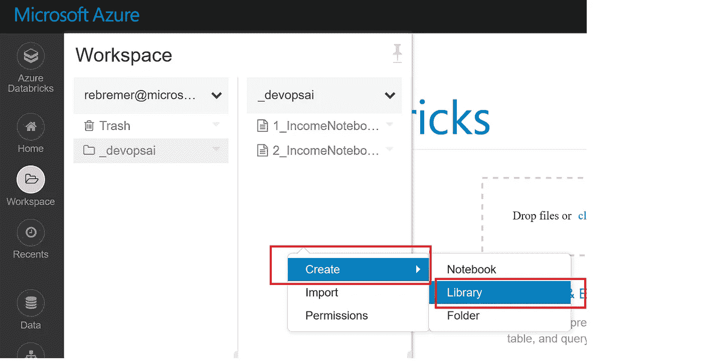

5a1\. Create library

选择 PyPi，然后填写:azureml-sdk[databricks]

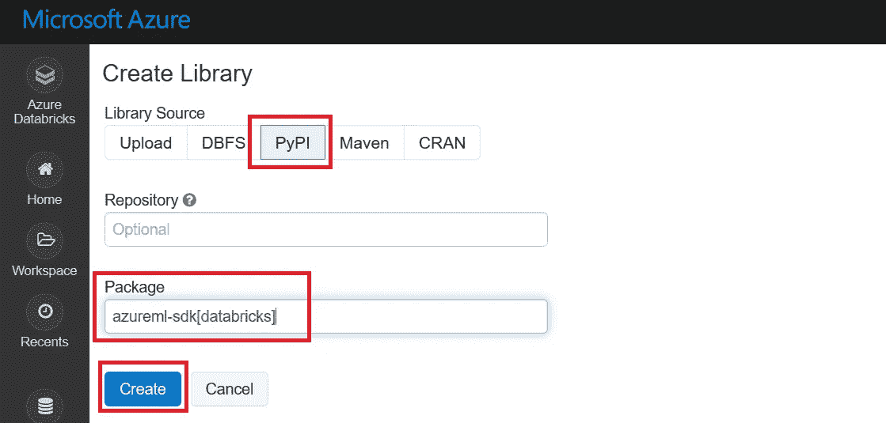

5a2\. Add PyPi library with azureml-sdk[databricks]

最后，将库连接到群集。

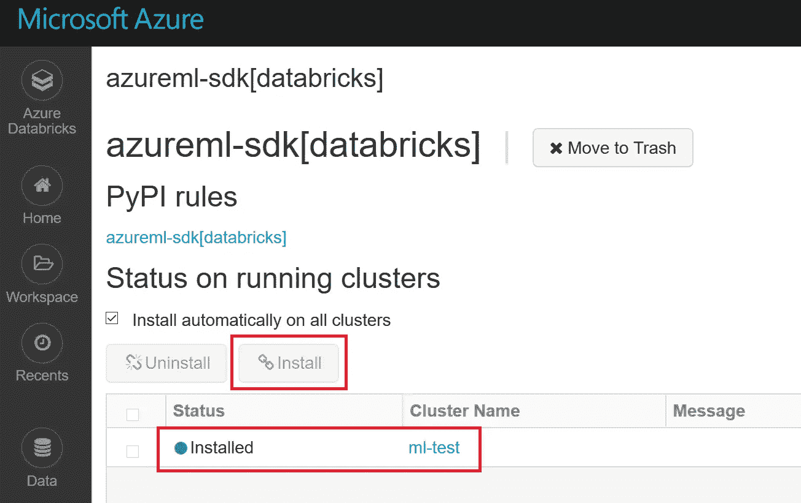

5a3\. Attach library to cluster

## 5b。使用 Azure ML 将笔记本导入到 Azure Databricks

在本教程的上一部分，我们在 Azure Databricks 中创建了一个模型。在这一部分中，您将把创建的模型添加到 Azure 机器学习服务中。

再次转到您的 Databricks 服务，右键单击，选择导入，并使用以下 URL 导入笔记本:

```
[https://raw.githubusercontent.com/rebremer/devopsai_databricks/master/project/modelling/2_IncomeNotebookAMLS.py](https://raw.githubusercontent.com/rebremer/devopsai_databricks/master/project/modelling/2_IncomeNotebookAMLS.py)
```

同样，确保它已连接到群集，并且群集正在运行

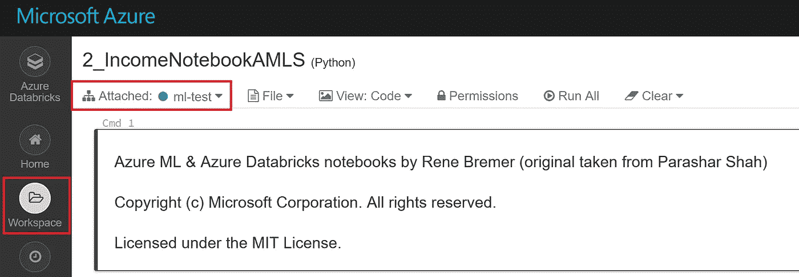

5b1\. Import Azure ML notebook

随后，为 workspace、subscription_id 和 resource_grp 填入正确的值。所有值都可以在 Azure 门户的 Azure 机器学习服务工作区的 overview 选项卡中找到。

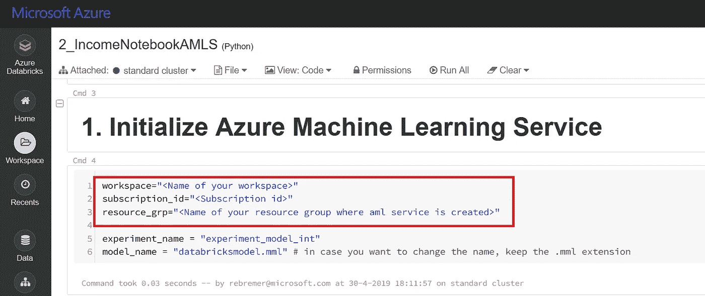

5b2\. Add variables notebook

现在，使用快捷键 SHIFT+ENTER 逐个单元格地运行笔记本单元格。

在 cell 6 中，您需要向笔记本中的 Azure 机器学习服务进行身份验证。按照笔记本中的说明打开 URL，并输入生成的代码进行身份验证。

## 5c。在 Azure ML 中查看结果

在步骤 5b 中，运行一个笔记本，其中的结果被写入 Azure 机器学习服务。在这方面，完成了以下工作:

*   在 you Azure ML 中创建了一个新的实验
*   在这个实验中，具有 6 个子运行的根运行可以找到不同的尝试。
*   子运行包含模型的描述(例如正则化为 0 的逻辑回归)和尝试的最重要记录(例如准确性、假阳性的数量)
*   模型人工制品(。mml)也是子运行的一部分。最佳子运行的工件可以投入生产。

转到您的 Azure ML 实例。选择笔记本中使用的实验名称(例如，experiment_model_int)。

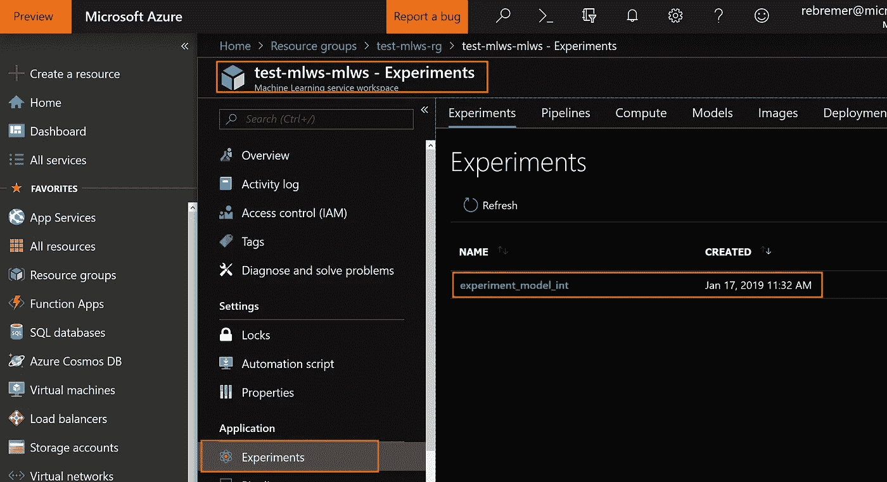

5c1\. Find experiment in Azure Machine Learning Service

现在单击实验，单击您想要查看指标的运行和子运行。

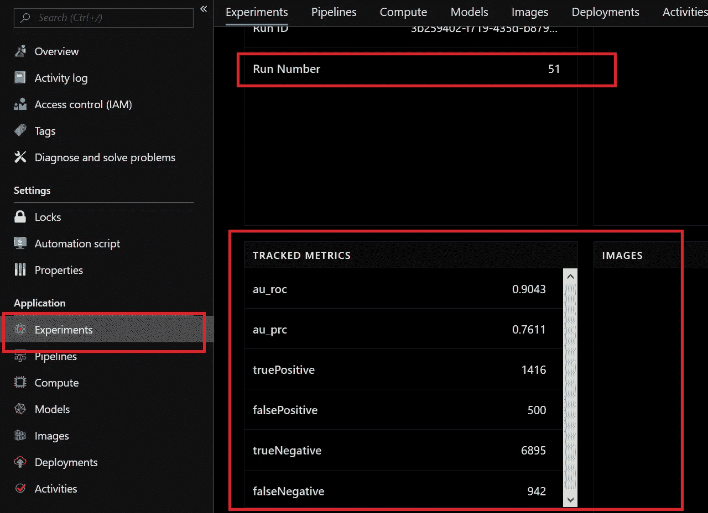

5c2\. Find metrics of a childrun in Azure Machine Learning Service

你去输出的时候会发现模型神器，也可以下载。在本教程的下一部分中，最佳运行的模型工件将被用作使用 Azure DevOps 部署的容器的基础。

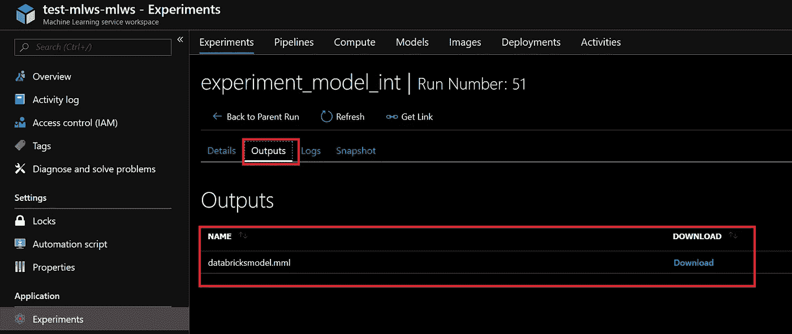

5c3\. Model artifact

# 6.创建和准备 Azure DevOps 项目

Azure DevOps 是一个工具，可以持续地构建、测试和部署你的代码到任何平台和云。在第 6 章中，将创建并准备一个 Azure DevOps。该项目将采用以下步骤进行准备:

*   6a。在数据块中创建个人访问令牌
*   6b。创建 AKS 集群
*   6c。创建 Azure DevOps 项目和服务连接
*   6d。向代码中添加变量

在第 7 章中，实际的构建-发布管道将被创建并运行以创建模型的一个端点。

## 6a。在数据块中创建个人访问令牌

要在 Azure DevOps(使用 REST APIs)触发的 Azure Databricks 中运行笔记本，需要 Databrics 访问令牌(PAT)进行身份验证。

进入 Azure Databricks，点击右上角的人物图标。选择用户设置，然后生成新令牌。


6a1\. Generate Databricks Access Token

请确保现在复制令牌。你再也看不到它了。稍后从 Azure DevOps 构建管道访问数据块需要令牌

## 6b。创建 AKS 集群

在这一步中，在 Azure Kubernetes Services (AKS)中创建了一个测试和生产环境。通常，这是两个独立的 AKS 环境，但是，为了简化和节约成本，只创建了一个环境。首先，转到您的 Azure ML 服务工作区并选择 Compute。取计算机名 **blog-devai-aks** 并选择 Kubernetes 服务作为计算机类型，也见下文。

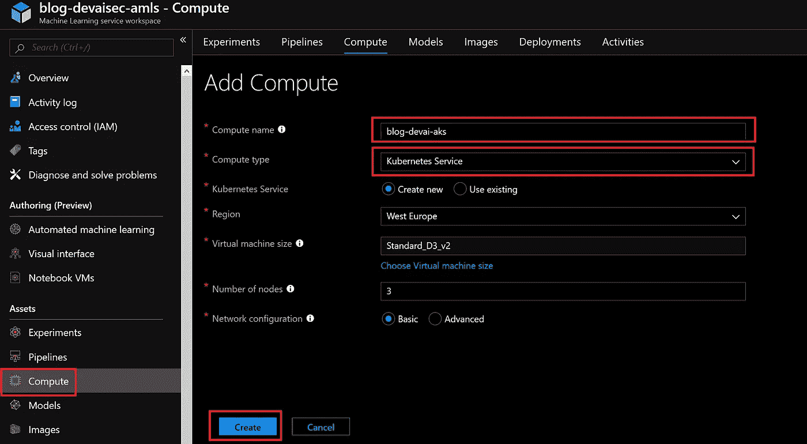

6b1\. Add AKS compute to Azure ML Service

创建 AKS 集群大约需要 10 分钟。继续下一步。

## 6c。创建带有服务连接的 Azure DevOps 项目

按照[这个](https://docs.microsoft.com/en-us/azure/devops/organizations/projects/create-project?view=azure-devops&tabs=new-nav&viewFallbackFrom=vsts)教程，在 Azure DevOps 中创建新项目。创建新项目后，单击存储库文件夹并选择导入以下存储库:

```
[https://github.com/rebremer/devopsai_databricks.git](https://github.com/rebremer/devopsai_databricks.git)
```

另请参见下图:

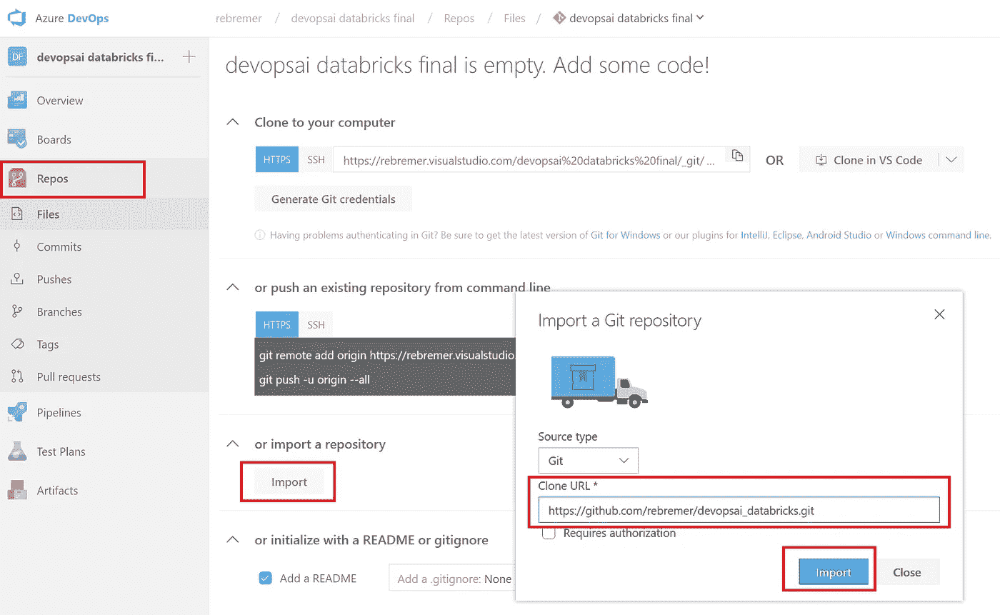

6c1\. Add repository to your Azure DevOps project

从 Azure DevOps 访问资源组中的资源需要服务连接。转到项目设置、服务连接，然后选择 Azure 资源管理器。


6c2\. Go to Service Connection

选择服务主体身份验证，并将范围限制在部署了机器学习工作区服务的资源组中。确保将连接命名为如下所示:**devopsaisec _ service _ connection。**

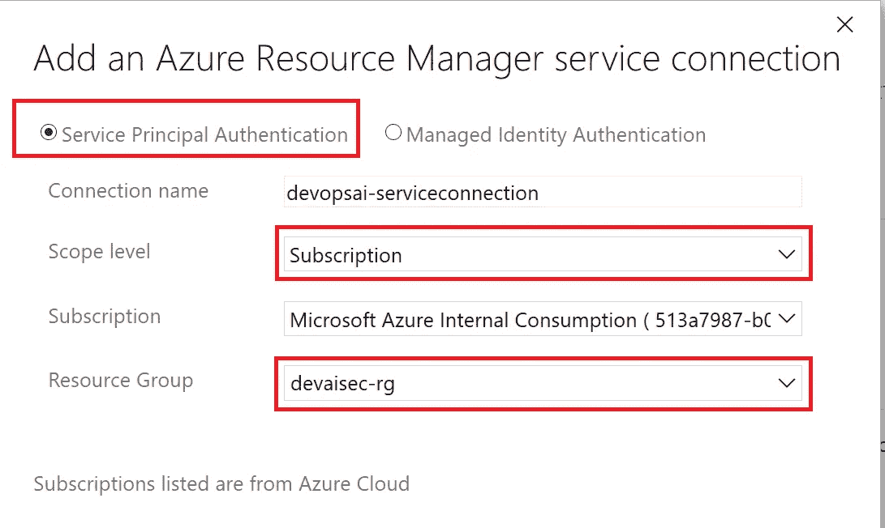

6c3\. Create Azure Resource Manager service connection

## 6d。向代码中添加变量

在您在上一步中创建的 Repos 中，应更改以下文件:

*   \ project \ config code _ build _ release . yml

对于工作空间、subscription_id 和 resource，使用与步骤 5b 中的机器学习服务工作空间的值相同的变量。此外，填写您在步骤 6a 中生成的 Databricks 个人访问令牌。

```
variables:
  # change 5 variables below with your own settings, make sure that 
  # : with a space is kept and not replaced with =
  workspace: '<<Name of your workspace>>'
  subscription_id: '<<Subscription id>>'
  resource_grp: '<<Name of your resource group with aml service>>'
  domain: 'westeurope.azuredatabricks.net' # change loc.when needed
  dbr_pat_token_raw: '<<your Databricks Personal Access Token>>'
```

在 Azure DevOps 中，可以通过在 Repos 中查找文件，点击“编辑”，更改变量，然后“提交”文件来更改文件。您还可以克隆项目并从那里开始工作。请注意，在生产环境中，绝不能将键添加到代码中。相反，Azure DevOps 管道中的[秘密变量](https://docs.microsoft.com/en-us/azure/devops/pipelines/process/variables?view=azure-devops&tabs=yaml%2Cbatch#secret-variables)将被使用，并在后续的[教程](/how-to-embed-security-in-your-azure-data-science-project-55ef3f2ab47)中处理。

在本章中，创建并准备了一个 Azure DevOps 项目。现在模型已经准备好在 Azure DevOps 项目中构建和发布了。

# 7.在 Azure DevOps 中构建和发布模型

在这一部分中，使用以下步骤在 Azure DevOps 中构建和发布模型:

*   7a。创建构建-发布管道
*   7b。运行构建-发布管道
*   7c。使用邮递员消费 HTTP 端点

## 7a。创建构建-发布管道

在这一步中，您将创建一个构建-发布管道。转到您在 6c 中创建的 Azure DevOps 项目，然后单击 Pipelines。将显示一个向导，您可以在其中选择 Azure Repos Git，另请参见下文。

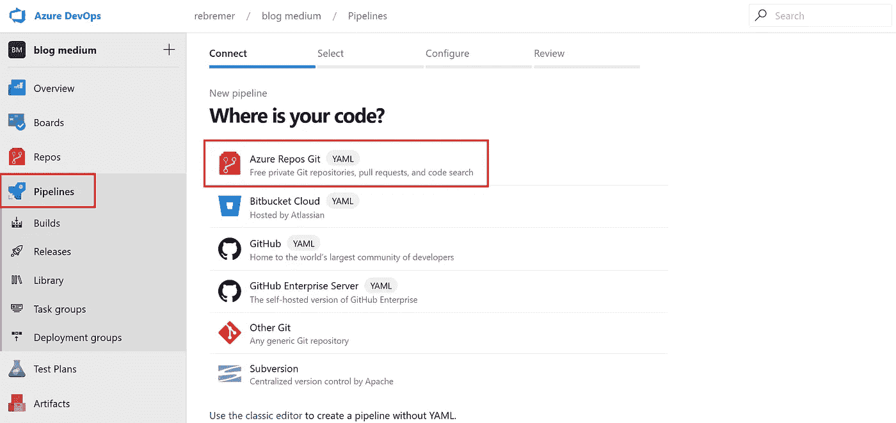

7a1\. Create Pipeline

随后，选择附加到这个项目的 Git repo，然后选择“现有的 Azure Pipelines YAML 文件”。然后浏览目录\ project \ config code _ build _ release _ ACI _ only . yml 或\ project \ config code _ build _ release . yml(如果在步骤 6b 中创建了 AKS 集群，另请参见下文)。

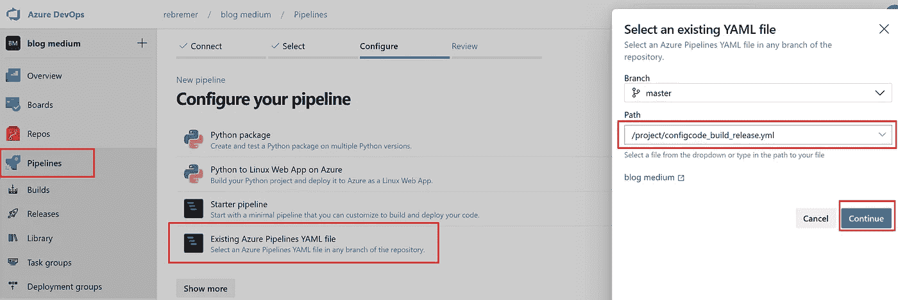

7a2\. Select build-release YAML file

最后，检查您的管道并保存您的管道，另见下文。

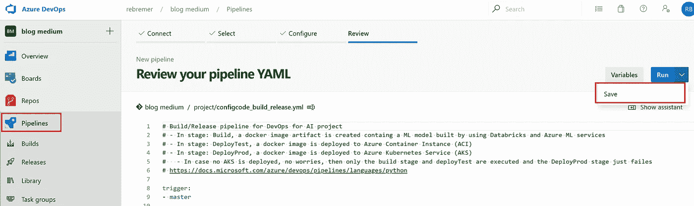

7a3\. Save pipeline

在本章中，配置了管道。在此管道中，将执行以下步骤:

构建:

*   选择 Python 3.6 并安装依赖项
*   将笔记本上传到数据块
*   通过运行 notebook 使用 Azure Databricks 创建模型。向 Azure 机器学习服务添加模型
*   创建构建工件作为发布 deployTest 和 deployProd 的输入

发布部署测试:

*   检索在构建步骤中创建的模型
*   将模型作为 docker 映像部署到作为测试端点的 AKS
*   测试 AKS 中的“测试端点”

释放部署杆:

*   检索在构建步骤中创建的模型
*   将模型作为 docker 映像部署到作为 prd 端点的 AKS
*   在 AKS 中测试“生产端点”

在下一部分中，将运行管道。

## 7b。运行构建-发布管道

在这一步中，构建-发布管道将在 Azure DevOps 中运行。转到上一步中部署的管道，选择管道，然后选择队列，另请参见下文。

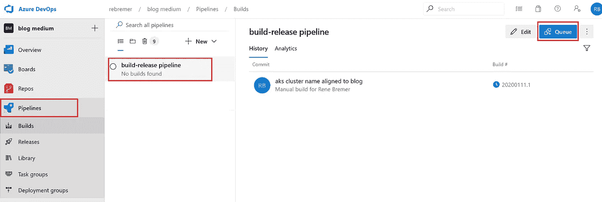

7b1\. Run build-release pipeline

当管道启动时，会在构建步骤中使用 Azure Databricks 和 Azure ML 创建一个包含 ML 模型的 docker 映像。随后，docker 映像在 ACI 和 AKS 中部署/发布。下面可以看到一次成功的运行。

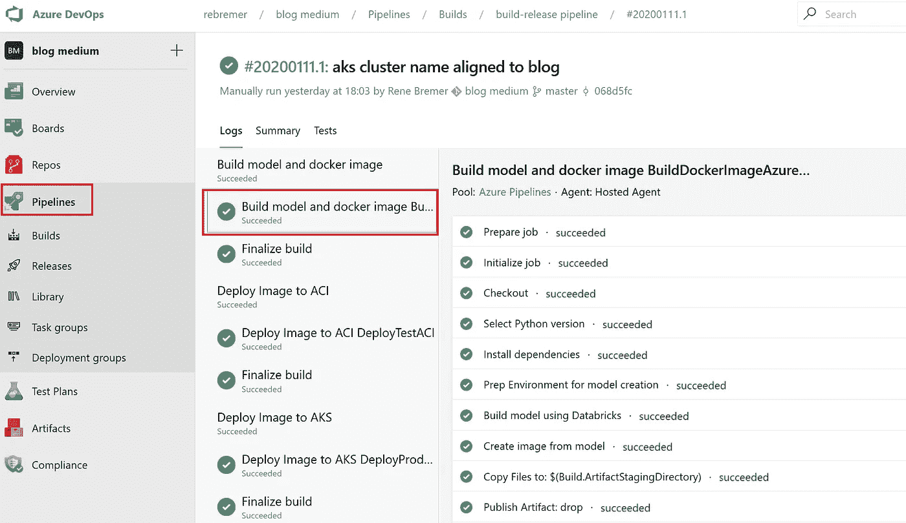

7b2\. Successful run of build-release pipeline

请注意，如果您决定不在 AKS 中部署 docker 映像，前面的步骤仍将执行，AKS 步骤将失败。要获得详细的日志记录，您可以单击各个步骤。

## 7c。使用邮递员消费 HTTP 端点

当你进入 Azure ML 工作区时，你可以找到你在 7b 中部署的模型的端点。这些端点现在将被[邮递员](https://www.getpostman.com/)用来创建预测。可以在项目中的项目/services/50_testEndpoint.py 中找到一个示例负载。在本例中，预测了三个人的收入等级。

*   对第一个人的预测是收入高于 50k，
*   对于另外两个人，预测值低于 50k。

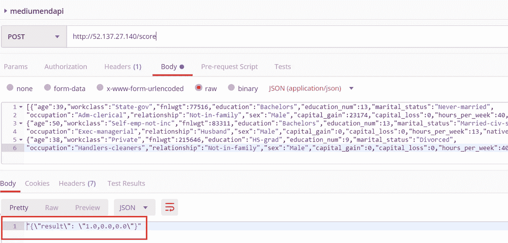

7c2\. Use HTTP endpoint to create predictions

# 8.结论

在本教程中，创建了一个机器学习项目的端到端管道。在此:

*   Azure Databricks with Spark 用于探索数据和创建机器学习模型。
*   Azure 机器学习服务用于跟踪模型及其度量。
*   Azure Devops 用于构建最佳模型的映像，并将其作为端点发布。

通过这种方式，您可以协调和监控从构思到模型投入生产的整个过程。这使您能够回答问题:*为什么模型会预测到这一点？*

可以在下面找到架构概述。在[这个](/how-to-embed-security-in-your-azure-data-science-project-55ef3f2ab47)后续教程中，管道的安全性得到了加强。


8\. High level overview