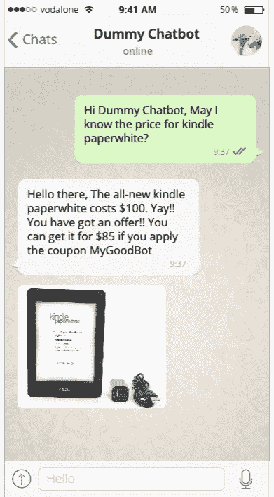
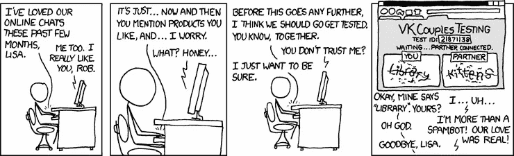
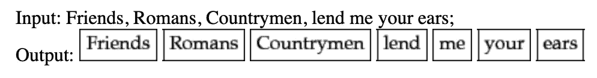
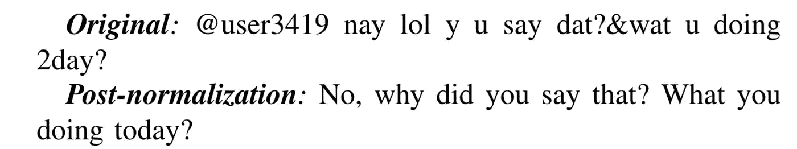
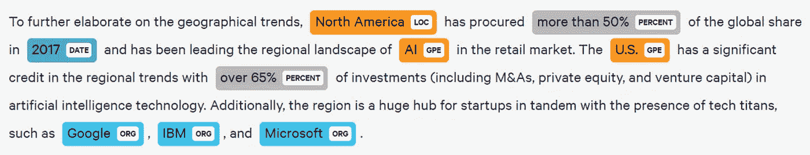
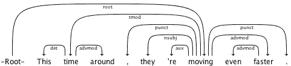
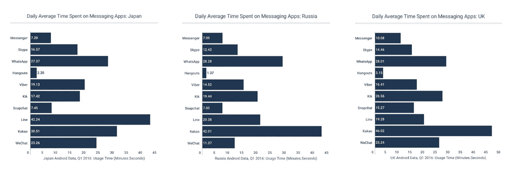

# 如何构建聊天机器人——自然语言处理中的一课

> 原文：<https://towardsdatascience.com/how-to-build-a-chatbot-a-lesson-in-nlp-d0df588afa4b?source=collection_archive---------1----------------------->

## 一个 5 步的自然语言处理过程可以帮助你设计简单的聊天机器人

顾名思义，聊天机器人是一种和你聊天的机器。不过，诀窍是让它尽可能像人类。从“美国运通客户支持”到谷歌 Pixel 的电话筛选软件，聊天机器人的种类繁多。


Photo by [Blake Wisz](https://unsplash.com/@blakewisz?utm_source=medium&utm_medium=referral) on [Unsplash](https://unsplash.com?utm_source=medium&utm_medium=referral)

# 它实际上是如何工作的？

聊天机器人的早期版本使用了一种叫做**模式匹配**的机器学习技术。与目前使用的高级 NLP 技术相比，这要简单得多。

## 什么是模式匹配？

要理解这一点，想象一下你会问一个卖书的人什么，比如——“*_ _ 本书的价格是多少？*"或"*你有哪些 __ 作者的书？*“这些斜体问题中的每一个都是一种模式的示例，当类似的问题在未来出现时，可以进行匹配。

模式匹配需要大量预先生成的模式。基于这些预先生成的模式，聊天机器人可以很容易地选择最匹配客户查询的模式，并为其提供答案。

你认为如何创建下面的聊天



简单地说，问题**我可以知道**的价格吗被转换成模板**的价格<星/ >。这个模板就像一把钥匙，所有未来的答案都将存储在里面。所以我们可以有下面的**

*   iPhone X 的价格是 1500 美元
*   Kindle Paperwhite 的价格——100 美元

用 AIML(人工智能建模语言)编写的代码看起来会像这样

```
**#PATTERN MATCHING**
<category>
   <pattern>**MAY I KNOW THE PRICE FOR ***</pattern>

   <template>
      <srai>**THE PRICE OF <star/>**</srai>
   </template>

</category>------------------------------------------------
**#PRE_STORED PATTERNS**<category>
   <pattern>**THE PRICE OF iPhone X?**</pattern>
   <template>*iPhone X Costs $1500.*</template>
</category><category>
   <pattern>**THE PRICE OF Kindle Paperwhite?**</pattern>
   <template>*The all-new kindle paperwhite costs $100\. Yay!! You   
             have got an offer!! You can get it for $85 if you apply 
             the coupon* ***MyGoodBot*** 
   </template>
</category>
```

## NLP 聊天机器人

模式匹配实现起来简单快捷，但也只能到此为止。它需要大量预先生成的模板，并且只对期望有限数量问题的应用有用。



[xkcd](https://xkcd.com/632/)

**进入 NLP** ！NLP 是一个稍微高级的技术的集合，可以理解广泛的问题。创建聊天机器人的 NLP 过程可以分为 5 个主要步骤

**1)标记化—** 标记化是将文本分割成小块的技术，称为*标记*，同时丢弃某些字符，如标点符号。这些标记在语言学上代表了文本。



Tokenizing a sentence

**2)规格化—** 规格化处理文本，找出可能改变用户请求意图的常见拼写错误。一篇很好的研究论文很好地解释了这个概念



[Syntactic normalisation of tweets research](http://www.cs.uccs.edu/~jkalita/work/reu/REUFinalPapers2010/Kaufmann.pdf)

**3)识别实体—** 这一步有助于聊天机器人识别正在谈论的事物，例如，它是一个物体、一个国家、一个号码还是用户的地址。

在下面的例子中，观察谷歌、IBM 和微软是如何联合起来的。这一步也称为命名实体识别。



Entities for various words.

**4)依存句法分析——在这一步中，我们把句子分成名词、动词、宾语、常用短语和标点符号。这项技术帮助机器识别短语，进而告诉它用户想要传达什么。**



[Stanford](https://nlp.stanford.edu/software/nndep.html) — dependency parsing example

**5)生成—** 最后，生成响应的步骤。以上所有步骤都属于 NLU(自然语言理解)。这些步骤有助于机器人理解所写句子的意思。然而，这一步属于 NLG(自然语言生成)。这一步接收前面 NLU 步骤的输出，并生成许多意思相同的句子。生成的句子通常在以下方面是相似的

*   **词序—** “厨房灯”类似于“厨房里的灯”
*   **单数/复数—** “厨房灯”类似于“厨房灯”
*   **问题—** “关上门”类似于“你介意关上门吗？”
*   **否定**——“19:00 开电视”类似于“19:00 不开电视”
*   **礼貌**——“打开电视”类似于“麻烦你打开电视好吗？”

基于用户问题的上下文，机器人可以用上述选项之一进行回复，用户会满意地返回。在很多情况下，用户无法区分机器人和人类。

自 AIML 于 1995 年发明以来，聊天机器人一直在稳步发展，并取得了长足的进步。即使在 2016 年，普通用户也要花 20 多分钟在即时通讯应用上，Kakao、Whatsapp 和 Line 是最受欢迎的应用。



[Similarweb](https://www.similarweb.com/blog/messaging-apps)

世界各地的企业都希望通过使用这些机器人来削减客户服务成本，并提供全天候的客户服务。

[](https://www.businessinsider.com/80-of-businesses-want-chatbots-by-2020-2016-12?IR=T) [## 到 2020 年，80%的企业想要聊天机器人

### 这个故事被发送到 BI Intelligence 应用和平台简报订阅者。要了解更多信息并订阅…

www.businessinsider.com](https://www.businessinsider.com/80-of-businesses-want-chatbots-by-2020-2016-12?IR=T) 

聊天机器人背后的技术相当标准。NLP 还有很长的路要走，但即使在目前的状态下，它也为聊天机器人领域带来了很多希望。