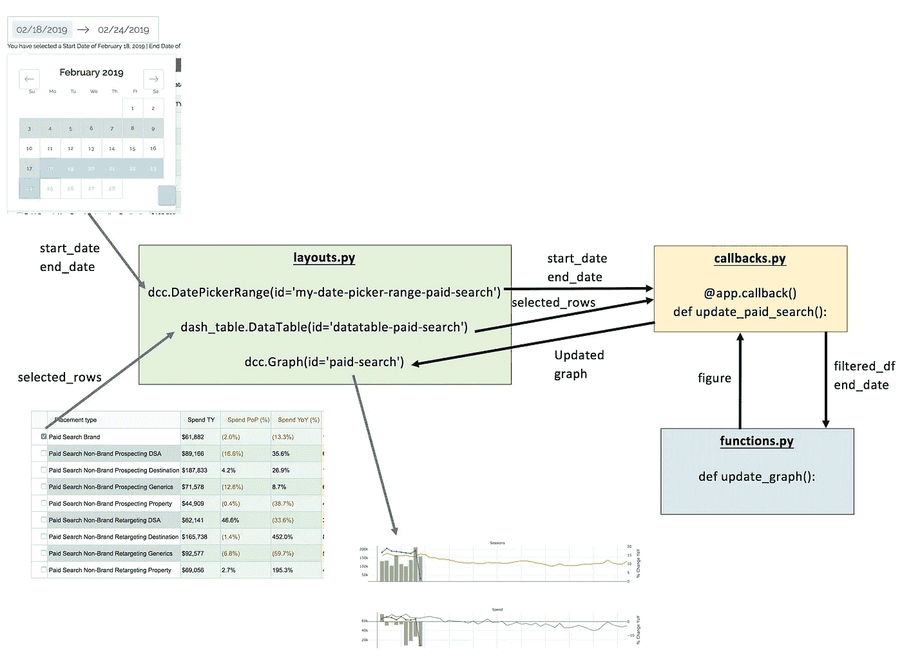

# 如何使用 Dash 和 Plotly 构建报告仪表板

> 原文：<https://towardsdatascience.com/how-to-build-a-complex-reporting-dashboard-using-dash-and-plotl-4f4257c18a7f?source=collection_archive---------1----------------------->

在这篇博文中，我将提供一个分步指南，介绍如何使用 [Dash](https://medium.com/@plotlygraphs) 构建一个报告[仪表板](https://davidcomfort-dash-app1.herokuapp.com/cc-travel-report/paid-search/)，这是一个用于构建分析性 web 应用程序的 Python 框架。我没有详细介绍构建 Dash 应用程序的基础知识，而是提供了一个使用数据表和图表构建多页仪表板的详细指南。

我将报告仪表板构建为一个多页面应用程序，以便将仪表板分成不同的页面，这样就不会太多，并以一种有组织的方式呈现数据。在每个仪表板页面上，有两个数据表、一个日期范围选择器、一个数据下载链接，以及两个仪表板下方的一组图表。我在构建仪表板时遇到了几个技术挑战，我详细描述了我是如何克服这些挑战的。

完成的仪表盘可以在[https://David comfort-dash-app 1 . heroku app . com/cc-travel-report/payed-search/](https://davidcomfort-dash-app1.herokuapp.com/cc-travel-report/paid-search/)查看，代码在 [Github](https://github.com/davidcomfort/dash_sample_dashboard) 中提供。(应用程序中使用的数据是随机数据，产品名称是“虚拟”名称。)


Figure 1: Dashboard built using Dash


Figure 2: Second Part of Dashboard

# 目录

*   [**1。**简介](https://medium.com/p/4f4257c18a7f#4711)
*   [**2。我想用仪表板实现什么？**](https://medium.com/p/4f4257c18a7f#a5c5)
*   [**3。构建仪表板的挑战**](https://medium.com/p/4f4257c18a7f#05bf)
*   [**4。创建新环境并安装 Dash**](https://medium.com/p/4f4257c18a7f#0bad)
*   [**5。破折号**入门](https://medium.com/p/4f4257c18a7f#319e)
*   [**6。构建多页面应用程序**](https://medium.com/p/4f4257c18a7f#eda6)
*   [*构建索引页面*](https://medium.com/p/4f4257c18a7f#9afd)
*   [*自定义页面标题和图标*](https://medium.com/p/4f4257c18a7f#f232)
*   [*页面布局概述*](https://medium.com/p/4f4257c18a7f#906f)
*   [*App 的本地测试*](https://medium.com/p/4f4257c18a7f#0bbb)
*   [**7。构建日期选择器元素**](https://medium.com/p/4f4257c18a7f#0d3f)
*   [*给 CSS 添加一个修正，这样日期选择器就不会隐藏在数据表后面*](https://medium.com/p/4f4257c18a7f#ed95)
*   [**8。构建第一个数据表**](https://medium.com/p/4f4257c18a7f#63bc)
*   [*根据日期选择改变数据表中显示的日期*](https://medium.com/p/4f4257c18a7f#d574)
*   [*计算指标的变化，以及计算每次会话的成本、转换率和每次收购的成本。*](https://medium.com/p/4f4257c18a7f#4b8c)
*   [*一种选择压缩数据表或完整数据表的方法。*](https://medium.com/p/4f4257c18a7f#58a3)
*   [*有条件地对不同的数据表单元格进行颜色编码*](https://medium.com/p/4f4257c18a7f#f5d2)
*   [*使用重身幽灵列的单元格的条件格式*](https://medium.com/p/4f4257c18a7f#4476)
*   [**9。**建筑下载数据链接](https://medium.com/p/4f4257c18a7f#37f2)
*   [10**。构建第二个数据表**和](https://medium.com/p/4f4257c18a7f#ec15)
*   [11**。通过选择仪表板数据表**中的行来更新图形](https://medium.com/p/4f4257c18a7f#b125)
*   [*第一步*](https://medium.com/p/4f4257c18a7f#2d4a)
*   [*第二步*](https://medium.com/p/4f4257c18a7f#672c)
*   [*第三步*](https://medium.com/p/4f4257c18a7f#5506)
*   [12**。动态更新图表和计算指标**](https://medium.com/p/4f4257c18a7f#7fea)
*   [**13。Plotly 图形工具**](https://medium.com/p/4f4257c18a7f#7a84)
*   [**14。部署仪表板**](https://medium.com/p/4f4257c18a7f#33e7)
*   [*解决 Custom.css 文件和认证问题*](https://medium.com/p/4f4257c18a7f#8520)
*   [*Dash 部署服务器*](https://medium.com/p/4f4257c18a7f#d025)
*   [**15。包装完毕**](https://medium.com/p/4f4257c18a7f#44e2)
*   [**16。破折号**的资源](https://medium.com/p/4f4257c18a7f#b300)

# 1.介绍

今年 1 月，我参加了我的第一次 PyData 会议，PyData Miami，参加了切尔西·道格拉斯关于 Dash 的精彩演讲。

Embedded Video 1: Dash: data exploration web apps in pure Python — Chelsea Douglas

很快，Dash 的强大功能变得显而易见，我可以使用 Python 轻松地构建 web 应用程序和仪表盘。

从我的角度来看，我的公司确实需要自动化报告，取代 Microsoft Excel 数据透视表和电子表格，并提供商业智能工具的替代方案。尽管我的公司中的各种利益相关者依赖 Excel 电子表格进行定期报告，但它们的使用变得很笨拙，容易出错，它们不是独立于平台的，并且它们不适合自动化。

因此，我努力使用 Dash 构建一个多页面的 web 应用程序。这篇文章深入探讨了我的努力的本质和细节，以及我是如何克服几个技术挑战的。我应该指出，我来自一个数据科学家的角度，并没有声称自己是一个软件开发人员。因此，我的代码当然还有改进的空间，我欢迎读者的建议。同时，如果读者需要构建复杂的仪表板和数据表，我希望他们能够从我的工作中受益。

# 2.我想用仪表板实现什么？

在我现在的公司，许多定期报告都是通过 Excel 电子表格和数据透视表完成的，或者使用商业智能工具，如 [Birst](https://www.birst.com/) 或 [Qlikview](https://www.qlik.com/us/products/qlikview) 。因此，我想建立一个报告仪表板，作为一个概念验证，可以取代和增强我们的报告。具体来说，我想为一个品牌构建一个报告 web 应用程序，它可以报告不同的营销渠道指标，实现自动化并提供方便的访问。

**电子商务营销仪表板**的要求包括:

*   将不同的营销渠道分成不同的页面，这样仪表盘中显示的数据量就不会过多。
*   日期选择器，用户可以选择日期范围来过滤数据。
*   一个数据表，显示所选日期范围内，以及去年同期和所选日期范围之前的相应时期内，每个数字营销渠道或产品类型的基本指标(支出、会话、交易数量和收入)。*
*   另一个数据表显示所选日期范围(以及去年同期和前期)的计算指标。这些指标包括每次会话成本(CPS)、转换率(CVR)和每次收购成本(CPA)。
*   下载每个数据表中显示的数据(Excel 格式)的链接。
*   数据表下方将显示每周的指标图表。
*   *对应的先前时段的一个示例是，如果用户选择了 2019 年的第 5 和第 6 周，则对应的先前时段将是 2019 年的第 3 和第 4 周。*

# 3.构建仪表板的挑战

当我构建 dashboard 应用程序时，出现了多个挑战。一些主要挑战包括:

*   找出一种方法来显示压缩的数据表或完整的数据表。
*   能够根据单元格中的值对数据表中的单元格进行颜色编码。
*   能够选择多个产品以包括在数据的图形表示中。
*   能够根据用户选择的日期范围动态更新数据表中的指标。
*   能够下载数据表中呈现的数据，而无需任何附加格式。
*   在与给定指标相同的 x 轴上描绘指标的逐年变化。
*   能够同时放大所有的图表。

# 4.创建新环境并安装 Dash

有一个 [Dash 用户指南](https://dash.plot.ly/)，它提供了 Dash 的一个相当全面的介绍，我鼓励读者在处理一个完全成熟的仪表板之前浏览用户指南并构建一些简单的 Dash 应用程序。此外，还有一个 [Dash 社区论坛](https://community.plot.ly/c/dash)，一个论坛的[展示和讲述](https://community.plot.ly/t/show-and-tell-community-thread/7554)部分，突出 Dash 社区的工作，一个 Dash 项目的[画廊](https://dash.plot.ly/gallery)，一个[令人敬畏的 Dash](https://github.com/ucg8j/awesome-dash) 资源的精选列表，以及一篇关于 Dash 的介绍性文章:

> Dash 是一个开源的 Python 库，用于创建基于 Web 的反应式应用程序。两年前，Dash 开始在 GitHub 上公开进行概念验证。我们在网上保留了这个原型，但是 Dash 的后续工作是秘密进行的。我们使用来自银行、实验室和数据科学团队的私人试验的反馈来指导产品的发展。**今天，我们很高兴地宣布 Dash 的首次公开发布，它既是企业级的，也是 Plotly 开源工具的一流成员。** Dash 现在可以从 Python 的包管理器中下载，带有`pip install dash`——它是完全开源的，得到了 MIT 的许可。你可以在这里找到[入门指南](https://plot.ly/dash)和 GitHub 上的 [Dash 代码](https://github.com/plotly/dash)。
> 
> Dash 是一个用于创建分析性 web 应用程序的用户界面库。那些使用 Python 进行数据分析、数据探索、可视化、建模、仪器控制和报告的人会立即发现 Dash 的用处。
> 
> Dash 使围绕数据分析代码构建 GUI 变得非常简单。

在安装 Dash 之前，按照惯例，我使用 [conda](https://docs.conda.io/projects/conda/en/latest/user-guide/tasks/manage-environments.html) : `conda create --name dash`创建了一个新环境，然后激活了那个环境`conda activate dash`。然后，我简单地按照用户指南中提供的 [Dash 安装协议](https://dash.plot.ly/installation)进行操作:

Code Block 1: Pip installing Dash and its components

我应该注意的是，Dash 及其组件的版本将会有所不同，您应该参考[用户指南](https://dash.plot.ly/installation)。

# 5.Dash 入门

已经有相当多的 Dash 教程了，所以我将在本教程中重点介绍如何使用数据表和图表构建多页仪表板，而不是复习构建 Dash 应用程序的基础知识。

如果你刚刚开始使用 Dash，我会鼓励读者至少通读优秀的 [Dash 用户指南](https://dash.plot.ly/)的前三节。在[仪表板数据表](https://dash.plot.ly/datatable)上也有一个部分。有几个教程可以让你入门 ***** :

*   [介绍 Plotly Dash](https://medium.com/@plotlygraphs/introducing-dash-5ecf7191b503)——《Dash》的作者 Chris Parmer 对 Dash 的高水平介绍。这篇文章是 Dash 官方发布(2017 年 6 月 21 日)的一部分。
*   [Plotly 的教程—第一部分:应用布局](https://plot.ly/dash/getting-started)
*   [Plotly 的教程—第二部分:交互性](https://plot.ly/dash/getting-started-part-2)
*   [Plotly 的教程——第三部分:交互式绘图](https://plot.ly/dash/interactive-graphing)
*   [Plotly 的教程—第 4 部分:带状态的回调](https://plot.ly/dash/state)
*   [Python 中基于 Web 的交互式仪表盘](https://alysivji.github.io/reactive-dashboards-with-dash.html)—MVC 模式如何适用于 Dash 以及构建应用程序的演练。
*   [使用 Plotly 的 Dash 交付公共部门决策支持仪表板](https://medium.com/a-r-g-o/using-plotlys-dash-to-deliver-public-sector-decision-support-dashboards-ac863fa829fb) —逐步构建复杂的仪表板。
*   [OPS code day:Dash Plotly Map+Graph](https://radumas.info/blog/tutorial/2017/08/10/codeday.html)—如何使用 Jupyter 笔记本与 Dash 协同创建映射，即
*   [使用 Plotly 的 Dash 框架创建交互式可视化效果](http://pbpython.com/plotly-dash-intro.html)—Dash 入门指南。
*   [用 Dash 寻找大脚怪，第 1 部分](https://timothyrenner.github.io/datascience/2017/08/08/finding-bigfoot-with-dash-part-1.html) —构建大脚怪目击仪表板的演练。[第二部分](https://timothyrenner.github.io/datascience/2017/08/09/finding-bigfoot-with-dash-part-2.html)，[第三部分](https://timothyrenner.github.io/datascience/2017/08/10/finding-bigfoot-with-dash-part-3.html)。
*   用 Dash 来想象地震——Dash 替代品的环境扫描，随后是一个教程。
*   [ARGO Labs — Plotly Dash 教程(视频)](https://www.youtube.com/watch?v=yfWJXkySfe0) —创建交互式仪表盘的详细介绍。
*   [使用 Dash 和 Python 的数据可视化 GUI(视频播放列表)](https://www.youtube.com/watch?v=J_Cy_QjG6NE&list=PLQVvvaa0QuDfsGImWNt1eUEveHOepkjqt) —探索 Dash 特性的五部分系列。

***** *来自* [*牛逼 Dash Github*](https://github.com/ucg8j/awesome-dash) *页面。*

本质上，Dash 应用程序由两部分组成:(1)描述应用程序外观和感觉的应用程序的“*布局*”,以及(2)使应用程序能够交互的“*回调*”。用户指南中提供了一个简单的 Dash 应用程序布局，如下所示:

Code Block 2: Simple Dash App Layout

我在本教程中描述的仪表板将 Dash 应用程序分割成不同的文件，并使用户能够构建多页面应用程序。

有一个“索引”页面，根据 URL 呈现不同的页面或布局。每个布局都由几个不同的 Dash 组件组成，包括日期范围选择器、数据表、下载链接和几个图表。这些组件中的每一个都与一个或多个“回调”相关，这些“回调”使仪表板能够进行交互。

用户可以与 Dash 组件之一交互(例如，改变日期范围)，并且其他组件反映该改变(例如，导致数据表中呈现的数据改变)。

这种方法的示意图如下图所示:


Figure 3: Schematic of Dashboard files

# 6.构建多页应用程序

基于在[https://dash.plot.ly/urls](https://dash.plot.ly/urls)的 Dash 文档，多页 Dash 应用程序的结构略有改动，如下所示:

Code Block 3: File Structure of a Multi-page Dash App

文件`app.py` 仅包含以下内容:

Code Block 4: app.py

注意，我使用的是 dash 认证模块([https://dash.plot.ly/authentication](https://dash.plot.ly/authentication))。这有一些含义，我将在下面加以阐述。

## 构建索引页面

`index.py`文件通过定义函数`display_page`来定义应用程序的 URL 页面结构，该函数根据应用程序的 URL 来决定应该呈现什么样的页面布局。

Code Block 5: index.py

这与[https://github.com/plotly/dash-vanguard-report](https://github.com/plotly/dash-vanguard-report)的 Dash Vanguard 报告中的`index.py`页面非常相似，在([https://Dash-gallery . plot ly . host/Dash-Vanguard-Report/portfolio-management](https://dash-gallery.plotly.host/dash-vanguard-report/portfolio-management))有一个演示。

然而，我不得不包括行`from app import server`，以便克服我在 Heroku 上部署应用程序时的一个问题(详见[https://community . plot . ly/t/nolayoutexception-on-deployment-of-multi-page-dash-app-example-code/12463](https://community.plot.ly/t/nolayoutexception-on-deployment-of-multi-page-dash-app-example-code/12463))。

## 自定义页面标题和图标

此外，我想定制应用程序的 HTML 索引模板，特别是页面标题和 favicon。为此，我在`index.py`中添加了以下`index_string:`:

Code Block 6: index_string in index.py File

为了定制 favicon，可以将`favicon.ico`图像放在资产目录中。

## 页面布局概述

`index.py`文件中的回调将应用程序 URL 作为输入，并根据布局输出不同的布局:

Code Block 7: Callback in index.py File

`layouts.py`文件包含以下内容:

*   普通 python 导入语句
*   将数据 CSV 文件读入 pandas 数据帧的语句
*   定义不同布局变化中所需的数据表列
*   每个页面布局部分的定义
*   `noPage` 布局的定义

`layouts.py`文件的开头如下:

Code Block 8: Beginning of layouts.py File

每个页面布局部分包含以下元素:

*   调用导入的`Header()`，这样就可以拥有共同的元素(徽标、品牌名称等。)跨多个 app。
*   数据范围元素
*   标题栏
*   用于选择压缩数据框和完整数据框的单选按钮
*   第一个数据表
*   下载按钮
*   第二数据表
*   图表

`layouts.py`中一个布局部分的简化代码块如下:

Code Block 9: Section of layouts.py to render Paid Search Page

上面的代码不包括条件格式，我将在下面讨论。

## 应用程序的本地测试

按照用户指南，在创建了`index.py`和`app.py`文件后，用户可以调用应用程序

```
$ python app.py
...Running on http://127.0.0.1:8050/ (Press CTRL+C to quit)
```

并在您的网络浏览器中访问[http:127 . 0 . 0 . 1:8050/cc-travel-report/payed-search/](http:127.0.0.1:8050/cc-travel-report/paid-search/)。

# 7.构建日期选择器元素


Figure 4: Date Selector Element

日期选择器元素提供了更新两个数据表中显示的数据以及下载的数据链接的方法。我还想让日期选择器对用户选择的日期提供反馈。

我干脆选择 2018 年 1 月 1 日作为允许的最小日期(`min_date_allowed`)；允许的最大日期基于 CSV 数据文件(`max_date_allowed`)中的最大日期；所选日期中显示的初始月份基于 CSV 数据文件中的最大日期(`initial_visible_month`)；初始开始日期是最大日期减去 6 天(`start_date`)；初始结束日期是最大日期。

以下代码位于`layouts.py`文件中，需要在 Dashboard 应用程序的每个“页面”上重复。

Code Block 10: Html Element for Date Picker in layouts.py File

我使用了一个回调函数和一个函数`update_output`来向用户提供反馈。具体来说，我希望提供关于所选日期、所选天数以及相应的前期日期的文本反馈。例如，如果用户使用日期范围选择器选择了 2019 年的第 5 周和第 6 周，则对应的过去时间段将是 2019 年的第 3 周和第 4 周。下面的`update_output`函数提供了这一功能。

Code Block 11: Callback and Function for Date Picker in layouts.py file

日期选择器元素为第一个数据表、第二个数据表、下载链接以及数据表下面的一组图表的回调提供输入。我将详细介绍这些回调是如何工作的，以及它们相关的输出。

## 向 CSS 添加一个修正，以便日期选择器不会隐藏在数据表后面

我必须纠正的一个问题是数据表模糊了日期选择器元素，所以我必须相应地纠正 CSS。

Code Block 12: CSS for change z-index of data table in custom.css file

# 8.构建第一个数据表


Figure 5: First Data Table with a Condensed View

仪表板中的第一个数据表显示了支出(与给定广告产品相关的成本)、网站会话、预订(交易)和收入等指标。这些指标根据在所选日期中选择的日期进行汇总，通常会显示所选日期范围内当前年度的数据、之前相应期间的数据、去年的数据，以及这些期间之间的百分比和绝对差异。

## 基于日期选择改变数据表中呈现的日期

我想要的第一个数据表的主要功能是使它具有交互性，由此显示的数据根据所选的日期而变化。首先，数据表元素需要包含在`layouts.py`文件中，如下面的(简化)代码所示:

Code Block 13: Data Table Component in layouts.py File

数据表的不同参数包括:

*   `id`:标识符，以便数据表可以被回调引用。
*   `columns`:表格中呈现的列；`deletable`让用户能够在使用应用程序时删除列。
*   `editable=True`让用户能够在使用应用程序时更改表格中的数据。
*   `n_fixed_columns=2`冻结前两列(在我们的例子中是复选框和位置类型)，因此当用户滚动整个数据表时，用户仍然可以查看复选框和位置类型。
*   `style_table`允许 CSS 样式应用于表格。
*   `row_selectable='multi'`允许用户通过复选框选择多行。这将根据选择更新下面的图表。
*   `selected_rows=0`包含最初选择的行的索引(如下图所示)。
*   `style_cell`允许将 CSS 样式应用于表格单元格。

我将在后续步骤中添加额外的参数，以便我们可以有条件的样式格式。在 pandas 中添加了数字格式，如美元符号、逗号和百分号，并定义为一系列格式化程序。

我应该注意，我没有在`layouts.py`文件中为数据表指定`data`参数。相反，数据表的`data`参数将来自回调:

Code Block 14: Callback for First Data Table in layouts.py File

## 计算指标的变化，以及计算每次会话的成本、转换率和每次收购的成本。

因为我们需要计算指标的变化，以及 CPA、CPS 和转换率，这些都取决于“动态”选择的日期，所以我将这些计算放入一个单独的文件中，`functions.py`。然后，我可以在不同的仪表板页面上重复使用这些功能。我还在这个文件中定义了格式化函数:

Code Block 15: Data Formatters in functions.py file

第一个数据表和第二个数据表的功能是相似的，所以我在这里只给出一个:

Code Block 16: update_first_datatable Function in functions.py

数据表元素、回调和函数之间的流程可以描述为:


Figure 6: Flow for the first data table

## 一种选择压缩数据表或完整数据表的方法。

我希望数据表的一个特性是能够显示表的“压缩”版本以及完整的数据表。因此，我在`layouts.py`文件中包含了一个单选按钮来选择要呈现的表格版本:

Code Block 17: Radio Button in layouts.py

此功能的回调接受单选按钮的输入，并输出要在数据表中呈现的列:

Code Block 18: Callback for Radio Button in layouts.py File

这个回调稍微复杂一点，因为我要为条件格式添加列(我将在下面讨论)。本质上，正如下面的回调基于使用回调语句`Output('datatable-paid-search', 'data'`选择的日期更改数据表中显示的数据一样，这个回调也基于使用回调语句`Output('datatable-paid-search', 'columns'`选择的单选按钮更改数据表中显示的列。

## 有条件地对不同的数据表单元格进行颜色编码

利益相关者希望数据表具有的特性之一是，能够根据指标值突出显示数据表中的某些数字或单元格；例如，红色代表负数。然而，数据表单元格的条件格式有三个主要问题。

*   目前 Dash 数据表中缺少格式化功能。
*   如果在将数字包含到 Dash 数据表中之前对其进行了格式化(例如在 pandas 中)，则数据表功能(如排序和过滤)将无法正常工作。
*   Dash 数据表代码中有一个缺陷，其中条件格式不能正常工作。

尽管有上述限制，我最终还是格式化了熊猫数据表中的数字。我发现 Dash 中的条件格式不适用于格式化的数字(带逗号、美元符号、百分号等的数字)。).事实上，我发现 Dash 数据表用户指南的[条件格式—突出显示单元格](https://dash.plot.ly/datatable/style)一节中描述的方法有一个错误:

Code Block 19: Conditional Formatting — Highlighting Cells

纽约市温度的单元格显示为绿色，即使该值小于 3.9。*我在其他场景中测试过，数字的条件格式似乎只使用了条件的整数部分(“3”而不是“3.9”)。用于条件格式的温度过滤器以某种方式截断了有效数字，并且只考虑数字的整数部分。我在 Dash [社区论坛](https://community.plot.ly/t/numerical-conditional-formatting-for-datatable-doesnt-work-properly/20289/2)上发布了关于这个 bug 的帖子，它已经在 Dash 的最新版本中被修复了。

**这已在 Dash 文档中得到纠正。*

## 使用重身幽灵列的单元格的条件格式

由于单元格条件格式的上述限制，我想到了一种替代方法，在该方法中，我将“二重身”列添加到 pandas 数据框和 Dash 数据表中。这些二重身列要么是原始列的值，要么是原始列的值乘以 100(以克服条件筛选不考虑值的小数部分时的缺陷)。然后，可以将重影列添加到数据表中，但使用以下语句隐藏这些列:

Code Block 20: Adding Doppelganger Columns

然后，可以使用以下语法实现条件单元格格式:

Code Block 21: Conditional Cell Formatting

本质上，过滤器应用于“二重身”列，`Revenue_YoY_percent_conditional`(过滤值小于 0 的单元格)。然而，格式化被应用于相应的“真实”列`Revenue YoY (%)`。人们可以想象这种条件格式编排方法的其他用途；例如，突出显示异常值。

数据表的完整语句如下(奇数行和偶数行的条件格式，以及使用 doppelganger 方法突出显示高于特定阈值的单元格):

Code Block 22: Data Table with Conditional Formatting

我描述了使用下面数据表中的选定行来更新图形的方法。

# 9.构建下载数据链接


Figure 7: Download data link

我希望仪表板的一个特性是能够下载数据表中显示的数据。具体来说，我希望下载的数据根据选择的日期进行更新(并显示在数据表中)。此外，由于没有显示日期，有必要将日期添加到下载的文件中。此外，尽管数据表中的数据是格式化的(带有`$`、`%`和千个逗号分隔符)，我还是希望下载的数据没有格式化。

有两个关键的 Plotly 社区线程帮助我在[建立了这个功能，允许用户点击](https://community.plot.ly/t/allow-users-to-dowload-an-excel-in-a-click/9410)下载 Excel 和[允许用户点击](https://community.plot.ly/t/allowing-users-to-download-csv-on-click/5550)下载 CSV。

下载数据功能通过以下方式实现:

*   在`layouts.py`文件中有一个用于下载按钮的占位符。

Code Block 23: Placeholder for Download Button

*   要使下载链接正常工作，您需要以下模块:

Code Block 24: Import Statements to Enable Download Functionality

*   excel 下载的回调放在`callbacks.py`文件中。回调从日期选择器元素获取`start_date`和`end_date`,并输出对下载链接的文件引用。
*   `update_link`功能是根据开始和结束日期更新要提供的 URL 链接。
*   函数`download_excel_1`获取 URL 值并将其拆分回`start_date`和`end_date`，这样我就可以根据开始和结束日期以及当前日期来命名`filename`。

Code Block 25: Callback and function for excel download data link

*   函数`download_excel_1`还调用另一个函数`update_first_download`，它与上面给出的`update_first_download`函数非常相似，只是数据没有格式化。
*   下载的 Excel 文件根据产品名称、选择的开始和结束日期以及当前日期命名。开始和结束日期以及其他适当日期的列被添加到下载的数据文件中。


Figure 8: Snap shot of the downloaded data.

# 10.建立第二数据表


Figure 9: Data Table with Calculated Metrics

第二个数据表显示了诸如每次会话成本、转换率和每次会话成本之类的指标，这些指标是根据所选日期范围内选择的日期“动态”计算的。

第二个数据表的创建方式与第一个数据表相似，所以本教程不再赘述，但是完整的文件在 [Github](https://github.com/davidcomfort/dash_sample_dashboard) 上。

# 11.通过选择仪表板数据表中的行来更新图形


Figure 10: Digital Marketing Metric Graphs

数据表下方的图形显示按周汇总的指标，包括本年度的数据、去年的数据以及两者之间的百分比变化。



Figure 11: Diagram of callback and function to update graphs

更新图表的步骤如下:

1.  在`layouts.py`文件中设置占位符。
2.  在`callbacks.py`文件中为每组图形、仪表板的每一页创建回调。
3.  构建一个函数，该函数根据 Dash 数据表中选择的产品列表过滤完整的产品列表，然后根据该选择创建一个 pandas 数据框。
4.  然后，过滤后的数据帧被传递给另一个函数，`update_graph`，该函数(a)计算诸如每次会话成本、转换率和每次会话成本之类的指标，以及(b)生成图形输出。

这些步骤详述如下。*第 12 节“动态更新图表和计算指标”详细介绍了第 4 步*

## 第一步

在`layouts.py`文件中，只有一个图形占位符:

Code Block 26: Placeholder for Graphs

## 第二步

在`callbacks.py`文件中，每页上的每组图形都有一个回调函数:

Code Block 27: Callback for Graphs

回调从第一个数据表中获取输入，以及从日期选择器中获取输入，并通过`id`、`paid-search`输出到`dcc.Graph`元素。

## 第三步

我遇到的一个挑战是，如何根据数据表中选择的产品来更新图表。

在第一个数据表的代码中，需要设置`row_selectable`到`multi`和`selected_rows=[0]`的参数。前一个参数启用数据表中每一行旁边的复选框，而后一个参数确保所选行有初始值。参数`n_fixed_columns`冻结数据表中的前两行，以便当用户启用完整的数据框时，它们是可见的(从而显示所有可用的列)。

以下是第一个数据表的简化代码块(在`layouts.py`文件中):

Code Block 28: Simplified Data Table Definition

因此，图形的回调获得了`selected_rows`。在更新图表的函数`update_paid_search`中，通过按照仪表板页面类别过滤原始数据框(在本例中为付费搜索)并获得唯一放置类型的完整列表，构建了一个产品列表。然后，`for`循环根据数据表中选择的产品列表过滤该列表。随后，通过根据所选产品列表过滤原始数据框并执行熊猫`groupby`以及对花费、会话、预订和收入列求和，创建过滤数据框`filtered_df`。图表的回调和函数`update_paid_search`如下所示:

Code Block 29: Callback and Update Function for Graphs

# 12.动态更新图表和计算指标

每个指标的图表按周和数据表中选择的产品进行汇总(如上所述)。

我想要的图形和更新功能包括:

*   由于图表可以一次描述多个产品的指标，因此更新功能需要实时计算指标。
*   每个指标的图表应包括今年的值、去年的值以及年度间的百分比差异。这些数据应覆盖在同一张图表上，数值以线图显示，年度变化以条形图显示。
*   我希望缩放功能能够同时作用于所有的图形，这样，放大一个图形，就可以以相同的缩放级别放大其他图形。

完整的`update_graph`函数(位于`functions.py`文件中)如下:

Code Block 30: update_graph Function in functions.py File

为了将图表“组合”在一起，我使用了在[https://plot.ly/python/subplots/](https://plot.ly/python/subplots/)中详细描述的子情节功能。`update_graph`功能有以下主要元素:

*   指标的动态计算。
*   使用 Plotly 库中的`graph_objs`方法定义每个图形“轨迹”(记住通过`import plotly.graph_objs as go`导入该方法)。具体来说，每个图形都用`go.Scatter`方法定义:

Code Block 31: Trace Assignment for each Graph element

*   当我们调用`tools.make_subplots`时，定义了主图形及其参数。在应用程序开发期间，我发现潜在的错误来源是在添加额外的跟踪(`rows=6`)时没有记住更改行数，以及确保标题的数量与图形的数量相同。这两种情况都可能导致应用程序失败。

Code Block 32: make_subplots To Set Parameters for Subplots

*   不同的子图“轨迹”被附加到主图形中，带有诸如`fig.append_trace(sessions_ty, 1, 1)`的语句，其中`sessions_ty`是上面定义的轨迹名称；第一个数字`1`是图形编号，最后一个数字是列编号(在任何情况下都是`1`，因为我们只有一列)。为了在下一步中帮助我，我已经为每个跟踪添加了注释掉的数字。

Code Block 33: Appending Trace to the Figure

为了覆盖每年的变化，我必须有几个 update 语句，并为每个覆盖图(每年的变化图)添加新的 y 轴。这些重叠图形所需的语法有点复杂。

Code Block 34: Code to Overlay Year-to-Year Change Graphs

*   例如，在第一个 update 语句中，语句`fig['data'][2]`中的索引号`2`引用第三个 trace，`sessions_yoy`(因为 Python 是零索引的)。

下图有助于可视化组合图中各种元素的索引。


Figure 12: Schematic of the Different Axis Indexes

*   语句`yaxis='y7'`中的 y 轴名称`y7`需要是`7`，因为已经有 6 个 y 轴(每个指标一个:会话、花费、预订、cpa、cps 和 cr。对于每个指标，今年和去年的数据共享同一个左侧 y 轴)。因此，我们需要从`7`开始对右侧 y 轴进行编号。
*   我们需要使用`fig['layout']['yaxis']`语句为每个额外的 y 轴分配参数。具体来说，第一个右侧轴表示会话的逐年变化，与第一个图表中的其他会话轨迹重叠。因此，我们需要相应地分配参数:`overlaying='y1', anchor='x1'`，当然，我们需要通过设置`side='right'`将其分配到右侧。此外，我用以下内容更新了这组图表的标题:

Code Block 35: Update Title of Graphs

最后，我需要用下面的语句更新整个图形布局。我应该注意到下面有几个参数被注释掉了，因为我还在试验不同的参数。

Code Block 36: Update Overall Figure Layout

# 13.绘图工具

我应该注意到，在 Dash 中有几个有用的工具可以用来操作图形。如果您将鼠标悬停在图表右上方，就可以查看这些工具。


Figure 13: Plotly Graph Tools

使用这些工具，您可以:

*   拖动以放大，双击以返回原始图形。
*   拖动图形的角沿一个轴缩放。
*   双击以自动缩放单个轴。
*   更改悬停模式以比较数据或调查单个数据点。

当然，最好的工具之一是下载图片的能力:


Figure 14: Downloaded image of the graphs

# 14.部署仪表板

我基本上遵循了 [Dash 用户指南](https://dash.plot.ly/)中的[部署 Dash 应用](https://dash.plot.ly/deployment)指南，做了一些改动。具体来说，我使用以下步骤在 [Heroku](https://devcenter.heroku.com/) 上部署了仪表板:

*   **步骤 1** :我已经在前一步中为我的仪表板代码创建了一个文件夹。

Code Block 37: Mkdir and cd Code

*   **第二步**:用`git`初始化文件夹。我之前为 Dash 设置了一个 [conda 环境](https://docs.conda.io/projects/conda/en/latest/user-guide/tasks/manage-environments.html)，而不是使用`venv`。

Code Block 38: Init Git and Active Dash Conda Environment

我已经使用`conda`或`pip`安装了应用程序的依赖项:

Code Block 39: Pip Installation of Dash and other Modules

您还需要一个新的依赖项`gunicorn`，用于部署应用程序(上面代码段中的第 10 行)。

*   **第三步**:用一个 app ( `app.py`)、一个`.gitignore`文件、`requirements.txt`文件、`Procfile`文件初始化文件夹进行部署。我们只需要最少的`app.py`，因为我们使用多个文件定义我们的应用程序。您需要在项目文件夹中创建以下文件。

`app.py`

Code Block 40: app.py file (previously created)

`.gitignore`

Code Block 41: .gitignore file

还有一个`Procfile`文件:

Code Block 42: Procfile file

您还需要生成一个`requirements.txt`文件。您可以通过以下方式实现这一点:

Code Block 43: Create new requirements.txt file

*   **第四步**:初始化 Heroku，添加文件到 Git，部署。在初始化 Heroku 之前，你需要安装 Heroku 命令行界面(CLI ),或者在 https://devcenter.heroku.com/articles/heroku-cli 用他们的安装程序安装，或者在 Mac 上用家酿软件安装。

Code Block 44: Initialize Heroku and Deploy

您应该可以在`https://my-dash-app.herokuapp.com`查看您的应用程序(将`my-dash-app`更改为您的应用程序的名称)。

*   **第五步**:更新代码，重新部署。当您修改应用程序的任何元素时，您需要将更改添加到 git，并将这些更改推送到 Heroku。此外，每当我更改底层 CSV 数据文件时，您都需要将新数据集推送到 Heroku。

Code Block 45: Pushing changes to Heroku via Git

我应该注意，如果您在部署 Heroku 时遇到问题，请先尝试部署一个简单的应用程序，并测试您是否正确地执行了每个步骤。例如，我发现我需要将以下内容添加到`index.py`文件中，以便 Heroku 部署能够工作:`from app import server`。

## 解决 Custom.css 文件和身份验证的问题

另外，我发现当我给我的 app 添加认证时，app 已经无法访问我的`custom.css`文件，所以我需要在 [codepen.io](https://codepen.io/) 上创建一个 css 文件，并将其包含在外部 css 文件列表中(我假设这是 Dash 中的一个 bug)。

## Dash 部署服务器

Plotly 还提供了一个 Dash 部署服务器

> 要在商业 IT 环境中轻松部署应用程序，请从关键任务项目的支持计划和研讨会开始，或者联系我们世界一流的工程团队进行定制功能开发或概念验证应用程序开发。

我应该指出，我与 Plotly 没有任何关系。

# 15.包扎

从开始到结束，这个项目花了大约两个半星期。我以前没有使用过 Dash，使用 Plotly 的经验有限。我用来构建仪表板的一些方法包括:

*   首先构建仪表板的最小部分。基本上，我不会试图一次解决所有问题。在将元素添加到整个仪表板之前，我一次构建一个元素，通常是单独构建。
*   为了确保我的 python 语法是正确的，我使用了一个 Jupyter 笔记本来记录原始数据框，并以分段的方式应用每个更改。
*   我会对应用程序进行小的增量更改，然后进行测试。冲洗并重复。
*   我首先开发了一个部分，并让它正常工作，达到了我的要求。然后，我会将此部分复制并粘贴到其他部分，并进行适当的更改。
*   我为最后一步保存了部署。我在本地测试了所有东西。

我希望更新仪表板的内容包括:

*   向每个图表轴添加周，很可能使用注释。
*   让图表的 x 轴跨越几年，而不是只描绘 2018 年或 2019 年。
*   为报告添加“打印 PDF”按钮。我试着实现了一个，但是还没有成功。
*   添加带有元数据的页脚(数据源、提取数据的日期、提取数据的位置等。)

谢谢你读到这里。我知道这有点让人不知所措，但我基本上把事情分成了易于管理的几个部分。

# 16.Dash 资源

这里有一些资源可以进一步帮助您使用 Dash:

*   [Dash 用户指南](https://dash.plot.ly/)
*   [Udemy 课程](https://www.udemy.com/interactive-python-dashboards-with-plotly-and-dash/)(我没有上过这个在线课程，所以我不能对此发表评论。
*   [Dash 社区论坛](https://community.plot.ly/c/dash)
*   [Github 上的超赞 Dash 资源指南](https://github.com/ucg8j/awesome-dash)