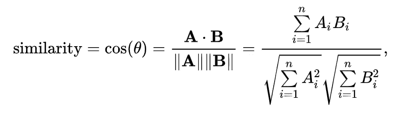
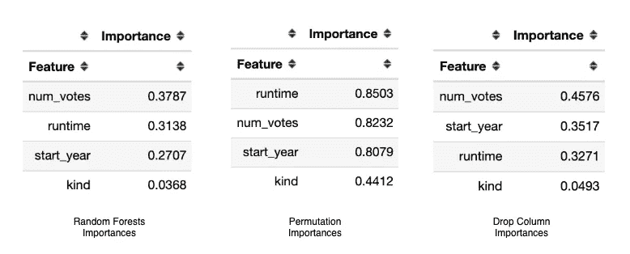

# 如何构建基于内容的电影推荐系统

> 原文：<https://towardsdatascience.com/how-to-build-a-content-based-movie-recommender-system-92352f5db7c6?source=collection_archive---------13----------------------->

## 创建基于内容的电影推荐系统


Designed by rawpixel.com / Freepik

在这篇文章中，我将尝试解释我们如何在没有用户数据的情况下创建一个推荐系统。我还将分享一个我用 Python 做的例子，并一步步告诉你它是如何工作的。

我不打算单独解释推荐系统的类型，因为它在互联网上很容易找到。所以，我们先来说说基于内容的推荐系统吧！

# 什么是基于内容的推荐系统？


基于内容的推荐系统不包括从除你之外的用户那里检索的数据。它只是通过识别与你喜欢的产品相似的产品来帮助你。

例如，您有一个在线销售商品的网站，但您还没有注册用户，但您仍然想向网站的访问者推荐产品。在这种情况下，基于内容的推荐系统将是您的理想选择。

然而，基于内容的推荐系统是有限的，因为它们不包含其他用户数据。它也不能帮助用户发现他们潜在的品味。

举个例子，假设用户 A 和用户 B 喜欢剧情电影。用户 A 也喜欢喜剧电影，但是既然你没有那方面的知识，你就继续提供剧情电影。最终，你排除了用户 B 可能喜欢的其他选项。

反正！在创建这个系统之前，我们先来讨论几个术语。先说[核密度估计](https://en.wikipedia.org/wiki/Kernel_density_estimation)！

# 核密度估计

> 核密度估计是一个非常有用的统计工具，有一个吓人的名字。通常简称为 **KDE** ，这是一种让你在给定一组数据的情况下创建平滑曲线的技术。


KDE plot example from seaborn

KDE 是一种帮助确定数据分布密度的方法。它提供了许多点位于何处和不在何处的信息。因此，在一维数组中，它通过将最低密度点(局部最小值)与最高密度点(局部最大值)分开来帮助您进行聚类。只要遵循这些步骤，

1.  计算密度
2.  寻找局部最小值和局部最大值
3.  创建集群

# 余弦相似性

[余弦相似度](https://en.wikipedia.org/wiki/Cosine_similarity)是一种度量向量之间相似度的方法。数学上，它计算两个向量之间角度的余弦值。如果两个向量之间的角度为零，则相似性被计算为 1，因为零的余弦为 1。所以这两个向量是相同的。任何角度的余弦值从 0 到 1 不等。因此，相似率将从 0 变化到 1。该公式表示如下:



Cosine similarity formula

现在够了！我们来编码吧！

# 特征重要性

我想为每部电影或连续剧设定一个分数，并且我需要为每个特征设定一个系数，所以我将查看特征的重要性。

数据集如下:


Sample data

通过合并在[https://datasets.imdbws.com](https://datasets.imdbws.com)共享的文件，你可以很容易地获得这个数据集。我通过将 title.basics.tsv.gz 的*与 title.ratings.tsv.gz 的**合并得到这个数据，之后，我删除了一些特征。例如， *end_year* 字段包含了太多的空值，所以我删除了它。更多详细信息，请查看我的知识库。在本文最后分享。***

**我还得多说一个细节，我已经通过使用*标签编码器*将*种类*字段转换为*整数*字段。**

**Feature importances**

**正如你在上面看到的，我已经尝试了三种不同的方法。首先是由 ***随机森林*** 模型直接提供的特性的重要性。**

**另一个是 ***排列重要性*** 。这种方法通过对每个预测值使用随机重排技术来直接测量磁场对模型的影响。它保持了变量的分布，因为它使用了随机重排技术。**

**最后是 ***降列特征重要度*** 。这种方法是完全直观的，每次它删除一个特征，并将其与使用所有列的模型进行比较。它通常要安全得多，但处理时间可能会很长。处理时间对我们的数据集来说并不重要。**

**结果是这样的:**

****

**Feature importance results**

**我们在这些方法中选择了**删除列特征重要性**方法。正如我们之前指出的，它更加可靠，当我们看一眼结果时，它们对计算分数更有意义。**

```
**dataset['score'] = (
    0.4576 * dataset['num_votes'] + 
    0.3271 * dataset['runtime'] + 
    0.3517 * dataset['start_year'] + 
    0.0493 * dataset['kind']
)**
```

# **使聚集**

**我将使用分数来创建聚类。所以我可以推荐平均分数相同的电影。**

**我有一个分数的一维数组，我可以用 KDE 聚类。我用这个代码来看分数的分布:**

```
**import matplotlib.pyplot as plt
import seaborn as snsplt.figure(figsize=(9, 6))
sns.distplot(dataset['score'])
plt.axvline(18000, color='r');**
```

**我得到了这样一张图表，**

****

**Score distribution**

**我加了一条竖线 18000，因为密度在 650 到 18000 之间。如果我在应用 KDE 时给你大于 18，000 的点，它会将所有小于 18，000 的点收集在一个聚类中，这不是我们想要的，因为这会降低多样性。**

**正如我在文章开头提到的，我应用了 3 个阶段对 KDE 进行聚类。**

1.  **计算密度**

```
**from sklearn.neighbors.kde import KernelDensityvals = dataset['score'].values.reshape(-1, 1)
kde = KernelDensity(kernel='gaussian', bandwidth=3).fit(vals)

s = np.linspace(650, 18000)
e = kde.score_samples(s.reshape(-1, 1))**
```

**2.寻找局部最小值和局部最大值**

```
**from scipy.signal import argrelextremami = argrelextrema(e, np.less)[0]
ma = argrelextrema(e, np.greater)[0]points = np.concatenate((s[mi], s[ma]), axis=0)
buckets = []

for point in points:
    buckets.append(point)buckets = np.array(buckets)
buckets.sort()**
```

**3.创建集群**

```
**dataset['cluster'] = buckets.searchsorted(dataset.score)**
```

# **文本相似度**

**最后，我计算了类型之间的相似性，以便能够尽可能准确地推荐同一类型的电影。为此我使用了 TF-IDF 和线性内核。因此，在背景中使用余弦相似性来寻找相似性。**

```
**from sklearn.feature_extraction.text import TfidfVectorizer
from sklearn.metrics.pairwise import linear_kerneltfidf_vectorizer = TfidfVectorizer()
matrix = tfidf_vectorizer.fit_transform(dataset['genres'])kernel = linear_kernel(matrix, matrix)**
```

**现在就来看看推荐吧！**

```
**def get_recommendations2(movie_index):
    print(dataset.iloc[movie_index])
    print('**' * 40)
    sim_ = list(enumerate(kernel[movie_index]))

    sim = sorted(sim_, key=lambda x: x[1], reverse=True)
    index = [i[0] for i in sim if i[0] != movie_index and i[1] > .5]

    cond1 = dataset.index.isin(index)
    cond2 = dataset.cluster == dataset.iloc[movie_index]['cluster'] selected = dataset.loc[cond1 & cond2] \
        .sort_values(by='score', ascending=False).head(20) print(selected[['title', 'cluster', 'genres']])**
```

****

**这对我来说似乎很有用！如果你想看更详细的代码，用 ***烧瓶*** 上菜，用 ***橡皮筋搜索*** 索引电影，用 ***docker*** ，你可以看看我的资源库:**

**[](https://github.com/egemenzeytinci/recommovie) [## egemenzeytinci/recommovie

### 对于所有选项，克隆存储库，$ git 克隆 https://github.com/egemenzeytinci/recommovie.git 构建并运行…

github.com](https://github.com/egemenzeytinci/recommovie) 

感谢您的阅读！

# 参考

*   Eryk Lewinson，[以随机森林为例解释特征重要性](/explaining-feature-importance-by-example-of-a-random-forest-d9166011959e) (2019)
*   马修·康伦**，**，[核密度估计](https://mathisonian.github.io/kde/)
*   马修·奥弗比， [1D 与 KDE](https://blog.mattoverby.net/2017/05/1d-clustering-with-kde.html) (2017)
*   [计数矢量器，tfidf 矢量器，预测评论](https://www.kaggle.com/adamschroeder/countvectorizer-tfidfvectorizer-predict-comments) (2018)**