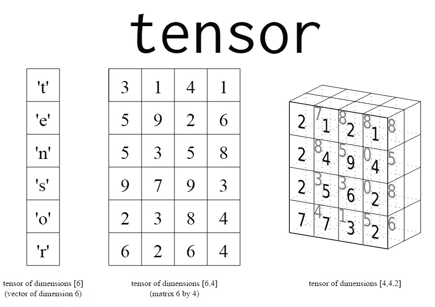
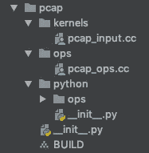
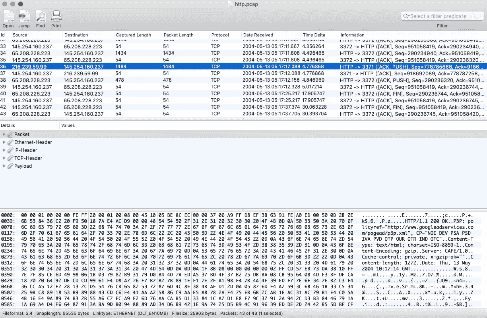
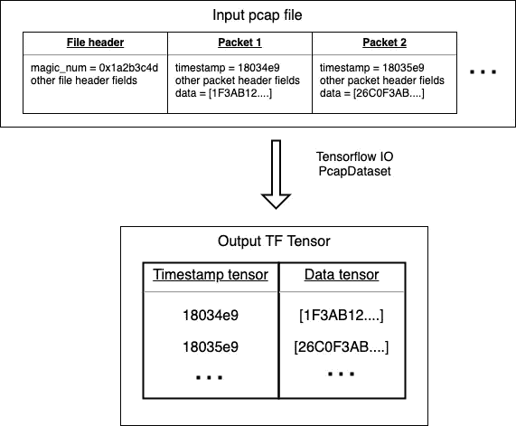

# 如何为 Tensorflow 构建自定义数据集

> 原文：<https://towardsdatascience.com/how-to-build-a-custom-dataset-for-tensorflow-1fe3967544d8?source=collection_archive---------2----------------------->

Tensorflow 激励开发人员在想到的几乎任何领域尝试他们令人兴奋的人工智能想法。在 ML 社区中有三个众所周知的因素，它们构成了一个好的深度神经网络模型，可以做神奇的事情。

1.  模型架构
2.  高质量的培训数据
3.  足够的计算能力

我感兴趣的领域是实时通信。想出可以为 RTC 应用增加价值的实际 ML 用例是容易的部分。我最近写了一些关于这些的文章。

正如我的共同创始人和好朋友 [Jean Deruelle](https://www.linkedin.com/in/jeanderuelle/) 指出的，如果我们走进[环境计算](https://www.computerworld.com/article/3402959/why-ambient-computing-is-just-a-marketing-buzzword-for-now.html)，新一代通信设备无缝增强家庭和工作体验，会有更多相邻的用例。

所以我想构建一个简单的原型，并直接将 [Restcomm](https://github.com/restcomm) 连接到 Tensorflow。经过几天的研究，我意识到没有简单的方法将实时流音频/视频媒体(SIP/RTP)输入 tensorflow 模型。类似于 [Google Cloud 的语音转文本流 gRPC API](https://cloud.google.com/speech-to-text/docs/streaming-recognize) 的东西本来是一个可以接受的初始后备，但我在开源 Tensorflow 社区中没有找到。

有多种方法可以从离线的[音频文件](https://github.com/tensorflow/io/tree/master/tensorflow_io/audio)和[视频文件](https://github.com/tensorflow/io/tree/master/tensorflow_io/video)中读取，但这与处理实时延迟敏感的媒体流完全不同。

最终，我的搜索将我带到了由[唐勇](https://www.linkedin.com/in/yong-tang/)领导的 [Tensorflow IO](https://github.com/tensorflow/io) 项目。TF IO 是一个年轻的项目，有一个由 Google、IBM 和其他公司支持的不断发展的社区。Yong 指给我一个[公开的 github 问题](https://github.com/tensorflow/io/issues/50)，等待贡献者的现场音频支持。这开始了一次愉快的谈话。几个周末后，我鼓起足够的勇气接受了一个小小的编码挑战——为 PCAP 网络捕获文件实现一个新的 Tensorflow 数据集。

PCAP 文件与实时媒体流密切相关，因为它们是网络活动的精确历史快照。PCAP 文件能够记录和重放进入媒体处理软件的实际网络数据包，包括丢包和时间延迟。

回到本文的主题——我现在将向您介绍构建 TF PcapDataset 并将其贡献给 Tensorflow IO 项目的主要步骤:

1.  Fork [Tensorflow IO](https://github.com/tensorflow/io) 和[从源](https://github.com/tensorflow/io#developing)构建
2.  查看源树中的[相邻数据集](https://github.com/tensorflow/io/tree/master/tensorflow_io)，选择一个最接近 pcap 的数据集。我利用了来自[文本](https://github.com/tensorflow/io/tree/master/tensorflow_io/text)、 [cifar](https://github.com/tensorflow/io/tree/master/tensorflow_io/cifar) 和[拼花](https://github.com/tensorflow/io/tree/master/tensorflow_io/parquet)的代码。还有一份关于创建 [TF ops](https://www.tensorflow.org/guide/extend/op#build_the_op_library) 的文件被证明是有帮助的。
3.  在 [gitter 频道](https://gitter.im/tensorflow/sig-io?utm_source=share-link&utm_medium=link&utm_campaign=share-link)上寻求帮助。有些人会在几小时内关注并回复。我从[斯蒂芬·阿普霍夫](https://github.com/suphoff)和勇那里得到了宝贵的建议。还有[每月电话会议](https://docs.google.com/document/d/1CB51yJxns5WA4Ylv89D-a5qReiGTC0GYum6DU-9nKGo/edit#heading=h.7ck4k2782ggg)，在那里任何人都可以就项目问题发表意见。
4.  准备好后提交一个[拉取请求](https://github.com/tensorflow/io/pull/303)。TF IO 团队响应迅速，支持性很强，通过调整和修复来指导贡献者满足最佳实践。

第 2 步是我花了大部分周末业余时间学习 TF 基础设施和 API 的一步。让我给你分析一下。

从根本上讲，TF 是一个在每个节点都有操作的图结构。数据进入图中，操作将数据样本作为输入，处理这些样本并将输出传递给图中其节点所连接的下一个操作。下图是来自官方文档的 TF 图示例。


[TF Graph example](https://www.tensorflow.org/guide/graphs)

操作使用名为 tensors 的常见数据类型(因此得名 TensorFlow)。术语张量有[数学](https://en.wikipedia.org/wiki/Tensor)定义，但张量的数据结构本质上是一个 n 维向量:0D 标量(数字、字符或字符串)、标量的 1D 列表、标量的 2D 矩阵或向量的更高维向量。

在将数据输入到 TF 模型之前，必须对其进行预处理并将其格式化为张量数据结构。这种张量格式要求是由于深度神经网络中广泛使用的线性代数，以及这些结构在 GPU 或 TPU 上应用计算并行性的可能优化。



[Tensor examples](/a-beginner-introduction-to-tensorflow-part-1-6d139e038278)

它有助于[理解 TF 数据集的优势](https://www.tensorflow.org/guide/datasets#batching_dataset_elements)和所有开箱即用的便利功能，如批处理、映射、混排、重复。这些函数使得利用有限的数据量和计算能力来构建和训练 TF 模型变得更加容易和高效。

数据集和其他 TF 操作可以用 C++或 Python 构建。我选择 C++路线只是为了学习一些 TF C++框架。然后我用 Python 把它们包起来。以后打算写几个纯 Python 数据集，应该会简单一点。

让我们看一下 TF IO 数据集的源代码文件结构。



Source code directory structure for the TF IO pcap Dataset

Tensorflow 使用 [Bazel](https://bazel.build/) 作为构建系统，谷歌在 2015 年开源了该系统。下面是 PcapDataset 构建文件。它声明了动态 pcap 库的公共名称(_pcap_ops.so)。列出了要构建的两个源文件(pcap_input.cc 和 pcap_ops.cc)。并声明了构建所需的一些 TF 依赖项。

Main Bazel BUILD file for the pcap dataset

下一个重要的源文件是 pcap_ops.cc，我们在其中声明了 TF ops，它将注册到 TF 运行时环境中，并可用于 TF 应用程序中。

这里的大部分代码都是样板文件。它说我们正在引入一个可以读取 pcap 文件的 PcapInput 操作和一个由 PcapInput 填充的 PcapDataset 操作。两者之间的关系将在稍后变得更加明显。

从我开始我的贡献工作直到它被 TF master 分支接受，在基本的 TF 2.0 框架中引入了一些简化，减少了我的文件中的样板代码。我怀疑在不久的将来会有更多这样的简化。

TF 的核心团队明白，为了吸引更多的贡献者，降低进入门槛是很重要的。新的贡献者应该能够只关注他们正在编写的全新代码，而不要为与 TF 环境交互的细节伤脑筋，直到他们为此做好准备。

包中的下一个文件是 [pcap_input.cc](https://github.com/tensorflow/io/blob/master/tensorflow_io/pcap/kernels/pcap_input.cc) 。那里是大部分重物搬运的地方。我花了相当多的时间来编写和测试这个文件。

它有一个部分声明了 PcapDataset、PcapInput 和 PcapInputStream 之间的关系。我们将会看到它们各自的作用。

PcapInputStream 包含从原始 pcap 文件中读取并将其转换为张量的大部分逻辑。为了了解输入的味道，这里有一个用 CocoaPacketAnalyzer 查看的测试 [http.pcap](https://github.com/tensorflow/io/blob/master/tests/test_pcap/http.pcap) 文件的截图。



CocoaPacketAnalyzer view of http.pcap

让我跳过特定于 pcap 文件的逻辑，指出一些从原始二进制文件数据到张量转换的定义元素。

Read a packet record from the pcap file and convert to tensors

此 ReadRecord 行从 pcap 文件中读取下一个 pcap 包，并填充两个局部变量:packet_timestamp double 和 packet_data_buffer 字符串。

```
ReadRecord(packet_timestamp, &packet_data_buffer, record_count);
```

如果成功填充了新的 pcap 记录，标量将被放入各自的张量占位符中。结果输出张量的形状是一个有两列的矩阵。一列保存每个读取的 pcap 数据包的时间戳标量。另一列将相应的数据包数据保存为字符串。输出张量(矩阵)中的每一行对应于一个 pcap 分组。



Processing pcap file input to TF tensor output

```
Tensor timestamp_tensor = (*out_tensors)[0];
timestamp_tensor.flat<double>()(*record_read) = packet_timestamp;Tensor data_tensor = (*out_tensors)[1];
data_tensor.flat<string>()(*record_read) = std::move(packet_data_buffer);
```

out_tensors 是从 PcapDataset 请求新批次时准备的占位符张量。那是在这里完成的；在读循环之前。

使用类型化平面函数将 packet_timestamp 标量放在第一列(index [0])和(*record_read)行。数据包数据缓冲区分别位于第二列(索引[1])和同一(*记录读取)行。

这涵盖了 C++代码的关键元素。现在让我们看看 Python 文件。

[_init_。顶层 pcap 目录级别的 py](https://github.com/tensorflow/io/blob/master/tensorflow_io/pcap/__init__.py) 指示 TF Python 文档生成器如何遍历 Python 代码并提取 API 参考文档。你可以在这里阅读更多关于文档最佳实践[。](https://github.com/Debian/tensorflow/blob/master/tensorflow/docs_src/community/documentation.md#generating-python-api-documentation)

上面的代码指示 Pyhton API 文档生成器专注于 PcapDataset 类，忽略该模型中的其他代码。

接下来， [pcap_ops.py](https://github.com/tensorflow/io/blob/master/tensorflow_io/pcap/python/ops/pcap_ops.py) 包装 C++数据集 op，并使其对 Python 应用程序可用。

C++动态库按如下方式导入:

```
from tensorflow_io import _load_library
pcap_ops = _load_library('_pcap_ops.so')
```

数据集构造函数的主要作用之一是提供关于它生成的数据集张量类型的元数据。首先，它必须描述单个数据样本中的张量类型。PcapDataset 样本是两个标量的向量。一个用于 tf.float64 类型的 pcap 分组时间戳，另一个用于 tf.string 类型的分组数据

```
dtypes = [tf.float64, tf.string]
```

Batch 是通过神经网络的一次正向/反向传递中的训练样本数。在我们的例子中，当我们定义批量的大小时，我们也定义了张量的形状。

当多个 pcap 数据包被分组为一批时，时间戳(tf.float64)和数据(tf.string)都是一维张量，具有 tf 的形状。TensorShape([batch])。

由于我们事先不知道总样本数，总样本数也不一定能被批量大小整除，所以我们宁愿把形状设为 tf。TensorShape([None])给我们更多的灵活性。

批量大小为 0 是一种特殊情况，其中每个单独张量的形状退化为 tf。TensorShape([])，或 0-D 标量张量。

```
shapes = [
        tf.TensorShape([]), tf.TensorShape([])] if batch == 0 else [
            tf.TensorShape([None]), tf.TensorShape([None])]
```

快到了。我们只需要一个测试案例。test_pcap_eager.py 在从 [http.pcap](https://github.com/tensorflow/io/blob/master/tests/test_pcap/http.pcap) 采样的同时练习 PcapDataset。

测试代码很简单。遍历所有 pcap 数据包，并根据已知常数测试第一个数据包中的值。

为了构建 PcapDataset 并运行其测试，我使用了本地 [io](https://github.com/tensorflow/io) 目录中的以下代码行:

```
$ bazel build -s --verbose_failures //tensorflow_io/pcap/...
$ pytest tests/test_pcap_eager.py
```

就是这样！希望这有助于您构建自己的自定义数据集。当你这样做的时候，我希望你会考虑把它贡献给 TF 社区，以加速开源 AI 的进步。

欢迎在评论区提问。我将尽力回答。