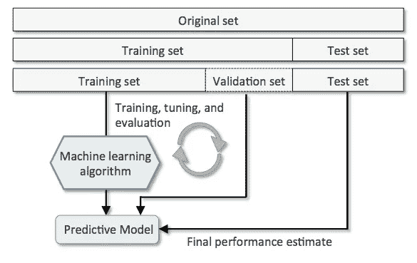
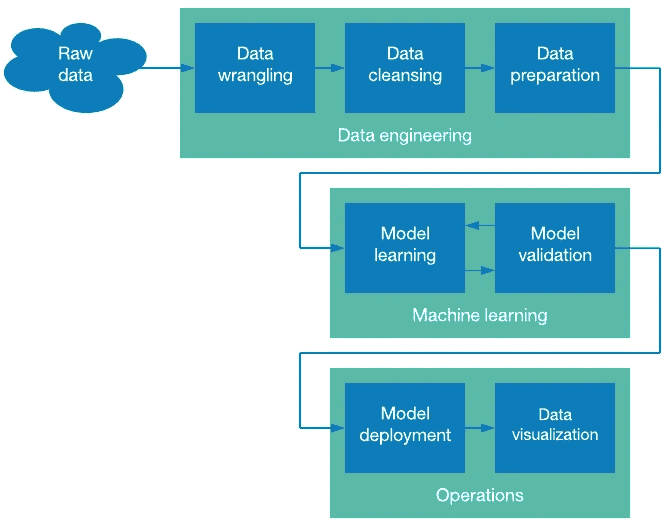
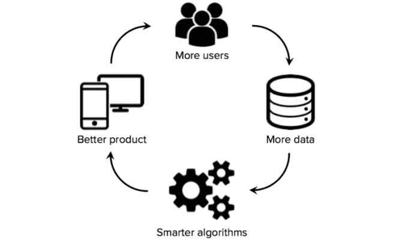

# 如何为你的机器学习项目建立数据集

> 原文：<https://towardsdatascience.com/how-to-build-a-data-set-for-your-machine-learning-project-5b3b871881ac?source=collection_archive---------0----------------------->

[Source](https://i.redd.it/a3evvw4pgwaz.png)

你会为你的组织考虑人工智能吗？您已经确定了一个 ROI 得到验证的用例？完美！但没那么快…你有数据集吗？大多数公司都在努力建立一个人工智能就绪的数据集，或者干脆忽略这个问题，我想这篇文章可能会对你有所帮助。

## 让我们从基础开始…

一个**数据集**是一个**数据**的集合。换句话说，**数据集**对应于单个数据库表或单个统计**数据**矩阵的内容，其中表的每一列代表一个特定变量，每一行对应于所讨论的**数据集**的给定成员。

在机器学习项目中，我们需要一个训练**数据集。**是实际的**数据集**，用于训练模型执行各种动作。

***我为什么需要数据集？*** ML 非常依赖数据，没有数据，一个“AI”是不可能学习的。是让算法训练成为可能的最关键的方面……无论你的 AI 团队有多伟大，或者你的数据集有多大，如果你的数据集不够好，你的整个 AI 项目都会失败！我见过一些很棒的项目失败，因为我们没有一个好的数据集，尽管我们有完美的用例以及非常熟练的数据科学家。

> 在训练数据的语料库上训练有监督的 AI。

在人工智能开发过程中，我们总是依赖数据。从训练、调整、模型选择到测试，我们使用三个不同的数据集:训练集、验证集和测试集。供您参考，验证集用于选择和调整最终的 ML 模型。

你可能认为收集数据就足够了，但事实恰恰相反。在每个人工智能项目中，对数据集进行分类和标记花费了我们大部分的时间，尤其是那些足够准确以反映市场/世界现实愿景的数据集。

我想向你介绍我们需要的前两个数据集——训练数据集和测试数据集，因为它们在你的人工智能项目中用于不同的目的，项目的成功在很大程度上取决于它们。

1.  **训练数据集**用于训练算法，以理解如何应用神经网络等概念，学习并产生结果。它包括输入数据和预期输出。

> **训练集占总数据的大部分，约 60 %。在测试中，模型在被称为调整权重的过程中与参数相适应。**

1.  **测试数据集**用于评估你的算法用训练数据集训练的有多好。在人工智能项目中，我们不能在测试阶段使用训练数据集，因为算法已经提前知道了预期的输出，这不是我们的目标。

> 测试集代表 20%的数据。通常通过人工验证，确保测试集是与验证的正确输出分组在一起的输入数据。

根据我的经验，在测试阶段之后尝试进一步调整是一个坏主意。这可能会导致过度拟合。

[Source](http://www.cs.nthu.edu.tw/~shwu/courses/ml/labs/08_CV_Ensembling/fig-holdout.png)

***什么是过度拟合？
对于数据科学家来说，一个众所周知的问题是…* 过度拟合**是一个建模错误，当一个函数过于接近有限的数据点集时就会出现这种错误。

***需要多少数据？所有项目在某种程度上都是独一无二的，但我认为你需要的数据是正在构建的模型中参数数量的 10 倍。**任务越复杂，需要的数据越多。*****

***我需要什么类型的数据？我总是通过向公司决策者提出精确的问题来启动人工智能项目。你想通过 AI 达到什么目的？根据您的回答，您需要考虑您实际需要哪些数据来解决您正在处理的问题。对您需要的数据做一些假设，并仔细记录这些假设，以便您可以在以后需要时测试它们。***

以下是一些对你有帮助的问题:

*   你能为这个项目使用什么数据？你必须对你能使用的所有东西有一个清晰的了解。
*   你希望拥有哪些不可用的数据？我喜欢这个问题，因为我们总能以某种方式模拟这些数据。

***我有一个数据集，现在怎么办？***
没那么快！你应该知道所有的数据集都是不准确的。在项目的这个时刻，我们需要做一些数据准备，这是机器学习过程中非常重要的一步。基本上，数据准备就是让你的数据集更适合机器学习。它是一组程序，消耗了花在机器学习项目上的大部分时间。

> 即使你有数据，你仍然会遇到数据质量的问题，以及隐藏在你的训练集中的偏见。简单来说，训练数据的质量决定了机器学习系统的性能。

***你听说过 AI 偏见吗？***
人工智能很容易受到影响……多年来，数据科学家发现，一些用于训练图像识别的流行数据集包含性别偏见。

因此，人工智能应用程序需要更长的时间来构建，因为我们试图确保数据是正确的，并正确集成。

***数据不够怎么办？*** 可能会发生这样的情况，你缺乏集成一个人工智能解决方案所需的数据。我不会对你撒谎，如果你仍然依赖于纸质文档或其他工具，建立一个人工智能就绪的数据集需要时间。 *csv* 文件。我建议你首先花时间建立一个现代的数据收集策略。

如果你已经确定了你的 ML 解决方案的目标，你可以要求你的团队花时间创建数据或者外包这个过程。在我最近的项目中，公司想要建立一个图像识别模型，但是没有图片。因此，我们花了几周时间拍摄照片来建立数据集，并找到未来客户为我们做这件事的方法。

***你有数据策略吗？在一个组织中创造一种数据驱动的文化可能是一名人工智能专家最难的部分。当我试图解释为什么公司需要数据文化时，我可以在大多数员工的眼中看到沮丧。事实上，数据收集可能是一项烦人的任务，会加重员工的负担。然而，我们可以自动化大部分的数据收集过程！***

另一个问题可能是数据的可访问性和所有权…在我的许多项目中，我注意到我的客户有足够的数据，但是这些数据被锁起来，很难访问。您必须在组织中的数据仓库之间创建连接。为了获得特殊的见解，你必须从多个来源收集数据。

关于所有权，合规性也是数据源的一个问题—仅仅因为公司可以访问信息，并不意味着它有权使用它！请不要犹豫，询问您的法律团队(欧洲的 GDPR 就是一个例子)。

***质量、范围、数量！*** 机器学习不仅仅是关于大数据集。事实上，你不需要向系统提供任何相关领域的所有已知数据。我们希望向系统提供精心策划的数据，希望它能够学习，或许在边际上扩展人们已经拥有的知识。

> 大多数公司认为，收集每一个可能的数据，将它们结合起来，让人工智能找到洞察力就足够了。

当构建数据集时，您应该以数据的多样性为目标。我总是建议公司收集内部和外部数据。目标是建立一个独特的数据集，让你的竞争对手难以复制。机器学习应用确实需要大量的数据点，但这并不意味着模型必须考虑广泛的特征。

我们想要与项目相关的有意义的数据。你可能拥有某个主题的丰富、详细的数据，但这些数据并不十分有用。人工智能专家会问你一些精确的问题，关于哪些领域真正重要，以及这些领域如何可能对你获得的洞察力的应用产生影响。

> 在我最近的任务中，我必须帮助一家公司建立一个用于营销目的的图像识别模型。这个想法是建立和确认一个概念证明。这家公司没有数据集，除了一些他们产品的 3D 渲染。我们希望人工智能能够识别产品，阅读包装，确定它是否适合客户，并帮助他们了解如何使用它。
> 
> 我们的数据集由 15 种产品组成，每种产品我们都有 200 张照片。这个数字是合理的，因为它仍然是一个原型，否则，我会需要更多的图片！这假设你正在利用迁移学习技术。
> 
> 在拍摄照片时，我们需要不同的背景、光线条件、角度等。
> 
> 每天，我都会从训练集中随机选择 20 张图片并进行分析。这让我对数据集的多样性和准确性有了一个很好的了解。
> 每次我这样做的时候，我都会发现一些关于我们数据的重要信息。这可能是具有相同角度的不平衡数量的图片、不正确的标签等。

一个好主意是从一个已经在大型现有数据集上预先训练好的模型开始，并使用迁移学习来用您收集的较小数据集对其进行微调。

## 数据预处理

好吧，让我们回到我们的数据集。在这一步，你已经收集了你认为对你的人工智能项目来说必要的、多样的和有代表性的数据。预处理包括从完整的数据集中选择正确的数据并建立训练集。以这种最佳格式将数据放在一起的过程被称为**特征转换**。

1.  **格式:**数据可能分散在不同的文件中。例如，使用不同货币、语言等的不同国家的销售结果。这些数据需要收集在一起形成一个数据集。
2.  **数据清理:**在这一步，我们的目标是处理丢失的值，并从数据中删除不需要的字符。
3.  **特征提取:**在这一步，我们重点分析和优化特征的数量。通常，团队成员必须找出哪些特征对于预测是重要的，并选择它们以实现更快的计算和更低的内存消耗。

[Source](https://developer.ibm.com/articles/ba-intro-data-science-1/)

# 完美的数据策略

最成功的人工智能项目是那些在服务/产品生命周期中整合数据收集策略的项目。的确，数据收集不可能是一系列一次性的练习。它必须内置于核心产品本身。基本上，每次用户使用你的产品/服务时，你都想从互动中收集数据。目标是利用这种持续不断的新数据流来改进您的产品/服务。

当您达到这种数据使用水平时，您添加的每个新客户都会使数据集更大，从而使产品更好，这会吸引更多的客户，从而使数据集更好，以此类推。这是某种良性循环。

[Source](https://i1.wp.com/cdn-images-1.medium.com/max/1600/1*BYLjHBFAEscnb_G1Kt91Pg.png?w=700&ssl=1)

最好的、面向长期的 ML 项目是那些利用动态的、不断更新的数据集的项目。建立这种数据收集策略的好处是，你的竞争对手很难复制你的数据集。有了数据，人工智能变得更好，在某些情况下，比如协同过滤，它是非常有价值的。协同过滤基于用户之间的相似性提出建议，它将随着访问更多数据而改进；一个人拥有的用户数据越多，该算法就越有可能找到相似的用户。

这意味着您需要一种策略来持续改进您的数据集，只要它对提高模型准确性有任何用户好处。如果可以的话，找到创造性的方法来利用微弱的信号来访问更大的数据集。

> 让我再一次使用图像识别模型的例子。在我上一次的体验中，我们设想并设计了一种方式，让用户给我们的产品拍照并发送给我们。这些照片将被用于我们的人工智能系统，使我们的系统随着时间的推移变得更加智能。

另一种方法是提高标签管道的效率，例如，我们过去非常依赖一个系统，该系统可以建议由模型的初始版本预测的标签，以便贴标机可以更快地做出决定。

最后，我看到一些公司只是雇佣更多的人来标记新的培训投入……这需要时间和金钱，但很有效，尽管在传统上没有这种支出预算的组织中，这可能很困难。

不管大多数 SaaS 公司怎么说，机器学习需要时间和准备。每当你听到人工智能这个术语，你一定会想到它背后的数据。我希望这篇文章能帮助你理解数据在 ML 项目中的关键作用，并说服你花时间反思你的数据策略。