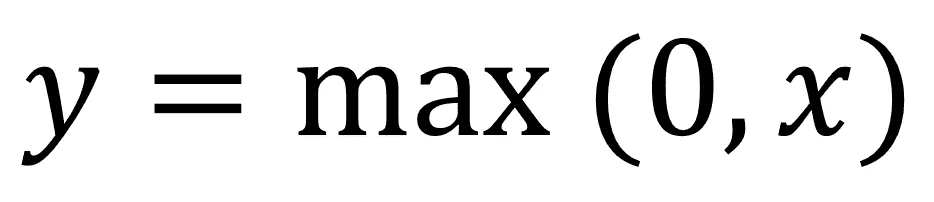
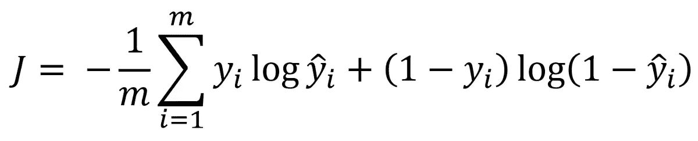

# 如何建立一个没有框架的深度神经网络

> 原文：<https://towardsdatascience.com/how-to-build-a-deep-neural-network-without-a-framework-5d46067754d5?source=collection_archive---------15----------------------->

## 了解如何使用 *NumPy* 构建可扩展的深度神经网络，并将其用于图像分类

Photo by [Sneaky Elbow](https://unsplash.com/@sneakyelbow?utm_source=medium&utm_medium=referral) on [Unsplash](https://unsplash.com?utm_source=medium&utm_medium=referral)

# 介绍

[之前](/step-by-step-guide-to-building-your-own-neural-network-from-scratch-df64b1c5ab6e)，我们从零开始构建了一个非常简单的神经网络用于图像分类。尽管如此，我们还是获得了 70%的准确率。

现在，我们将在不使用框架的情况下构建更深层次的神经网络。以下几段代码可扩展到任何神经网络架构。这意味着你可以使用不同数量的层和不同的[激活](/step-by-step-guide-to-building-your-own-neural-network-from-scratch-df64b1c5ab6e)和[成本函数](/step-by-step-guide-to-building-your-own-neural-network-from-scratch-df64b1c5ab6e)，只需对代码做最小的改动！

你可以在 Github 上抓取总结代码的两个笔记本。第一个[笔记本](https://github.com/marcopeix/Deep_Learning_AI/blob/master/1.Neural%20Networks%20and%20Deep%20Learning/4.Deep%20Neural%20Networks/Building%20a%20Deep%20Neural%20Network.ipynb)构建必要的函数，第二个[笔记本](https://github.com/marcopeix/Deep_Learning_AI/blob/master/1.Neural%20Networks%20and%20Deep%20Learning/4.Deep%20Neural%20Networks/Deep%20Neural%20Network%20-%20Application.ipynb)应用它们进行图像分类。

作为先决条件，我强烈推荐你阅读我的[上一篇文章](https://github.com/marcopeix/Deep_Learning_AI/blob/master/1.Neural%20Networks%20and%20Deep%20Learning/4.Deep%20Neural%20Networks/Deep%20Neural%20Network%20-%20Application.ipynb)，因为它包含了关于构建神经网络的不同步骤的详细解释。

现在，让我们开始编码吧！

> 关于机器学习、深度学习和人工智能的实践视频教程，请查看我的 [YouTube 频道](https://www.youtube.com/channel/UC-0lpiwlftqwC7znCcF83qg?view_as=subscriber)。

The feeling you will get when you are done building the neural network!

# 构建神经网络

## 步骤 1:初始化权重和偏差

像往常一样，构建神经网络的第一步是初始化权重矩阵和偏差矩阵。

请记住，权重必须是随机的非零值，而偏差可以初始化为 0。

对于这一步，函数非常简单:在神经网络的层数上循环，并为您的输入初始化每个权重和偏差。在代码中，应该是这样的:

## 步骤 2:正向传播模块

现在，我们将构建正向传播模块。在前向传播中，我们需要将加权和提供给激活函数。

该模块将分三步构建:

*   为加权和写一个函数
*   编写一个函数，将加权和提供给激活函数
*   编写一个函数，在最后一层使用 sigmoid 函数，在所有前面的层使用 ReLU

**可选阅读:什么是 ReLU？**

**ReLu** 代表**Re**ctived**L**linear**U**nit，表示为:

ReLU function

看起来是这样的:

ReLU plot

如你所见，正值的导数是 1，负值的导数是 0。请注意，函数在 0 处不可微。

实际上，激活函数通常是正的，这意味着导数将大于 0。因此，参数将更新得更快，并且网络最终*通过 ReLU 学习得更快*。

通常，如果您不确定使用什么激活函数，ReLU 是一个很好的默认函数，在大多数情况下都能很好地工作。

因此，对于加权和，函数很简单:

够简单！现在，我们构建一个函数来将结果提供给激活函数(ReLU 或 sigmoid):

现在，我们想在最后一层使用 sigmoid 函数，并依赖于所有先前的层。这是特定于该应用的，因为我们将执行二值图像分类，所以在最后一层使用 sigmoid 函数是有意义的。

太好了！

## 步骤 3:定义成本函数

当然，我们现在需要定义一个成本函数。然后，该函数将被最小化，并且它将驱动对权重和偏差矩阵的更新。

为此，我们使用交叉熵损失表示为:

Cross-entropy loss function

现在，我们用代码实现了一个矢量化版本:

成本函数到此为止！

## 第四步:反向传播

与正向传播类似，我们将分三步构建反向传播模块:

*   计算重量和偏差的导数
*   计算激活函数的导数
*   对整个网络执行反向传播

首先，我们为权重和偏差的导数写一个函数:

然后，我们找到激活函数的导数:

最后，我们编写一个函数在整个网络上执行反向传播:

现在这已经完成了，我们需要更新我们的参数！

## 步骤 5:用梯度下降更新参数

现在，我们简单地定义梯度下降来更新我们的参数，以便最小化交叉熵成本函数:

完美！我们现在准备在一个用于图像分类的神经网络中使用上述所有功能！

# 使用神经网络

随着所有助手功能的建立，我们现在可以在深度神经网络中使用它们来识别它是否是一张猫图片，并看看我们是否可以在我们的[以前的模型](/step-by-step-guide-to-building-your-own-neural-network-from-scratch-df64b1c5ab6e)上进行改进。

查阅[笔记本](https://github.com/marcopeix/Deep_Learning_AI/blob/master/1.Neural%20Networks%20and%20Deep%20Learning/4.Deep%20Neural%20Networks/Deep%20Neural%20Network%20-%20Application.ipynb)导入合适的库并预处理数据。

在这种情况下，我们将训练一个 5 层网络。我们定义每个维度的维度，并按如下方式训练模型:

训练此模型需要几分钟时间。如果一切都做对了，你应该看到我们达到了 80%的测试准确率！这比我们以前的型号好多了！

当然，您可以随意调整模型的参数和结构。上面代码的优点是完全灵活。你可以添加任意多的层，改变迭代次数，提高学习速度等等。

恭喜你构建了一个没有任何框架的深度神经网络！你现在已经有了深度学习的坚实基础，你甚至可以将上面的代码重用到任何神经网络结构中。

在接下来的文章中，我将教授不同的方法来改善你的神经网络，并取得更好的效果。

干杯！