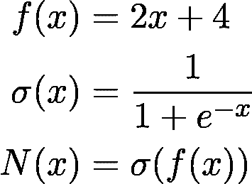
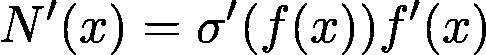
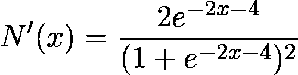

# 如何在 NumPy 中构建 DIY 深度学习框架

> 原文：<https://towardsdatascience.com/how-to-build-a-diy-deep-learning-framework-in-numpy-59b5b618f9b7?source=collection_archive---------13----------------------->

## 通过从头开始构建神经网络来理解神经网络的细节

作为学习的一般经验法则，只有当你能够自己构建时，你才会详细地理解一些东西。对于机器学习和神经网络等技术学科来说尤其如此。在您第一次接触深度学习时，您可以通过学习和掌握 TensorFlow 或 PyTorch 等高级框架来迈出几大步。然而，如果你想真正深入，你需要回到起点:你需要从头开始建立自己的神经网络和优化器！对于深度学习工程师和研究人员来说，这是一个常见的成人礼。掌握这些算法的细节会给你在这个领域带来非常有价值的优势。

当我最近开始这段旅程时，成功对我来说是一个提升的时刻。在这篇文章中，我们将一起走过这条道路，最终实现一个全功能的神经网络。如果你熟悉高水平的主题，并且知道什么是梯度下降，你就可以开始了！(如果你不熟悉梯度下降，[看看这个帖子！](/understanding-the-mathematics-behind-gradient-descent-dde5dc9be06e))

**然而一个重要的注意事项。与其马上阅读这篇文章，我鼓励你将这篇文章加入书签，然后尝试完全依靠自己建立一个神经网络。在我作为一名开发人员和科学家的生活中，很少有时刻像看着我的第一个神经网络学习一样有成就感和智力满足感。**

这篇文章的代码可以在我的 GitHub 知识库[https://GitHub . com/cosmic-cortex/neural-networks-from-scratch](https://github.com/cosmic-cortex/neural-networks-from-scratch)中找到。(在这里，我稍微超出了这篇文章的范围:实现了额外的层，如批量规范化和卷积层。)

# 究竟什么是神经网络？

在高层次上，神经网络只是一个函数，将输入(例如图像)映射到预测(例如可能标签上的概率分布)。从根本上说，有两个简单的操作你想做的函数:计算输出和导数，给定一个输入。第一个是需要获得预测，后一个是训练你的网络梯度下降。在神经网络术语中，计算输出被称为*正向传递*，而相对于输入的梯度被称为*局部梯度*。

对 Python 建模非常简单。

在`local_grad()`方法中，我们将返回一个渐变字典，而不是渐变的 NumPy 数组。当我们实现神经网络的层时，这样做的原因就变得很明显了。由于层有可调参数，这些参数将有自己的梯度。因此，区别对待变量组的梯度是有用的。

举个简单的例子，我们来考虑一下著名的 Sigmoid 函数！

注意，这个函数也适用于 NumPy 数组输入。目前，你可以认为这是一个单一变量的函数。然而，在后面，我们将把多元函数看作是带有张量输入的单变量函数。这一抽象层对于为神经网络编写紧凑的构件是必不可少的。

# 将乐趣分层

本质上，神经网络只是函数的重复应用，其中每个函数可以被认为是一层。对于复合函数来说，计算正向传递很简单。然而，如果我们要计算梯度，函数组合会使事情变得复杂，这对我们的目的是必不可少的。为了看看会发生什么，让我们考虑一个简单的例子！假设 *N(x)* 函数代表我们的神经网络，由一个线性函数与 Sigmoid 的组合定义。

A very simple “neural network”.

为了简单起见，我们还没有任何权重。为了计算它的导数，我们可以使用[链式法则](https://en.wikipedia.org/wiki/Chain_rule):

Derivative of N(x)

总结一下，我们需要三样东西来计算这个。

1.  Sigmoid 的导函数。
2.  *f* 的导函数。
3.  在 *x* 处 *f* 的输出。

让我们从实用和计算的角度来思考这个问题。我们总是可以手动计算 *N(x)* 的导数，并将其硬编码到我们的程序中:

Derivative of N(x), expanded

然而，这不是一个好主意。首先，我们想要比这更复杂的功能，可能由数百层组成。计算数百个函数组合的导数实际上是不可能的。第二，我们希望我们的代码是模块化的，所以我们不是为我们的网络定义一个单一的功能，而是将它定义为功能的组合。

正因为如此，我们最好采用链式法则。然而，如果你注意到，计算导数本身也依赖于计算 *f(x)* 的值，所以我们不能简单地计算导数函数。为了确保一切正常，我们可以基于我们的`Function`实现下面的算法。(注意函数后面的撇，它表示它的导数。有时候很难看到，所以我提前强调一下。)

1.  乘 *x* 。传递给代表 *f* 的`Function`对象，计算 *f(x)* 和局部导数 *f'(x)* 。将两个结果都存储在缓存中。返回 *f(x)* 。
2.  取 *f(x)。*传递给代表 *Sigmoid* 的对象，计算 *Sigmoid(f(x))* 和局部导数 *Sigmoid'(f(x))。将两个结果存储在缓存中。返回 *Sigmoid(f(x))* 。*
3.  取*乙状结肠'(f(x))* 。并返回 *Sigmoid'(f(x))* 。(是的，我知道，这不是有史以来最复杂的步骤，但为了算法正确，这必须完成。)
4.  将其传递给代表 *f* 的对象，从缓存中检索局部导数*f’(x)*，最后与*Sigmoid’(f(x))*相乘。退回产品。

如果您再看一看，您可以看到步骤 1。第二。对于 *f* 和*s 形*的*正向传递+局部梯度计算+缓存*是否链接在一起。步骤三。第四。都是新东西:它们被称为*倒传球*代替*乙状结肠*和 *f* 。向后传递的返回值是梯度。请注意，这不仅仅是特定图层的局部渐变，而是该图层及其后所有图层的全局渐变。在技术文献中，它通常不会明确地与局部渐变区分开(因为它们都是渐变)，但我喜欢通过使用*全局*和*局部*前缀来强调区别。

为了在我们的`Function`中反映这些方法，我们向它添加了缓存和向后方法。值得注意的是，当对象被调用时(即使用`Function.__call__` 方法)，局部渐变被自动缓存。

有了这个新模型，我们可以将 Sigmoid 函数定义如下。

这不仅是可组合的，而且我们也有方法计算组合函数的梯度。我们正在使用的这个算法叫做*自动微分*。这是现代深度学习框架的核心。没有它，梯度下降在计算上将是不可行的。

请注意，缓存起着非常重要的作用。例如，我们在向前传递过程中保存输入供以后使用，以节省梯度计算的时间。考虑这一点:如果特定的全连接线性层是神经网络中的第 109 层，则其输入是前 108 个函数的合成的输出。我们真的不想每次都重新计算，因为这会导致巨大的计算成本。

# 引入可调参数

在前面的例子中，我们只看到了某种意义上的静态函数，比如 Sigmoid。为了使模型适合训练数据，我们需要一组参数来调整。一个参数化的可微函数就是我们所说的*层*。理论上，可调参数(称为*权重*)可以被认为是另一组输入。然而实际上，分开处理这些参数更容易，因为

1.  我们不会直接指定它们的值，而是存储一组当前值，
2.  我们需要在每次反向传递后修改这些方法来执行梯度下降。

为此，我们通过使用权重初始化和权重更新方法扩展`Function`来创建`Layer`类:

例如，一个简单的全连接线性层表示具有参数 *W* 和 *b* 的 *f(X) = Wx + b* 函数，可以如下实现。

你可能会注意到，虽然这个函数从`in_dim` 维空间映射到`out_dim`维空间，但是向前传递只有一个变量。这是因为我们的代码是*矢量化的*:我们使用线性代数运算来压缩代码，而不是对每个维度的不同变量进行操作。一般来说，矢量化代码的执行速度也更快，因此这是机器学习武器库中一个不可或缺的技巧。

除此之外，我们的线性层还批量接受输入。也就是说，如果你在 *d-* 维空间中有 *n 个*数据点，你传递一个 *n x d* 矩阵，而不是调用函数 *n* 次。使用批处理弄清楚向前和向后传递的正确实现可能需要一些脑力劳动，但是我也建议你自己至少一次详细地解决这个问题。当然如果你卡住了，你可以随时查阅上面的代码！

# 损失函数

在神经网络的构件中，损失函数起着某种特殊的作用。损失函数不是只将前一层的输出作为输入，而是还将地面实况作为输入，输出反映函数拟合训练数据的能力的单个数字。损失越小，拟合越好。在任何情况下，它们都只是没有可调参数的可微函数。

实际上，这意味着两个重要的区别。

1.  正向传递需要两个参数:最终层的输出和地面实况。
2.  由于是最后一层，全局渐变等于局部渐变。

例如，一个常用的损失函数是*交叉熵损失*，它可以实现如下。

# 构成图层

到目前为止，我们只创建了神经网络的构建模块，而不是实际的网络本身。为了能够舒适地使用这样一个 DIY 深度学习框架，我们希望有一个这样的界面。

我们已经完成了大部分工作，所以`Net`只是一个简单的容器，将图层和损耗组合在一起。这个对象只是在层列表中循环，将每一层的输出传递给下一层。

# 测试我们的框架

现在我们已经构建了必要的工具，是时候将它们投入工作了！我们将使用具有 ReLU 激活的简单 2 层全连接神经网络来分类二维平面中的点。

[完整的例子可以在](https://github.com/cosmic-cortex/neural-networks-from-scratch/blob/master/mlp.py)这里找到，你可以在你自己的电脑上本地运行并试验它，这是非常鼓励的。我建议设置一个随机种子(以保持权重初始化的确定性),并尝试学习率参数。

# 超越完全连接的层

当然，这个简单的架构只是冰山一角。还有更复杂的架构可用，例如用于计算机视觉的卷积网络、用于序列学习的递归网络等。

[在附带的代码](https://giphy.com/gifs/lrh58Bl3dmmZGltsQw)中，您可以找到卷积层和池层的实现，以及一个 2d 批处理规范化层，您可以使用它来研究和试验某些组件。

在我的探索过程中，斯坦福大学著名的 [CS231n:用于视觉识别的卷积神经网络](http://cs231n.stanford.edu/)课程对我帮助很大，所以如果你决定开始这段旅程并从头实现一个卷积网络，我可以向你推荐这个。

玩得开心，不断学习！

[***如果你喜欢把机器学习概念拆开，理解是什么让它们运转，我们有很多共同点。看看我的博客，我经常在那里发表这样的技术文章！***](https://www.tivadardanka.com/blog)