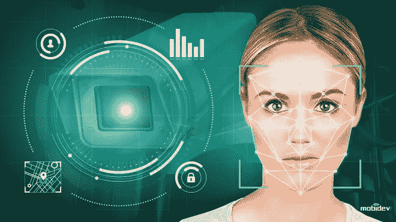
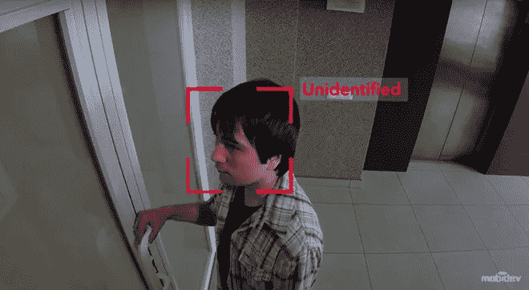
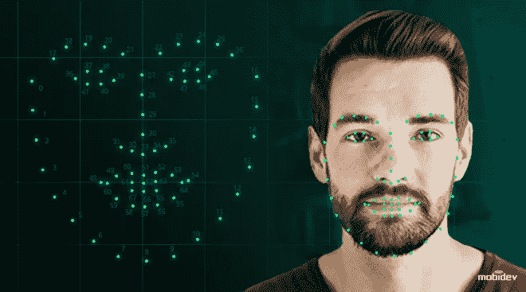
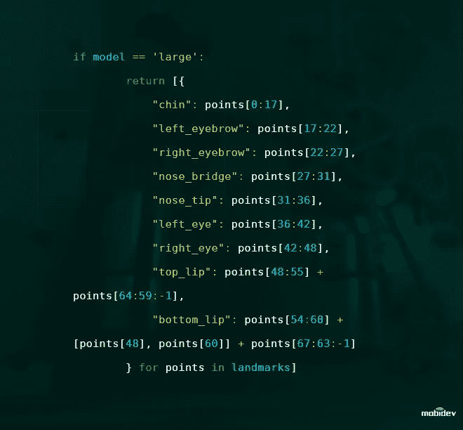
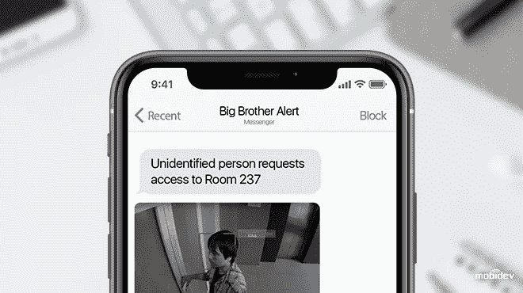
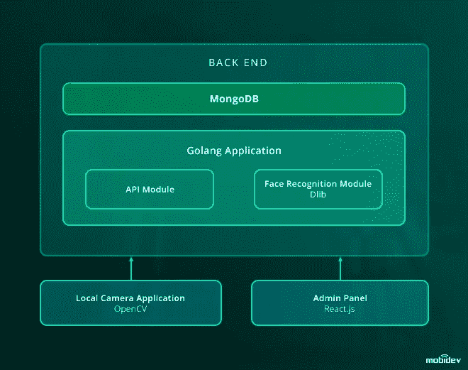

# 如何建立一个人脸检测和识别系统

> 原文：<https://towardsdatascience.com/how-to-build-a-face-detection-and-recognition-system-f5c2cdfbeb8c?source=collection_archive---------1----------------------->

## 基于计算机视觉和深度神经网络的解决方案

[Source](https://mobidev.biz/blog/custom-face-detection-recognition-software-development?utm_source=towardsds&utm_medium=bigb&utm_campaign=source)

将机器学习技术应用于生物安全解决方案是新兴的人工智能趋势之一。今天，我想分享一些关于如何使用 OpenCV 库、DLib 和通过摄像机的实时流来开发基于人脸识别的生物识别系统的想法。

为了让系统正常运行，有必要实施三个步骤。首先，它必须检测到一张脸。然后，它必须几乎立即认出那张脸。最后，它必须采取任何需要的进一步行动，比如允许被批准的用户访问。

我在视频中的队友大致解释了这个想法，下面你可以阅读更详细的描述。

## **人脸检测和识别过程**

面部识别过程从安装在与所述相机通信的任何兼容设备上的相机应用开始。该应用程序是用 [Golang](https://golang.org/) 编写的，可以作为本地控制台应用程序与 Raspbian 和 Ubuntu 一起使用。当应用程序第一次启动时，需要使用 JSON 配置文件配置本地摄像机 ID 和摄像机读取器类型。

然后，该应用程序能够使用计算机视觉和深度神经网络，以便在其流中找到预期的人脸。有两种主要的有效方法来做到这一点:第一种是 [TensorFlow](https://www.tensorflow.org/) 对象检测模型，第二种是 Caffe 人脸跟踪。这两种方法都运行良好，并且是 OpenCV 库的一部分。

一旦捕捉到人脸，裁剪后的图像将通过 HTTP 表单数据请求转发到后端。然后，这个面部图像由 API 保存在本地文件系统和检测日志中，并附加一个 personID。

在后端，一种算法识别“classified=false”的记录，并使用 [Dlib](http://dlib.net/) 函数生成 128 维向量，详细描述这张脸的属性。然后，该算法使用[欧几里德距离](/distance-functions-in-machine-learning-a-primer-in-simple-language-with-few-action-points-f5e328759b24)将该向量与数据库中的所有面部条目进行交叉引用，以发现该新面部是否与记录中的任何面部相匹配。

下图是 Dlib 函数的代码表示，索引点对应于面部的各个部分。

在计算欧几里德距离之后，该算法将为未知类型的人生成新的 personID(如果距离大于 0.6)，或者将面部标记为已分类并匹配 personID(如果距离小于 0.6)。

当一张脸被发现身份不明时，这张图像可以通过信使程序中的聊天机器人或其他方式与通知一起转发给经理或主管。经理或主管将会看到一系列关于如何处理这种情况的选项。

实现一个简单的聊天机器人警报系统需要大约两到五天的时间，可以使用像 [Errbot](https://errbot.readthedocs.io/en/latest/) (基于 Python)或[微软的机器人框架这样的工具来创建。](https://dev.botframework.com/)

面部记录可通过管理面板进行事后管理。这个空间将包含所有记录的图像及其 ID 号的链接。有可能创建一个所有相关员工面部图像的数据库，可以在系统上线前将其放入数据库。

一个潜在的问题是伸缩性。在我们的例子中，数据库中有大约 200 个条目，因此系统可以无缝地处理和立即识别人脸。当数据库膨胀到成千上万的条目时，或者如果需要多个摄像头时，事情变得更加复杂。如果不采取对策，处理速度将会减慢。

幸运的是，并行化提供了一个解决方案。可以创建一个负载平衡器和多个能够同时工作的 Web workers。这允许数据库被分成子部分，从而产生显著更快的搜索结果。

以下是对该面部识别解决方案所实施的技术和整体结构的总结。

解决方案中的 API 请求使用 RESTful API，后端员工数据收集使用 [MongoDB](https://www.mongodb.com/) 集合和 Golang。可以使用常规的工作站设置来测试解决方案。

值得注意的是，支持安全措施可以并且可能应该增强面部识别。面部图像比视网膜扫描或指纹更容易获得。如果安全需要足够重要，采取额外的[面部反欺骗措施](https://mobidev.biz/blog/face-anti-spoofing-prevent-fake-biometric-detection?utm_source=towardsds&utm_medium=bigb&utm_campaign=measures)确保没有人能够用面部照片或图像击败面部识别系统。
你可以在我之前的文章 [**中了解更多人脸识别解决方案的反欺骗技术**](/anti-spoofing-techniques-for-face-recognition-solutions-4257c5b1dfc9#c152-32567857a412) **。**

这个解决方案以及其他类似的解决方案可以处理大量的数据。假设企业能够协调清晰的业务需求，[数据科学](https://mobidev.biz/services/data-science?utm_source=towardsds&utm_medium=bigb&utm_campaign=dsservice)公司将能够提供业务洞察力。人脸识别软件开发正在兴起，并将决定人工智能应用的未来。

人脸识别只是实现这种方法的开始。人脸只是要检测的对象之一。其他物体也可以用同样的方式识别。例如，如果使用对象在数据集上创建和训练了 DS 模型，那么它可以是车辆、家具、花卉、动物。

此外，还可以开发多模式生物识别系统，将两种或两种以上的生物识别凭证结合起来，例如，面部和声音识别，或[基于 OCR 的身份识别](/how-to-use-optical-character-recognition-for-security-system-development-9dc57258afa3)。

想知道如何推出具有 DS/ML 特性的软件产品吗？阅读我最近的文章[数据科学咨询:从想法到部署](/data-science-consulting-from-idea-to-deployment-ea8efed8c388)。