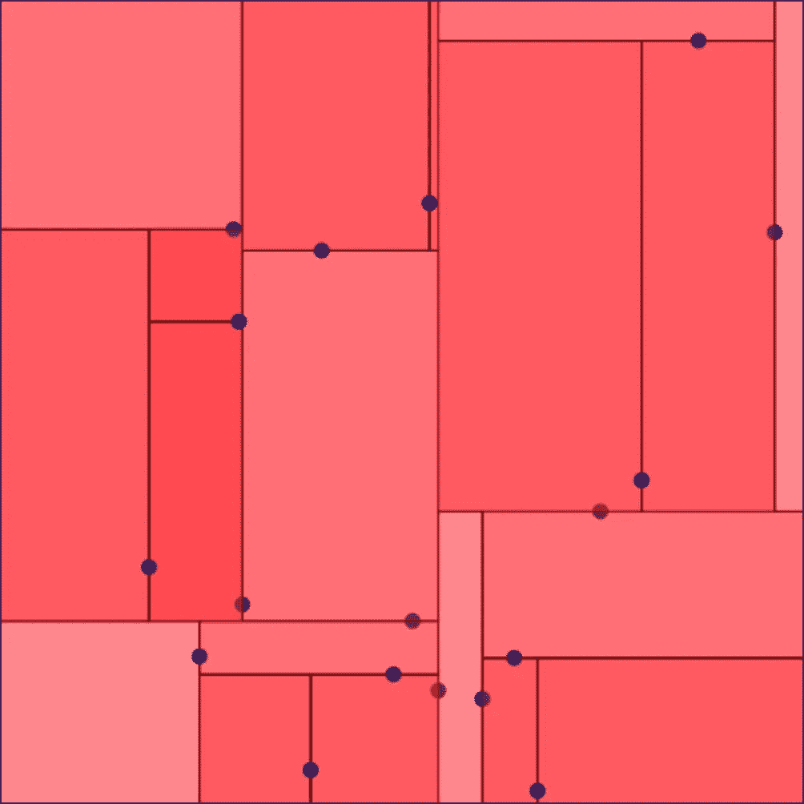
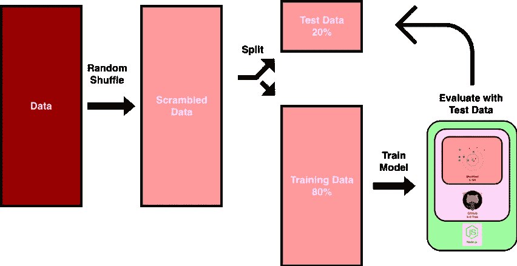
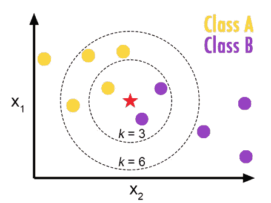

# 如何在 Node.js 中不用 TensorFlow 建立一个 k-NN

> 原文：<https://towardsdatascience.com/how-to-build-a-k-nn-in-node-js-without-tensorflow-cac5753daa87?source=collection_archive---------23----------------------->


Points connected to each other, Image from [Pixabay](https://pixabay.com/illustrations/system-web-network-connection-3699542/)

k-NN 是一个简单直观的基于实例的学习器,当训练数据很大时，它工作得很好。因为模型必须记住训练数据中的所有点，所以它也消耗了相当多的内存。为了在 Node.js 中构建 k-NN，人们首先会想到 [TensorFlow.js](https://www.tensorflow.org/js) ，这是一个流行的机器学习框架，在 JavaScript 中提供 API。

但是，如果你是一个有经验的研究人员，想稍微改变一下模型，看看是否有改进的余地，那该怎么办呢？然后，您将需要进入另一个级别来更改核心架构。如果你是一个初学者，能够从头开始编写模型肯定会提高你的理解能力。

# 让我们开始吧！

万一你还没有，你得先安装 [**Node.js**](https://nodejs.org/en/download/) 。Node.js 是一种基于 JavaScript 的服务器端语言，相对容易学习。为了以最佳效率构建 k-NN，您将需要一个 k-d 树。k-d 树允许用分治法在 k 维空间中搜索点。对于设计涉及 k-means 或 LBS 服务等多维数据的系统确实很有用。更多关于 k-d 树的信息可以在[这里](https://en.wikipedia.org/wiki/K-d_tree)找到。



Visualization of a k-d Tree

我们可以从 [**这里**](https://github.com/ubilabs/kd-tree-javascript) 下载整个 GitHub 存储库到我们的项目文件夹，为了导入它，我们使用了下面的 JavaScript 代码。

```
const kdtree = require('./kd-tree-javascript/kdTree');
```

现在为了测试 k-d 树是否有效，我们可以使用下面的代码:

```
const kdtree = require('./kd-tree-javascript/kdTree');
var points = [
  {x: 1, y: 2},
  {x: 3, y: 4},
  {x: 5, y: 6},
  {x: 7, y: 8}
];
var distance = function(a, b){
  return Math.pow(a.x - b.x, 2) +  Math.pow(a.y - b.y, 2);
}
var tree = new kdtree.kdTree(points, distance, ["x", "y"]);
var nearest = tree.nearest({ x: 5, y: 5 }, 2);
console.log(nearest);
```

代码应该打印以下对象:

```
[ [ { x: 3, y: 4 }, 5 ], [ { x: 5, y: 6 }, 1 ] ]
```

我们可以使用下面的代码来构建我们的 k-d 树，其中 ***x*** 和 ***y*** 是 2 个特征， ***train*** 是训练数据。在距离方程中，要素除以其最大值。这样，计算出的欧几里德距离就不会太偏向于任何一个特征。还有许多其他有趣的方法来计算距离。

```
const kdtree = require('./kd-tree-javascript/kdTree');
var distance = function(a, b){
  return Math.pow((a.x - b.x)/Xmax, 2) +  Math.pow((a.y - b.y)/Ymax, 2);
}
var tree = new kdtree.kdTree(train, distance, ["x", "y"]);
var k = 5;
```

训练数据是对象的数组，其中每个对象至少包含 k-d 树内的两个特征。下面是一个如何在 for 循环中构造对象的例子。

```
var newObject = {
  label: newLabel,
  x: newX,
  y: newY
}
data.push(newObject)
```

为了拆分训练数据，我们还可以使用以下代码混洗数据，在本例中，80%的数据被混洗到训练数据中。



Diagram illustrating how the data is processed

```
var shuffledData = shuffle(data);
var train = shuffledData.slice(0, Math.floor(shuffledData.length * 0.8));
var test = shuffledData.slice(Math.floor(shuffledData.length * 0.8) + 1, shuffledData.length);
function shuffle(array) {
  var currentIndex = array.length, temporaryValue, randomIndex;
  // While there remain elements to shuffle...
  while (0 !== currentIndex) {
    // Pick a remaining element...
    randomIndex = Math.floor(Math.random() * currentIndex);
    currentIndex -= 1;
    // And swap it with the current element...
    temporaryValue = array[currentIndex];
    array[currentIndex] = array[randomIndex];
    array[randomIndex] = temporaryValue;
  }
return array;
}
```

最后，我们可以使用下面的代码来运行我们的模型。

```
var total = 0;
var correct = 0;
while(test[total] != null)
{
 var nearest = tree.nearest(test[total], k);
 var label = test[total].label;
 var classa = 0;
 // Count k nearest points that is labeled as "Class A"
 for(i = 0; i < k; i++)
 {
  if(nearest[i][0].label == "Class A")
  {
   classa++;
  }
 }
 // Validate if the actual label matches the majority
 if(classa > k - classa && test[total].label == "Class A")
 {
  correct++;
 }
 else if(classa < k - classa && test[total].label == "Class B")
 {
  correct++
 }
 else if(classa == k - classa)
 {
  // In the case of a tie, evaluate randomly 50%/50%
  if(Math.random() > 0.5 && test[total].label == "Class A")
  {
   correct++;
  }
  else if(test[total].label == "Class B")
  {
   correct++;
  }
 }
 total++;
}
console.log("k-NN accuracy: " + correct/total);
```

该代码主要针对测试集运行 k-NN 算法，并对成功分类的实例进行计数。如果该实例周围的 k 个点的大多数被标记为该类，则该实例被分类为该类之一。在出现平局的情况下，算法会将其随机放入其中一个类中。



k-NN Illustrated, Image from [Medium](/knn-k-nearest-neighbors-1-a4707b24bd1d)

恭喜你！您刚刚学习了如何从零开始构建 k-NN！现在由您来深入研究这个模型！

# 最后…

我对许多事情都充满热情，数据科学就是其中之一。在 Unity 机器学习框架准备好之前，我还从头开始构建了一个 BPANN。我当时唯一能找到的人工神经网络是用遗传算法来训练的。我没有把它写成一篇文章，但是我可以根据要求来写。

我喜欢学习新的东西，并与社区分享，如果有你特别感兴趣的主题，请让我知道，我可能会写它。我目前正在写一篇长文，详细解释 AlphaGo 是如何工作的，我需要一些时间来完成。

敬请关注，享受数据科学的乐趣！