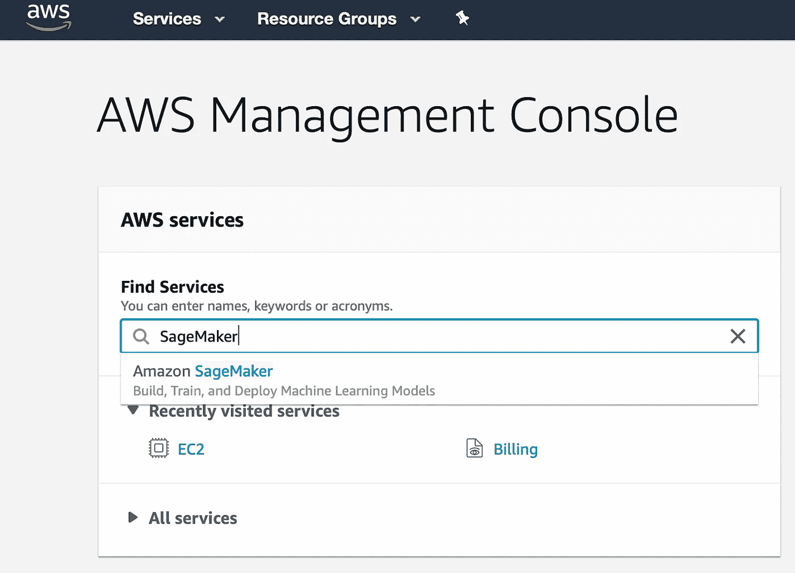
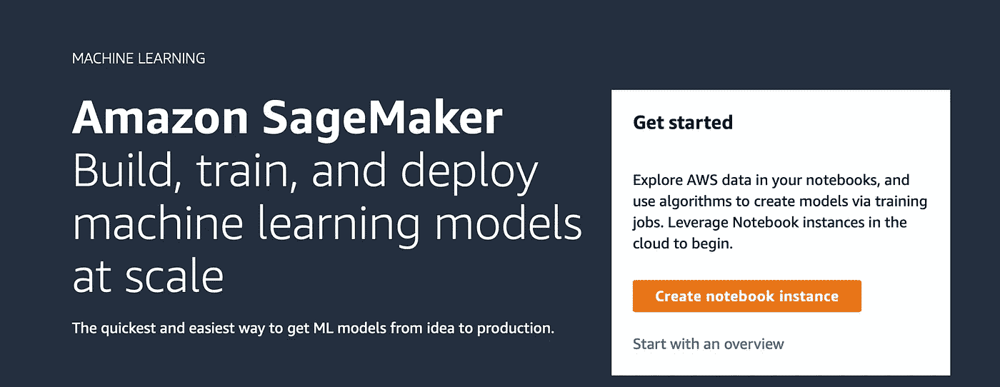
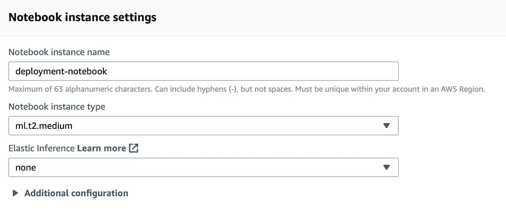
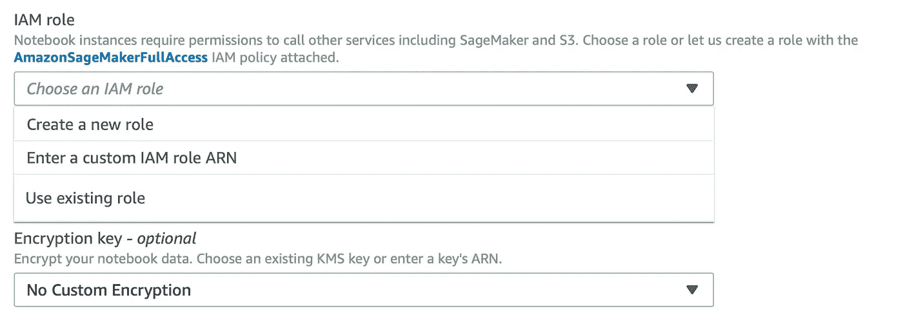
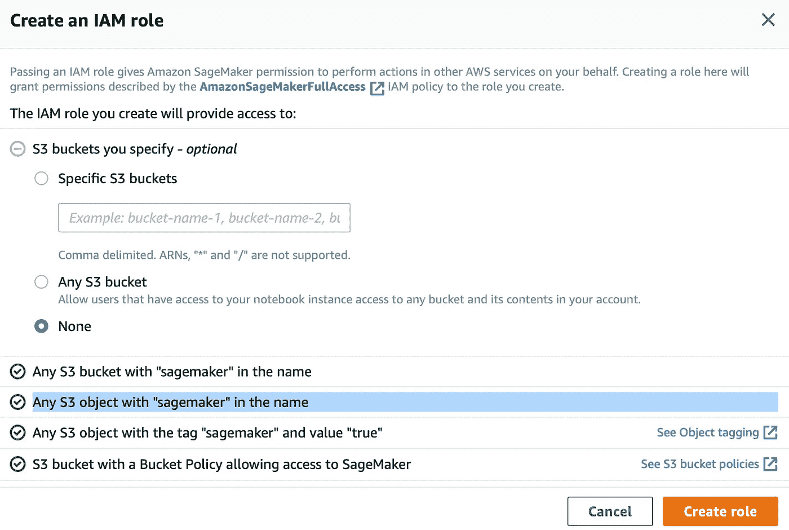
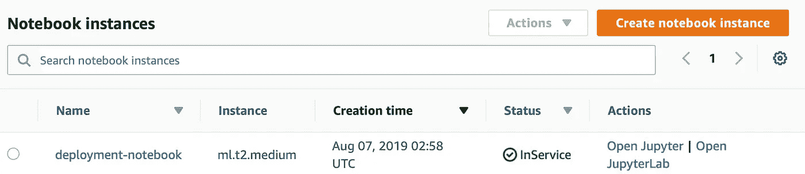
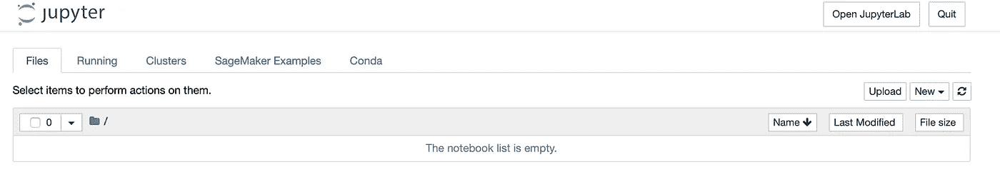
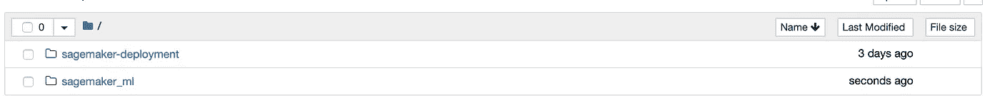

# 如何在 SageMaker 上建立模型

> 原文：<https://towardsdatascience.com/how-to-build-a-model-on-sagemaker-da03be698a9c?source=collection_archive---------6----------------------->

Photo by [Samuel Zeller](https://unsplash.com/@samuelzeller?utm_source=medium&utm_medium=referral) on [Unsplash](https://unsplash.com?utm_source=medium&utm_medium=referral)

数据科学项目往往以报告的准确性和圆滑的情节而告终。在这篇文章中，我们将探讨下一步:如何创建一个可以部署的模型。

为此，我们将使用 [Amazon SageMaker](https://aws.amazon.com/sagemaker/) 并分解从实验到生产就绪的步骤。我们将遵循高层次的方法，这意味着 AWS 将为我们挑选一些参数。

在继续之前，确保你有一个 AWS 账户和一个 [Jupyter 笔记本](https://jupyter.org)的访问权限。

# 设置笔记本实例

Photo by [ASHLEY EDWARDS](https://unsplash.com/@westwardwayphotography?utm_source=medium&utm_medium=referral) on [Unsplash](https://unsplash.com?utm_source=medium&utm_medium=referral)

第一步是登录[亚马逊控制台](http://console.aws.amazon.com)，寻找 SageMaker，以防它不可见。

接下来，我们点击*创建笔记本实例*。

我们给笔记本命名，运行它的价格由实例类型决定。这里我们使用 *ml.t2.medium* ，但是建议查看[定价页面](https://aws.amazon.com/sagemaker/pricing/)以获得最佳选择。对于这种应用，我们可以保持[弹性推断](https://docs.aws.amazon.com/sagemaker/latest/dg/ei.html)为*无*。

我们要设置*角色*，它是一种安全证书，决定权限，比如笔记本可以访问哪些资源。我们点击它并选择*创建一个新角色*

由于没有我们希望笔记本访问的额外存储桶，我们选择 *None* 并点击 *create role。*这里最重要的条件是第二行。

最后，我们单击页面最底部的“板条箱笔记本实例”。过一会儿，你的笔记本的状态应该会显示*在使用中*。一旦发生这种情况，AWS 将向我们收取使用该实例的费用，所以请确保在不使用时将其关闭。

# 克隆部署笔记本

从上图中点击*打开 Jupyter* 进入熟悉的设置。

在右上角点击*新建*并打开一个*终端*并改变目录。然后我们克隆这个包含笔记本[和](https://github.com/NadimKawwa/sagemaker_ml/blob/master/SageMaker_IMDB_highlevel.ipynb)的 [git 仓库](https://github.com/NadimKawwa/sagemaker_ml)，并在完成后关闭它。

回到主页选项卡，我们看到添加了一个 sagemaker 目录。我们导航到笔记本在 sagemaker_ml 文件夹中的位置。

# 下载数据

对于一般的数据科学家，特别是 NLP 实践者来说, [IMDB 数据集](http://ai.stanford.edu/~amaas/data/sentiment/)就像是一个成年礼。我们将通过 [XGBoost](https://xgboost.readthedocs.io) 使用这些数据来预测用户情绪。

第一步是下载数据。我们可以在笔记本中使用命令行代码:

[GNU](https://www.gnu.org/software/wget/manual/html_node/Download-Options.html#Download-Options) 文档为上面的命令提供了充足的资源。

# 准备数据

这里我们不会详细讨论这个问题，只提供一个简要的概述。不过，您可以在[笔记本](https://github.com/NadimKawwa/sagemaker_ml/blob/master/SageMaker_IMDB_highlevel.ipynb)中查看整个过程。

这是一个 NLP 练习，所以我们需要将原始信息处理成数据和相应的标签。然后，我们剥离所有 html 标签的文本，用 [NLTK](http://www.nltk.org) 执行词干提取，并提取一个[单词包](https://en.wikipedia.org/wiki/Bag-of-words_model)。

在这个过程的最后，我们应该准备好我们的测试和训练数据。

# 用 XGBoost 分类

XGBoost clasifier 要求将数据集更好地写入文件，并使用亚马逊 S3 存储。我们进一步将训练数据集分为两部分:训练和验证。

我们将把这些数据集写入一个文件，并将文件上传到 S3。此外，我们将做同样的测试集输入上传到 S3。这样，一旦拟合完成，我们就可以使用 SageMaker 的[批量转换](https://docs.aws.amazon.com/sagemaker/latest/dg/how-it-works-batch.html)功能来测试模型。

SageMaker 中 XGBoost 算法的[文档要求保存的数据集不应包含标题或索引，对于训练和验证数据，标签应首先出现在每个样本中。](https://docs.aws.amazon.com/sagemaker/latest/dg/xgboost.html)

此时，节省可用内存是一个好的做法，我们可以将 text_X、train_X、val_X、train_y 和 val_y 设置为 *None* :

# 将培训验证文件上传至 S3

对于这一部分，我们将大量参考 [SageMaker API 文档](http://sagemaker.readthedocs.io/en/latest/)和 [SageMaker 开发者指南](https://docs.aws.amazon.com/sagemaker/latest/dg/)。

[upload_data](https://sagemaker.readthedocs.io/en/latest/session.html?highlight=upload_data#sagemaker.session.Session.upload_data) 方法将本地文件或目录上传到 S3。它是代表我们当前 SageMaker 会话的对象的成员。这个方法将数据上传到 AWS 为我们创建的默认 bucket，如果它还不存在的话，上传到由变量 *key_prefix* 描述的路径中。如果我们导航到 S3 控制台，我们应该在那里找到我们的文件。

# 创建 XGBoost 模型

我们认为 SageMaker 上的模型由三部分组成:

*   模型工件
*   培训代码(集装箱)
*   推理代码(容器)

*模型工件*是实际的模型本身。在这种情况下，工件是在训练期间创建的树。

*训练代码*和*推理代码*用于操作训练工件。训练代码使用提供的训练数据和创建的模型工件，推理代码使用模型工件对新数据进行预测。

SageMaker 通过使用 [docker 容器](https://sagemaker-workshop.com/custom/containers.html#the-dockerfile)来运行训练和推理代码，这是一种打包代码并确保依赖关系不会成为问题的方法。

# 拟合 XGBoost

通过访问 S3 输入来拟合模型。

使用 SageMaker 拟合模型时，过程如下。

*   一个计算实例(某处的服务器)使用我们指定的属性启动。
*   当计算实例准备就绪时，用于适应模型的容器形式的代码被加载和执行。
*   当这个代码被执行时，它被提供对存储在 S3 上的训练(以及可能的验证)数据的访问。
*   一旦计算实例完成了对模型的拟合，生成的模型工件就被存储在 S3 上，并且计算实例被关闭。

# 试验

我们使用批量转换以非实时的方式对大型数据集进行推理。这让我们可以看到我们的模型执行得有多好。

这样做的好处是，我们不需要立即使用模型的结果，而是可以对大量样本进行推断。这种方法也很有用，因为我们可以对整个测试集进行推理。

要执行转换作业，我们需要指定要发送的数据类型，以便在后台正确序列化。这里我们为模型提供 csv 数据，因此我们指定*文本/csv* 。

此外，如果数据太大，无法一次性处理，那么我们需要指定数据文件应该如何分割。同样，这是一个 csv 文件，因此每一行是一个单独的条目，我们告诉 SageMaker 在每一行拆分输入。

使用上面的代码，转换在后台运行。我们调用 *wait* 方法等待转换工作完成并接收一些反馈。

转换作业被执行，并且每个评论的估计情绪被保存在 S3 上。我们想在本地处理这个文件，并将它复制到数据目录 *data_dir* 。

一种方便的方法是在 jupyter 中找到 [AWS CLI 命令参考](https://docs.aws.amazon.com/cli/latest/reference/s3/cp.html#examples)。

最后，我们可以从模型中读取输出。

我们需要将输出转换成对我们的目的更有用的东西。我们将情绪转换为*正*的`1`和*负*的`0`。最后我们可以打印出准确率: **86%** ，还不错！

# 清除

Photo by [Paweł Czerwiński](https://unsplash.com/@pawel_czerwinski?utm_source=medium&utm_medium=referral) on [Unsplash](https://unsplash.com?utm_source=medium&utm_medium=referral)

当我们对越来越大的数据执行操作时，跟踪我们使用了多少内存变得至关重要。我们可能会在执行操作时耗尽内存和/或产生昂贵的费用。

SageMaker 上的默认 notebook 实例可能没有太多多余的磁盘空间。当我们重复类似的练习时，我们最终可能会填满分配的磁盘空间，导致难以诊断的错误。

一旦我们完成了一个 notebok，删除我们在这个过程中创建的文件是一个很好的做法。我们可以从终端或笔记本电脑中心完成这项工作。

完成后，请务必返回 SageMaker *笔记本实例*并停止该实例。

# 总结和后续步骤

在这篇文章中，我们看到了如何在 AWS SageMaker 上创建一个可以部署的模型。工作流程应该与典型的机器学习练习相同，只是增加了一些额外的步骤。

主要的收获是关注数据存储的位置和方式，代表我们做出的决策，以及如何防止内存溢出。

恭喜你！我们现在已经有了一个可以部署的情感分析模型！